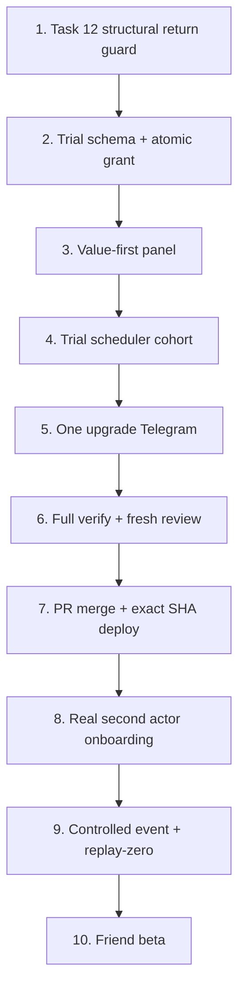

# Life Manager Cloud On-Time Core Finish Implementation Plan

> **For agentic workers:** REQUIRED SUB-SKILL: Use `superpowers:subagent-driven-development` to implement this plan task-by-task. Steps use checkbox (`- [ ]`) syntax for tracking. The primary owns this plan, the product specs, progress, provider E2E, and completion judgment.

**Goal:** Finish the cloud on-time core so a new Telegram actor can activate a three-day trial and receive receipt-bearing travel blocks, T-10/T-5 calls, and one T-5 route reminder with replay-zero.

**Architecture:** Keep the existing Railway/Supabase deterministic core. Fix the remaining Travel-block attribution defect with one structural fail-closed guard, then add trial entitlement through the existing onboarding RPC, selector SSOT, panel UI, onboarding loop, Stripe link validator, and durable travel ledger. OpenClawMU/Hermes remains outside this plan.

**Tech Stack:** Node.js `>=20.19.0`, built-in `node:test`, PostgreSQL/Supabase, Railway, Telegram Bot API, Google Calendar/Composio, Transit API with Google fallback, Telnyx, Stripe, GitHub CLI, `gog` Calendar CLI.

**Specs:**

- `docs/superpowers/specs/2026-08-26-life-manager-cloud-on-time-core-design.md`
- `docs/superpowers/specs/2026-08-28-life-manager-cloud-telegram-product-ux-design.md`

## Global Constraints

- Writable checkout: `/Users/anicca/Projects/life-manager-main/.worktrees/lm-cloud-core-spec` only.
- Branch/upstream: `codex/lm-cloud-core-spec` → `origin/codex/lm-cloud-core-spec`.
- Never modify `deploy/local`, `/Users/anicca/Projects/life-manager-main`, or `/Users/anicca/anicca-project`.
- Each code slice uses the assigned Luna implementation lane and receives a fresh exact-commit read-only Sol review. Only the primary edits spec, plan, progress, PR, deploy, and production evidence.
- Ponytail full applies before each slice: reuse existing event arrays, RPCs, loops, claims, providers, and validators. Add no package, table, service, queue, auth provider, route provider, conversational runtime, or usage meter.
- Calls require valid E.164 plus `call_enabled === true`. Phone presence alone is never consent.
- Stripe webhook remains the only `paid` writer. Client input never sets `paid` or a trial deadline.
- Provider completion requires official IDs/readback plus Supabase durable claims. Local tests and process health alone do not close an effect.
- Unknown/failed delivery is reconciled before retry. A failed provider call releases only its owned claim.
- Never print credentials, raw Telegram initData, phone, home, live coordinates, OAuth URLs, or provider payloads into ordinary logs or chat.
- No personal-card charge without exact amount, currency, and source approval. Current successful Telnyx calls mean top-up is not an active task unless official balance evidence proves it necessary.

## Active Order



## File and Interface Map

| Slice | Production responsibility | Tests |
|---|---|---|
| Task 12 | `lib/travel-reminder.js`: select one safe resolved destination | `lib/travel-reminder.test.js` |
| Task 13A | `migrations/2026-08-28-lm-trial-first.sql`: trial column and same-signature onboarding RPC replacement | `test/postgres/lm-trial-first.integration.sh`, unchanged panel contracts |
| Task 13B | `lib/payment-link.js`: one Stripe link validator; `panel-api.js`/`panel-ui.js`: server trial truth and ready screen | `payment-link.test.js`, `panel-api.test.js`, `panel-ui.test.js` |
| Task 13C | `lib/user-selector.js`: one scheduler cohort SSOT | `user-selector.test.js`, existing scheduler suites |
| Task 13D | `lib/telegram-onboard.js`: active-trial stage and one durable expiry notice | `telegram-onboard.test.js`, `ch1-atomic-dedup.test.js` |

---

### Task 1: Reject structurally identifiable return blocks

**Ownership:** Same Luna implementation lane that owns Task 12. Production/test files only.

**Files:**

- Modify: `apps/life-manager/lib/travel-reminder.js:45-70`
- Test: `apps/life-manager/lib/travel-reminder.test.js:111-170`

**Interfaces:**

- Consumes: existing `startMs(event)`, `endMs(event)`, `helper(event)`, `travelHelper(event)`, and the already-fetched `events` array.
- Produces: `matchesOtherEventEnd(candidateStart, events, target, candidate) → boolean`, used only by `resolveReminderDestination`.
- Preserves: original event selection, claim key, title, displayed location, privacy log, and provider call count.

- [x] **Step 1: Add the old-home return RED**

Add this test beside the existing home-return regressions:

```js
test("resolved destination rejects an old-home return block by event geometry", () => {
  const previous = event({
    id: "previous-old-home",
    summary: "前の予定",
    location: "赤坂",
    startMs: START - 60 * 60000,
    endMs: START - 20 * 60000,
  });
  const returnBlock = {
    id: "return-old-home",
    summary: "[Travel] 🚆 赤坂→旧自宅",
    location: "東京都新宿区1丁目1番1号 旧建物",
    startMs: previous.endMs,
    endMs: START,
  };
  const current = event({ id: "target-after-return", location: "MUIT 出社 (着席)" });
  assert.equal(
    resolveReminderDestination(current, { events: [previous, returnBlock, current], home: HOME }),
    current.location,
  );
});
```

- [x] **Step 2: Run the one test and confirm RED**

Run:

```bash
cd apps/life-manager
node --test --test-name-pattern="old-home return block by event geometry" lib/travel-reminder.test.js
```

Expected: FAIL because the actual destination is `東京都新宿区1丁目1番1号 旧建物`, not `MUIT 出社 (着席)`.

- [x] **Step 3: Add the minimum structural guard**

Add this pure helper next to `matchesOtherEventWindow`:

```js
function matchesOtherEventEnd(candidateStart, events, event, candidate) {
  return events.some((other) => {
    if (!other || other === event || other === candidate) return false;
    if (other.id && (other.id === event.id || (candidate.id && other.id === candidate.id))) return false;
    if (helper(other)) return false;
    const otherEnd = endMs(other);
    return otherEnd !== null
      && candidateStart >= otherEnd - 60000
      && candidateStart <= otherEnd + 60000;
  });
}
```

In `resolveReminderDestination`, after the existing `matchesOtherEventWindow` rejection, add:

```js
if (matchesOtherEventEnd(candidateStart, list, event, candidate)) continue;
```

Do not change normalization or parse an address/summary.

- [x] **Step 4: Run GREEN and related regressions**

Run:

```bash
node --test lib/travel-reminder.test.js
node --test lib/travel-reminder.test.js lib/wake-filter.test.js test/wake-levels.test.js test/wake-catchup.test.js test/wake-loop-isolation.test.js
```

Expected: new focused count 20/20; related count 81/81.

- [x] **Step 5: Mutation-check the new assertion**

Temporarily remove the `matchesOtherEventEnd` call, rerun the one-test command, and require FAIL with the old-home destination. Restore the call and require PASS.

- [x] **Step 6: Commit and fresh review**

```bash
git add apps/life-manager/lib/travel-reminder.js apps/life-manager/lib/travel-reminder.test.js
git commit -m "fix(life-manager): reject return travel destinations"
```

Fresh Sol reviews the exact commit for return blocks, multiple events, NFKC/home drift, display/claim preservation, privacy, and timezone boundaries. Any correctness finding returns to the same Luna lane before Task 2.

---

### Task 2: Persist one server-owned three-day trial

**Ownership:** Luna owns the migration and the specified static contract tests. The primary owns production rollback/apply/readback.

**Files:**

- Create: `apps/life-manager/migrations/2026-08-28-lm-trial-first.sql`
- Create/Test: `apps/life-manager/test/postgres/lm-trial-first.integration.sh`
- Verify unchanged: `apps/life-manager/lib/panel-api.test.js`, `test/onboarding-resume-contract.test.js`, `test/calendar-connect-signature-contract.test.js`

**Interfaces:**

- Keeps signatures unchanged: `lm_panel_onboarding_step(text,text,text,text,text,boolean,boolean)`, `lm_panel_onboarding_state(text,text)`, `lm_panel_onboarding_transition(text,text,text,jsonb)`.
- Produces: nullable `lm_users.trial_expires_at timestamptz`; JSON `trialExpiresAt: string|null`, `trialActive: boolean`.
- Grants once: exact `notifications.enable` transition writes `coalesce(trial_expires_at, now() + interval '3 days')` under the existing user-row lock.

- [x] **Step 1: Add a real PostgreSQL behavior RED**

Create `test/postgres/lm-trial-first.integration.sh` by reusing the local-PostgreSQL/Docker bootstrap and cleanup structure from `test/postgres/panel-score-postgres.integration.sh`. Use a disposable database named `lm_trial_test`; create roles `anon`, `authenticated`, and `service_role`; create minimal `lm_users` and `lm_panel_preferences` tables with every column referenced by `2026-08-27-lm-panel-onboarding-core.sql`; apply that core migration, then require the new migration file to exist before applying it.

The behavior phase inserts `tenant-a` at stage `notifications` with Calendar, home, name, unpaid, and notifications false. As `service_role`, call:

```sql
SELECT public.lm_panel_onboarding_transition(
  'tenant-a', '101', 'notifications.enable', '{}'::jsonb
);
```

Capture `trial_expires_at`, reset only the stage/preferences fixture to the same pre-completion state, call the transition again, and require the exact timestamp unchanged. Then require:

```sql
SELECT
  (public.lm_panel_onboarding_state('tenant-a', '101')->>'trialExpiresAt')::timestamptz
    = trial_expires_at,
  (public.lm_panel_onboarding_state('tenant-a', '101')->>'trialActive')::boolean,
  paid = false
FROM public.lm_users
WHERE uid = 'tenant-a';
```

Also require `phone.skip`, `call.enable`, and `call.skip` end at `done`; a different chat ID gets no state; `service_role` has EXECUTE while `anon`/`authenticated` do not; and `SET ROLE anon; SELECT lm_panel_onboarding_state(...)` fails. Finish with one stable line:

```text
lm-trial-first-postgres: PASS grant_once=1 trial_active=1 tenant_scope=1 acl=1 paid_writes=0
```

- [x] **Step 2: Run RED**

```bash
cd apps/life-manager
bash test/postgres/lm-trial-first.integration.sh
```

Expected: FAIL with `missing migration: migrations/2026-08-28-lm-trial-first.sql` before any trial RPC can run.

- [x] **Step 3: Create the additive migration**

The migration starts with:

```sql
ALTER TABLE public.lm_users
  ADD COLUMN IF NOT EXISTS trial_expires_at timestamptz;
```

Copy the current onboarding functions into this later migration with their existing signatures. Make these exact behavioral changes:

```sql
-- lm_panel_onboarding_step, after core prerequisites
IF p_paid IS TRUE THEN RETURN 'dashboard'; END IF;
IF stage IN ('done', 'dashboard', 'pay', 'payment', 'gmail') THEN RETURN 'dashboard'; END IF;
IF nullif(trim(coalesce(p_phone, '')), '') IS NULL THEN RETURN 'phone'; END IF;
RETURN 'call';
```

```sql
-- notifications.enable, inside the existing locked transition
UPDATE public.lm_users
SET tg_onboard_stage = 'phone',
    trial_expires_at = coalesce(trial_expires_at, now() + interval '3 days'),
    updated_at = now()
WHERE uid = p_uid;
```

`phone.skip`, `call.enable`, and `call.skip` set `tg_onboard_stage = 'done'`. The state JSON adds:

```sql
'trialExpiresAt', u.trial_expires_at,
'trialActive', coalesce(u.trial_expires_at > now(), false)
```

Retain `SECURITY DEFINER SET search_path = public, pg_temp`, the tenant/chat scope checks, user-row `FOR UPDATE`, service-role grants, and anon/authenticated revokes. Do not redefine `transition_with_calendar`; it already calls the replaced transition by name.

- [x] **Step 4: Run local GREEN and related contracts**

```bash
bash test/postgres/lm-trial-first.integration.sh
node --test lib/panel-api.test.js test/onboarding-resume-contract.test.js test/calendar-connect-signature-contract.test.js
```

Expected: the PostgreSQL script prints its single PASS line and the unchanged Node contracts all PASS.

- [x] **Step 5: Commit and fresh migration review**

```bash
git add apps/life-manager/migrations/2026-08-28-lm-trial-first.sql apps/life-manager/test/postgres/lm-trial-first.integration.sh
git commit -m "feat(life-manager): grant one server owned trial"
```

Fresh Sol reviews migration order, same-signature replacement, one-time grant, row locking, ACL, no paid writer, and clean-install ordering.

- [x] **Step 6: Primary performs production rollback preflight only**

Run the exact migration inside `BEGIN; ... ROLLBACK;` against production PostgreSQL and inspect zero persistent row/schema drift. Do not apply it yet: the current deployed selector does not admit trial tenants, while the new selector cannot query the column before it exists. Record the following rollback readbacks:

- column type `timestamptz` and nullability;
- function bodies containing `coalesce(trial_expires_at, now() + interval '3 days')`;
- service-role execute true, anon/authenticated execute false;
- an isolated actor transition sets one deadline and replay preserves the exact timestamp before rollback.

Record SQLSTATE/output facts in progress without secret values.

---

### Task 3: Show value before checkout

**Ownership:** Luna owns the three production files and three focused tests.

**Files:**

- Create: `apps/life-manager/lib/payment-link.js`
- Modify: `apps/life-manager/lib/panel-api.js`, `apps/life-manager/lib/panel-ui.js`
- Test: `apps/life-manager/lib/payment-link.test.js`, `apps/life-manager/lib/panel-api.test.js`, `apps/life-manager/lib/panel-ui.test.js`

**Interfaces:**

- Produces: `paymentLink(opts = {}, scope = {}) → trusted HTTPS Stripe URL|string empty`.
- Extends onboarding response with `trialExpiresAt`, `trialActive`, optional `paymentLink`, and optional `nextEvent: {summary,startAt}`.
- The browser derives no identity/deadline and renders Calendar text through `textContent` only.

- [x] **Step 1: Add payment-link module RED**

Create `payment-link.test.js` first:

```js
"use strict";
const { test } = require("node:test");
const assert = require("node:assert/strict");
const { paymentLink } = require("./payment-link.js");

test("paymentLink allows only tenant-scoped buy.stripe.com HTTPS", () => {
  assert.equal(
    paymentLink({ stripePaymentLink: "https://buy.stripe.com/test_life_manager" }, { uid: "tenant-a" }),
    "https://buy.stripe.com/test_life_manager?client_reference_id=tenant-a",
  );
  assert.equal(paymentLink({ stripePaymentLink: "https://evil.example/pay" }, { uid: "tenant-a" }), "");
  assert.equal(paymentLink({ stripePaymentLink: "https://buy.stripe.com/test" }, {}), "");
});
```

- [x] **Step 2: Add panel/UI RED contracts**

In `panel-api.test.js`, add a core-ready trial state with:

```js
const h = onboardingHarness({
  step: "dashboard",
  stage: "done",
  paid: false,
  trialExpiresAt: "2026-08-31T12:00:00.000Z",
  trialActive: true,
});
```

Require HTTP 200, dashboard, server deadline, and trusted payment link. A missing Stripe link must still return dashboard 200 with no `paymentLink`.

In `panel-ui.test.js`, require the dashboard branch to contain `準備できました`, `移動時間を自動追加`, `出発5分前`, `無料期間`, and no required payment action. Calendar summary/start must be assigned with `textContent`.

- [x] **Step 3: Run RED**

```bash
cd apps/life-manager
node --test lib/payment-link.test.js lib/panel-api.test.js lib/panel-ui.test.js
```

Expected: first failure is `MODULE_NOT_FOUND` for `payment-link.js`; after adding only the module, panel/UI trial assertions still fail.

- [x] **Step 4: Extract the existing validator without semantic change**

Move the current `paymentLink` function from `panel-api.js` into `payment-link.js` and export it:

```js
"use strict";

function paymentLink(opts = {}, scope = {}) {
  const value = String(
    opts.stripePaymentLink || opts.paymentLink
      || process.env.LM_STRIPE_PAYMENT_LINK || process.env.STRIPE_PAYMENT_LINK || "",
  ).trim();
  try {
    const url = new URL(value);
    if (url.protocol !== "https:" || url.hostname !== "buy.stripe.com"
      || !scope.uid || url.username || url.password || url.pathname.length <= 1) return "";
    url.searchParams.set("client_reference_id", String(scope.uid));
    return url.toString();
  } catch { return ""; }
}

module.exports = { paymentLink };
```

Import it from `panel-api.js`; do not duplicate it.

- [x] **Step 5: Extend server response and ready screen**

Add `trialExpiresAt`, `trialActive` to the existing response allowlist. Map legacy `payment`, `pay`, `done`, and `gmail` stages to `dashboard`. For an unpaid dashboard, add a payment link only when `paymentLink(opts, scope)` is non-empty; missing checkout must not return 503.

On dashboard GET, use the existing `timeline(scope.uid, opts)` reader and select the first future non-helper item for the optional preview:

```js
body.nextEvent = next ? { summary: String(next.summary || "予定"), startAt: next.start_at } : null;
```

If timeline fails, keep `nextEvent = null`; onboarding remains ready. In `panel-ui.js`, render the ready copy and optional next event with DOM `textContent`. Keep the validated checkout as a secondary action.

- [x] **Step 6: Run GREEN and mutation checks**

```bash
node --test lib/payment-link.test.js lib/panel-api.test.js lib/panel-ui.test.js lib/billing.test.js lib/panel-auth.test.js
```

Expected: PASS. Temporarily accept `evil.example` and require the payment-link test to fail; restore. Temporarily use client `trialExpiresAt` and require panel tests to fail; restore.

- [x] **Step 7: Commit and fresh review**

```bash
git add apps/life-manager/lib/payment-link.js apps/life-manager/lib/payment-link.test.js apps/life-manager/lib/panel-api.js apps/life-manager/lib/panel-api.test.js apps/life-manager/lib/panel-ui.js apps/life-manager/lib/panel-ui.test.js
git commit -m "feat(life-manager): show value before checkout"
```

Fresh Sol checks tenant scope, Stripe host validation, trial truth, XSS/textContent, missing-provider degradation, and no new client authority.

---

### Task 4: Admit paid, active-trial, or comp tenants only

**Ownership:** Luna owns `user-selector.js` and its tests. No scheduler rewrite.

**Files:**

- Modify: `apps/life-manager/lib/user-selector.js`
- Test: `apps/life-manager/lib/user-selector.test.js`, `apps/life-manager/lib/daily-preflight.test.js`
- Verify unchanged consumers: `apps/life-manager/scheduler.js`, `apps/life-manager/lib/daily-preflight.js`

**Interfaces:**

- Produces: `trialEntitlementFilter(nowMs) → PostgREST or(...) fragment` and existing `schedulerCohortFilter(env, nowMs)`.
- Both scheduler selectors and daily preflight keep consuming the one SSOT.

- [x] **Step 1: Replace fixed-paid expectations with clocked RED tests**

Add:

```js
const CLOCK = Date.parse("2026-08-28T12:00:00.000Z");
const CLOCK_ISO = encodeURIComponent(new Date(CLOCK).toISOString());

test("scheduler cohort is paid OR trial-active at the exact server clock", () => {
  assert.equal(
    schedulerCohortFilter({}, CLOCK),
    `or=(paid.is.true,trial_expires_at.gt.${CLOCK_ISO})&calendar_provider=in.(composio_gcal,pipedream_gcal)`,
  );
});

test("active comp removes only the entitlement predicate", () => {
  assert.equal(
    schedulerCohortFilter({ LM_COMP_UNTIL: "2026-08-28T12:01:00.000Z" }, CLOCK),
    "calendar_provider=in.(composio_gcal,pipedream_gcal)",
  );
});
```

Retain the exact-two-caller source assertion.

Update the existing daily-preflight consumer assertion to require the exact `or=(paid.is.true,trial_expires_at.gt.<encoded-clock>)` query parameter instead of the retired standalone `paid=is.true` parameter. Preserve its supported-provider and phone-optional assertions. This test is a consumer of the selector interface; `daily-preflight.js` remains unchanged.

- [x] **Step 2: Run RED**

```bash
cd apps/life-manager
node --test lib/user-selector.test.js
```

Expected: FAIL because the current result starts with `paid=is.true&`.

- [x] **Step 3: Implement the single filter**

```js
function trialEntitlementFilter(nowMs = Date.now()) {
  const clock = Number.isFinite(nowMs) ? nowMs : Date.now();
  return `or=(paid.is.true,trial_expires_at.gt.${encodeURIComponent(new Date(clock).toISOString())})`;
}

function schedulerCohortFilter(env, nowMs = Date.now()) {
  const entitlement = compActive(env || process.env, nowMs)
    ? ""
    : `${trialEntitlementFilter(nowMs)}&`;
  return `${entitlement}${calendarProviderFilter()}`;
}
```

Export `trialEntitlementFilter` for focused boundary tests. Do not touch `scheduler.js` query construction.

- [x] **Step 4: Run GREEN and consumer regressions**

```bash
node --test lib/user-selector.test.js lib/daily-preflight.test.js lib/daily-preflight-production-wiring.test.js test/wake-loop-isolation.test.js lib/travel-reminder.test.js
```

Expected: PASS. Mutation-check `.gt.` to `.gte.` by requiring the exact filter test to fail, then restore `.gt.`.

- [x] **Step 5: Commit and fresh review**

```bash
git add apps/life-manager/lib/user-selector.js apps/life-manager/lib/user-selector.test.js apps/life-manager/lib/daily-preflight.test.js
git commit -m "feat(life-manager): admit active trial tenants"
```

Fresh Sol checks exact expiry, invalid clock fallback, comp independence, provider filter preservation, phone independence, and both consumers.

---

### Task 5: Send one durable upgrade Telegram after expiry

**Ownership:** Luna owns `telegram-onboard.js` and its test. Existing loop/ledger only.

**Files:**

- Modify: `apps/life-manager/lib/telegram-onboard.js`
- Test: `apps/life-manager/lib/telegram-onboard.test.js`
- Modify: `apps/life-manager/lib/travel.js`
- Test: `apps/life-manager/lib/ch1-atomic-dedup.test.js`
- Create: `apps/life-manager/migrations/2026-08-28-lm-travel-log-legs.sql`
- Create/Test: `apps/life-manager/test/postgres/lm-travel-log-legs.integration.sh`

**Interfaces:**

- Consumes: `paymentLink(opts, {uid})`, `claimTravel(uid,eventKey,"trial-upgrade",supaUrl,supaKey)`, `unclaimTravel(...)`, and `sendMessage(...)`.
- Produces: at most one Telegram message ID per `(uid, trial_expires_at, trial-upgrade)`; no new loop/table.
- Preserves `lm_travel_log` as the ledger, widening only its existing `leg` CHECK to `go|return|telegram-t5|trial-upgrade`. `unclaimTravel(...) → boolean` reports verified DELETE success to every caller.

- [x] **Step 1: Add active/expired stage RED tests**

Add fixed-clock cases:

```js
const TRIAL_NOW = Date.parse("2026-08-31T12:00:00.000Z");

test("legacy pay rows do not reopen ordinary pay nudges", () => {
  const base = nudgeRow({ tg_onboard_stage: "pay", paid: false, trial_expires_at: "2026-08-31T12:01:00.000Z" });
  assert.equal(computeStage(base, { now: TRIAL_NOW, env: {} }), "done");
  assert.equal(computeStage({ ...base, trial_expires_at: "2026-08-31T12:00:00.000Z" }, { now: TRIAL_NOW, env: {} }), "done");
});
```

The expiry message is a separate durable branch, not a stage transition.

- [x] **Step 2: Add claim/send/release RED**

Create one harness row with Calendar, home, notifications, Telegram binding, `paid:false`, `tg_onboard_stage:"done"`, and expired `trial_expires_at`. Inject `claimTravel`, `unclaimTravel`, `sendMessage`, and `paymentLink` seams. Require:

```js
assert.deepEqual(order.map((entry) => entry[0]), ["claim", "send"]);
assert.equal(sent[0].result.message_id, 901);
assert.equal(unclaims, 0);
```

Run twice with the second claim returning false; total sends remain one. For `{ok:false}` and missing `message_id`, require order `claim → send → unclaim`.

Add malformed receipt cases: negative, zero, boolean, object, string, and non-integer `message_id` all release. Only a positive integer retains the claim. Add release-result cases: verified DELETE success permits a later retry; DELETE non-2xx/network failure is surfaced as reconciliation-required and does not claim delivery success.

Create a disposable PostgreSQL test by reusing the existing `test/postgres` local/Docker harness. Apply `2026-06-24-ch1-atomic-dedup.sql`, prove `telegram-t5` is rejected before the new migration, apply the new migration twice, then require inserts for `go`, `return`, `telegram-t5`, and `trial-upgrade`; reject an unknown leg; preserve unique `(uid,event_key,leg)`.

- [x] **Step 3: Run RED**

```bash
cd apps/life-manager
node --test --test-name-pattern="trial|upgrade" lib/telegram-onboard.test.js
```

Expected: FAIL because no durable expiry branch exists and the selector omits `trial_expires_at`.

- [x] **Step 4: Implement within the existing two-minute owner**

Add `trial_expires_at` to `SEL`. Before ordinary stage-drift nudges, evaluate:

```js
const expiresAt = Date.parse(String(row.trial_expires_at || ""));
const expired = Number.isFinite(expiresAt) && expiresAt <= now && row.paid !== true && coreReady(row);
```

At the top of `computeStage`, preserve core-ready legacy terminal stages:

```js
const storedStage = String(row && row.tg_onboard_stage || "").toLowerCase();
if (coreReady(row) && ["done", "dashboard", "pay", "payment", "gmail"].includes(storedStage)) return "done";
```

For an expired, notifications-enabled, Telegram-bound row:

```js
const eventKey = String(row.trial_expires_at);
const claimed = await claim(row.uid, eventKey, "trial-upgrade", opts.supaUrl, opts.supaKey);
if (!claimed) continue;
const checkout = link(opts, { uid: row.uid });
const result = checkout
  ? await send(opts.token, row.telegram_chat_id, `無料期間が終了しました。\n\n<a href="${checkout}">月額プランを確認する</a>`)
  : { ok: false };
const messageId = result && result.ok === true && result.result && result.result.message_id;
if (!messageId) await unclaim(row.uid, eventKey, "trial-upgrade", opts.supaUrl, opts.supaKey);
else sent++;
continue;
```

Resolve `claim`, `unclaim`, `send`, and `link` from injected seams first, then existing functions. HTML-escape or URL-validate every inserted value; only the validated Stripe URL is interpolated.

Change `unclaimTravel` in `travel.js` to return `true` only for an HTTP 2xx DELETE and `false` for non-2xx/network failure. Existing callers may ignore the return; the trial-upgrade caller must inspect it. A failed release is delivery reconciliation state: emit one generic owner-visible error without event title/location/phone/home/URL and do not automatically resend while the claim remains.

The leg migration must drop only the CHECK constraint whose constrained column set is exactly `lm_travel_log.leg`, then add and validate an explicitly named idempotent constraint allowing `go`, `return`, `telegram-t5`, and `trial-upgrade`. Do not modify the unique constraint, RLS, rows, or table shape otherwise. Production apply remains Task 6; Task 5 primary runs rollback-only preflight.

- [x] **Step 5: Run GREEN and negative matrix**

```bash
bash test/postgres/lm-travel-log-legs.integration.sh
node --test lib/telegram-onboard.test.js lib/payment-link.test.js lib/ch1-atomic-dedup.test.js lib/panel-api.test.js lib/billing.test.js
```

Expected: PASS for active, exact-expiry, paid, incomplete, notification-off, Telegram-unbound, duplicate, failure-release, and missing-ID cases.

- [x] **Step 6: Commit and fresh review**

```bash
git add apps/life-manager/lib/telegram-onboard.js apps/life-manager/lib/telegram-onboard.test.js
git commit -m "feat(life-manager): send one trial upgrade"
```

Fresh Sol checks durable dedupe, exact expiry, failed-send retry, link validation, HTML safety, ordinary nudge preservation, and no extra loop.

---

### Task 6: Run integrated verification and merge one PR

**Ownership:** Primary only. No code change unless verification returns work to the owning Luna slice.

- [x] **Step 1: Install the exact dependency lock in the worktree**

```bash
cd apps/life-manager
npm ci --ignore-scripts
```

Expected: exit 0. ENOSPC or partial install is not a test failure and must be resolved before full verification.

- [x] **Step 2: Run the focused route/reminder/call group**

```bash
node --test \
  lib/transit.test.js \
  lib/travel-transit-wire.test.js \
  lib/route-cache.test.js \
  lib/travel-routes.test.js \
  lib/travel-return.test.js \
  lib/travel-reminder.test.js \
  lib/wake-filter.test.js \
  test/wake-levels.test.js \
  test/wake-catchup.test.js \
  test/wake-claim-token.test.js \
  test/wake-loop-isolation.test.js
```

Expected: all tests PASS, zero skipped acceptance tests.

- [x] **Step 3: Run the focused onboarding/trial/billing group**

```bash
node --test \
  lib/payment-link.test.js \
  lib/telegram-onboard.test.js \
  lib/panel-auth.test.js \
  lib/panel-api.test.js \
  lib/panel-ui.test.js \
  lib/user-selector.test.js \
  lib/billing.test.js \
  lib/ch1-atomic-dedup.test.js \
  test/onboarding-resume-contract.test.js \
  test/calendar-connect-signature-contract.test.js
bash test/postgres/lm-trial-first.integration.sh
bash test/postgres/lm-travel-log-legs.integration.sh
```

Expected: all tests PASS.

- [x] **Step 4: Run full and static checks**

```bash
npm test
cd ../..
git diff --check
git diff --exit-code origin/main...HEAD -- apps/life-manager/package.json apps/life-manager/package-lock.json
gitleaks git . --log-opts="origin/main..HEAD" --redact=100 --no-banner
```

Expected: exit 0 for every command; dependency diff empty; secret findings zero.

- [x] **Step 5: Fresh whole-slice Sol review**

Fresh read-only Sol reviews `origin/main..HEAD` against AC-01–38, with emphasis on money loss, duplicate effects, tenant crossing, client-written truth, secret/PII logs, trial extension, and OpenClawMU/local scope creep. Critical/High must be zero.

- [x] **Step 6: Rebase safely, push, and create the PR**

```bash
git fetch origin
git rebase origin/main
git push --force-with-lease origin HEAD:codex/lm-cloud-core-spec
gh pr create \
  --repo Daisuke134/life-manager \
  --base main \
  --head codex/lm-cloud-core-spec \
  --title "feat(life-manager): finish Telegram cloud core" \
  --body "Finishes Task 12 destination safety, server-owned three-day trials, value-first onboarding, durable expiry upgrade, and receipt/replay acceptance gates."
```

Re-run Step 4 after rebase if the merge base changes. Leave the approved PR unmerged until Step 7.

- [x] **Step 7: Apply the migration, merge immediately, and read back exact deploy**

Pause new friend invitations for this controlled release window. Apply `2026-08-28-lm-trial-first.sql` and `2026-08-28-lm-travel-log-legs.sql` in one production transaction. Read back the trial column/function bodies/ACL/unchanged existing null rows and the validated four-leg CHECK with existing travel rows/unique/RLS/other CHECKs preserved. Then merge the already-approved PR immediately:

```bash
gh pr merge --repo Daisuke134/life-manager --merge --delete-branch=false
```

Read the merged SHA from GitHub, then require a successful GitHub Deployment for that exact SHA and `/health.build` equal to the same immutable release. A later unrelated deployment is not proof that this release is live. If deploy fails, do not roll the schema backward while old code remains compatible; fix/redeploy from the same approved release line.

---

### Task 7: Prove public QR onboarding with a real second actor

**Ownership:** Primary coordinates and records official evidence. No synthetic actor can close this task.

- [x] **Step 1: Decode the public QR**

Require the payload to equal the public Telegram `/start` deep link and contain no uid, chat ID, email, or secret.

Current official readback: `https://aniccaai.com/life-manager` renders one QR through `QRCodeSVG(value=TG_DEEPLINK)`; the fixed source value and adjacent live link are exactly `https://t.me/LifeManagerBotbot?start=lp`. The payload contains no tenant, actor, email, or secret. `/lm` is a separate general-product page and is not the QR surface.

- [ ] **Step 2: A real Telegram account different from Dais scans and starts**

The actor opens the bot, receives the `web_app` button, and completes Calendar consent, home, notifications, phone skip or phone+explicit call choice. Do not use Supabase Google login.

Measured recovery atom, before continuing Step 2:

- [ ] Persist the exact `connected_account_id` returned by the current Composio link in the single-use OAuth state.
- [ ] Accept the callback only when that same account is exact-owner Google Calendar ACTIVE; an unrelated older ACTIVE account must not advance onboarding.
- [ ] Persist the selected account ID on the tenant and pin every Composio Calendar read/write to it, with legacy users retaining the current user-id fallback until they reconnect.
- [ ] Make `reconnect calendar` / `カレンダーを再接続` create and verify a new connection instead of re-enabling or silently reusing the old one; switch only after successful readback.
- [ ] Telegram reports the real seven-day event count. Zero events shows `このまま進む` and `別のGoogleアカウントをつなぐ`; it does not claim that autofill is ready.
- [ ] Re-run the affected real actor from the same chat. Require a fresh Google button, exact-account callback, Calendar read success, home prompt only after verification, and no block/archive/chat deletion.

- [ ] **Step 3: Read server truth**

Read back one new `lm_users` row and its `lm_panel_preferences` row by the verified Telegram binding. Require distinct UID from Dais, Calendar ACTIVE, home non-empty, notifications true, correct phone/call branch, `trial_expires_at = core_completion + 3 days`, and `paid=false`.

- [ ] **Step 4: Attack cross-actor scope and replay**

Reopen with the same actor and require the same tenant/deadline. Replay the same initData and require rejection. Supply hostile `uid/tg/chat_id` query/body values from another actor and require zero cross-tenant reads/writes.

- [ ] **Step 5: Record provider evidence**

Record only hashes/redacted IDs in progress: Telegram actor binding result, HTTP status, distinct tenant refs, trial timestamp, Calendar connected-account ID/status, and cross-actor zero result. Do not delete the real beta tenant.

- [ ] **Step 6: Prove the active-trial and natural-expiry boundary**

The acceptance actor does not pay during this proof. During the three-day window, require at least one real eligible Calendar event to produce its normal enabled effect and read back the provider ID plus tenant ledger. At the exact stored deadline, read the scheduler cohort and require the actor absent while paid remains false.

Continue the existing two-minute onboarding owner until it sends one upgrade Telegram. Record its Telegram message ID and `lm_travel_log` key `(uid, trial_expires_at, trial-upgrade)`. Replay the owner and require additional upgrade messages `0`. Reopening onboarding must return the original deadline and must not re-admit the expired actor.

---

### Task 8: Prove the complete natural event and replay-zero

**Ownership:** Primary only. This task creates and later deletes one controlled private Calendar event.

- [x] **Step 0: Persist the signed Telnyx provider receipt before creating replacement events**

The existing wake ledger stores `amd_result` but drops the Telnyx call identifiers carried by the dial response and signed `call.machine.detection.ended` webhook. Add only the provider receipt fields needed for acceptance to the existing `lm_wake_log`; do not create another call ledger or provider abstraction. Bind every write to the exact `(uid,event_key,claim_token)`, latch one `call_control_id`, accept only the same ID on webhook replay, store the signed webhook event ID/session/leg IDs, and never release a wake claim after Telnyx accepted the call. A conflicting call ID must write zero rows. Verify with real PostgreSQL plus the real signed-webhook HTTP path before production apply.

- [x] 8A: add the additive receipt migration and bounded RPC client, including cross-row provider-ID uniqueness and real PostgreSQL concurrency coverage.
- [x] 8B1a: carry the optional claim token in backward-compatible Telnyx client state and return exact call-control/session/leg IDs from one accepted dial.
- [x] 8B1b: wire scheduler order `claim → dial → receipt`; an accepted dial retains its claim even when receipt reconciliation fails, while a rejected dial alone releases it.
- [x] 8B2: wire the signature-verified webhook to the same receipt RPC and prove replay/conflict behavior through the real HTTP route.
- [x] 8C: rollback-preflight, apply, deploy, and read back the exact production SHA before replacement events.
- [x] 8D1: add a service-only Telegram message receipt RPC to the existing `lm_travel_log`; preserve its claim key, rows, RLS, policies, and four-leg constraint.
- [x] 8D2: after an accepted T-5 send, record the exact positive Telegram `message_id`; receipt mismatch/failure retains the claim and never resends, while provider rejection alone releases it.
- [x] 8D3: apply the additive migration, merge/deploy the wiring, and read back the exact production SHA before creating replacement events.

Expected: the replacement event can be read back as one exact Telnyx call ID + one signed webhook event ID + one wake row for each level, while webhook replay changes no identity and creates no call.

- [x] **Step 1: Reconcile old controlled events**

Read Google status for `lnpffie7md7fp0qp5j9hrudkq4` and `ah40e31tqlstvk2qvo1e0jt82c`, plus Supabase/Telnyx/Telegram receipts. Do not resend. Count the old no-location event as accepted only if both T-10 and T-5 Telnyx call/webhook/ledger triples and replay-zero are present. If effect outcome is unknown, leave the event confirmed until reconciliation is complete and schedule the replacement in Step 3.

- [x] **Step 2: Create one future physical event after the exact deployment**

Choose explicit RFC3339 start/end values 45–60 minutes in the future and a provider-routable full address read from the existing resolved Travel block. Keep the address private. Then run with those explicit environment values:

```bash
gog calendar create primary \
  --summary="Life Manager controlled cloud acceptance — 行動不要" \
  --from="$CONTROL_START" \
  --to="$CONTROL_END" \
  --start-timezone="Asia/Tokyo" \
  --end-timezone="Asia/Tokyo" \
  --location="$CONTROL_LOCATION" \
  --description="Private controlled production verification. No action required." \
  --visibility=private \
  --send-updates=none \
  --private-prop="life_manager_e2e=cloud-core-finish" \
  --json --no-input
```

Save the returned exact event ID privately and read it back:

```bash
gog calendar raw primary "$CONTROL_EVENT_ID" --json --no-input
```

- [x] **Step 3: Create a replacement no-location event when old proof is incomplete**

If Step 1 does not prove both no-location call levels, create a second private controlled event with explicit start/end 20–30 minutes in the future, no location, no Meet link, `send-updates=none`, and private property `life_manager_e2e=cloud-core-no-location`. Save/read back its exact event ID. Do not manually trigger the scheduler.

- [x] **Step 4: Observe natural provider effects without manual trigger**

Current atomic run order:

- [x] exact receipt-bearing release deployed and read back as `0303507584458fc55cfe1d8f27db9ff1e9fedce9`;
- [x] replacement no-location event `cspe20kgthj5qj4130n9q24c3s` confirmed for 15:10 JST;
- [x] physical event `1it7jaacjfuaelalljim6nk6qs` confirmed for 15:41 JST with a private provider-routable destination;
- [x] implement a shared scheduler-owner fallback: standalone `LIFE_RUN_LOOPS=false` with no Inngest key selects in-process loops, while explicit roles/Inngest remain unchanged;
- [x] deploy/read back the corrected shared scheduler-owner fix at exact SHA `05988c7170bba91df7d375437cf61679e9e45f75`;
- [x] adversarial production-gate review: code/deploy may ship and no new code is justified before the due window; runtime success still requires a natural ledger receipt and replay-zero;
- [x] observe through 18:19 JST and reject the false due-event premise: provider raw readback has no 18:00-start real event; 17:06–18:00 is a helper `[Travel]` block, so wake/travel row `0` is expected rather than a scheduler failure;
- [x] read the corrected deployment's boot evidence: exact release `05988c717...`, `node server.js`, role/loop flag/Inngest unset, standalone transition owner, and all seven scheduler loop `started` lines;
- [x] read the exact tenant/event boundary without external effects: one paid tenant, Calendar read success, all call/notification/automation/home/phone gates true, but the candidate window contains only past controlled events plus helper blocks and therefore no wake-eligible future event;
- [x] create fresh no-location controlled event `ceepnjmqc11udi99pq2nbesdso`; Google readback is private, location absent, `confirmed`, 19:03–19:13 JST, and private property `cloud-core-no-location-v2`;
- [x] observe its natural T-10 window: provider event is visible and wake-eligible, but production `listPaidUsers()` returns zero because Composio reports `status=ACTIVE`, `is_disabled=false`, omits non-schema `enabled`, and Life Manager misclassifies that exact active account as DISABLED, leaving `calendar_provider=NULL`;
- [x] TDD the provider-schema fix in `panel-api.js`/existing tests: `2f584d9ab` accepts missing `enabled` only with exact owner/toolkit + ACTIVE + not-disabled, explicit false/null/nonboolean and disabled contradictions reject; fresh Sol review `ship`, findings zero, Ponytail minimal;
- [x] deploy/read back the minimal fix: PR #3063 merges as `0c6bbd6fc895ce123ca48f28f84b84bec7e36bdb`, Railway deployment `19a195eb-3edf-4c89-8853-5fec167150ae` is SUCCESS, public health matches, canonical provider-status RPC stores `composio_gcal`, and production scheduler cohort changes from zero to one;
- [x] create post-repair no-location event `0gevo7mkpbce7up75v45k2pnjk`; Google and production Composio readbacks agree on `confirmed`, private, no location, 19:35–19:45 JST, wake-eligible under `all-events`, with scheduler cohort one;
- [x] observe its natural 19:25 T-10 and 19:30 T-5 calls: two durable claims contain distinct call-control/session/leg IDs, official Telnyx retrieve returns HTTP 200 with exact matching hashes and `is_alive=false`, and six signed-route POSTs return 200; both calls are unanswered so AMD/webhook identity remains null;
- [x] TDD signed terminal `call.hangup` receipt for unanswered wake calls: `b77db8bbd` wires the signed HTTP route; focused/combined HTTP is 20/20 and 21/21;
- [x] fix round 1 `61908cd4e`: function-only precedence migration plus real PostgreSQL regression proves hangup→AMD, AMD→hangup, replay, distinct AMD/cross-row conflicts, and both concurrent lock orders; scoped Sol re-review `ship`, Critical addressed, new Critical/Important zero;
- [x] fix round 2 `98523b230`: rename the function migration after the base in lexical order; primary PostgreSQL PASS and scoped re-review `ship`, no new breakage;
- [x] rollback-preflight and apply the function-only production migration SHA-256 `304c40a330baf3e03f38a6d2a91d5731af7ba3d7f556497ba10b623983b32df6`; post-readback function hash `7ccc1d1b6d6f42a6ff207909083af725`, wake rows 496, fixture zero, indexes two, RLS true, service execute true, browser execute false;
- [x] merge/deploy/read back the hangup HTTP route: PR #3072 passes 9/9, merges as `d37cba22d26eb2a6686b5ef94e78b46cf1ac4b69`, Railway deployment `d0050aac-fe29-46ad-a073-a2243f72c11b` is SUCCESS, and public health matches;
- [x] create post-hangup-release no-location event `or3855rnheueg91q5u5vu8tkqk`; Google/Composio agree on private, no location, `confirmed`, 20:50–21:00 JST, wake-eligible, cohort one;
- [x] observe natural 20:40 T-10 and 20:45 T-5 for `or3855rnheueg91q5u5vu8tkqk`: both durable rows have call/session/leg plus signed terminal or AMD webhook IDs; Telnyx GET returns HTTP 200 with exact ID matches and `is_alive=false`;
- [x] create physical event `7bmv7s4d2p8vh3rlnknhsekt2o`, private, location `東京駅`, `confirmed`, 21:45–21:55 JST; production Composio matches it and live Transit returns buffered departure 21:09:40, arrival 21:45, four steps, two rail legs with line/headsign, one transfer, platform data, and no station-exit field;
- [x] TDD the measured Travel-block suppression: `ea1f295fa` requires adjacency plus normalized destination; 16T 3/3, Travel/return 32/32, ch1 19/19, scoped Sol `ship`;
- [x] TDD the measured live-origin failure: `317c7a78c` parses valid geo directly and `649578220` normalizes every Google fallback to `lat,lon`; primary 61/61, scoped Sol `ship`;
- [x] merge/deploy route fixes: PR #3086 passes 9/9, merges as `d37714dd08756b5f835452786da10a0b3ee07b56`, Railway deployment `48ca9cc3-2826-44fa-872a-ac6dda2ef3f1` is SUCCESS, public health matches;
- [x] create post-fix physical event `udo8jkpls9u250ji2u853str9g`, private, `東京駅`, confirmed, 22:39–22:49 JST; live geo Transit route has buffered departure 22:00:06, Telegram due 21:55:06, three steps and one service/headsign;
- [x] TDD the measured provider latency boundary: `d69b16db9` sets Transit 15 seconds and reminder 25 seconds; RED 40/42, GREEN 42/42 plus related 47/47, fresh Sol `ship`, cadence/isolation unchanged;
- [x] TDD the measured failure-cache boundary: first provider timeout returns null, next tick calls the provider again and caches only the later accepted route; accepted-route replay remains one provider call. Implementation `160235a60`, review-comment correction `aadf8ceb9`; fresh Sol finds no functional defect, primary focused verification 25/25;
- [x] create latest physical event `pf0cbjkrqkhmj8ihmot4fmmf2k`, private, `新宿駅`, confirmed, 23:14–23:24 JST; fresh live Transit returns two steps, one rail service/headsign, buffered departure 22:52:57 and Telegram due 22:47:57;
- [ ] require one `provider=transit` Telegram route message for `pf0cbjkrqkhmj8ihmot4fmmf2k` at natural due 22:47:57 with durable positive message ID;
- [x] merge Task 16AC as PR #3096 at `cd3a83647a8f6db01abef938c0fe555d9b9d7b06`; Railway deployment `f654d570-528a-4b46-9141-24124d09f90b` is SUCCESS and public `/health.build` matches, while the Railway-created GitHub Deployment for the same SHA reports failure and remains a separate exact-readback discrepancy;
- [x] create post-16AC event `icqi2rhh24g1sf8q0hodja0i2s`, private, attendee zero, `渋谷駅`, confirmed, 00:05–00:15 JST; natural 60-second reminder and 30-minute travel loops are active;
- [x] TDD the measured late-hour provider boundary: `0a671c27c` changes only the existing constants to 25-second Transit and 35-second per-tenant reminder budgets; RED 71/73, GREEN and primary 73/73, fresh Sol `SHIP` with zero findings;
- [x] require one `provider=transit` Telegram route message for `icqi2rhh24g1sf8q0hodja0i2s`: Railway logs exact `tg_message_id=981`, and Supabase `telegram-t5` stores the same positive ID/time;
- [x] require one outbound `[Travel]` block with provider event ID: Google confirms outbound `na4a3iqdpq4vbb9npmdbt64o4c` and return `14sg8l0muaao62sutibvci3ap8`; durable `go`/`return` claims exist;
- [x] replay the next 60-second reminder tick: event-hash send log remains one, ledger remains three rows with message ID 981, and both Travel event IDs/updated timestamps are unchanged;
- [x] delete controlled transit event `icqi2rhh24g1sf8q0hodja0i2s` and its exact outbound/return helper IDs with `send-updates none`; Google reads all three as `cancelled`;
- [x] no-location T-10 row has one call-control ID, one signed webhook ID, and one durable claim (`or3855rnheueg91q5u5vu8tkqk`);
- [x] no-location T-5 row has one call-control ID, one signed webhook ID, and one durable claim (`or3855rnheueg91q5u5vu8tkqk`);
- [ ] physical event has one outbound `[Travel]` Calendar block with provider event ID;
- [x] physical T-10 row has one call-control ID, one signed webhook ID, and one durable claim (`icqi2rhh24g1sf8q0hodja0i2s`);
- [x] physical T-5 row has one call-control ID, one signed webhook ID, and one durable claim (`icqi2rhh24g1sf8q0hodja0i2s`);
- [x] physical departure reminder has Telegram message ID `981` plus matching `lm_travel_log.telegram-t5` receipt and `provider=transit` Railway log;
- [x] Telnyx provider GET returns HTTP 200 and exact call-control/session/leg matches for both levels of accepted no-location and physical events; all four calls are ended;
- [x] natural replay adds Calendar block 0, call 0, Telegram message 0;
- [x] controlled events and their uniquely correlated helper blocks are deleted with `send-updates=none` and read back `cancelled`; real Travel blocks and the recurring `MUIT 出社` series remain `confirmed`.

Require all of the following correlated to the exact event:

- outbound `[Travel]` Google event ID/status/location;
- T-10 Telnyx call ID plus signed webhook and matching `lm_wake_log` key;
- T-5 Telnyx call ID plus signed webhook and matching `lm_wake_log` key;
- one Telegram T-5 message ID with the original event title/location and provider-backed route;
- one `lm_travel_log` `telegram-t5` claim;
- Railway health/deploy SHA equal to the release under test.

For the accepted old or replacement no-location event, require T-10 and T-5 Telnyx call IDs, signed webhooks, and distinct `lm_wake_log` keys. It has no route or travel-block requirement.

- [x] **Step 5: Replay and require zero additional effects**

Re-evaluate the same tenant/event through the real scheduler owner. Official readback counts before and after must show new travel block `0`, new call `0`, new Telegram message `0`, and unchanged durable claims.

- [x] **Step 6: Delete controlled events only after receipts and replay-zero**

For each exact controlled ID whose evidence is reconciled:

```bash
gog calendar delete primary "$CONTROL_EVENT_ID" \
  --send-updates=none --force --no-input
gog calendar raw primary "$CONTROL_EVENT_ID" --json --no-input
```

Expected final status: `cancelled`. Never delete the recurring real `MUIT 出社` series.

- [ ] **Step 7: Close the product contract**

Update the on-time core spec to COMPLETE only when AC-01–38 each points to official evidence and replay-zero. Update progress, commit/push the docs, send one `Codex:::` Telegram completion report with provider message ID readback, and start friend beta. Free conversation/OpenClawMU remains the next separate spec.

---

### Task 9: Restore exact GitHub Deployment aggregation

**Ownership:** Luna owns only `services/x402-endpoint/Dockerfile`, `services/x402-endpoint/railway.toml`, `services/x402-endpoint/migration-contract.test.mjs`, `services/x402-endpoint/src/server.js`, and `services/x402-endpoint/src/__tests__/server.test.js`. Primary owns plan/progress, merge, and provider readback.

Railway currently auto-selects the legacy TypeScript/pnpm Dockerfile even though the canonical service is `src/server.js` + Prisma + `package-lock.json` and `railway.toml` names the same start command. The stale lock causes every monorepo deploy to mark the GitHub Deployment aggregate failed while life-call itself succeeds.

- [x] RED: extend the existing migration contract to reject the legacy pnpm/server.ts/tsx Docker path and require package-lock/npm, Prisma generation, canonical `src`, non-root runtime, dynamic runtime PORT `/health`, limited generated-output ownership, and `node src/server.js`.
- [x] GREEN: `89f5fa6dc` updates only the existing Dockerfile and contract; review fix `5ba0c94cc` follows `${PORT:-8403}` and limits chown to `/app/src/generated`. Dependencies, x402 behavior, paid routes, wallet/network settings, and Railway settings are unchanged.
- [x] Run focused contract 4/4, Prisma generation, current x402 service tests 68/68, syntax/diff/secret/dependency checks. Local container build reaches successful Prisma generation but stops at the disk safety floor; remote Railway build remains the acceptance gate.
- [x] Fresh exact-range Sol review and scoped re-review return `SHIP`, Critical/Important zero, new findings zero, and Ponytail minimality.
- [ ] Merge the watch-path PR; on the next non-x402 Life Manager/spec commit require x402 Railway `SKIPPED`, GitHub Deployment aggregate `success`, and the accepted life-call code-bearing `/health.build` SHA unchanged or exactly redeployed when its watched subtree changes.
- [x] Bound external facilitator initialization to 15 seconds in `6eca30bc7`. RED watchdog exits 124 on the never-settling initializer; GREEN returns health 200 with mocked DB, keeps paid route 503, and full x402 is 69/69.
- [x] Follow Railway's official monorepo boundary: `watchPatterns = ["/services/x402-endpoint/**"]`, so unrelated Life Manager commits no longer rebuild the broken unrelated service. RED 6/7, GREEN 7/7.
