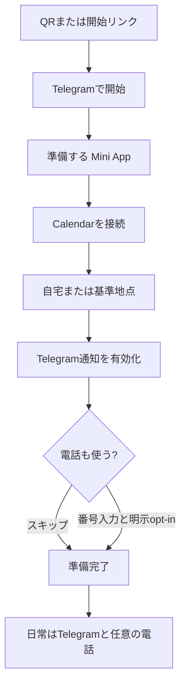
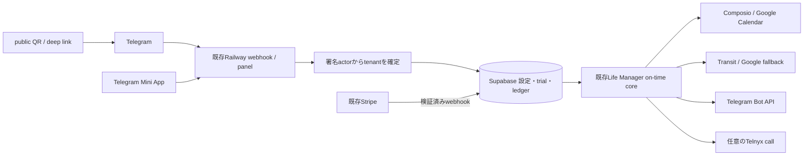

# Life Manager Cloud Telegram-First Product UX Design

状態: APPROVED — 2026-09-06 owner sequencing revision（2026-09-05 scopeを維持）。既存Life Manager Cloudの日常機能を出荷する。新しいagent frameworkへの移行は行わない。

正本範囲: public QR/deep linkからの初回体験、日常のTelegram通知、任意の電話、既存Stripe課金、正式製品の公開と継続改善。

## 0.1 Product and UX decision — Telegram-native formal product

Life Managerはbetaではなく正式な製品である。製品の約束は、個別機能を並べることではなく、本人に代わって
生活を継続的に管理すること。Cloudで最初に提供する能力はCalendar、移動時間、乗換案内、Telegram通知、
任意の電話であり、投資などの後続能力は検証・移植が完了したものから同じ会話へ追加する。未提供の能力を
現在動作中とは表示しない。

初回設定の主画面はTelegram chatとする。Google本人同意、Stripe Checkout、法的に必要な外部確認だけを
外部画面で開き、完了後は同じTelegram chatへ戻す。Mini Appは日常dashboardと任意設定に限定し、
onboardingの質問、進捗、完了、料金案内を所有しない。onboarding中にStripe、card、料金プランを表示しない。

正式な初回体験は次の順序に固定する。

1. `/start`でLife Managerが何を管理するかを短く説明する。
2. Google Calendar接続ボタンを送る。Google同意だけ外部で行い、完了をserverで確認してTelegramへ戻す。
3. Telegramで「自宅の住所」を質問し、返信をtenant-scopedに保存する。自宅以外を通常の出発地点にする人だけ、普段使う場所を回答できると短く補足する。
4. Telegram通知を有効化する。
5. 電話は「物理予定の出発10分前と5分前に知らせる任意機能」と説明し、`使う`と`スキップ`を並べる。
6. 電話番号の保存とcall opt-inを別の操作にし、番号だけで電話を有効化しない。
7. Readyにし、次予定と最初の通知予定をTelegramで案内する。料金、card、Stripe、planを話題にしない。

activationはWebのReady画面ではない。本人のCalendarから物理予定を読み、Travel blockを作成し、採用した
乗換案内を出発前にTelegramへ1回届けた時点とする。CalendarやMapsを完全に削除したとは表現せず、
「予定の確認、移動時間の逆算、乗換案内の検索を毎回自分で行わなくてよい」を現在の価値として伝える。

日本語では製品名を「ライフマネージャー」、役割を「生活を監督する」と表現する。「管理」はDBや
operator向け技術文書に限定する。質問は一度に1つ、説明は回答に必要な理由だけにし、完了画面へ
料金やcardなど次の行動に不要な情報を置かない。

public CTAは固定deep link `https://t.me/LifeManagerBotbot?start=lp`を開く。Telegram仕様上、初回は
clientが`Start`ボタンを表示し、本人が一度押した後にBotが`/start lp`を受け取る。Botは開始前の本人へ
先に送信できないため、この1 tapは削除できない。CTA横には「Telegramを開いて、画面下の『開始』を
1回押す」とだけ表示し、slash commandを入力させない。

開始後はTelegram `from.language_code`が`ja`で始まれば日本語、それ以外は英語にする。値がない場合は
開始元localeを使い、どちらもなければ日本語へfallbackする。onboarding途中で同じ言語を保持し、
日時は本人timezoneで表示する。言語選択画面は原則追加しないが、`/language`で後から変更できる。

## 0. 最新のowner決定と正本の優先順位

- 今回の担当はCloudの日常機能の出荷だけ。local loopの修理・運用・12 loopのcloud移植はこのチェックリストに含めない。local事情を把握するlocal Codex側の別作業とする。
- ElizaOS / Eliza Cloud / `@elizaos/plugin-life-manager`は採用しない。旧採用比較、plugin化、cutoverを本specから削除した。発売後の必須Phase 2としても復活させない。
- 既存Life Manager runtime、Railway、Supabase、Calendar接続、Transit/Google、Telegram、Telnyxを再利用する。別runtime、別queue、別ledgerへ全面rewriteしない。
- 課金は既存Stripeを維持する。Telegram Stars比較・導入・決済基盤移行は今回の開発TODOに含めない。これは実装スコープの決定であり、外部サービスの規約についての適合性証明ではない。
- 1件ずつ実装・検証する。local作業を取り合わず、他ループの障害や将来の無料化をCloudの日常版出荷条件にしない。
- 2026-09-06 owner決定: 友達の実機テストは最後にDaisへまとめて引き継ぐ。先に開発・自動検証・可能なCloud検証・既存Stripe・公開ページを仕上げる。人の操作や権限待ちを理由に、実行可能な独立作業を止めない。実行順と完了状態は§8、権限付き操作の引き継ぎは§9を正本とする。

正本の役割:

- 本spec §8: 現在の残作業順。古いplanやprogress中の旧移行方針・旧Active Orderに優先する。
- `2026-08-26-life-manager-cloud-on-time-core-design.md`: 既存の技術契約。§8の各実装で変更するACは、同じsliceで明示的に更新する。
- `../plans/2026-08-28-life-manager-cloud-on-time-core-finish.md`: 既存coreの詳細実装・検証手順。完了済みsliceを再実装せず、適用可能な手順だけ再利用する。
- `../../../.superpowers/sdd/2026-08-26-life-manager-cloud-on-time-core/progress.md`: 測定済み状態とreceiptの履歴。過去の証拠は保存し、旧Eliza移行決定は本owner決定で失効する。

この文書の更新自体は、機能実装・本番deploy・fresh-user E2E完了を意味しない。

## 1. Telegramが製品で、public Webは開始導線に限定する

Life Manager Cloudは、ユーザーが予定表や乗換アプリを繰り返し開かなくても、次の予定へ時間どおり動ける状態を作る。日常の主画面はTelegramと任意の電話である。

`/life-manager`と`/lm`は同じ製品へ案内する。QRとタップ可能なTelegram deep linkを用意する。同じスマホでInstagram/LINEを見ている人に、QR scanだけを要求しない。public Webはtenant identity、onboarding state、日常dashboardを所有しない。

初回設定と接続状態の確認はTelegramから開くMini Appで行う。独立したpassword accountやSupabase loginを追加しない。Life Manager専用native appのdownloadも不要とする。Telegramがない人には導入方法を案内する。

Google Calendarは本人が初回に接続・同意する。PC不要・個人APIキー不要であって、Google accountやサービスへの同意まで不要という意味ではない。Calendarそのものを不要にする自由会話での予定作成・変更は今回の出荷条件にしない。

## 2. 初回設定は最小限にする

Telegram署名済みactorからtenant identityを確定する。Telegram profileの名前があれば再入力を要求しない。Google consentの途中で中断した場合も、安全に同じ本人の設定へ戻れるようにする。

| 画面 | 主操作・表示 | 禁止 |
|---|---|---|
| `/start` | `準備する` | uid/chat ID/tokenの手入力 |
| Calendar | `Calendarを接続`、server側の接続確認 | 別password account、接続未確認の成功表示 |
| Home | 自宅または基準地点の登録 | 常時GPSを取得しているとの表現 |
| Notifications | 通知ON/OFF | 電話同意との抱き合わせ |
| Phone | 番号入力またはskip、別途call opt-in | 番号登録だけで電話ON |
| Ready | 次予定、通知予定時刻、trial期限、設定への戻り方 | 未取得の次予定・未送信通知を成功扱い |

3分以内を初回設定の目標とし、実測前に保証しない。電話なしでもtrialとTelegram通知を使える。再scan/reloadは同じtenantへ戻り、trialや接続を重複作成しない。

## 3. 日常の通知を、そのまま行動できる案内にする

Cloud v1の中心は、Calendarの移動block、出発前のTelegram案内、任意の電話。価値のない定期メッセージは送らない。

### 3.1 物理的な移動

各移動ごとに次を順番に表示する。

1. 予定名・予定開始時刻、基準出発地、家や現在地を出る時刻、providerによる到着見込み。
2. 出発地から最初の駅までの徒歩。
3. 乗車時刻、駅、路線、種別、行先、存在する番線、降車時刻・駅。
4. 乗換があれば、その徒歩区間と次の乗車。
5. 最後の駅から目的地までの徒歩、取得できた運賃。

徒歩を最後の合計だけにまとめて省略しない。距離・番線・入口・出口・号車は、同じ採用経路に対応したsource factが取得できた場合だけ表示する。取得できないfieldをLLMで補わない。全駅の入口・出口・推奨号車対応や新provider契約は友達betaの前提にしない。

経路providerの各時刻、access/transfer/egressの徒歩時間と、Calendarの移動block・Telegram・電話の基準時刻を整合させる。予定開始時刻をproviderの到着見込みとして表示しない。providerのdepartureが駅発かdoor発かを確認し、徒歩やbufferを二重加算しない。

通知基準は電車の発車5分前ではなく、移動を始める5分前。1日複数移動も個別eventで処理する。送信予定時刻と実際のprovider受付時刻を記録し、端末到達の秒単位保証はしない。

基準出発地はfreshな本人の共有位置、条件を満たす直前予定の場所、登録基準地点の順。位置共有がなければ現在地を把握していると表示しない。ユーザー間で位置や経路を流用しない。

### 3.2 オンライン・場所なし・経路不明

- online eventは開始5分前に予定通知を送る。鉄道絵文字・出発/到着・乗換検索を使わない。
- 確認できた参加URLを表示できる。イベント案内ページしか分からない時は`イベント詳細`とし、参加用URLだと断定しない。
- 場所なしeventにも偽の移動を作らない。
- physical eventで経路を取得できない時は、予定名・開始時刻・目的地と取得失敗を明示する。確認済みの基準出発時刻がある場合だけ、その根拠とともに表示し、予定開始を出発/到着へ代入しない。
- 失敗を無言で捨てず、同じ障害を連投しない。送信成否不明の時は即再送せずreconciliationを優先する。

### 3.3 変更・取消・電話

予定の変更/取消、送信済み予定、同時刻の別event、オンラインと対面の混在を区別する。古い経路の送信を止め、再評価で無条件に新しいclaimを作って二重通知しない。

電話は`call_enabled === true`と有効な電話番号がある人だけ。physicalは同じ出発時刻のT-10/T-5、online・場所なし・起床・就寝は既存policyに従い予定開始基準。睡眠推定など未実装の機能を出荷済みとして扱わない。

## 4. 既存Life Manager Cloudを使う

時刻計算、scheduler ownership、atomic claim、provider receiptをLLMの自由判断へ移さない。既存認証・Calendar接続・queue・cache・ledger・provider adapterを先に再利用する。別agent frameworkやplugin kernelを追加しない。

## 5. Phone-onlyの境界

一般Cloudユーザーは、自分やDaisのMac mini、localhost、local browser session、gog、Keychain、local launchd、手動tunnelを実行時の依存にしない。Cloudのscheduler・保存先・秘密情報・provider接続だけで動くことを証明する。

self-host/localは別surfaceとして維持し、この出荷作業で変更しない。将来のloop移植はlocal Codex側と別計画で1件ずつ進める。業務ロジックやskillsを共有できても、owner個人の認証・wallet・browser profileを他ユーザーへコピーしない。

## 6. 既存Stripeと3日trialを維持する

Calendar consent、home、notificationsが揃った時にserverが3日trialを1回だけ付与する。phoneとcall opt-inはtrial開始条件にしない。再scan、client時計、localStorageで期限を延長しない。

既存Stripe Checkout・署名検証webhook・entitlement・解約処理を再利用し、支払い成功/失敗/重複/更新/解約でserver側の利用権が正しくなることを確認する。client入力で`paid`を設定しない。trial期限後は仕様どおりの利用権へ切り替え、upgrade通知はdurable claimで最大1回とする。

課金テストはtest modeを優先する。実カードへの請求、通話残高の補充、有料契約は金額・通貨・支払元についての許可なく行わない。決済基盤の追加・比較は本チェックリストの対象外。

## 7. 完了には実際の効果と証拠が必要

| 価値 | 完了証拠 |
|---|---|
| 移動block | Google Calendar event IDとstatus |
| T-10/T-5電話 | Telnyx call ID、署名検証済みwebhook、同じwake ledger |
| T-5通知 | 採用routeと予定時刻、Telegram message ID、travel ledger |
| 初回設定 | 本人以外の実Telegram client、別tenant、他tenantへのread/write 0 |
| trial/Stripe | server期限、正式なStripe event、利用権のreadback |
| deploy | 対象serviceのexact SHAとhealth。deploy成功を通知成功の代わりにしない |
| restart/replay | 設定・claim・receiptが残り、余分なCalendar/Telegram/call effect 0 |

raw initData、OAuth token、電話、住所、座標、provider payloadを公開repoや通常logへ残さない。合成actorのテストは本物の新規ユーザーの操作テストの代用にしない。

## 8. 出荷までの残TODO — 開発を先に、友達テストを最後に

2026-09-06 owner sequencing revision。既存IDは履歴参照のため変更せず、実行順を **CLOUD-01 → 02 → 03 → 04 → 05 → 07 → 08 → 技術引き継ぎの解消 → 06** とする。友達の予定・参加・端末操作は、Stripeや公開ページを進める前提にしない。

この表は残作業の順序であり、未確認を未実装と断定するものではない。既存証拠を再利用し、差分と未証明の境界を検証する。文書の順序変更だけで完了件数を増やさない。

### 8.1 開発側で先に終える7項目

| 順番 / ID | 作業 | 友達へ渡す前の技術完了条件 |
|---|---|---|
| 1 / CLOUD-01 | 詳細なTelegram経路表示とonline表示 | 徒歩→乗車→乗換→最後の徒歩を表示。onlineは移動表示/route call 0。直通・乗換・徒歩のみ・経路失敗のテストを通し、架空の入口/号車/時刻を出さない。関連CI・レビューを閉じる。本番の実通知receipt/replayは権限があればここで照合し、なければ§9へ記録。 |
| 2 / CLOUD-02 | 出発・到着・通知時刻の整合性 | 同じ採用経路でCalendar/Telegram/電話を計算。移動開始T-5、1日3移動、出発順の逆転、変更/取消、同時刻の別event、再実行を検証。送信時刻の計算と実provider受付時刻は別々に記録。 |
| 3 / CLOUD-03 | QR/リンクからの初回設定 | `/life-manager`と`/lm`から同じTelegramへ。Calendar consent→基準地点→通知→電話skip/opt-in→Readyを実装。署名actor、OAuth復帰、中断再開、重複登録防止、分かりやすい日本語とスマホ表示を開発側で検証。実機・Instagram/LINE内ブラウザで本人が行う最終操作はCLOUD-06へ集約する。 |
| 4 / CLOUD-04 | Cloud単独稼働とtenant分離 | Cloud用設定でlocal credential/localhost/Mac依存0。別tenantの設定/予定/送信先/課金のread/write 0、再起動後の設定/claim/receipt保持を検証。認可済みの開発用tenantで可能なCloud E2Eを行い、DB/Railway権限が不足する検証だけ§9へ切り出す。 |
| 5 / CLOUD-05 | 日常の設定・停止・復旧 | 通知ON/OFF、住所変更、明示位置共有、Calendar再接続、電話opt-in/skip、問い合わせ・接続解除/削除案内を完成。認証切れ/route障害/送信失敗の説明、二重送信防止、費用上限・安全な停止/復旧を確認する。 |
| 6 / CLOUD-07 | 既存Stripeと3日trial | 友達を待たずtest modeを優先してtrial一度だけ・期限・成功/失敗/重複/更新/解約とserver利用権を検証。既存Stripeを再利用する。権限が必要なprovider照合は§9へ。実請求や価格変更は別途許可。 |
| 7 / CLOUD-08 | 公開ページ・README・配布素材の準備 | QRと同じスマホ用tap link、実物に合う通知例、既存料金、Cloud対応範囲、privacy/supportを完成。QRの実際の遷移先とbot名を検証。DM・X投稿文を下書きし、対象Webのbuild/deploy/公開URLも確認する。ここでは一般公開の宣言・投稿・友達への送信を実行しない。 |

各項目をspec/AC→RED→最小修正→GREEN→reviewの順で進め、可能な対象Cloud deploy/readbackを行う。権限不足や実機待ちがある場合は、`code_verified / deploy_verified / provider_verified / access_blocked / user_pending`を別々に記録する。必要な条件が満たされるまで項目全体をDONEにしない。

権限待ちは検証の免除ではない。ただし、独立した次項目のコード・テスト・文書作業は進めてよい。依存する変更は隔離branchや明示したPR依存で管理し、未検証変更を本番へまとめて押し込まない。重大なsecurity/tenant分離問題やrequired check失敗を隠したり、branch protectionを回避したりしない。

### 8.2 友達へ渡す前の技術引き継ぎと準備完了判定

§9の権限付きCloud操作を、必要な権限を持つlocal Codexまたは接続済みtoolで解消する。友達への依頼前に、次を確認する。

- [ ] 上記7項目のcode/test/reviewと適用対象serviceへのdeploy/healthを確認済み。必要なmigration・環境設定・webhook登録を未実施のまま残さない。
- [ ] 認可済み開発用tenantでCalendar→移動block→実経路→Telegram message ID→durable receiptを照合し、replay追加effect 0を確認。電話を提供する場合はopt-inとcall receiptも確認。
- [ ] 新規tenantの分離・Cloud単独稼働・既存Stripeの利用権・設定/停止/復旧に、未解消の技術blockerがない。
- [ ] `/lm`と`/life-manager`のリンク/QR、対応機能、料金、privacy/supportを確認し、短い利用手順とテスト手順、DM/X下書きを揃えた。
- [ ] 残る未確認事項は、本人によるGoogle同意・実Telegram/端末操作・使いやすさ・3日間の実使用など、最後のユーザー受け入れ確認として列挙されている。

この状態を **READY_FOR_USER_ACCEPTANCE（開発・技術準備完了／友達の最終テスト待ち）** と呼ぶ。自動テスト、モック、既存ownerの成功を、新しい友達の実機成功に置き換えない。「誰でも問題なく利用できる」「一般公開完了」とはまだ言わない。

### 8.3 最後にDaisへ渡す項目 — CLOUD-06

**担当: Daisと同意したテスト協力者。** Daisが母親や友達へQR/リンクと短い手順を渡し、本人のTelegramとGoogle Calendarで開始→設定→実通知を確認する。iPhone/Android、Instagram/LINEからの開始、中断再開、電話skip、複数移動、3日間の使用感を確認する。

引き継ぐものは、検証済みの開始URL/QR、対応機能と既知の制約、初回設定手順、3日テストの確認項目、停止/問い合わせ方法、共有前提を明記したDM/Xの下書き。ユーザーに開発用コマンド・APIキー・DB手修正を要求しない。

CLOUD-06で見つかった不具合は開発側に戻して修正・再検証する。受け入れ合格と全技術条件を確認してから、Daisが一般公開・投稿を判断する。未完の機能開発を友達に丸投げしない。

入口/出口/推奨号車の追加取得、全12 loopの移植、自由会話、agent economyによる費用補填は別計画。友達の参加待ちをこれらの追加開発で埋めたり、今回の完了条件を増やしたりしない。

## 9. 作業の分担・権限付き操作・記録

| 担当 | 今進めること | 引き継ぐ境界 |
|---|---|---|
| このチャット / Cloud開発担当 | 既存spec/codeの確認、修正、利用可能な環境でのtest、PR、review対応、関連CI判定、公開ページ/README、DM/X下書き。接続と権限があるCloud操作は直接実行・確認する。 | 実際にtool/接続を確認したうえで権限不足の操作だけ切り出す。全Cloud操作ができるとも、Cloudはすべてlocal専用とも決めつけない。 |
| 権限を持つlocal Codex / Cloud運用担当 | 対象Railway serviceのrelease・環境設定・health、Supabaseの必要最小限の照合、OAuth/Bot設定、Stripe test mode、認可済みテストtenantでのprovider E2E。 | 接続/権限の有無を最初に確認する。Macを操作端末として使っても、製品の常時稼働をMacに依存させない。local 12 loopの修理や移植は混ぜない。 |
| Dais / テスト協力者 | READY_FOR_USER_ACCEPTANCE後の本人同意・スマホ操作・受信/使いやすさ・3日使用の確認と、最後の配布/公開判断。 | アカウント同意、OTP、実請求の許可など本人限定の操作は代行済みと装わない。 |

権限付きCloud操作の引き継ぎは、各項目につき以下を既存progressへまとめる。

1. task ID、確認対象repo/branch/commitとservice/environment、不足している接続/権限、既に実施した確認。
2. 読んで確認したentrypointまたは正確な手順、前提設定の名前、期待する結果、失敗時の停止/rollback/cleanup。値としてのsecretや個人情報は記録しない。
3. 対象tenantを必要最小限に絞った照合方法、返してもらうredacted receipt（deploy SHA/health、Calendar ID、Telegram ID、Stripe test eventと利用権など）。
4. その証拠で閉じる条件と、依然としてDaisの実機操作が必要な条件を分ける。

primaryだけがspec/plan/progressの完了判定を更新する。利用可能なworkerがない場合は存在しないsubagent実行を装わず、背景で自動的に続けていると約束しない。code/CI、merge、deploy、provider readback、実機受け入れを別々に記録する。

過去のprogressやCLOUD-01の古い「実通知確認が終わるまで次の開発をしない」という順序は、本§8で置き換える。過去の成功証拠と未解消blockerは消さない。旧Eliza採用方針も歴史記録であり、実行指示として復活させない。

## 10. 今回変更しないもの

- local launchd/12 loopの修理、稼働設定、移植、投資・cryptoの実行。
- self-host版の削除や全面rewrite。
- 別agent framework、plugin migration、決済基盤移行。
- 新しい経路provider契約、全駅の出口/号車対応。
- annual plan、価格変更、usage-based billing、無料化の約束。
- 提出済みhackathonの提出物や審査導線。

## 11. 根拠と実装参照

- Owner sequencing decision: 2026-09-06、この会話で開発・可能なCloud検証・Stripe・公開ページを先に完了し、友達の実機テストを最後にDaisへまとめて引き継ぐと明示。
- Owner decision: 2026-09-05、この会話でCloudの日常版のみ、Stripe維持、Eliza不採用、local移植はlocal Codex側と明示。
- 技術契約: `2026-08-26-life-manager-cloud-on-time-core-design.md`。
- 実測履歴: `../../../.superpowers/sdd/2026-08-26-life-manager-cloud-on-time-core/progress.md`。
- Source: `apps/life-manager/lib/travel-reminder.js`、`transit.js`、`travel.js`、`calendar-interpreter.js`、`panel-api.js`、`panel-ui.js`、`telegram-onboard.js`、`payment-link.js`、`user-selector.js`、`apps/life-manager/scheduler.js`。
- 公開入口の確認元: `Daisuke134/anicca-products`の`apps/landing/app/life-manager/LifeManagerBody.tsx`と`apps/landing/app/lm/LmBody.tsx`。変更前に実際の公開source/deployを再確認する。
- 改定前の設計比較はGit履歴に残るが、採用決定・実行計画としては無効。
