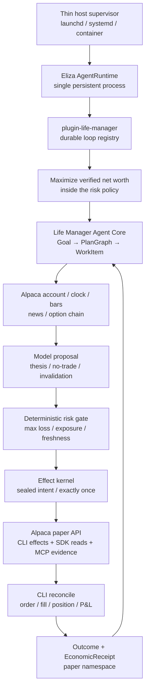
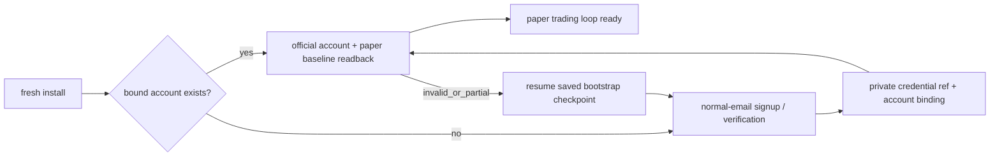
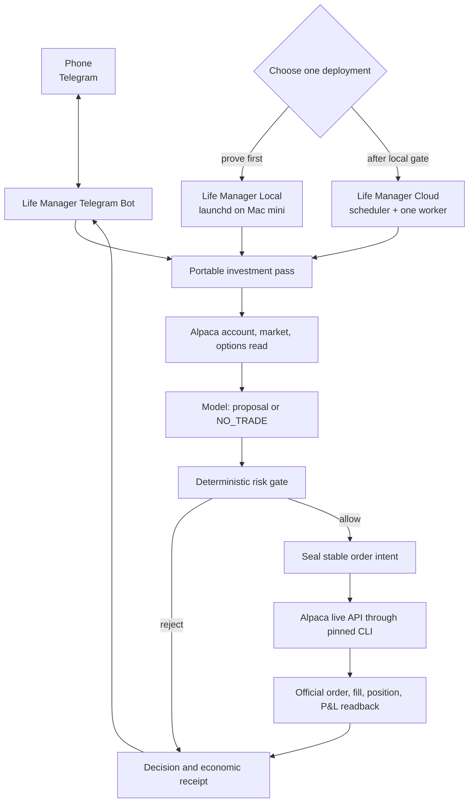
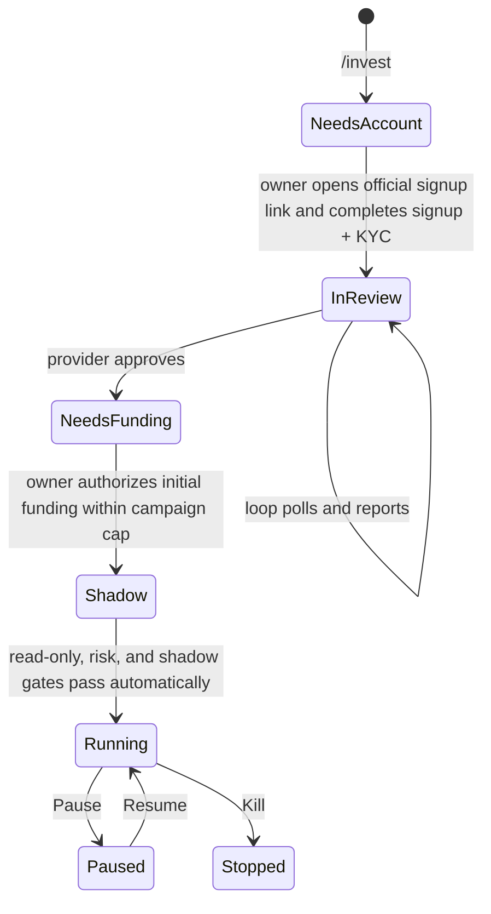
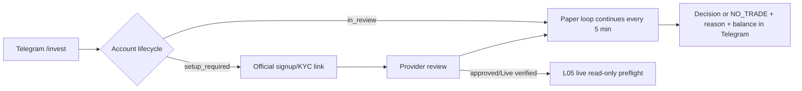

# Life Manager Alpaca Money Maximizer — design and ordered TODO

status: APPROVED PAPER HISTORY / LIVE OSS DESIGN / L01–L03 DONE / L04 ACTIVE
owner: Dais / Life Manager
hackathon deadline: 2026-09-05 00:00 JST — submitted
Alpaca live-product implementation SSOT: this document §§7–8

Sections 1–6 are the frozen hackathon design and execution history. They describe the former Eliza architecture
and must not be used to implement current work. Sections 7–8 supersede them for the native launchd/cloud live-money
product; section 8 is the only current ordered TODO.

## 1. Goal and boundaries

Build the first registered durable loop in `plugin-life-manager` and the first CAPITAL capability of the Life
Manager general money agent. One owner goal starts a bounded, restart-safe loop that observes Alpaca market/account state, lets the model propose or refuse a defined-risk
options trade, applies deterministic risk and effect gates, executes on the dedicated hackathon paper account,
and records official order/fill/P&L receipts. The same capability later ships in the local OSS and cloud hosts.

This slice does not promise profit, call paper P&L money, use Dais's live capital, manage another person's
assets, bypass CAPTCHA/KYC/provider consent, or let a model rewrite production and immediately trade. Paper,
live owner-capital, and regulated customer management remain different capabilities and ledgers.

### Acceptance

1. The submission satisfies every event-specific eligibility item: Trading API, CLI or MCP, options in every
   eligible strategy, a new dedicated $100,000 paper account, private account ID, and real paper activity/P&L.
2. A scheduled no-routine-human pass completes `observe → decide → risk → effect → reconcile → receipt → reflect`.
3. Unknown order outcome never causes a blind retry. New risk stops on stale state, reconciliation failure,
   daily loss, drawdown, insufficient option level, undefined max loss, or excessive spread/concentration.
4. Public repository, hosted demo, cover, one-pager, PDF slides, and a video no longer than four minutes are
   submitted before the deadline and independently readable while logged out.
5. The capability uses the existing Life Manager Goal/PlanGraph/WorkItem/EffectIntent/OutcomeReceipt/
   EconomicReceipt chain. Eliza owns the only loop registry and scheduler; the capability does not create a
   second agent core, scheduler, product, or general ledger.
6. A fresh install owns the complete lifecycle: create or resume the dedicated account through normal email,
   verify and store only secret references, prove a new-session login, then run trading without routine human
   setup. Replaying bootstrap reuses the bound account and creates zero duplicate accounts.

## 2. Product and runtime decision

The product is the canonical Life Manager monorepo. The agent core is the already selected ElizaOS
`AgentRuntime` plus the single `plugin-life-manager`; Alpaca is a capability/provider adapter inside that core.
The Alpaca loop registers with `plugin-life-manager` and is started, scheduled, checkpointed, resumed, healed,
and improved by the existing Eliza `AgentRuntime`. Current launchd code contributes proven lock, heartbeat,
timeout, and Telegram patterns during migration, but it does not own an Alpaca schedule or pass. The only
host-level responsibility is keeping the Eliza process alive: launchd on macOS, systemd on Linux, or the
container/cloud restart policy. These interchangeable adapters contain no goal, market, account, risk, effect,
or improvement state.



Local OSS and cloud run the same persistent Eliza runtime and internal loop registry. Host adapters only start
or restart that runtime; they never schedule the Alpaca loop. Phones are Telegram/web clients to a persistent
host because mobile operating systems are not promised as reliable background daemon hosts. Cloud adds tenant
isolation, vault, queue, billing, and quota without another core.

Eliza self-healing owns task timeout, provider failure, stale observation, acknowledgement loss, circuit break,
checkpoint resume, and loop-local quarantine. Eliza self-improvement owns receipt attribution, offline replay,
no-effect evaluation, paper canary, versioned promotion, monitoring, and rollback. A completely dead Eliza
process cannot execute its own recovery code, so only process resurrection remains outside Eliza. Machine power
and host failure remain the responsibility of the operating system or cloud platform.

### Event contract and Alpaca interface authority

This matrix freezes A01. The current official event page was read through the existing browser session; the
archived 20 August 2026 PDF verification (`SHA-256 7e436430…`) independently corroborates its controlling
requirements. Anonymous crawl/search snippets are incomplete and do not override the live page. A changed
official form or organizer notice remains controlling and must be recorded as a visible conflict before
submission.

| Requirement | Frozen contract | Evidence and conflict handling |
|---|---|---|
| Event window and deadline | Online, 28 August–4 September 2026; submit by **5 September 2026 00:00 JST** | Current official page and schedule both show the exact deadline; archived PDF agrees. |
| Challenge | Build an autonomous AI trading agent using Alpaca Trading API in paper trading | Current official challenge and archived PDF page 2 agree. |
| Agent-facing Alpaca surface | Event minimum is **either** Alpaca CLI or Alpaca MCP server | Current official `CORE REQUIREMENTS` and archived PDF page 2 agree. Life Manager chooses CLI authority plus optional read-only MCP presentation. |
| Options | All strategies incorporate options; underlying-only entry is ineligible | Current official `CORE REQUIREMENTS` and archived PDF page 2 agree. Alpaca official options docs confirm paper options are enabled by default and levels 2/3 support long options/spreads. |
| Judged account | Brand-new Alpaca paper account dedicated to this hackathon, starting at exactly `$100,000`; development accounts may differ | Current official `REQUIRED FOR JUDGING` and `ADDITIONAL REQUIREMENTS`. Alpaca official paper docs confirm global email-only Paper Only signup and the default `$100,000` balance. |
| Required write-up | One page covering AI logic, risk gates, and Alpaca infrastructure implementation | Current official `ADDITIONAL REQUIREMENTS`. This is separate from the slide presentation. |
| Private judge identifier | Submit the dedicated Alpaca paper account ID for activity/P&L verification | Current official `WHAT TO SUBMIT` and archived PDF page 6 agree. Public artifacts expose only a redacted/hash reference. |
| Submission fields | Project title; short and long descriptions; technology/category tags; cover image; video presentation; slide presentation; public GitHub repository; demo platform and application URL; Alpaca account ID | Current official `WHAT TO SUBMIT`. Generic Lablab guidance permits a video up to five minutes; this project keeps the stricter ≤4-minute target. |
| Social extra challenge | Up to five X/LinkedIn post links tagging lablab.ai and Alpaca | Current official extra challenge. These links are optional for main judging but required to compete for the social prize. |
| Judging | P&L Performance; Technology Implementation; Creativity & Originality; Presentation & Execution | Current event-specific official criteria. The generic Lablab rubric does not replace these criteria. P&L never overrides safety or truthfulness. |
| Team and originality | Team size 1–6; entrants 18+ for prize eligibility; submissions must be original and MIT-compliant | Current official guidelines and prize terms. Life Manager remains public MIT-compatible OSS with donor notices. |
| Prize pool | `$6,000` cash plus `$300` Featherless credits displayed as `$6,300` total | Current official prize section: main cash `$2,500 + $1,500 + $1,000`, social cash `2 × $500`, and first-place Featherless credits `$300`. |

**Broker authority decision:** the Alpaca CLI is the sole mutation and authoritative reconciliation surface used
by the Financial loop. Eliza invokes pinned CLI commands with structured JSON, binds every mutation to a stable
`client_order_id`, and reconciles through CLI account/order/position/activity reads. The official
`@alpacahq/alpaca-trade-api` SDK may serve only the read-only bulk market-data plane; its trading namespace is not
exposed by the Life Manager adapter. This is permitted because the event requires the Trading API plus at least
one of CLI or MCP, not CLI-only implementation. MCP remains an optional read-only judge/explanation surface; it
cannot place, replace, cancel, exercise, or close orders.

## 3. Reuse research — fixed source and decision

The repositories below were cloned into an isolated temporary directory and inspected at the listed commits.
The review covered entrypoints, broker calls, risk, state, reconciliation, scheduler, and demo rather than
README claims alone.

| Source | Fixed commit / observed evidence | Decision |
|---|---|---|
| [Veto](https://github.com/dancaldera/veto) | `4e5e6af95a70e4dd99d96323958ec72ad3538b84`; MIT; isolated `uv run pytest`: 43/43 | Primary donor. Copy/adapt paper-only key rejection, option selection/collar order construction, risk checks, `client_order_id`, reconcile/halt behavior, and read-only demo formatting. Preserve MIT notice. Do not copy its SQLite scheduler, SMA brain, separate MCP server, or product shell. |
| [Reason Before Result](https://github.com/wubian87/reason-before-result) | `095b2ae0afc1432aac786651dac797f8627ee112`; MIT; risk self-check 10/10; ledger/MCP static check PASS | Secondary donor. Copy/adapt the written-decision-before-effect sequence, MCP request/receipt redaction, and all-gates-visible explanation. Preserve MIT notice. Do not copy Chinese UI/product shell or its separate ledger. |
| [Alpaca Risk Agent](https://github.com/Stephen-Kimoi/alpaca-risk-agent) | `0d6f5a5dc5ecfc52d6868f028468df679943510e`; 415 Python LOC; no tests or LICENSE file | Learn only. Adopt the one-shot re-derive-from-broker shape and thin structured CLI invocation. Do not copy code without a license; its stock bracket strategy does not satisfy the event options requirement. |
| [Dis-Pater](https://github.com/MuhammadTahaBinZaeem/Dis-Pater) | `b40188a09fc69c99145dc5aad58f3243996ad70a`; 62,891 Python LOC, 115 tests, no root LICENSE file | Learn only and reject wholesale adoption. Reproduce only the small safety invariants: uncertain POST → reconcile by stable ID before retry, stale quote/account denial, protective exits during halt, and circuit-open on unhealthy reconciliation. |

### Reuse ladder inside Life Manager

1. Reuse the existing Eliza Goal/effect/receipt/restart kernel for orchestration and exactly-once effects.
2. Reuse current Life Manager financial/economic receipt, secret-reference, lease/heartbeat, and Telegram
   patterns; do not reuse launchd as the loop owner.
3. Adapt only MIT donor code that fills an Alpaca-specific gap and record attribution in
   `THIRD_PARTY_NOTICES.md`.
4. Use the pinned official Alpaca CLI as the sole broker authority rather than writing a custom market protocol;
   optional MCP is read-only and judge-facing.
5. Add no strategy framework, new database, agent team, dashboard framework, or second scheduler.

## 4. Hackathon strategy and winning demo

The agent trades only defined-risk option structures. The first eligible structures are long call, long put,
bull call debit spread, and bear put debit spread, subject to the dedicated account's actual approved option
level. A strategy requiring an unavailable level is unavailable, not silently replaced by a stock-only trade.
No naked short option, unbounded loss, leverage, martingale, or fabricated fill is permitted.

The model interprets market regime, price/volume evidence, news, and option-chain evidence and produces one
proposal or `NO_TRADE`. Deterministic code validates structure and arithmetic. The initial frozen policy is:

- hard maximum loss per trade: 0.5% of current paper equity;
- total open maximum loss: 3%; minimum uncommitted cash: 30%; no borrowed leverage;
- daily realised/unrealised loss halt: 1.5%; portfolio high-water drawdown halt: 4%;
- maximum five positions; maximum ten open orders; five-minute entry cooldown;
- quote age at most 30 seconds, Greeks age at most 60 seconds, spread at most 15%; initial entries use 7–45 DTE;
- only regular-session entries; risk-reducing exits remain allowed while entries are halted.

Parameters freeze before the first judged trade. Historical replay chooses the initial strategy; competition
P&L does not trigger mid-event curve fitting. Paper deposit, reset, or self-transfer is never income.

The four-minute demo shows: Life Manager goal, new paper account and option level, CLI observation, model thesis,
one rejected proposal, one permitted defined-risk proposal, Alpaca CLI order receipt, reconcile/fill/P&L,
Telegram/panel evidence, the optional read-only MCP explanation view, and the same-core OSS path. The broad SELL/WORK/CAPITAL story is the opening/closing
differentiator; the middle of the demo is real Alpaca execution.

## 5. No-routine-human bootstrap

Use normal email signup through the existing owned browser and mailbox session; do not require Google login.
The bootstrap may read a provider email code and continue, store credentials only in the private credential
SSOT, and prove a new-session login. It must stop rather than bypass CAPTCHA, mandatory identity/KYC, legal
consent, or a provider request for the account owner. Such a provider-enforced handoff is reported as a named
blocked capability and is not hidden behind a claim of full autonomy.

Account bootstrap is a resumable one-time state machine inside the same Financial/Alpaca capability, not a
manual prerequisite and not part of every market wake:



## 6. Hackathon execution history — closed

This section preserves the paper-hackathon implementation history. It is not the current execution queue; the
only authoritative current cursor and order are in section 8. During the event, Dais changed the order after the first paper canary proved
durability: the open SPY exit remains owned by the same background Eliza task, but a closed options session no
longer blocks multi-market research, the bounded portfolio allocator, or submission artifacts. No second
scheduler or broker mutation path is introduced. Each atom ends with the named official readback; tests support
the atom and do not create a separate completeness program.

The historical cursor was **A11 Multi-market paper allocator**. The submitted product has since moved to the
native launchd loop recorded in section 7. A01 is DONE with the event contract matrix above. The prerequisite startup-context drift repair is DONE: public
`/lm` metadata is bound to context `2026-09-01.1` / digest `f61cbb3c…` through anicca-products PR #402,
production deploy run `33500496615` and its money-path smoke passed, and the Life Manager live audit reads
product/repository/Telegram as 3/3 GREEN. This prerequisite does not consume or reorder an Alpaca atom.

A02 is **DONE**. The normal-email Lablab account remains `Approved` for the event, and Dais completed Discord's
required human-presence checks. The connected Discord identity initially differed from the identity that had
joined the LABLAB.AI community; changing the official Lablab OAuth connection to the joined identity removed
the provider's `DISCORD_COMMUNITY_JOIN_REQUIRED` response. Lablab then returned HTTP `201` with a team slug and
created the one-member, closed, UTC +9:00 team `Life Manager`. Official readback:
`https://lablab.ai/ai-hackathons/alpaca-ai-trading-agents-hackathon/life-manager`.

The final submission is public with title `Life Manager: Autonomous Options Money Loop`, truthful short/long
descriptions, categories Finance/Investment/Personal Finance, technology Alpaca, video, slides, public repository,
demo URL, and the private Alpaca account ID supplied only to the submission form. Logged-out readback returns the
public project and demo. Google login was not used, and no secret or Discord/account identifier was written to the
repository.

A03 is **DONE**. A brand-new Alpaca Trading API identity was created through the normal-email form and verified
through the existing authenticated mail reader. Authenticator MFA and its recovery code are active; password,
TOTP secret, recovery code, and paper account ID exist only in the mode-`0600` private credential SSOT. A fresh
cookie-free login required both password and a newly generated TOTP code and returned the same private paper
account. The official paper dashboard reads equity `$100,000.00`, cash `$100,000.00`, no open positions, no
orders, and no activities. Official configuration reads options `Level 3`, including defined-risk spreads and
multi-leg strategies. The provider offered a separate live Individual/Business account application; it was not
started, and no KYC, funding, live-capital, or live-trading state was created.

The active Eliza implementation branch `feat/alpaca-a03-autonomous-bootstrap-20260901` now exposes
`ALPACA_BOOTSTRAP` from the sole `plugin-life-manager`. It stores one redacted, non-scheduled checkpoint Task
row; an empty checkpoint discovers six bound private refs from the mode-`0600` credential SSOT and runs only
the pinned CLI. A production readback through that operation returned `READY` twice with one Task row,
`scheduled=false`, paper ACTIVE, cash/equity `100000`, options Level 3, and zero positions/orders/activities.
The second pass created no Task or account duplicate. A fresh-install fixture now atomically seeds only the
owner's normal email, an internally generated password, and the paper endpoint into the private SSOT, preserves
mode `0600`, and checkpoints three bound refs without returning the password to the model. BrowserService actions
now fill those values without model exposure, use the authenticated read-only mailbox CLI to allowlist and open
only the Alpaca verification URL, capture TOTP/recovery/API/account material directly into the private SSOT, and
generate/fill the current TOTP code without returning either the secret or code. Commit `69a3fa4e58` passed Biome
and package typecheck; a production-function runtime fixture preserved mode `0600`, filled exactly six digits,
and exposed neither value. Commit `4b0bb86350` extends the same checkpoint to deterministic
`CREATE_PAPER_ACCOUNT → VERIFY_EMAIL → CONFIGURE_MFA → BIND_API_KEYS → RUN_TRADING_LOOP` resumption. Its runtime
fixture produced exactly one create step, required eight private refs including recovery code and account ID,
then reached paper `READY` with cash/equity `100000`; Bun compiled every changed production entrypoint. The real
existing account path remained `READY` and left the SSOT hash unchanged. Commit `9c7dba5473` registers
`plugin-life-manager` once in the normal macOS/Linux/Docker core collector while keeping it out of the CLI-less
mobile boot. Commit `8dd1114f3e` routes every Alpaca Action into the `finance/automation` owner context and returns
the concrete BrowserService/private-action chain to the native planner; its handler fixture persisted one Task,
selected normal email rather than Google login, and exposed no secret. A real isolated Eliza runtime then loaded
`plugin-life-manager`, accepted one authenticated owner goal, selected and successfully executed
`ALPACA_BOOTSTRAP`, and persisted exactly one checkpoint Task at `READY / RUN_TRADING_LOOP`. Its redacted action
trajectory and Task readback reported eight bound credential refs, paper `ACTIVE`, cash/equity `100000`, options
Level 3, and zero positions/orders/activities. After a full runtime stop and restart against the same state, a
second owner goal executed the same action, kept the Task count at one, and returned the same facts; immediate
official CLI readback still returned zero positions/orders/activities. No account, order, or trade was created by
either pass. The closing implementation on branch `feat/alpaca-a03-autonomous-bootstrap-20260901` adds the
existing CloakBrowser CDP session as a local BrowserService target and a deterministic, authenticated Life
Manager bootstrap dispatch. Life Manager used Alpaca's official account switcher, created exactly one additional
paper account named `Life Manager`, and left the original baseline account intact. The provider returned HTTP
`200` for `POST /api/v1/paper_accounts`; switcher readback showed two paper accounts and exactly one `Life
Manager` account. Life Manager selected the new account, generated its API keys, and captured the key, secret,
and account number directly into the mode-`0600` private credential SSOT without returning their values to the
model or logs. Pinned CLI v0.0.14 then returned `READY / RUN_TRADING_LOOP`, paper `ACTIVE`, cash/equity `100000`,
options Level 3, and zero positions/orders/activities. After a full runtime restart, the same checkpoint returned
the same READY facts; the provider still showed two paper accounts and one `Life Manager` account, proving zero
duplicate creation. No live account, live capital, order, position, or trade was created. Closing commits through
`a8e00e3f3e` passed BrowserService `22/22`, bootstrap/private-capture `2/2`, and focused import/diff checks.

A04 is **DONE** against the official `alpacahq/cli` release `v0.0.14`, source commit
`53606273aa230a40c64b783425dcb3f4423ede30`. Its published release checksum was verified before installing the
native macOS arm64 binary. `alpaca version` returns `0.0.14`; `alpaca doctor` reports no saved profile, env-only
credentials, active profile `paper`, connected `paper-api.alpaca.markets` trading and data APIs, and all checks
passed. CLI JSON reads return the same private account with status ACTIVE, cash/equity `100000`, options level
3, a valid market clock, a current SPY trade, ten SPY option-chain snapshots, and three SPY news items. CLI
position/order/activity lists each return zero. Paper keys exist only in the private credential SSOT and are
injected into the process environment; `ALPACA_LIVE_TRADE=false`, no CLI profile or repo secret exists, and no
mutation command ran. The closing readback against the Life Manager-created A03 account returned the same
paper ACTIVE cash/equity `100000`, options Level 3, current market clock and SPY trade, ten option-chain
snapshots, three news items, and zero positions/orders/activities. No CLI profile was created.

A05 is **DONE** in `life-manager-eliza` merge `270d80f99850c4274a7fb70f2625f55a7bfb3c79` (PR #47).
`plugin-life-manager` now reuses the existing private credential reader and bounded `execFile` boundary to expose
typed paper account, latest-trade, and option-chain observations plus one CLI-only defined-risk `mleg` order
method. Every invocation pins CLI v0.0.14 and injects `ALPACA_LIVE_TRADE=false`; a non-paper request is rejected
before credential resolution or process execution. Real readback returned paper ACTIVE, cash/equity `100000`, a
current SPY trade, and 100 option snapshots. The pinned CLI's own `order submit --dry-run` produced a two-leg
`mleg` limit/day request with a stable client order ID, and an injected execution-boundary check produced a typed
paper receipt. No REST/SDK mutation path exists and no order was submitted; the first broker effect remains A08.

A06 is **DONE** in `life-manager-eliza` merge `f3e11707e60a22d5b2721ad11060fdf5531f7700` (PR #48).
One bounded `ACTION_PLANNER` call returns either `NO_TRADE` or a strict options decision containing thesis,
structure, maximum loss, invalidation, exit plan, and only offered evidence references. A tenant-scoped,
work-item-unique `decision_receipts` row stores that payload separately from model-attempt metadata. The same
work item replays the durable receipt without another model call. Its persistence transaction checks that no
effect intent already exists and fails closed if effect ordering has been violated. Plugin strict typecheck and
four focused suites passed (`7/7` tests), including first call=1, replay call=0, and effect-before-decision
rejection. No broker order or other external effect ran in A06.

A07 is **DONE** in `life-manager-eliza` merge `b7a39fc8eaf58ea838f36820e05ec3edb0f9b9b5` (PR #49).
One pure gate checks the model decision against deterministic max-loss arithmetic and the frozen paper policy:
0.5% per trade, 3% total open risk, 30% cash reserve, 1.5% daily-loss halt, 4% high-water drawdown halt,
five positions, ten orders, five-minute cooldown, 30-second quotes, 60-second Greeks, 15% spread, option
level, no leverage, regular-session entry, and healthy reconciliation. The initial 7–45 DTE range excludes
0DTE and same-week expiration risk; [FINRA](https://www.finra.org/investors/insights/zeroing-in-options-trading-strategy)
warns that buying and selling 0DTE options can be risky, while
[OCC](https://www.optionseducation.org/referencelibrary/faq/weekly-options) documents weekly expiry/exercise
behavior. Unknown structures and malformed runtime values fail closed. Plugin
strict typecheck and four focused suites passed (`5/5` tests); a $400 maximum-loss spread on $100,000 equity
passed, while the combined halt fixture returned every applicable reason. No broker effect ran in A07.

A08 is **DONE** in `life-manager-eliza` merges through PR #58. The owner-authenticated Life Manager Eliza
runtime observed the dedicated paper account and fresh SPY option snapshots through pinned Alpaca CLI v0.0.14,
persisted a model decision, and rejected its first 751P/750P proposal with deterministic `SPREAD_LIMIT` and zero
broker effect. On a second immutable run it selected one 769C/770C bull-call debit spread, calculated and agreed
maximum loss `$33`, passed A07 with no reasons, sealed a stable `lm-a08-*` client ID, acquired the durable DB
effect lease, and submitted through the CLI-only paper adapter. Official Alpaca readback returned one filled
order, quantity one, and the same provider order/client IDs. Replaying the identical run returned
`effect_started=false`, `replayed=true`, `outcome=noop`; an official all-orders query found exactly one matching
client ID. Immediate paper readback was equity `$99,996.95`, cash `$99,970.95`, two option legs, and unrealized
P&L `-$3`; A08 therefore proves execution and idempotency, not profit. No live credential or capital was used.

A09 is **DONE** in `life-manager-eliza` merge `c5f20b77eadecbd975e12a2c9b092796cf533cfb`
(PR #59). With the isolated runtime stopped, the existing applied intent was changed to an expired `running`
lease and its outcome receipt was removed to simulate a lost acknowledgement. The merged runtime then restarted
against the same DB and the same owner request. Life Manager performed one pinned-CLI lookup by the sealed
client ID, consumed that official readback without a second inspect or submission, returned
`effect_started=false`, `replayed=true`, `outcome=noop`, restored the missing receipt, and converged the intent
to `applied` with no lease. Official Alpaca CLI readback still found exactly one matching order, provider order
ID `c143b7aa-52d5-47f8-9e59-fae7ded50a0d`; no duplicate order was created. A separate copied-DB fault injection
made the sealed broker order absent after effect start: the route returned HTTP `409`, persisted
`reconciliation_blocked`, cleared the lease, and the official matching-order count remained one. Strict plugin
typecheck and four focused suites passed (`6/6` tests). Closing paper readback was equity `$99,997.95` and cash
`$99,970.95`; A09 proves recovery and fail-closed behavior, not material profit.

A10 is **DONE** in `life-manager-eliza` merges `126f042f4181b80866ad696981a70ef22c49f2c1`,
`3a0377164c0a005b888a44a344f3ee05312cb4cb`, and `ed39404f44f865cd35bd54227094940f1b4c363d`
(PRs #60–#62). `plugin-life-manager` registers one seed-once five-minute interval task and one contributed
Financial dispatch channel through the existing `plugin-scheduling` spine; no timer, scheduler DB, host cadence,
or broker mutation path was added. The deferred-plugin boot hook seeded exactly one task. Official scheduled-task
readback showed one matching idempotency key, then the existing Eliza runner naturally fired the same task ID and
recorded `ok=true`, channel `life_manager_alpaca_paper_loop`, and Financial status `ORDER_VERIFIED`. The pass
reconciled the A08 order through pinned Alpaca CLI and submitted no new order. After a full runtime stop/restart,
readback preserved the same task ID, trigger, fire time, and result with matching task count one. Official Alpaca
CLI still found exactly one matching client ID/provider order; paper equity was `$99,997.95` and cash
`$99,970.95`. Strict plugin typecheck and five focused suites passed (`8/8` tests). Host adapters contain no
Alpaca timing or trade decision.

A11 is **ACTIVE**. `life-manager-eliza` merge `512ef713a5fac6dae002d62e566649e09924716a`
(PR #63) adds a pinned-CLI campaign snapshot and an immutable reconciliation receipt without adding another
broker or scheduler path. The official account returned exactly two entry fills and the two expected SPY option
positions; fill-derived quantities matched the long `769C` and short `770C` legs with zero unexplained delta.
Life Manager recorded the open campaign with entry debit `$29`, two fills, two positions, and unrealised P&L
`-$2`; unrealised P&L was not recorded as revenue. A real branch-root Eliza runtime loaded the Life Manager
plugin, action, and service, then fired the existing task ID through channel
`life_manager_alpaca_paper_loop` with `ORDER_VERIFIED` and no pending dispatch. Official Alpaca CLI still found
exactly one matching client order/provider order, paper equity `$99,997.95`, and cash `$99,970.95`. The position
has not exited, so realised P&L is not yet available and A11 remains ACTIVE.

Follow-up `life-manager-eliza` merge `ad5f1fdbf7f12ced5ed24c53841bce4d5bb50496` (PR #64) seals the
risk-reducing exit through the same effect kernel and stable client-ID derivation. It uses Alpaca's documented
mleg sign convention (negative limit price means credit), records exact position/fill details, and creates a
paper-only realised gain/loss receipt only after official positions reach zero. The existing five-minute task
now evaluates this exit on every pass. Its real after-hours fire returned `ORDER_VERIFIED` plus
`HOLD_CLOSED_SESSION`, with pending dispatch empty and no close order submitted; the next regular-session fire
owns the exactly-once close and subsequent realised-P&L reconciliation.

Follow-up merges `45e33086bf0463323d3c28b1509854af2f5226ed` and
`772189de2f4229fe6c47c6d926037cae8c61cefb` (PRs #65–#66) persist immutable
`broker.paper.no_effect` receipts for future `NO_TRADE`/`RISK_REJECTED` decisions and make entry selection
explicit from its sealed `*_to_open` legs, so a later exit intent cannot be mistaken for the entry. The earlier
rejected `751P/750P` proposal now has one historical `RISK_REJECTED / SPREAD_LIMIT / effectStarted=false`
receipt and no broker order. After restart on the same database, the existing five-minute task retained the same
ID and returned `ORDER_VERIFIED / HOLD_CLOSED_SESSION`. Pinned-CLI readback still showed one filled entry,
two fills, two positions, zero open orders, cash `$99,970.95`, equity `$99,997.95`, and unrealised P&L `-$2`.
No close order exists while the regular session is closed; A11 remains ACTIVE until the loop records an official
close fill, zero positions, and the realised paper P&L receipt.

Current paper-money scoreboard (pinned-CLI readback): starting equity `$100,000`; current equity `$99,997.95`;
realised P&L `$0`; open-position unrealised P&L `-$2`; realised profit made `$0`. Therefore the Alpaca loop has
placed and filled its first paper trade but is **not making money yet**. Paper equity, unrealised P&L, and any
future realised paper gain remain simulation evidence and must never be reported as revenue or live earnings.

The A11 natural-recurrence sub-atom is **DONE**. Without a REST fire or second scheduler, the live Eliza
TaskService refired the same interval task ID from `20:59:39Z` to `21:16:13Z`; the contributed Financial channel
again returned `ORDER_VERIFIED / HOLD_CLOSED_SESSION`. The persisted trigger remains five minutes, although this
observed process fire was late and is not represented as an exact-cadence guarantee. Immediate pinned-CLI
readback retained the same filled provider order ID, two fills, two positions, zero open orders, cash
`$99,970.95`, equity `$99,997.95`, and unrealised P&L `-$2`. Natural recurrence therefore added zero broker
orders. The next A11 sub-atom remains the regular-session sealed exit and realised-P&L reconciliation.

Restart durability was re-read from the same live runtime and PGlite state rather than inferred from a PID. After
process resurrection, the authenticated Eliza API retained task `st_mtj43gm5_goclnvsx`, its five-minute trigger,
and advanced `firedAt` again to `21:27:38Z` with `ORDER_VERIFIED / HOLD_CLOSED_SESSION`. A fresh pinned-CLI
v0.0.14 readback at `21:30:37Z` still showed exactly one filled campaign order, the same two entry fills and two
positions, zero open orders, cash `$99,970.95`, equity `$99,997.95`, and unrealised P&L `-$2`. Thus restart plus
subsequent natural replay preserved the durable task and added zero broker orders. The market clock remained
closed with the next regular session at `2026-09-02T09:30:00-04:00`; no after-hours exit was attempted.

Here `HOLD_CLOSED_SESSION` is narrowly an **options-exit** hold, not an Alpaca-wide market outage. The open
campaign owns US-listed SPY option legs, and Alpaca says options orders may only be placed during regular market
hours. Alpaca separately documents crypto trading 24 hours every day and 24/5 overnight trading for NMS
securities. Those asset classes do not make the current option legs closeable. Dais subsequently authorized the
same Financial loop to continue across other asset classes while that exit remains monitored; aggregate
exposure, open orders and campaign state must be included in every allocator decision. Sources:
<https://docs.alpaca.markets/us/docs/spacex-trading-availability-and-faqs>,
<https://docs.alpaca.markets/us/docs/crypto-trading>, and <https://docs.alpaca.markets/us/docs/245-trading>.

There is no supported parameter that makes the two open option legs executable after hours. Alpaca's options
validation requires `extended_hours=false` or omission; `day`/`gtc` describe lifetime, not an extended-hours
execution venue. The current resolution is therefore one regular-session, two-leg `SELL_TO_CLOSE` /
`BUY_TO_CLOSE` limit order through the existing sealed CLI effect, followed by official fills, zero positions,
realised paper P&L, and replay-zero readback. The permanent non-blocking design after this frozen campaign closes
is an asset-class-aware opportunity router inside the **same** Eliza task/effect kernel/CLI authority: crypto may
run 24/7, eligible NMS equities/ETFs may run 24/5, and options entries/exits run only in their regular session.
An option-session hold must never pause observations for another asset class. Any new bounded paper effect must
still pass the one portfolio-level risk gate, use the existing CLI effect kernel, and reconcile before another
effect begins. Order validation source:
<https://docs.alpaca.markets/us/docs/options-trading>.

The A11 non-blocking data-plane sub-atom is **DONE** in `life-manager-eliza` merge
`1f18fcbe7c5a0b2a1b58a13819c4b8b1452b7499` (PR #67). The plugin pins the current official
`@alpacahq/alpaca-trade-api` `4.0.1` SDK behind a read-only adapter that exposes only bulk option-chain and crypto
snapshot reads. It does not return the SDK client or trading namespace, while the existing CLI remains the only
order/effect and account/order/fill reconciliation path. Typecheck and plugin build passed. A real authenticated
paper-data read returned 305 SPY call contracts plus BTC/USD and ETH/USD snapshots, including a current BTC
trade, with zero broker mutation. The superseded `alpacahq/typescript-sdk` was rejected because its own official
README says it is no longer maintained and points to `alpaca-trade-api-js`. This removes closed-session research
blocking without authorising a second campaign before the open SPY spread closes.

The A11 no-effect ranking sub-atom is **DONE** in `life-manager-eliza` merge
`b4dc698ef66e46f9d6e82e82e1a279539d739f6d` (PR #70). The same registered task first
reconciled the existing order and evaluated its sealed exit, then used the read-only SDK adapter to construct
12 quoted SPY vertical-spread candidates while reading BTC/USD and ETH/USD only as market context. One bounded
model decision returned `NO_TRADE`; Life Manager persisted the thesis, invalidation, exit plan, evidence refs,
and all ranked candidates as `RESEARCH_ONLY / effectStarted=false`. The dispatcher result was
`ORDER_VERIFIED / HOLD_CLOSED_SESSION / NO_TRADE`. Immediate pinned-CLI readback remained two positions, two
fills, zero open orders, cash `$99,970.95`, equity `$99,997.95`, and unrealised P&L `-$2`, proving that research
added zero broker effects. During E2E recovery, the existing task's stale notification escalation was closed,
reopened, and refired under the same task ID so its Financial channel—not `push/in_app`—owned the successful
pass. Typecheck, build, and three focused suites passed (`4/4` tests).

The A11 dispatcher self-heal sub-atom is **DONE** in `life-manager-eliza` merge
`097111f3b1f379282e6dfd0244756faf32742c24` (PR #73). A real restart exposed two persisted-host failures:
the deferred Life Manager plugin could register after the five-minute task had already recorded
`disconnected`, and the task's legacy `bg-light-30s` execution profile caused the host-capability gate to
substitute `in_app` before the contributed Financial dispatcher. The same Eliza boot hook now removes only
that stale Alpaca dispatch state, clears the legacy profile, and lets the existing runner refire when the
interval is naturally due. At `23:43:46Z` the same task ID fired without a REST/manual trigger and persisted
`ok=true`, channel `life_manager_alpaca_paper_loop`, and
`ORDER_VERIFIED / HOLD_CLOSED_SESSION / NO_TRADE`; pending dispatch was absent. Pinned-CLI readback remained
paper `ACTIVE`, cash `$99,970.95`, equity `$99,997.95`, two positions, two entry fills, and unrealised P&L
`-$2`. No close fill exists, so realised campaign P&L remains `$0`. Typecheck, build, three focused suites
(`4/4` tests), and `git diff --check` passed. The next natural recurrence at `23:49:16Z` returned the same
three Financial statuses with pending dispatch absent; immediate CLI readback still showed two positions and
two fills with identical cash/equity, proving this closed-session replay added zero broker effects. The final
post-close replay-zero gate remains pending.

The A11 multi-market allocator contract sub-atom is **DONE** in `life-manager-eliza` merge
`3df280e9d6d97e882986ee84e512973dcef1a241` (PR #75). The same natural task read 12 SPY defined-risk option
candidates, live BTC/USD and ETH/USD quotes, and one QQQ snapshot through the read-only SDK, then offered all
15 candidates to one model decision. The typed result carries `assetClass` plus one offered candidate reference;
the model selected the SPY `782C/783C` debit spread with stated maximum loss `$2`. Life Manager persisted the
decision and all offered candidates as `RESEARCH_ONLY / effectStarted=false`. Pinned-CLI readback remained the
existing two SPY legs and two entry fills, so the allocator created zero broker effects. Typecheck, build, and
three focused suites passed (`4/4` tests). The selected far-OTM spread also exposes the next quality gap: common
expected-value, probability, freshness, and liquidity evidence must be normalized before any crypto/equity
effect is authorized; a low debit alone is not a winning strategy.

The A11 common scoring-gate implementation sub-atom is **DONE** in `life-manager-eliza` merge
`640af4ca1790e6de6ef973430c5ae276f11d2332` (PR #82). The existing single model decision now supplies an
estimated win probability and expected gain; deterministic code calculates expected value and checks it against
the selected candidate's exact maximum loss. Every option, crypto and ETF candidate carries quote age and spread
in basis points, while defined-risk options also carry maximum profit. The research-only gate rejects nonpositive
expected value, quotes older than the existing 30-second policy, spreads above the existing 15% policy, maximum-
loss mismatch, and option expected gain above the contract's maximum profit. No scheduler, broker client, DB,
dependency or order path was added; Alpaca CLI remains the only mutation authority. Typecheck, build, three
focused suites (`4/4` tests), and `git diff --check` pass. Main-derived production natural-wake evidence remains
pending and is not inferred from the source checks.

The A11 aggregate portfolio-gate implementation sub-atom is **DONE** in `life-manager-eliza` merge
`e9d15205afcf4e63283226dad86793a284cc5cbf` (PR #83). The ranking pass reads the official CLI campaign
snapshot and the immutable opening-order risk receipt, then evaluates candidate maximum loss together with
existing open maximum loss, every current position, open-order count, cash/equity, daily P&L, high-water
drawdown, and reconciliation health. Existing positions without a readable opening risk fail closed as
`OPEN_RISK_UNKNOWN`. The verified pure example adds the current `$29` SPY maximum loss to a `$250` candidate
for aggregate maximum loss `$279`; typecheck, build, three focused suites (`5/5` tests), and `git diff --check`
pass. This is still research-only and adds no broker effect. Read-only process and reflog evidence shows the
running Eliza PID loaded separate-branch commit `41da4d035caead82534751ebed4c68db7030ad3f` at startup. Its checkout
later advanced without a process restart to `02f8acf2ffcdee075adb45ebd830b885d7f9291e`; neither commit contains
the spot-effect merge `951b02dfb0a3aab2464d943c5f5ff2190cae94f4`. At that observation point main-derived natural-wake evidence
remained pending; source checks and a changed checkout were not presented as runtime deployment proof.

The A11 risk-gated spot-effect source sub-atom is **DONE** in `life-manager-eliza` merge
`951b02dfb0a3aab2464d943c5f5ff2190cae94f4` (PR #85). The existing ranking pass now seals an allowed crypto
or equity/ETF selection into one stable `lm-a11-*` client order ID, persists one planned effect intent, and
submits one paper-only market order through pinned Alpaca CLI v0.0.14. Crypto uses `gtc`; equity uses `day` and
is vetoed outside the regular session. The existing effect-receipt kernel performs official client-ID readback,
unknown acknowledgement opens the reconciliation breaker, and identical replay submits zero additional orders.
Current spot exposure is included in aggregate maximum loss before a later proposal can act. No SDK mutation,
second broker client, scheduler, or live-capital path was added. Typecheck, build, two focused suites (`5/5`
tests), and `git diff --check` pass. Main-derived natural-wake broker evidence remains pending and is not inferred
from source checks.

The main-derived runtime promotion is **DONE** without `launchctl` or any `gui/$UID` operation. The old Eliza
tmux process stopped independently of the Codex app-server, Remote Control, phone tunnel, gateway and browser;
all remained live. A 43 MB PGlite snapshot and the old start entrypoint were retained before promotion. The first
main boot exposed an invalid WAL checkpoint in the existing PGlite directory; a pristine snapshot copy reproduced
the failure, `pg_controldata` showed a shut-down cluster, and `pg_resetwal` repaired only a copy before it opened
89 tables, read six scheduled tasks and 178 task-log rows, and closed cleanly. The same bounded recovery then
restored production state. Eliza now runs from clean `life-manager-eliza` main merge
`7d2b79d65bdcf0f62fc4fd13bcdb25f99d075569`, its PGlite lock names the new runtime PID, plugin-life-manager and
AutonomyService completed startup, and the independent Remote processes remained live. The natural task wake and
official broker receipt still require readback before this A11 sub-atom is complete.

The A12 shared public-projection source sub-atom is **DONE** in `life-manager-eliza` merge
`0837d62918d1ce1719e04f03cab807ad5859e139` (PR #87). A pure allowlist converts official CLI campaign state
and persisted decision/effect/outcome receipts into paper status, starting/current equity, cash, total/daily/
unrealised P&L, positions, redacted fills, latest thesis/gate, timeline and reconciliation counts. Broker order
and fill IDs are replaced by deterministic `public-*` hashes; account ID, credentials, raw input references,
model prompts and raw errors are never selected. `GET /api/life-manager/alpaca/public` performs reads only and
returns a generic `503` on failure. Typecheck, build, focused redaction test (`1/1`), and `git diff --check` pass.
A12 remains incomplete until the same projection drives a logged-out page on a hosted URL and that URL is read
back without authentication.

The A12 read-only page source sub-atom is **DONE** in `life-manager-eliza` merge
`7d2b79d65bdcf0f62fc4fd13bcdb25f99d075569` (PR #89). The responsive `/alpaca` page renders the same shared
projection used by the GET API and adds no form, button, POST route, SDK mutation, broker client, or order
surface. Focused public projection/page tests passed (`2/2`), plugin typecheck and build passed, and
`git diff --check` passed. A12 remains incomplete until `/alpaca` is hosted at a logged-out public URL and that
URL is read back without authentication.

### Win target and verified competitive baseline

The target is both **main-prize first place** and one of the two **Social Engagement prizes**, but they are
different scoreboards. The authenticated event page says judges score P&L Performance, Technology
Implementation, Creativity & Originality, and Presentation & Execution. The live page labels its visible project
ordering `Top submissions — By community vote`; its separate builder leaderboard explicitly says points do not
affect submission evaluation. Social Engagement is a separate prize whose quality and likes/comments/shares may
be considered. At the research readback there were 3,459 participants, 1,150 teams, 56 submissions, 78 drafts,
and 44 Options Alpha submissions; the community-vote leader had nine votes. Community votes are useful reach,
not proof of main-prize rank.

The submission draft is real and saved at Step 2 of 3 (`26%`). Cover image, video, and slide PDF are mandatory;
the complete submission also requires public GitHub, a logged-out working application URL, the private dedicated
Alpaca paper account ID, and up to five X/LinkedIn post URLs. Deadline remains 2026-09-05 00:00 JST.

### OSS and competitor code audit — copy the pattern, not the broker path

All repositories below were shallow-cloned into an isolated temporary directory and inspected at the pinned
commit. No source was copied into Life Manager during research.

| Source | Inspected evidence | Adopt / reject |
|---|---|---|
| `Chong1120/Vetoed@465f8d7` | Deterministic shortlist/veto, paper-only guard, broker reconciliation, stable IDs, SQLite decision funnel, return-on-risk/exit reasons, static judge dashboard, write-up/Q&A/demo script. | **Adopt the audit/dashboard/presentation shapes.** Reject SDK mutation, GitHub Actions scheduler, and git-pushed broker journal. |
| `ibrahimjatt1313-prog/AlphaPilot@7cb43cc` | Current community-vote leader: indicators, option ranking, position/open-order checks, SL/TP, CSV performance, Streamlit demo. Execution contains hard-coded contract/price and direct SDK calls. | Adopt only the simple judge-visible lifecycle. Reject execution and performance authority. |
| `huygiatrng/AlpacaTradingAgent@8d9d770` | Analyst/researcher debates, SQLite checkpoints, memory/reflection, backtest UI, direct Alpaca integration. | Adopt structured decision explanation and later offline reflection vocabulary. Reject a second agent graph and broker client. |
| `dyners5208/AlpacaTradingAgent@49a1100` | Defined-risk multi-leg orders, wheel workflow, margin checks, position manager and dashboard. | Use as strategy/reference evidence only. Reject direct SDK effects, live switch and wheel complexity before submission. |
| `virattt/ai-hedge-fund@eff8a73` | Deterministic portfolio blending, non-negotiable position/gross clamps, point-in-time backtest, complete thesis→clamp→order→fill receipts. | Adopt clamp/funnel metric names for public explanation. Reject its simulated broker as campaign evidence. |
| `TauricResearch/TradingAgents@9dee508` and `Lumiwealth/lumibot@859f02e` | Multi-role graph/memory and mature strategy/backtest abstractions. | Reference only; importing either framework would replace Eliza ownership and exceed the deadline. |
| `alpacahq/alpaca-py@712dc73` | Official options/mleg, spreads, wheel, iron condor, 0DTE and backtest examples. | Use to validate strategy semantics only. Broker mutation remains pinned Alpaca CLI exclusively. |

Life Manager's defensible difference is not “more agents.” It is the only inspected design that demonstrates the
agent itself creating and resuming a fresh `$100,000` paper account, then keeps one Eliza loop, one pinned CLI
broker authority, decision-before-effect receipts, deterministic vetoes, exactly-once recovery and a public
broker-reconciled audit trail. The demo must make that end-to-end autonomy visible in under four minutes.

| Seq | Atom | Done condition |
|---:|---|---|
| A01 | Freeze event contract — **DONE** | Official/archived rules matrix confirms deadline, Trading API, CLI/MCP, options, new paper account, account ID, judging, and every submission artifact; conflicts remain visible. |
| A02 | Team/submission shell — **DONE** | The official one-member team and final public submission contain title, short/long descriptions, tags, cover, video, slides, public GitHub, demo URL, and the private Alpaca account ID. |
| A03 | Life Manager-owned paper-account bootstrap — **DONE** | From the existing normal-email/password/TOTP login, `plugin-life-manager` uses Alpaca's official **Open New Paper Account** path, captures the new account ID/API keys privately, and checkpoints the result; a restart resumes the saved checkpoint; pinned-CLI readback proves the new paper account has cash/equity=`100000`, empty positions/orders/activity, and options Level 3. The existing baseline account is neither deleted nor presented as agent-created. |
| A04 | Alpaca CLI preflight — **DONE** | Pinned CLI v0.0.14 and doctor plus account/clock/SPY/options/news reads return the dedicated paper account; zero positions/orders/activities reconcile; secrets appear in no repo/log/chat artifact. Optional MCP is not a readiness dependency. |
| A05 | Alpaca CLI provider adapter — **DONE** | `plugin-life-manager` converts CLI JSON account/market/option data to typed observations and can submit a paper-only defined-risk order request through the CLI; live mode is structurally rejected and no second REST/SDK mutation path exists. |
| A06 | Decision-before-effect — **DONE** | One bounded model call returns `NO_TRADE` or a typed thesis, structure, max loss, invalidation, exit, and evidence refs; the written decision precedes any effect intent. |
| A07 | Risk gate — **DONE** | Pure gate proves defined max loss, option level, quote/Greeks freshness, spread, DTE, cash/exposure, order/position count, cooldown, daily loss, drawdown, leverage, and reconciliation health. |
| A08 | Exactly-once paper canary — **DONE** | One model-selected 769C/770C paper spread passed the deterministic gate, filled through pinned CLI, and reconciled to one official order/client ID; identical replay returned noop and added zero orders. Immediate unrealized P&L was `-$3`, so no profit claim is made. |
| A09 | Ack-loss/restart reconciliation — **DONE** | A real process restart reconciled the simulated lost acknowledgement from one official client-ID readback, restored the receipt, and added zero orders; copied-DB absent state opened the breaker with zero blind retries. |
| A10 | First registered durable loop — **DONE** | Exactly one seed-once interval task fires through the existing Eliza scheduling spine and Life Manager Financial dispatcher; natural fire reconciled the official order, restart preserved the same task/result, and host adapters own no Alpaca schedule. |
| A11 | Paper campaign — **ACTIVE** | Frozen strategy runs on the dedicated account; every proposal/no-trade/order/fill/exit/P&L is recorded; official account activity and Life Manager projection have zero unexplained delta. |
| A12 | Read-only public demo — **ACTIVE** | Shared redacted API projection and responsive `/alpaca` page are merged. Remaining: host the page and read it back without authentication; public UI cannot place an order. |
| A13 | Submission assets | Public README, one-pager, PDF slides, 16:9 cover, and ≤4-minute video truthfully match the current account and code. |
| A14 | Submit and read back | Form contains hosted URL, public repo, assets, tags, and private account ID; official submitted state is read back before 2026-09-05 00:00 JST. |
| A15 | Portable OSS release | Clean macOS and Linux/Docker installs start the same Eliza runtime in paper mode from the public SHA; launchd/systemd/container policy only supervise that process, while the Eliza registry schedules the loop; secret-free fixture replay passes. |

### Archived pre-submission queue — non-authoritative

The checklist below records the plan as it existed before final submission. It must not be resumed or used to
order current work. Section 8 supersedes every unchecked historical item.

- [x] **A03:** Life Manager opens one new paper account inside the existing normal-email Alpaca login, binds its
  private account ID and fresh keys, proves exactly `$100,000` and zero effects through CLI, then proves restart
  resumption without creating another account.
- [x] **A04:** Close the already-collected pinned CLI preflight against the new A03 account.
- [x] **A05:** Implement the typed, paper-only Alpaca CLI provider adapter; reject live mode and any REST/SDK
  mutation fallback.
- [x] **A06:** Persist one model-authored `NO_TRADE` or typed options thesis before any effect intent.
- [x] **A07:** Enforce the deterministic defined-risk, exposure, freshness, cooldown, and drawdown gate.
- [x] **A08:** Submit and reconcile one minimum-risk paper canary with a stable `client_order_id`; replay adds
  zero orders.
- [x] **A09:** Prove lost-acknowledgement and restart reconciliation without blind retry.
- [x] **A10:** Register exactly one Eliza-owned durable Alpaca loop; host adapters only restart Eliza.
- [ ] **A11:** Run the frozen paper campaign and reconcile every proposal, fill, exit, and P&L receipt.
  Entry, two fills, both open legs, current equity/cash, and unrealised P&L reconcile. Remaining A11 sub-atoms,
  in order: ~~prove the existing five-minute Eliza task naturally refires~~ **DONE**; ~~add the official-SDK
  read-only option/crypto bulk data plane without a second mutation path~~ **DONE**; ~~rank current candidates
  and persist one model decision as a no-effect research receipt~~ **DONE**; close through its sealed CLI-only
  exit; reconcile one official close order/fills, zero positions and realised P&L; show identical replay adds
  zero orders; record the final campaign funnel (`proposed → vetoed/no-trade → submitted → filled → closed`) and
  no unexplained broker delta. In parallel, ~~add one common candidate contract for crypto, equity/ETF and
  defined-risk options and persist one typed cross-market model choice with no broker effect~~ **DONE**. Next,
  ~~normalize comparable expected-value/probability/freshness/liquidity evidence and veto weak selections~~
  **DONE**. ~~Make the portfolio-level gate account for every open position/order before the unchanged CLI
  effect path can act~~ **DONE**. ~~Add one bounded crypto/equity CLI order shape without adding a broker client
  or scheduler~~ **DONE**. Next, observe the main-derived natural task wake and reconcile its official CLI
  proposal/veto/order/fill receipt; identical replay must add zero orders. The sealed SPY exit remains active for
  the next regular options session, followed by the final campaign funnel and unexplained-delta check.
- [ ] **A12:** Publish a logged-out, read-only, redacted demo with no order-placement surface. One shared
  projection must drive both live and static views so they cannot drift. The shared allowlisted projection,
  read-only GET route, and responsive `/alpaca` page are **DONE**. Next, host that page at a logged-out public URL and read it back without authentication. Above the fold show paper-only status,
  starting/current equity, realised/unrealised P&L, open max loss, last successful loop and broker reconciliation.
  Then show candidate funnel/selectivity, model thesis, deterministic gate/veto reasons, order/fill/exit timeline,
  self-heal/replay evidence, and the Life Manager-owned account-bootstrap checkpoint. Every number links to a
  redacted receipt; Alpaca CLI readback is authoritative, never a local CSV or simulated broker.
- [ ] **A13:** Publish the truthful README, one-page write-up, PDF slides, 16:9 cover, and ≤4-minute video. The
  four-minute story is: goal-only prompt → Life Manager creates/resumes account → model proposes → code can veto
  → CLI executes once → restart reconciles → public audit/P&L → portable open source. Include a judge Q&A for
  P&L, novelty, paper limitations, duplicate prevention, CLI proof, and “why not ten agents.” Publish up to five
  build-in-public posts and capture their URLs using this word map:
  1. **Origin:** `goal → autonomous account → $100k paper` / fresh account / normal email / checkpoint / CLI.
  2. **Honesty:** `realised $0, unrealised -$2` / refused trades / setback / no fake revenue / paper disclaimer.
  3. **Reliability:** `decision before effect` / stable client ID / lost-ack self-heal / duplicate orders zero.
  4. **Proof:** public read-only dashboard / broker reconciliation / thesis→veto→fill→exit / open-source demo.
  5. **Final:** ≤4-minute demo / lessons / final paper P&L / GitHub / Lablab project / community-vote CTA.
  Every post tags X `@lablabai @AlpacaHQ` or LinkedIn `lablab.ai` and `Alpaca`; quality comes before volume.
- [ ] **A14:** Submit every required URL and the private account ID to Lablab, then read back official submitted
  state before the deadline. Read back the public project logged out, all asset links, correct paper account ID
  privately, and official submitted state. Then request community votes with the truthful final post; never call
  votes the judging result or claim first place before official results.
- [ ] **A15:** Publish and verify the portable macOS/Linux/Docker OSS release from the public SHA. A clean fixture
  installs the same Eliza plugin and pinned CLI, replays redacted receipts, and starts in paper mode; launchd,
  systemd and Docker restart only Eliza. Tag the immutable release and make the public SHA match demo/submission.

## 7. After submission — live-money OSS product

The hackathon submission is complete and public. The production loop now runs as the native
`alpaca-investment` launchd job every 300 seconds; Eliza is not its scheduler or runtime. The public dashboard
remains online unchanged as a hackathon artifact, but is not used by the live-money product. Removing, migrating,
refactoring, or extending it is out of scope. Telegram is the normal product interface.

Production does not redefine paper P&L as revenue or promise profit. The first live boundary manages only Dais's
own Alpaca account. A hosted service that chooses or executes trades for other people's accounts is a separate
regulated product and is outside this implementation queue until qualified legal review closes its jurisdiction,
registration, disclosure, suitability, custody, and supervision requirements.

### 7.1 Deployment decision: prove local live first, then cloud

The same open-source investment core supports two mutually exclusive deployment profiles:

- `local`: the first production proving surface. The existing Mac mini launchd loop is extended from paper through
  shadow to bounded live execution, including real buy, fill, hold, exit, realised P&L, Telegram, restart recovery,
  and repeated natural 300-second wakes.
- `cloud`: the second production surface. Only after local live satisfies its repeatability gate, the exact same
  committed finite pass is wired to one cloud scheduler and worker. Cloud does not receive a rewritten strategy,
  risk engine, broker adapter, reporter, or ledger.

One installation chooses exactly one profile for an Alpaca account. Cloud and local do not coordinate, fail over,
take over, share a lease, or run the same account concurrently. Moving an account is a deliberate operator
procedure: stop the old deployment, verify no running pass or unresolved effect, export/import only the documented
state, then start the new deployment. Automatic migration is a non-goal.



The local loop is a complete product, not a disposable prototype. It must prove the whole live effect lifecycle
before cloud work starts. Portability comes from keeping scheduler, secret loading, and state storage behind narrow
interfaces while the finite pass remains identical. Cloud work wires those interfaces; it does not migrate or
rewrite trading logic. Cloud execution is technically complete without a browser or Mac mini because market observation, order entry,
and reconciliation use Alpaca's network API through the pinned CLI. The cloud deployment needs only a scheduler,
one worker per installation, encrypted secrets, durable receipts, outbound Alpaca access, and Telegram delivery.
The existing hackathon dashboard is left untouched. No new dashboard, web trading console, cloud/local coordinator,
multi-region failover, or customer signup platform belongs in the first live release.
The dashboard publisher remains connected only to its frozen paper-state namespace. Shadow and live entrypoints
must have no call path to that publisher, so private account balances, positions, orders, or fills cannot enter the
public projection.

### 7.2 Telegram-only UX

Every natural wake sends one concise Japanese report, including `NO_TRADE`, risk rejection, success, and terminal
failure. A report states the decision and natural-language reason, order/effect status, equity, cash, daily and
cumulative realised/unrealised P&L, positions, remaining loss budget, observation time, and next wake. Missing
fields remain `unknown`; they are never fabricated as zero. Telegram acknowledgement uncertainty never retries an
order.

The following Japanese messages are the canonical owner-visible examples. Dollar values and times below are
illustrative; production substitutes only official broker/readback values and renders an unavailable value as
`不明`.

```text
[Investment Loop][投資判断]
⏭️ 今回は投資しませんでした

モード: live
ライブ口座: 有効
判断: NO_TRADE
理由: 条件を満たす期待値のある候補がありません
資産: $100.00
現金: $100.00
損益: 確定 $0.00、含み $0.00
保有: 0件
注文: 注文なし
残り日次損失枠: $20.00
観測時刻: 09:30
次回確認: 09:35
ユーザー操作は必要ありません。
```

```text
[Investment Loop][投資判断]
✅ 投資注文を実行しました

モード: live
判断: BTC/USDを買い
理由: リスク調整後の期待値が基準を通過
注文額: $8.00
公式状態: 約定済み
資産: $100.06
現金: $92.00
確定損益: $0.00
含み損益: +$0.06
保有: 1件
残り日次損失枠: $19.94
次回確認: 5分後
ユーザー操作は必要ありません。
```

```text
[Investment Loop][実行エラー]
⚠️ 今回の投資判断を確定できませんでした

停止段階: broker_readback
新しい注文は送信していません。
資産・現金: 最後に確認できた値
次に自動で行うこと:
5分後に安全な照合を再実行します。
ユーザー操作は必要ありません。
```

Natural-wake reporting is not routed through OpenClaw. The Local investment runner uses the shared durable outbox
and `TelegramClient` to call Telegram Bot API directly, matching the Lancers reporting pattern. Consequently an
OpenClaw reload, restart, command-registry problem, or model failure cannot block the five-minute Investment report.
OpenClaw is only the currently installed inbound owner for commands sent to the Local `@AniccaLifeBot`; the retired
Python polling bot stays disabled because Telegram permits only one update consumer per bot token. Cloud commands
remain owned by the existing Life Manager Cloud webhook. Inbound command maintenance and outbound loop reporting
are separate operational boundaries and neither is presented as the other.

`/invest` is the one user entry point. `/investment` is needlessly long, while `/trading` incorrectly narrows the
product to frequent stock trades instead of observation, holding, refusal, exit, and risk management. The command
returns the current lifecycle state and only the actions valid in that state as Telegram buttons:

The existing Life Manager subscription entitlement remains the only product payment gate. An unpaid user receives
the existing subscription checkout and returns to `/invest` after payment; Investment Loop creates no second plan,
checkout, billing service, or investment-specific subscription. A paid user goes directly to the account state.



For a new account, Life Manager does not automate the browser signup. Signup and KYC are one short provider-owned
ceremony, and automating only its first pages adds cloud browser/session complexity without removing the mandatory
human identity work. `/invest` therefore sends one Telegram URL button named `Alpacaで口座開設する` whose exact
target is Alpaca's official signup page: `https://app.alpaca.markets/signup`. The message shows the user's existing
Life Manager email, masked unless the chat is owner-authenticated, and recommends using that address so account
binding is simple. It does not ask the user to copy the email, password, tax ID, document, or MFA value into chat.

The exact new-account chat contract is:

> Investment Loop
>
> Alpacaで口座開設と本人確認を完了してください。Life Managerと同じメールアドレスを使うと接続が簡単です。
>
> 口座開設、本人確認、初回入金を完了してください。その後はLife Managerが状態を確認して自動運転します。

Buttons: `Alpacaで口座開設する` (URL above) and `今はしない`. Signup, KYC, and initial owner-authorized funding
are one provider-owned ceremony whenever Alpaca exposes them in one flow. Life Manager never requires a separate
`提出した`, `入金を確認`, `Shadowを開始`, or `ライブ開始` acknowledgement. After the account is privately bound,
the loop polls official account state. A detected `SUBMITTED` or `APPROVAL_PENDING` state enters review; `APPROVED`
or `ACTIVE` plus funded cash advances automatically through L05 read-only preflight, L06 risk checks, and the L08
shadow gate. Live entries become eligible automatically only after every frozen gate passes. A Telegram tap or
free-text claim is never proof of submission, approval, funding, or readiness.

The same one-time setup records the user's instruction to run autonomously under the frozen `$100` allocated-capital,
`$10` per-trade-loss, and `$20` daily-loss limits. It does not authorize exceeding those limits, withdrawing funds,
or changing the destination account. This one-time mandate replaces per-order and first-live confirmations; it does
not replace the provider/bank's legally required identity, agreement, or transfer authorization.

The user creates the provider password in the signup ceremony and stores it with the device password manager or a
passkey when supported. Life Manager never mandates one shared password across services and never promises to know
a password the user created. Password reuse is rejected because compromise of one unrelated service would expose
the brokerage account. This security boundary adds no recurring UX step: autofill handles later login, while
passwords, tax IDs, documents, MFA secrets, and API keys never enter Telegram, receipts, logs, or Git.

After approval, the loop binds live API credentials through the deployment's private secret path and advances
without another human confirmation. The only required human actions are the provider signup/KYC ceremony, any
provider-requested additional identity response, and the provider/bank authorization that moves the owner's initial
funds. These actions cannot be inferred or performed silently. Everything after that is loop-owned.

The initial action surface behind `/invest` is deliberately small:

| Action | User result | Effect boundary |
|---|---|---|
| `/invest` or `Status` | Lifecycle, mode, deployment, equity, cash, P&L, positions, latest wake, next wake | Read-only |
| `Why` | Natural-language explanation of the latest proposal, rejection, or `NO_TRADE` | Read-only |
| `Risk` | Capital cap, per-trade cap, daily remaining loss budget, halt reason | Read-only |
| `Resume` | Re-enables automatic entries only after the user previously chose `Pause` and every gate still passes | Authenticated state change |
| `Pause` | Blocks new entries; reconciliation and risk-reducing exits continue | Authenticated state change |
| `Kill` | Blocks new entries, cancels open orders, then performs official reconciliation | Authenticated emergency action |

While L04 is in review, the first local UX slice is available without changing TODO order: the existing OpenClaw
Telegram gateway owns inbound `/invest`, reads the existing paper observation/allocation receipts, and reads a private
local application-status receipt. It reports `in_review`, the paper balance, and the latest natural-language
decision reason. Missing or unknown state fails closed and never implies live readiness. This slice is read-only;
it does not complete L05 or L07 and cannot submit an order, move money, or expose credentials in Telegram.

There is no Telegram command for changing credentials, increasing capital, weakening risk limits, or switching
deployment. Those operations require the deployment's private operator path and explicit readback.

Local and cloud expose this identical chat contract. The host is invisible to the user: local uses launchd and
private local state; cloud uses the existing Life Manager scheduler, tenant state, and encrypted secret provider.
Exactly one deployment owns an account at a time. Every natural wake reports decision or `NO_TRADE`, reason,
official account/effect readback, balance and P&L, remaining risk budget, and next wake. Review-state polling sends
only state changes or required action, avoiding repetitive noise. After activation, skipped trades, orders, fills,
exits, failures, halts, and recovery all report without asking the user to supervise the loop.

For the owner retail account, review polling has two distinct evidence levels. Alpaca's documented
`SUBMITTED` / `APPROVAL_PENDING` / `APPROVED` / `ACTIVE` lifecycle belongs to Broker API and Event API;
the current private credential set contains a retail login and paper Trading API key, not Broker API Basic
credentials. The paper `/v2/account` response therefore cannot prove KYC approval. The existing authenticated
Gmail route may detect a new Alpaca message and wake the checker, but mail subject/body classification is only a
trigger and never changes `application_status` by itself. `approved`, `active`, `action_required`, or `rejected`
must come from one authenticated provider-dashboard readback (or a future official retail status API) and be
written atomically to the private application-status receipt. Until that readback succeeds, the last verified
state remains `in_review`, `/invest` says when it was observed, and the five-minute paper loop continues normally.

The dashboard checker reuses the shared browser foundation, owns a leased context, performs read-only navigation,
and releases what it opens. It does not use a sibling loop's tab or launch a second browser. The shared lease now
binds command-substitution callers to their durable wrapper PID and the raw CDP client uses the lease's
`127.0.0.1` target namespace. The local paper pass invokes the checker best-effort every 30 minutes: browser or
unknown-DOM failure preserves the last verified receipt and never stops the five-minute paper pass. A selected
Live account is accepted only when the stable account-switcher trigger itself changes from `Paper - <id>` to
`Live - <id>`; a hidden or visible menu candidate is not approval evidence. The deployed main SHA
`5c91094de1566f4e9b8d6173b170b723cd8647c0` completed a natural production wake, wrote `in_review` into the
decision, and delivered Telegram message `58961` containing `ライブ口座: 審査中` with no `Codex` or `Alpaca`
sender label. This proves monitoring and reporting, not account approval; L04 remains in review.

The owner-originated local `/invest` acceptance now passes. Its first production attempt exposed a stale OpenClaw
command-registry snapshot: Telegram reached the registered handler, but the runtime lookup returned `Command not
found.` A normal managed gateway restart rebuilt one consistent plugin snapshot. Dais then sent `/invest` again
from his phone and received the expected `Investment Loop` response with `ライブ口座: 審査中`, paper equity and
cash `$99,996.76`, `取引なし`, and the model's natural-language reason. The gateway recorded the outbound delivery
as Telegram message `59456`. No credential or live effect was present. This closes only L04.2; provider status is
still `in_review` and the next active atom is L04.3.

#### 7.2.1 Start-to-finish product UX map

The ordered L01–L15 table in section 8 remains the only implementation TODO SSOT. This map explains the same order
from the paying user's perspective; it does not add, remove, or reorder an atom.

| Product phase | User sees or does | Life Manager owns | TODO gate |
|---|---|---|---|
| Existing subscription | An unpaid user receives the existing Life Manager checkout; a paid user continues immediately | Reuses the existing entitlement and returns to `/invest`; no new billing product | Existing Cloud product |
| Enter Investment Loop | Sends `/invest` once | Resolves paid status, owner authentication, deployment owner, and current account lifecycle | L04 UX slice |
| Open account | Taps `Alpacaで口座開設する`, then completes signup, KYC, agreements, initial funding authorization, and the bounded-autonomy instruction in one setup | Supplies the official URL and known Life Manager email; never asks for secrets or repeated profile data in Telegram | L04 |
| Review | Does nothing unless Alpaca requires a genuinely human identity/legal response | Polls official status, continues paper operation, reports state changes, and links directly to the exact additional-action page when required | L04 |
| Approval and funding detected | Receives an informational message; no confirmation tap | Reads account status, cash, buying power, permissions, configuration, positions, and orders without mutation | L05 |
| Safety qualification | Receives risk status; no confirmation tap | Enforces fixed `$100/$10/$20`, one-position/one-intent, fresh-data, cash-flow, and fail-closed gates | L06 |
| Local shadow | Receives every natural decision and reason; does nothing | Observes the live account without submit permission for at least two natural wakes | L07–L08 |
| Local live canary and close | Receives order/fill/position/exit/P&L readback; no per-order approval | Executes and reconciles one smallest defined-risk effect, then closes it exactly once | L09–L10 |
| Local repeatable operation | Reads Telegram; may optionally use `Pause`, `Resume`, or `Kill` | Runs 24/7, reports every wake, survives restart, prevents duplicates, and measures official net performance | L11–L12 |
| Cloud availability | Uses the same `/invest` UX from a phone; no migration ceremony | Reuses the frozen core in existing Life Manager Cloud, transfers single ownership, proves shadow parity, then one cloud canary | L13–L15 |

The product is complete only when L15 passes. “Makes money” means the loop's objective is positive verified net P&L
after fees and slippage; it is never represented as guaranteed profit. L12 blocks capital expansion when evidence is
negative or statistically unsupported, while the bounded loop may continue collecting evidence.

Telegram reporting follows two cadences. Lifecycle reports are event-driven: subscription required, signup link,
review started, additional action required, approved, funded, shadow started, live eligible, paused, killed, or halted.
Operational reports occur every natural investment wake, including `NO_TRADE`, and contain decision, natural-language
reason, mode/deployment, equity, cash, realised/unrealised P&L, positions/orders, remaining loss budget, official
effect/readback status, observation time, and next wake. No report asks the user to acknowledge an automatic step.

### 7.3 Frozen initial live-risk policy

- Maximum live capital allocated to this loop: `$100`.
- Maximum defined loss per new trade: `$10`.
- Daily realised plus unrealised loss halt: `$20`.
- Maximum concurrent position: one; maximum unresolved order intent: one.
- Use a dedicated Alpaca live account when the provider permits it. Otherwise, live mode requires zero external or
  manually opened positions and orders; any external position or order halts new entries.
- No borrowed leverage, naked short option, martingale, averaging down, or loss-limit reset during the same day.
- New entries require fresh account/quote data, sufficient buying power, approved option level, regular-session
  eligibility, and zero unresolved prior effect.
- Risk-reducing cancellation, reconciliation, and exit remain available while entries are halted.
- Any unknown order acknowledgement, unexplained position, credential mismatch, stale data, or breached limit
  fails closed. Capital never increases automatically.

The risk day is `America/New_York` and resets at midnight in that timezone. The day's baseline is the first
official account-equity read after midnight. The `$20` halt uses the worse of (a) official current equity minus
that baseline, adjusted only for verified deposits and withdrawals, and (b) the sum of official realised and
unrealised P&L. Fees reduce P&L. Missing activity, cash-flow, position, or valuation evidence makes the loss budget
unknown and rejects new entries. The `$100` allocation cap is loop-owned maximum loss plus committed premium, not
the brokerage account's total balance.

Promotion beyond the first live canary requires both the L11 local-repeatability gate and the L12 measured-performance
gate. The first live canary is one smallest broker-valid, defined-risk order. A loss does not trigger a compensating
trade.

### 7.4 Verified growth target

The business target is `$10,000` in verified monthly net trading profit, not deposits, turnover, unrealised gains,
or a guaranteed return. The loop cannot reach that target from the initial `$100` capital cap. Required capital is
`$10,000 / verified monthly net return`; for illustration, 1% requires `$1,000,000`, 2% requires `$500,000`, 5%
requires `$200,000`, and 10% requires `$100,000`. A 10% monthly return is not the planning assumption.

Capital grows only through a separately approved budget after a complete measurement window shows positive net
profit after fees and slippage, drawdown within policy, reconciled effects, and zero safety breach. Each capital
step repeats shadow, canary, and bounded-campaign gates. Strategy changes and capital increases never occur in the
same release. The `$10,000` KPI is reached only when official broker receipts prove at least that much realised net
profit in a calendar month; a projected annualisation or one lucky trade does not qualify.

### 7.5 Product and revenue decision

The long-term customer default is the **existing Life Manager Cloud / Web App**, while `local` remains the proving
surface and the OSS self-host option. Alpaca does not create another signup, subscription, billing, tenant,
dashboard, queue, scheduler, secret store, or customer application. A customer chooses one deployment for one
Alpaca account; neither profile is a companion process for the other. The cloud product needs no Mac mini or
browser for normal investing because the finite pass observes, submits, and reconciles through Alpaca's API. A
phone with the existing Life Manager UX and Telegram is sufficient for routine status, explanations, pause, resume,
and emergency stop after the provider's one-time owner onboarding is complete.

Local closes the live lifecycle first because it is the cheapest bounded place to prove the exact core against
Dais's own `$100` campaign. This is not a throwaway implementation: its core, receipts, risk policy, and Telegram
contract become the cloud artifact. Cloud work begins at L13 and changes only hosting adapters—scheduler, worker,
encrypted tenant secrets, durable state, and Telegram transport. It does not introduce a second strategy or broker
effect path.

Life Manager has two distinct revenue lines which must never be conflated:

1. **Owner trading result:** verified realised net P&L from Dais's own Alpaca account. Deposits, paper gains,
   turnover, projections, and unrealised gains are not revenue.
2. **Existing Life Manager subscription:** recurring payment for the existing hosted product. Alpaca becomes one
   capability inside that product; it does not build a parallel commercial stack. Subscription revenue does not
   prove that the investment strategy makes money.

Hosting a system that chooses or executes trades for customer accounts may trigger investment-adviser, broker,
suitability, disclosure, custody, supervision, or jurisdiction-specific obligations. Therefore the current L01–L18
queue proves Dais's account and produces an OSS self-host release; it does not silently turn L13 into public
managed trading for every existing tenant. A later approved commercial activation must obtain qualified legal
review and reuse the existing Life Manager identity, billing, tenant isolation, onboarding, and support boundaries.
Only Alpaca-specific consent, disclosures, account binding, and trading controls may be added. Marketing must not
promise profit or call the product a guaranteed money printer.

Browser-dependent Life Manager capabilities such as marketplace gig work remain local or hybrid until their own
cloud browser/session boundary is proven. That does not block the Alpaca investment loop: Alpaca's API-only core can
run end to end in cloud independently of those browser loops.

## 8. Ordered live implementation TODO

This order is fixed until Dais explicitly changes it. The current cursor is **L04**. Each atom merges to `main`
independently and ends with official readback. The local loop closes the entire bounded live lifecycle first.
Cloud broker execution and account ownership begin only after the local repeatability gate passes, and run the
same committed core. L04 may complete effect-disabled Cloud UX, tenant-state, secret-reference, scheduler, and
fixture-parity readiness while provider review is pending. That readiness cannot resolve a live credential,
contact Alpaca's trading API, submit an order, or claim L13 complete.

### 8.1 Current cursor and executable work

The freshest authoritative Alpaca account receipt is
`~/.local/state/life-manager/alpaca-investment/account-status.json`: it records
`application_status=in_review`, `source=authenticated_provider_readback`, observed at
`2026-09-06T11:16:22.088017Z`. The forced authenticated refresh returned `checked=true`, `changed=false`, and
`application_status=in_review`. No newer authenticated receipt proves `approved`, a selectable Live account, live
API permission, or funding. Therefore the live account is still treated as **in review** and every live effect
remains disabled. A missing newer receipt is not evidence of rejection or approval.

This status does not stop all work. It divides the unchanged ordered queue into the following executable bands:

The execution policy is **zero idle time, not Cloud deferral**. While provider review remains pending, complete
every effect-disabled task whose truth does not depend on Live approval on both hosts: Local paper durability,
Telegram control/risk contracts, shadow-readiness fixtures, Cloud `/invest`, tenant state and secret references,
disabled Cloud scheduling, and cross-host parity. Preparation may exercise sealed fixtures and paper/read-only
adapters, but it cannot mark a later live atom accepted without that atom's official Live evidence. Once all such
pre-approval work is exhausted, monitoring review is the only wait. After approval, finish and measure the complete
Local live lifecycle first; only then transfer single ownership and prove the complete Cloud live lifecycle.

| Band | Fixed atoms | What may happen now |
|---|---|---|
| Completed foundation | L01–L04.4 | Preserve the portable finite pass, deployment/mode separation, local review monitor, Local `/invest`, replay fixture, and shared chat contract. |
| Active now, no live effects | L04.5–L04.8 plus readiness work for L05–L08 | Close the owner-originated Cloud `/invest` receipt, then add tenant-scoped state/secret references, disabled five-minute Cloud dry-run, and Local/Cloud parity fixture. In the same fixed sequence, harden Local paper durability and prepare fixture-backed live read-only, risk, Telegram-control, and shadow contracts. Broker submit permission remains zero, and L05–L08 remain unaccepted until their own post-approval evidence exists. |
| Provider transition | L04.9 | Continue authenticated monitoring. Advance only after official `approved` or selected `Live - <id>` readback and at most `$100` owner-authorized initial funding. |
| Local live proof | L05–L12 | After L04.9, perform read-only preflight, freeze risk, complete Telegram controls, shadow, one canary, its close, repeatability, and measured net-performance gate. |
| Cloud live proof | L13–L16 | Wire the frozen core, transfer single ownership from Local to Cloud, prove shadow parity, then execute and reconcile one Cloud canary and bounded campaign. Local and Cloud never submit concurrently for one account. |
| Product release and growth | L17–L18 | Publish the OSS self-host release, then use a separately approved measured capital ladder. `$10k/month` means official realised net trading P&L here; Life Manager subscription MRR is a separate product metric. |

L04.5 is complete: Dais sent `/invest` once to `@LifeManagerBotbot`; the Cloud response rendered the shared
Investment Loop signup copy and official Alpaca button, and production build `734190f7` logged positive Telegram
`provider_message_id=1130`. The exact next action is L04.6, tenant-scoped Cloud Investment state and secret
references. The owner-originated command was an acceptance probe, not a recurring product burden; normal Cloud
users use the same single `/invest` entry point.

L04.6 source is implemented on branch `feat/alpaca-l046-cloud-state-20260906`: the Cloud webhook reads one exact
`uid`, missing state remains `setup_required`, writes accept only the lifecycle/deployment/mode/pause/kill/
core-digest/receipt-ref/Alpaca-secret-ref allowlist, and raw credential-shaped values fail before any database
write. State uses the existing Life Manager Cloud runtime PostgreSQL shared with the L04.7 scheduler/receipt
infrastructure; Supabase remains the Telegram identity source and does not duplicate runtime state. The additive
table is RLS-enabled and service-role-only. Focused store/renderer/router/real-server tests pass 44/44; a disposable
PostgreSQL applies the migration twice and proves service-only access, exact rows, and raw-secret rejection.
Production migration and source promotion are complete: PR `#4220` merged as `77f3fea5c29d7357f38a4c401a495a0526ebdf8a`,
Railway deployment `44e25f11-9a1e-4ebe-812a-12552b49fd13` reached `SUCCESS`, and `/health` returns that exact build.
Production runtime DB readback reports RLS enabled, the exact allowlisted columns, and one exact Telegram-bound
tenant row with `in_review/cloud/paper`, pause/kill false, and no secret or receipt values. L04.6 remains
**ACTIVE**, not done, only until Dais sends one fresh `/invest` to `@LifeManagerBotbot` and the deployed response
reports `ライブ口座: 審査中` with a positive provider message ID. Telegram Web is logged out, so Codex does not
fabricate a bot-generated owner update. This one owner command is the next action before L04.7.

L01 is **DONE** in implementation commit `2eb1e886d`: the existing environment-injected finite paper pass retains
observation, model proposal, deterministic gate, sealed effect, reconciliation, durable state, and Telegram while
the success and terminal-failure dashboard child-process paths are removed. Focused Alpaca tests pass 8/8, loop
runtime tests pass 109/109, registry tests pass 15/15, `lm-loop doctor` reports 174 entries with zero missing,
unmanaged, or installed-retired labels, and fresh task review reports no findings. After merge, L01 targeted
`alpaca-investment` with immutable main release `bd18a131ca8387d21d59aad3f5c6fef705fbc95c`. Its next natural
300-second wake ended `pass` at `2026-09-05T02:30:00.939137+00:00`, delivered Telegram message `57303`, recorded
paper `NO_TRADE` with no broker effect, and emitted no dashboard-publication field.

L02 is **DONE** in main merge `16b0425859da1aa305a6cdbcbdb84c4c94936629`: exact `local|cloud`
validation runs before broker access, every new decision receipt and successful stdout status records the validated
profile, and only the local Alpaca plist declares `local`. Focused profile tests pass 11/11 and independent reviews
report no findings. The targeted production apply first recorded the interrupted old-process event and one
`transient_timeout`; it was not called success at that point. The same new release then completed a natural
300-second pass at `2026-09-05T03:17:37.697251+00:00`. Plist, stdout, and the newest decision receipt all read
`local`; Telegram message `57418` was delivered; the paper decision was `NO_TRADE` with no broker effect.

L03 is **DONE** in main merge `697a72bfdfed4caa8dca656117b093cea741abbf`: exact `paper|shadow|live`
validation precedes broker access; credential fields and endpoints are mode-specific; state namespaces reject aliases;
shadow/live snapshots are non-paper and both runner submit paths plus the direct submit boundary fail closed. Every
new investment receipt, stdout result, and Telegram report carries mode. Focused tests pass 57/57 and fresh
adversarial review reports SHIP with no silent real-money loss path. After targeted apply of immutable release
`/Users/anicca/loops/releases/20260905T131625-697a72bf`, the natural wake first recorded an intermediate fail while
the same process retried, then ended `pass` at `2026-09-05T04:24:32.655354+00:00`. Installed/event SHA match;
stdout and the newest decision receipt both read `mode=paper`; Telegram message `57631` was delivered with
`mode=paper`, balance, P&L, the `NO_TRADE` gate, and no order. The model's full natural-language reason is not yet
included in Telegram and remains part of L07. No live broker mutation occurred.

L04 is **SUBMITTED / IN REVIEW**. Dais completed the provider KYC flow. The freshest authenticated Alpaca readback,
observed at `2026-09-06T11:16:22.088017Z`, records exact application status `in_review`; the provider UI states that
Alpaca may request additional information. This proves
submission, not approval, live API availability, options permission, or funding. The cursor remains L04 until the
official account state is approved and owner funding of at most `$100` is verified; the loop polls and reports the
review state without resubmitting the application.

L04 review does not pause the existing paper loop. Production evidence shows the launchd job loaded at 300-second
cadence, decision receipts continuing every natural wake, and reports acknowledged through the established
`AniccaLifeBot` owner route. The presentation repair is deployed: reports now use the loop-owned
`[Investment Loop][投資判断]` or `[Investment Loop][実行エラー]`, include the model's natural-language reason and
next automatic action, and contain neither `Codex`, `Alpaca`, nor `:::`. It changes presentation only;
it adds no sender, schedule, outbox, or sibling-loop dependency. Until L04 closes, every natural paper wake still
reports balance, P&L, decision or failure, and `NO_TRADE` when applicable. This repair restores the already-required
product description; it does not mark the L07 command surface complete or reorder the TODO.

### L04 pre-approval work queue

Provider review blocks only official live-account facts and effects; it does not block the product shell around
them. The following sub-atoms are the fixed L04 execution order. They refine L04 without moving L05–L18. “E2E”
before approval always means the complete pre-approval path and must not be reported as live-trading E2E.

| Seq | Pre-approval atom | Current evidence | Acceptance gate |
|---:|---|---|---|
| L04.1 | Local authenticated review monitor — **DONE** | Production SHA `5c91094d`; natural wake and Telegram message `58961` | The five-minute local paper pass invokes a 30-minute authenticated dashboard read best-effort, persists only explicit provider state, reports it, and continues paper operation on browser failure. |
| L04.2 | Local Telegram onboarding/status E2E — **DONE** | Owner-originated `/invest` returned the verified `in_review` lifecycle, paper equity/cash `$99,996.76`, `NO_TRADE`, and natural-language reason; gateway delivery receipt `59456`. The initial stale command-registry snapshot was recovered by a managed gateway restart. | Dais sends `/invest` once from his phone to `@AniccaLifeBot`. The local gateway returns verified lifecycle plus paper balance/reason and yields one provider message ID. No secret appears. Codex verifies the receipt; it does not impersonate the owner with a bot-generated update. |
| L04.3 | Local pre-approval replay E2E — **DONE** | Sealed fixture `preapproval-replay.json` covers `setup_required → in_review`, one `NO_TRADE`, one approved paper intent, one broker reconciliation, module reload, and Telegram rendering. Replay leaves one no-trade receipt, one broker outcome, one broker lookup, and one provider message. | A clean fixture replays `setup_required → in_review`, one `NO_TRADE`, one approved paper proposal, reconciliation, restart, and Telegram rendering with duplicate effects/messages zero. |
| L04.4 | Shared Investment chat contract — **DONE** | `apps/life-manager/lib/investment-chat.js` is the host-neutral renderer used by both the Local OpenClaw plugin and Cloud slash router. Focused contract/router tests pass 36/36, the Local plugin fixture passes, legacy Local status tests pass 7/7, and Cloud adapter tests pass 15/15. | One host-neutral response model renders the same command name, signup button, lifecycle copy, balance/reason, and fail-closed states for local and Cloud. Local gateway and Cloud webhook are thin transports. |
| L04.5 | Cloud `/invest` E2E, effects disabled — **DONE** | Owner-originated `/invest` to `@LifeManagerBotbot` rendered the shared signup response and official Alpaca button; production build `734190f7` logged `provider_message_id=1130`. Focused renderer/router/webhook tests pass 38/38; unlinked input fails closed and broker/scheduler effects remain zero. | An authenticated Cloud tenant sends `/invest` and receives the shared response with a provider message ID. Unlinked/cross-tenant requests fail closed. Broker calls and scheduler effects remain zero. |
| L04.6 | Tenant-scoped Cloud Investment state and secret references — **DONE** | PR `#4220`, deployed build `77f3fea5c`; production RLS/schema/tenant state PASS. Owner `/invest` at 21:27 returned `審査中`; production log recorded `provider_message_id=1132`. Focused 44/44, PostgreSQL integration, and fresh review `SHIP`. | Cloud stores only lifecycle, deployment, mode, pause/kill state, core digest, receipt refs, and Alpaca secret references. Raw credentials never enter DB, queue, log, Telegram, fixture, or Git. |
| L04.7 | Cloud scheduler dry-run — **DONE** | PRs `#4230` and `#4235`; production SHA `c341635f1`. Existing single-writer Cloud loop owner runs the packaged sealed fixture immediately and every 300 seconds; the Inngest manifest remains available when configured. Natural production receipt at `2026-09-06T12:51:20.750Z` recorded `NO_TRADE`, `effect_permission=none`, `broker_calls=0`, and `message_calls=0`. A fresh-process replay returned `already_processed`; job/receipt counts remained `1/1`. Focused 83/83 and fresh reviews `SHIP`. | A disabled-by-default five-minute job claims one tenant/account owner, runs fixture/read-only core only, writes a durable receipt, and reports `effect_permission=none`. Retry/restart creates zero duplicate jobs or messages. |
| L04.8 | Local/Cloud parity fixture — **DONE** | PR `#4238`; production SHA `eb85a9932`. Local Python, Cloud Node, and the packaged expected artifact produce identical `NO_TRADE`, risk, cash/equity/reason, `core_digest=85ac90e0…f259`, and `idempotency_key=e66dc8de…4c9d`. A natural Cloud receipt at `2026-09-06T13:09:19.259Z` contains those exact values with broker/message calls `0/0` and job/receipt `1/1`. Mismatch stops before `completeJob`; cross-language 2/2, Cloud focused 66/66, registry 15/15, doctor OK, fresh review `ship`. | Identical sealed inputs produce the same decision, risk result, report fields, core digest, and idempotency key locally and in the Cloud adapter. Any mismatch fails the Cloud job closed. |
| L04.9 | Approval transition — **DONE** | Authenticated dashboard selected the current `Individual Trading / Brokerage Account`; live Trading API returned account `ACTIVE` and crypto status `ACTIVE`. Owner-authorized Solana funding was converted and deposited as `66.755761 USDC`; the on-chain transfer finalized and Alpaca `/v2/wallets/transfers` returned the same amount, chain `SOL`, direction `INCOMING`, status `COMPLETE`. Equity readback was `$66.76`, within the `$100` initial-capital ceiling. | Authenticated provider readback proves the live account and the exact completed owner-funded amount. No order was submitted. L04 is closed and the cursor advances to L05. |

#### L04 Local pre-approval readiness audit

This is the actual Local work that can be completed without provider approval. It refines the readiness work named
above; it does not reorder or prematurely complete L05–L08. Execute the unfinished rows after L04.8 and before
declaring that review is the only remaining wait.

| Seq | Local readiness atom | Current implementation evidence | Pre-approval acceptance |
|---:|---|---|---|
| LP01 | Existing finite Local paper pass — **DONE** | `run.py`, `allocator.py`, `effect_store.py`, and `reporter.py` already observe crypto/options/equity inputs, call the model, persist decisions before effects, reconcile started effects by stable `client_order_id`, and deliver one outbox-backed Telegram report per wake. | Preserve the natural 300-second paper pass and its provider message receipt while the remaining rows change no live effect. |
| LP02 | Fixed capital/loss policy — **DONE** | PRs `#4243`, `#4248`, `#4257`, and `#4266`; installed SHA `1988b3e38`. One deterministic contract enforces allocated capital `≤$100`, per-trade maximum loss `≤$10`, New-York-day realised-plus-unrealised loss halt at `$20`, and rejects unknown, non-finite, stale, or wrong-day inputs. The confirmed Local Python 3.9 nanosecond-offset parsing failure was fixed at its shared source. Investment tests pass `41/41`, the Python 3.9 regression passes `7/7`, and fresh review returned `SHIP`. Natural run `18d2c21fa4c6a9f0-93303` from the installed SHA ended `pass` at `2026-09-06T14:38:02.313282Z`, chose `NO_TRADE`, created no order, and delivered Telegram message `62369`. | One fail-closed deterministic contract enforces total allocated capital `≤$100`, per-trade maximum loss `≤$10`, and New-York-day realised-plus-unrealised loss halt at `$20`; unknown/non-finite/stale inputs reject entry. Fixture tests reach no broker submit. |
| LP03 | One-position, one-intent, cash-flow state — **DONE** | PR `#4277`, merge `6074e2de7d`, installed descendant SHA `f7b109ab3`. A new entry requires broker positions `=0`, open orders `=0`, and durable unresolved intents `=0`; unknown or malformed counts fail closed. The append-only ledger recovers `started`, `reconciliation_blocked`, and interrupted `applied` intents by stable client order ID without a second submit. Exact `CSD/CSW` activities inside the New-York-day UTC interval separate signed owner deposits/withdrawals from realised P&L. Mac Python 3.9 tests pass `46/46`; fresh review returned `SHIP`. Natural run `18d2c3f3f8a5f820-52379` from the installed SHA ended `pass` at `2026-09-06T15:11:27.296353Z`, chose `NO_TRADE`, added no order, delivered Telegram message `62441`, and left unresolved intents `0`. A direct read-only provider snapshot returned positions `0`, open orders `0`, cash flow `0`, realised P&L `0.00`, and unrealised P&L `0`. | Durable state and replay enforce at most one open position and one unresolved intent, distinguish owner cash flow from P&L, survive restart, and add zero duplicate orders. Fixture tests use paper/read-only adapters only. |
| LP04 | Minimal Local Telegram surface — **DONE** | PR `#4292`, main merge `36e01e42e`. The runner sends every natural report directly through the durable outbox and shared `TelegramClient`; OpenClaw is not on that path. The Local inbound plugin imports the shared `investment-chat.js` renderer; OpenClaw is only the existing polling transport. After a target-only gateway reload, Dais sent `/invest status` to `@AniccaLifeBot` and received the truthful running-state reply shown in the owner screenshot; gateway delivery log records Telegram message `63401` at `2026-09-07T08:07:43+09:00`. The reply states that mode, Live enablement, and capital limits cannot be changed. The Mac, loginwindow, Investment job, and sibling loops were not restarted. Product decision: `/invest` is the only promoted Investment command. Existing granular control commands remain as compatibility/safety code but receive no further UX, rollout, or acceptance work because users are not expected to operate the product through them. | One owner-originated `/invest` reply reads the shared state/renderer, never enables Live or increases capital, and outbound natural reports remain independent of the inbound transport. **PASS.** |
| LP05 | Net-performance accounting — **DONE** | PR `#4309`, merge `3a8bd52d1`, immutable release `20260907T010836-78da7443`. Pure `performance.project()` and sealed fixture produce identical results across module restart: ending NAV `$160` minus owner deposit `$50` against starting NAV `$100` yields net P&L `$10`, not `$60`; gross strategy P&L `$13`, fees `$2`, slippage `$1`, max drawdown `$10`, exposure `$40`, benchmark P&L `$5`, and alpha `$5`. Every missing required field plus non-finite number, negative cost, impossible peak, invalid time, and duplicate/empty source receipt fails closed without numeric metrics. Capital expansion remains false for both measured and blocked results; no paper result is promoted into a profitability claim. Investment tests pass `56/56`; focused CI, Loop control, Shell, and TruffleHog pass. The first natural 300-second wake from installed SHA `78da7443b` ended `pass` at `2026-09-06T16:16:18.011215Z`, produced paper `NO_TRADE`, effect `none`, positions `0`, unresolved intents `0`, and Telegram message `62562`; no Live effect occurred. | A pure receipt projection calculates the same fields from sealed fixtures, never counts deposits as profit, and blocks expansion when a required value is missing. It does not claim a profitable strategy from paper results. **PASS.** |
| LP06 | Local pre-live replay and natural readback — **DONE** | PR `#4371`, merge `2a443cb80`, immutable release `20260907T082219-2a443cb8`. One secret-free sealed trajectory covers idempotent paper `NO_TRADE`, deterministic risk rejection, one approved paper intent, unknown acknowledgement, module restart, same-client-order reconciliation, replay-zero, shadow submit rejection before broker context/CLI, and Telegram send-once. Investment tests pass `57/57`, control-plane tests `159/159`, doctor `174/174`; Python, Loop control, Shell, and TruffleHog CI pass. The first natural 300-second wake from installed SHA `2a443cb80` ended `pass` at `2026-09-06T23:30:10.199837Z`, produced paper `NO_TRADE`, effect `none`, positions `0`, unresolved intents `0`, and Telegram message `63462`. Granular chat commands are explicitly outside this gate. | One sealed replay covers paper `NO_TRADE`, risk rejection, approved paper intent, uncertain acknowledgement, restart reconciliation, and shadow proposal with broker effects zero. After merge/release/apply, one natural paper wake from the installed SHA yields one durable receipt and one Telegram provider message. **PASS.** |

LP01–LP06 are complete pre-approval receipts, not Live-trading claims. The Local side has exhausted the implementation
work possible before approval; only official Live-account facts and effects remain for L04.9 and L05–L12.

The immediate remaining item is L04.9 provider approval readback. There is no remaining pre-approval implementation
or granular Investment command work. L04.9 continues its authenticated provider-status monitoring in the background.
The paper loop and its direct five-minute Telegram reports continue throughout; provider review is not a reporting
blocker.

The pre-approval user journeys are therefore:



Local and Cloud share `A` through `F`; only the transport, scheduler, tenant store, and secret resolver differ.
Neither deployment may execute `G` or any live effect while L04.9 is pending.

| Seq | Atom | Acceptance gate |
|---:|---|---|
| L01 | Portable finite pass — **DONE** | Reuse the working local paper loop to prove observation, model proposal, deterministic gate, sealed effect, reconciliation, receipt, and Telegram from one environment-neutral entrypoint. Broker credentials, scheduler, and mutable state remain injected boundaries. Dashboard publishing is excluded from the portable pass. |
| L02 | Explicit deployment profile — **DONE** | One required `LIFE_MANAGER_INVESTMENT_DEPLOYMENT=cloud|local` value is reported in status/receipts. Installation rejects an absent or ambiguous profile; it implements no cross-profile coordination or automatic failover. |
| L03 | Structural paper/shadow/live separation — **DONE** | Separate credential refs, endpoints, receipt namespaces, and effect permissions make a paper key incapable of a live effect and make shadow mode read-only. Mode appears in every receipt and Telegram report. Only the frozen paper namespace can invoke the hackathon dashboard publisher; shadow/live have no publisher call path. |
| L04 | Human live-account gate — **DONE** | The authenticated provider reports the live account and crypto access `ACTIVE`; the completed owner-funded deposit is `66.755761 USDC`, below the `$100` ceiling. Options approval remains absent and is not inferred. |
| L05 | Owner-live read-only preflight — **DONE** | Live API readback returned equity `$66.76`, cash/buying power `$0`, crypto status `ACTIVE`, options trading/approval levels absent, `suspend_trade=false`, `fractional_trading=true`, zero orders, and exactly one crypto position: `66.755761 USDC` (`USDCUSD`). The preflight submitted zero orders and establishes crypto—not options—as the currently eligible canary asset class. |
| L06 | Frozen live-risk gate — **DONE** | The first live snapshot exposed a real accounting defect: completed Solana USDC funding was absent from `CSD/CSW` and was incorrectly projected as `$66.742977` realised profit. The replacement persists each New York day's first official equity read plus bank-flow, crypto-transfer ID/status, and official FILL baselines. Pre-baseline funding is principal; only a transfer first observed `COMPLETE` later is adjusted once using provider `usd_value`, across restarts. The second durable live read returned adjusted equity P&L `$0.00` and official P&L `-$0.017023` (official FILL count zero plus official position unrealised P&L); the fixed `$100/$10/$20` checks passed. Initial/corrupt/ambiguous state, a day first observed after a FILL, and any new unpriced FILL reject entry. The independent one-position gate still rejects a new entry while `USDCUSD` exists. Investment tests pass `66/66`; no order was submitted. |
| L07 | Minimal Telegram reporting — **DONE** | The shared reporter receives the same durable risk snapshot as the entry gate and renders every wake with action/`NO_TRADE`, Japanese reason, equity, cash, conservative daily net P&L, unrealised P&L, position count, remaining daily loss budget, observation time, and the exact next five-minute check; unknown evidence is `不明`, never zero. Main-derived Local shadow message `72050` delivered the complete contract with live account `有効`, equity `$66.72`, daily net P&L `-$0.02`, remaining budget `$19.98`, one position, zero orders, and an exact next timestamp. Local `/invest` read the same shadow snapshot rather than stale `審査中`/paper state. |
| L08 | Local live shadow — **DONE** | Separate main-derived paper and live-shadow launchd labels run at 300 seconds with isolated state; shadow has `effect_class=none`, cannot call `submit_order`, and bypasses the paper-only SPY campaign. The first deployed attempt failed closed at that legacy coupling and reported message `71989` with zero broker effects. After the fix, at least two natural shadow wakes exited zero and delivered `72003`, `72026`, and then final-UX `72050`; official readback remained one `USDCUSD` position, zero orders, and no FILL activity. Paper remains installed on its separate effect-capable path. |
| L09 | One local owner-capital canary — **DONE** | A standalone main-derived live boundary froze exactly one `$2.00` `BTC/USDC` market buy behind the `$100/$10/$20` risk gate, zero-risk-position/order/unresolved-intent gate, live/local context, pause/kill fence, deterministic client ID, and durable `started` claim. Official readback proves exactly one filled order and one FILL for `0.000025037 BTC` at `78,314.105 USDC`; Alpaca normalised the fee-adjusted holding to `0.000024974 BTCUSD`. The first verifier failed closed on that provider normalisation after the fill, preserved the unresolved claim, and submitted no retry. The reviewed hotfix accepts only a `BTCUSD` holding within 99–100% of the exact summed FILL quantity. Main-derived replay then returned `verified=true`, `submitted_this_run=false`; the ledger has one terminal outcome and zero unresolved intents. Investment tests pass `81/81`; both independent live-safety reviews pass. No profit is claimed from the current unrealised value. |
| L10 | Local end-to-end close — **DONE** | A standalone main-derived close plan froze the L09 acquired quantity and original buy evidence before effect sealing. Exactly one `BTC/USDC` market sell closed `0.000024974 BTC` at `78,428.616 USDC`; official readback shows one sell order, one sell FILL, zero BTC/unknown positions, zero open orders, unchanged external cash-flow fingerprint, and one order-bound `-0.004896691 USDC` CFEE. The round trip contains exactly two orders, two FILLs, and two CFEE rows. Gross sell proceeds were `1.958676255984 USDC`, official USDC increased `1.953779565`, and fee-inclusive realised net P&L was `-0.006970681885 USDC`; this is a verified loss, not income. Replay returned `verified=true`, `submitted_this_run=false`, with one terminal close outcome and zero unresolved intents. The risk-day adapter detected new FILLs and reports official daily P&L unknown rather than inventing zero. Investment tests pass `91/91`; independent close-safety review passed after all-position, fee, and concurrent-cashflow false positives were removed. |
| L11 | Local 24/7 repeatability — **ACTIVE (collecting: 1/30 NY days, 6/100 natural wakes)** | The main-core verifier reads immutable runtime events, the durable Telegram outbox, live receipts, and official broker orders; it requires consecutive New-York dates, at least one weekend, multiple process IDs, one terminal event and one delivered Telegram report per natural wake, zero event/order/client-ID duplicates, zero unresolved effects, and shadow `effect_class=none`. The first production evaluation after L09 reports Telegram `6/6`, processes `6`, official orders `2`, and all zero-duplicate/no-effect/unresolved checks pass. Time gates remain incomplete: 29 more consecutive days, 94 more natural wakes, and a weekend must be observed; fixture time cannot satisfy them. |
| L12 | Local performance gate | Official receipts calculate net realised/unrealised P&L, fees, slippage, drawdown, exposure, and benchmark. Net-negative or statistically unsupported results keep the `$100` cap and block capital expansion without blocking further bounded measurement. |
| L13 | Disabled cloud wiring | With cloud scheduling and broker mutation disabled, wire the L12-frozen core artifact behind the existing Life Manager cloud queue, scheduler, encrypted secrets, durable receipts, and Telegram transport. Cloud readback reports the same core digest; the change is host wiring only and introduces no strategy, risk, effect, or reporting fork. |
| L14 | Ownership transfer and cloud shadow parity | Before the first cloud wake, stop local and read back no running pass, drain both queues, reconcile official orders/positions, and verify export/import of account binding, pause/kill state, loss-day baseline/high-water state, receipts, unresolved intents, and issued client IDs. Only then enable cloud shadow for at least two natural 300-second wakes. Fixture inputs produce the same decision/risk/receipt shape and restart adds zero duplicate jobs or effects. |
| L15 | One cloud parity canary | After explicit environment transfer and local shutdown readback, cloud executes one canary under the unchanged `$100/$10/$20` policy and reconciles exactly one official broker effect. |
| L16 | Bounded cloud live campaign | Natural cloud wakes reproduce the local lifecycle and Telegram UX. Any parity, reconciliation, or safety failure stops new entries and returns the project to local diagnosis, not automatic failover. |
| L17 | OSS self-host release | Public `main` contains the shared core, local launchd/Linux container wiring, cloud wiring, README, architecture, threat model, risk policy, secret handling, recovery, and verified fixture replay. No credential, private account ID, or profit guarantee is published. |
| L18 | Capital and `$10k/month` ladder | A new approved spec may increase capital one measured step at a time. Official monthly receipts, not projections, must prove `$10,000` realised net profit before the target is marked achieved. |

Capital expansion is not a scheduled TODO. A later spec may propose it only after verified live net profit after
fees, no safety breach, and a new explicitly approved maximum-loss budget.

## 9. Controlling references

- Event: <https://lablab.ai/ai-hackathons/alpaca-ai-trading-agents-hackathon>
- Live submissions/community vote (not final judging):
  <https://lablab.ai/ai-hackathons/alpaca-ai-trading-agents-hackathon/live>
- Strongest inspected audit competitor: <https://github.com/Chong1120/Vetoed/tree/465f8d7e3aca996c49bc6f426fd0817a00d925b9>
- Community-vote leader inspected at research time:
  <https://github.com/ibrahimjatt1313-prog/AlphaPilot/tree/7cb43cc0f300d1ecb8e7cff08b8fff9bdd5482b3>
- Archived event-rule verification and PDF provenance:
  <https://github.com/MuhammadTahaBinZaeem/Dis-Pater/blob/b40188a09fc69c99145dc5aad58f3243996ad70a/artifacts/hackathon-rule-verification.md>
- Alpaca CLI: <https://docs.alpaca.markets/us/docs/alpacas-cli>
- Official JavaScript/TypeScript SDK: <https://github.com/alpacahq/alpaca-trade-api-js>
- Alpaca MCP Server: <https://docs.alpaca.markets/us/docs/alpaca-mcp-server>
- Alpaca paper trading: <https://docs.alpaca.markets/us/docs/paper-trading>
- Lablab submission/judging overview: <https://lablab.ai/guide/ai-hackathons>
- Japan FSA registration guide: <https://www.fsa.go.jp/policy/marketentry/guidebook/02.html>
