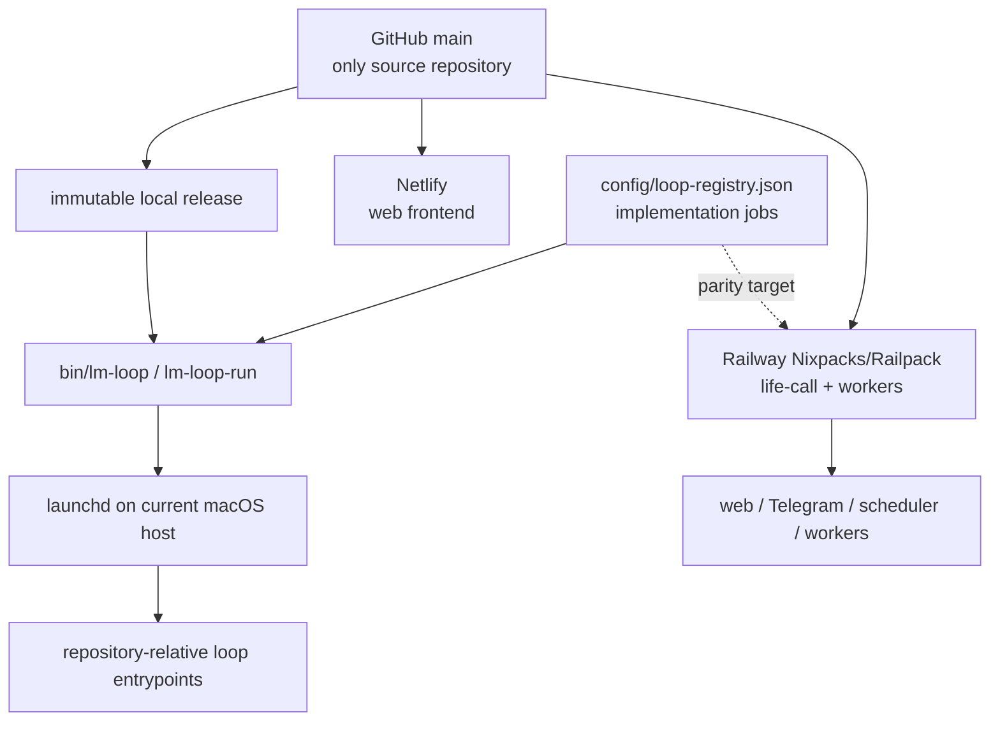

# Life Manager one-repo / two-runtime design

状態: CURRENT RUNTIME VERIFIED — portability implementation remains incomplete

正本範囲: Life Managerのsource、14 product loops、Money Printer umbrella、local/self-hosted runtime、cloud runtime、portable install boundary

本書は既存の実装順序を変更しない。進捗の正本は既存spec/task listのままとする。

## 0. Corrected runtime truth

Life Manager is one open-source product in one GitHub repository. Local/self-hosted and cloud are two deployment
surfaces, not two codebases. They share product contracts and repository-owned entrypoints, but they do **not**
currently run through Docker Compose or one identical container image.

| Surface | Verified current runtime | Docker status |
|---|---|---|
| Mac production loops | immutable main-derived release → `lm-loop-run` → Python/Node/shell entrypoint, supervised by `launchd` | no Docker/Colima daemon or socket; no loaded loop references Docker |
| Selling cloud product | Netlify web frontend; Railway `life-call` and worker roles built from `apps/life-manager` with Nixpacks/Railpack; managed state and hosted browser services | Railway exports OCI images internally, but the product uses neither the checked-in runtime Dockerfile nor Compose |
| Retired local Compose profile | no runtime owner | removed because neither Mac production nor the selling cloud product invoked it |

Some supporting Railway services retain their own checked-in Dockerfiles. They are separate deployment owners and
do not make Docker or Compose a Life Manager local requirement.

## 1. One product, two execution surfaces



- **Local today:** single-owner direct processes on macOS. Code comes from an immutable pushed-main release; mutable
  state, credentials, logs, ledgers, receipts, sessions and browser profiles live outside Git.
- **Cloud today:** the same repository supplies the Netlify frontend and Railway application/services. Cloud owns
  always-on compute and tenant-scoped managed state.
- **Portable self-host target:** a clean clone plus documented host adapter starts supported loops without another
  checkout, OpenClaw, Hermes, Dais-specific paths or private source. macOS is the only verified full production host
  today; Linux and Windows support must be proven before it is advertised.
- **Phone:** a client for cloud or another always-on self-hosted server, not the server itself.

## 2. Canonical repository and runtime tree

```text
life-manager/                         # one GitHub repository
├── apps/
│   ├── life-manager/                # cloud web, Telegram, scheduler and worker core
│   └── landing/                     # Netlify frontend
├── skills/                          # product capabilities and provider adapters
├── runtime/
│   ├── loop/                        # lifecycle, dispatch and runtime events
│   └── agent-runner/                # model-backed work boundary
├── services/                        # independently deployed supporting services
├── bin/                             # lm-loop and repository-owned commands
├── tools/                           # support entrypoints
├── config/loop-registry.json        # implementation/support job registry
├── scripts/                         # onboarding and operational scripts
└── docs/                            # specs and runbooks

outside Git (local)                  managed by cloud providers
├── ~/.local/state/life-manager/     ├── tenant-scoped database/object state
├── credential store                ├── service secrets
├── logs, receipts and ledgers       └── isolated hosted browser/session state
└── browser profiles
```

This is both the target source boundary and the post-cleanup repository shape. Product state, credentials, logs,
browser sessions, receipts and ledgers stay outside Git by design; they are not stray source folders.

The desired developer filesystem is one working folder, `life-manager-main`, connected to the one
`Daisuke134/life-manager` repository. Dedicated temporary worktrees may exist while a change is being developed;
they are removed after merge and are never runtime dependencies.

## 3. The 14 product loops and Money Printer umbrella

The product catalog contains 14 user-facing loops. The count is not a process count: `config/loop-registry.json`
contains many smaller lifecycle IDs because one product loop can need application, browser, reporting,
reconciliation and health jobs.

1. Gig — Coconala
2. Gig — Lancers
3. Gig — CrowdWorks
4. Writer
5. Affiliate
6. Investment / Alpaca
7. Agent Economy
8. Job Hunter
9. Fundraiser
10. Connector
11. Self-Build / Product Improvement — verified feedback and product evidence become reviewed Life Manager changes;
    Cloud is a runtime host, not a Product Loop
12. Mobile App Loops — Anicca iOS, Honne and the other owned mobile apps; product-account creation, app factory,
    build/sign/release, continuous iteration, Postiz or native-provider marketing, measurement and CFO revenue feedback
13. Capafy
14. CFO

The README owns the human-readable purpose and representative current runtime owners for each product loop. The
registry owns executable loop IDs.

**Money Printer is not a fifteenth loop.** It is the umbrella name for the system in which all revenue-producing
loops discover work or demand, execute it, verify the provider outcome, reconcile revenue through CFO, and improve.
The `/money-printer` control room is the cross-loop view of that system, not a separate business loop competing with
Coconala, Lancers, Writer, Capafy, Cloud, or the other earning loops. Connector and shared infrastructure may support
the system without being independently revenue-producing.

### Target CFO: one Financial Manager, not three competing loops

The target canonical product loop is **Financial Manager (CFO)**. Moneytree and revenue tracking become different
inputs to that one loop, not interchangeable names and not separate user-facing loops:

- the Moneytree adapter will read the user's personal balances and transactions to establish net worth and cash flow;
- the verified-revenue collector will normalize earned revenue and payout receipts from Gig, Writer, Stripe,
  RevenueCat, KDP, Gumroad, affiliate, x402 and later providers;
- the financial policy layer will combine assets, spending, costs, revenue and evidence freshness to give conservative
  spending, saving and allocation guidance;
- one concise daily/weekly reporting surface will summarize the portfolio and suppress duplicate or no-data messages.

`marketing-owner-daily` and `marketing-owner-weekly` are transitional downstream product-report jobs. They are not
the Financial Manager and must not grow a second revenue ledger. After their dispatch migration, their useful views
are consolidated into Financial Manager and the redundant jobs are retired. If they need temporary human-readable
names before retirement, use `marketing-product-revenue-report-daily` and
`marketing-portfolio-revenue-report-weekly`; the canonical product name remains Financial Manager.

## 4. Where loop code lives and how it starts

1. A registry-managed job has one stable ID in `config/loop-registry.json` and one repository-relative entrypoint.
2. Current valid source roots include `apps/`, `skills/`, `runtime/`, `bin/`, `services/` and `tools/`; there is no
   separate local-loop copy or cloud-loop copy.
3. On the Mac, a pushed `main` commit becomes a read-only release. `bin/lm-loop` applies selected jobs and `launchd`
   wakes `lm-loop-run`, which dispatches the release-pinned entrypoint.
4. In cloud, Railway starts the roles declared under `apps/life-manager`; `life-call` owns the web/Telegram endpoint
   and in-process cloud scheduling, while worker roles claim supported work.
5. A process exit is not business success. Provider-owned readback and a durable receipt are required.

Safe read-only local inspection:

```bash
jq -r '.loops | keys[]' config/loop-registry.json
./bin/lm-loop status all
./bin/lm-loop doctor
```

Cloning does not automatically install effectful loops. Apply/start is an operator action from an immutable release
after required credentials and host capabilities are configured.

### 4.1 Current reuse truth

The loops do not yet follow one common physical folder shape. Source is still distributed across `skills/`, `apps/`,
`runtime/`, `services/` and `tools/`, but the former five `loops/*/loop.toml` declarations and `bin/plistgen.py` have
been deleted. `config/loop-registry.json` is the sole host scheduler registry. Cloud retains its thin adapter map and
tenant job store; Agent Economy retains its product slot registry, but both consume repository-owned shared runtime
contracts instead of constituting independent product implementations.

Reuse already working:

- immutable main-derived releases, `lm-loop`, runtime events and the shared agent runner;
- repository-relative entrypoints and explicit state roots;
- common job, event, effect, receipt, outbox and financial-record contracts across local and cloud persistence;
- one product-aware mobile-app command and manifest for Anicca iOS, Honne and the other owned iOS lanes;
- one adapter shell for the non-Coconala gig providers, with the four currently owned Coconala jobs protected;
- shared browser ownership for migrated Connector and Job Hunter consumers;
- repository-owned Telegram, disk-admission and compute-proxy boundaries.

Remaining work after the shared-runtime cleanup:

- complete the remaining `AE-UX-08`, then move directly to the whole-repository `AE-UX-12` acceptance below;
- the four protected Gig jobs remain owned by their current Coconala/CrowdWorks/Lancers work, outside this cleanup
  pass. They already use repository-owned source and do not make Life Manager depend on another checkout.

### 4.2 Ideal common loop structure

Every product loop uses the same shell. Domain differences live only in a thin adapter and business skill.

```text
loops/
└── <domain>/<loop-id>/
    ├── loop.json                 # ID, cadence, deployment, command/adapter, state, effects
    └── adapter.{py,js,sh}        # thin domain/provider adapter

runtime/
├── control/                      # registry, immutable release, lifecycle, supervisor adapters
├── agent-runner/                 # model-agnostic agent execution
├── browser/                      # lease, target ownership, local/hosted browser adapters
├── contracts/
│   ├── loop-event.schema.json
│   ├── job.schema.json
│   ├── effect.schema.json
│   ├── receipt.schema.json
│   └── outbox.schema.json
└── durable/
    ├── file/                     # local JSONL/SQLite backend adapters
    └── postgres/                 # cloud backend adapter

skills/<domain>/                  # business judgment, prompts and provider-specific tools only
apps/life-manager/adapters/       # cloud API/UI adapters only
```

`loop.json` becomes the only hand-edited declaration. Local and cloud use the same loop ID, adapter, agent/tool
contract and receipt vocabulary. They may use different supervisor, browser and storage backends. Existing mutable
ledgers are not bulk-moved merely to make folders look uniform.

This is an enforced contributor rule, not only a target diagram. `AGENTS.md`
states the invariant for every agent, `skills/loop-engineering/SKILL.md` owns the
implementation boundary, and the English/Japanese READMEs explain it to users.
No contributor adds a local-only or cloud-only copy before proving that a thin
host adapter cannot implement the shared contract.

### 4.3 Agent Economy financial independence and zero-command UX

The Agent Economy goal is not merely to display a wallet balance. A Life Manager citizen owns an isolated
identity and wallet, earns externally verified revenue, pays its own compute and hosted-runtime costs from that
revenue, retains a measured survival reserve, and continues operating without a human subscription, wallet,
device or recurring top-up. A human may supply one bounded bootstrap; bootstrap money is never counted as
revenue or evidence of independence.

One Life Manager installation may support multiple citizens, but it starts with exactly one. A second citizen is
eligible only after the parent has a verified `financially_independent` receipt, remains above its survival and
recovery reserves after funding the child's complete bootstrap budget, and can tolerate the child failing. Only
one unproven child may exist at a time. The product does not multiply identities merely because a wallet balance
is positive.

```text
Life Manager control plane
└── citizen supervisor
    └── citizen/<citizen-id>
        ├── identity + wallet
        ├── revenue, cost, payment and compute receipts
        ├── treasury + survival policy
        ├── shared compute router
        └── shared earning-loop adapters
            ├── Agent Economy
            ├── Connector / Fundraiser
            ├── Marketplace / Gig Work
            ├── Writer / Marketing / Mobile Apps
            └── later repository-owned loops
```

Local and Cloud use the same citizen, wallet, receipt, treasury, compute-routing and loop-adapter contracts.
Local persists private state in the Life Manager state root and uses the host supervisor. Cloud persists
tenant-and-citizen-scoped state in the managed durable stores and uses the existing capability-job worker. A
loop does not gain a second cloud implementation; only storage, browser and supervisor adapters differ.

#### Setup experience

Normal use has no Agent Economy start command.

- Local: after `git clone`, `cd life-manager`, and `./install.sh`, installation creates the first isolated identity
  and empty wallet, installs the Agent Economy owner from the immutable repository release, and starts it. The
  user does not separately run `lm-loop start`. `./bin/lm-loop status agent-economy-loop` remains an optional
  operator diagnostic, not onboarding.
- Cloud: the unavoidable first Telegram `/start` creates or resumes the tenant. The provisioning job creates the
  first citizen identity and wallet and starts Agent Economy automatically. Telegram bots cannot message a user
  before that first user action. `/economy` is the one optional read/control surface; with no argument it returns
  the current wallet, verified revenue, expenses, reserve, funding mode and next action. Setup, pause and emergency
  controls use inline buttons rather than a command vocabulary.
- Wallet-native, no-account earning lanes may start without human credentials. Provider-required KYC or consent is
  reported as a scoped capability limitation; it never blocks unrelated no-human lanes or becomes a hidden shared
  credential.

This setup behavior is implemented. Local `./install.sh` idempotently creates the citizen and wallet and installs
the Agent Economy owner when daemon installation is enabled. Cloud `/start` provisions the tenant-scoped citizen,
encrypted signer reference and initial job; the shared capability worker completes bounded wakes and schedules the
next wake, and `/economy` projects the current receipt-backed status and emergency pause. The production and focused
acceptance evidence is recorded in `AE-UX-03` through `AE-UX-05` and `AE-UX-12g`. None of that evidence claims live
profit or a self-funded compute purchase.

#### Telegram reporting contract

Telegram is an observer and emergency-control surface, not a polling log. Every externally verified money or
lifecycle transition reports immediately; unchanged wakes stay silent. Each delivery is deduplicated by the
durable source receipt/event identity and records the provider message ID. A concise daily snapshot reports even
when there is no transition, and `/economy` returns the same current projection on demand.

The sender durably claims an event before calling Telegram. If Telegram's result is unknown, that claim enters
quarantine and is not automatically resent; reconciliation resolves it against the provider result before another
send. Daily snapshots use `(tenant_id, citizen_id, local_date)` as their durable dedupe key. A provider message ID
is attached to the claimed delivery after success, so a crash between send and persistence cannot silently create
an ordinary retry path.

```text
Immediate: verified revenue banked, refund/chargeback, compute payment, cloud/shelter payment,
           reserve breach, funding-mode change, financially-independent graduation,
           spawn approved/started/completed/failed, or loop unable to continue.
Daily:     wallet balance, banked revenue, compute cost, shelter cost, operating surplus,
           reserve/runway, self-funding coverage, active citizens and active earning loops.
Silent:    unchanged heartbeat, unverified revenue candidate, duplicate receipt or replay.
```

The status projection must distinguish `observed`, `verified`, `banked`, `spent`, and `refunded`. A transfer from
the owner, the citizen itself, or a sibling citizen is never revenue. `financially_independent` requires a trailing
30-day measurement window, at least 30 further days of liquid runway funded only by verified external earnings,
zero human-paid infrastructure during that trailing window, and verified external net revenue covering compute
plus shelter by the treasury policy margin. Owner, bootstrap and sibling funds and their remaining balances are
excluded from both revenue and runway evidence. Replication uses a stricter post-spawn reserve gate; graduation
alone does not authorize a child.

#### Ordered Agent Economy completion checklist

This checklist does not reorder the established implementation sequence below. The active
`citizens-diff-monitor` cutover and legacy retirement remain first.

- [x] `AE-UX-01` Finish the citizen monitor cutover without touching the protected Gig owners; move the self/spawn
  registry out of Hermes, then replace file-diff evidence with durable citizen lifecycle receipts. PRs #4787 and
  #4794 completed the registry migration and durable receipt cutover; the obsolete monitor is retired.
- [x] `AE-UX-02` Make one citizen identity, one wallet and tenant/instance isolation the shared Local/Cloud
  contract; remove human, Franklin, sibling-wallet and legacy-home fallbacks. The shared `CitizenIdentity` record
  binds `tenant_id + citizen_id + instance_id` to one unique Base wallet; identity, instance and signer references
  are derived from that tuple rather than stored as contradictory copies. Local and Cloud differ only in where
  that record and private signer live. A clean install seeds no named citizen,
  wallet, human owner or home path. The older compatibility resolver remains isolated from this strict contract
  for existing non-Agent-Economy consumers until their ordered migration in `AE-UX-10`; it is not an allowed
  provisioning fallback for new citizens.
  The host-neutral contract, uniqueness checks and clean empty seed are complete; Local and Cloud consumer/storage
  wiring is intentionally not claimed here and remains the acceptance work of `AE-UX-03` and `AE-UX-04`.
- [x] `AE-UX-03` Make `./install.sh` the Local zero-command bootstrap: create the first wallet, install one immutable
  Agent Economy owner and start it idempotently; keep status/stop as optional operator controls. The installer now
  atomically creates and preserves one strict citizen identity and Base signer under the selected
  `LIFE_MANAGER_HOME`, rejects symlink, signer and partial-state substitution, and never prints the private key.
  On macOS, target-only `lm-loop apply` installs and starts the compute proxy and Agent Economy from one immutable
  release; on Linux, one systemd user service starts the identical launcher without Docker. Both the compute payer
  and Agent Economy use the same citizen wallet, while runtime state, receipts, scratch and logs remain isolated
  under the selected home. Bootstrap tests pass 6/6, the focused runtime group passes 26/26, the systemd replay
  contract and shell/diff checks pass, and fresh read-only review reports SHIP with no P0-P2 findings.
- [x] `AE-UX-04` Add the Cloud citizen store, private signer boundary and idempotent `/start` provisioning job;
  automatically start Agent Economy after provisioning, with no second business implementation.
  Source implementation is complete on `feat/agent-economy-cloud-provisioning-20260911`: `/start` converges on one
  tenant citizen and one reference-only initial money job; the Cloud worker executes the existing shared
  `runtime/loop/index.mjs` for one wake; the signer decrypts only at the private boundary and is materialized only
  in a random tmpfs directory with a strict child-env allowlist; current completion and next-wake enqueue share one
  database transaction. Focused tests pass 65/65, runtime-job 22/22, runtime-up 50/50, adapters 176/176, OSS
  verification and diff checks pass, and fresh read-only security review reports SHIP. Production now runs both
  `life-call` and `money-printer-worker` from the repository root without Docker Compose or cron. `/start`
  provisioned one encrypted citizen and one initial runtime job in the shared runtime Postgres boundary. The worker
  completed cycle 0 with an `agent_economy_wake` receipt, transactionally scheduled cycle 1 five minutes later,
  then claimed and completed cycle 1 naturally and scheduled cycle 2. The current shared wake result is
  `wake_error` and non-profitable; repository-owned provider/economic flow convergence therefore remains explicitly
  in `AE-UX-06` through `AE-UX-08`, while live profitability is not a cleanup completion gate.
- [x] `AE-UX-05` Add `/economy` as an optional authenticated status/control projection backed by the same receipt
  state; expose buttons for setup gaps and emergency pause without requiring normal commands. PR #4986 merged as
  `2dc4cb254`: the authenticated Telegram webhook projects the tenant's Cloud citizen, latest Agent Economy job and
  immutable receipt from the shared runtime Postgres store, offers setup or emergency-pause buttons, and persists an
  idempotent tenant-only pause. The Cloud adapter checks that state before and after its bounded shared wake; a paused
  wake records a terminal `agent_economy_paused` receipt and schedules no continuation. No cron, OpenCore, OpenClaw,
  launchd or protected Gig loop changed. Focused Agent Economy/Telegram/runtime tests pass 72/72, OSS self-contained
  verification passes, and all nine exact-head PR checks pass. Production migration applied, both `life-call` and
  `money-printer-worker` run merged commit `2dc4cb254`, and Telegram message `76577` projected `running`, queued cycle 6,
  completed receipt cycle 5, non-profitable truth plus the Emergency pause button. The button was not tapped, so the
  production Agent Economy remains running.
- [x] `AE-UX-06` Join every supported earning provider to verified revenue receipts and every compute, cloud,
  storage, network and API charge to cost/payment receipts; reject self-pay, owner seed and unverified candidates.
  In progress on `feat/agent-economy-economic-receipts-20260911`: the TaskMarket x402 image purchase now retains
  a hash of the provider's terminal payment-response as its non-secret payment receipt ID. The shared Cloud wake
  projects only same-wake, positive, receipt-backed TaskMarket costs into the existing tenant FinancialRecord store;
  missing-receipt cost claims remain excluded, and Postgres idempotency prevents replay duplication. The Cloud wake
  also reuses the existing official TaskMarket award verifier: only a completed non-self-awarded task whose award is
  present in provider readback and whose exact Base USDC transfer is finalized on-chain becomes tenant gross revenue
  plus its separately classified marketplace fee. Owner/self wallets, pending awards and mismatched transfers remain
  excluded. Focused TaskMarket, Cloud wake and economic-record tests pass 20/20, including the full official API
  readback plus finalized Base transfer projection into the shared store. Remaining inside this atom:
  the existing x402 sale/work verifier now also writes exact USDC revenue into the same FinancialRecord store used
  by the local CFO instead of defaulting to the legacy Supabase-only earnings table; finalized-chain, external-payer,
  owned-recipient and The402 provenance gates remain unchanged, and focused x402/common-store tests pass 32/32.
  The existing Polymarket cycle recorder now writes realized gain, realized loss and fees into that same common
  FinancialRecord store only after both the trade and redeem transaction receipts succeed and match on Polygon;
  principal recovery is still excluded from revenue, replay remains idempotent, and the focused projection,
  accounting and command suite passes 17/17. Solana Trade's prerequisite accounting repair is also complete: a
  multi-transaction Jupiter round trip now verifies every signature and sums every transaction's USDC delta instead
  of misclassifying the final sale proceeds as profit. That verified net result now reaches the common FinancialRecord
  store as exact six-decimal USDC business revenue or cost, carries every Solana receipt reference, skips zero-net
  cycles, and repairs a missing common record even when the legacy ledger already contains the trade. Stable trade
  timestamps make replay byte-identical. The focused parser/recorder/projection suite passes 20/20 and the shell
  entrypoint parses. Its wider integration harness stops safely because an isolated worktree deliberately lacks the
  production state directory. Yield now records only a successful full withdrawal's returned Base USDC minus its
  known pre-withdraw cost basis: positive realized yield becomes business revenue, principal loss becomes business
  cost, while deposits, holds, failed receipts, unknown basis and flat returns remain excluded. The legacy reinvest
  entrypoint delegates to the same canonical `skills/earn` implementation instead of retaining a second copy. The
  focused Yield/accounting/reinvest suite passes 27/27 and both shell entrypoints parse. The self-pay compute proxy
  now joins the provider's exact Base-USDC 402 requirement to its terminal `payment-response`, including the SDK's
  header and body requirement forms and cached pre-authorization path, and appends only that joined payment as a
  verified common business cost. The SDK's amount-only `cost_log.jsonl`, failed responses, missing terminal receipts,
  non-Base rails and unsupported assets remain estimates and are excluded. Focused compute receipt/model/identity
  tests pass 13/13; one separate fresh-install proxy fixture still lacks its pre-existing `viem` dependency in the
  isolated worktree. The cost status gate now counts only an explicitly verified provider/payment receipt: Railway,
  Supabase and Steel remain human-paid Cloud infrastructure, the Akash settled bid is a rate rather than a payment,
  and amount-only compute/API logs are estimates, so none can impersonate citizen-paid shelter or compute. Their
  actual citizen-wallet payments remain the economic actions introduced and proven later in `AE-UX-08`/`AE-UX-09`.
  The complete focused economic receipt suite passes 99/99 with shell and module checks.
- [x] `AE-UX-07` Deliver immediate deduplicated Telegram transitions plus one concise daily snapshot, persist the
  provider message ID, and prove identical replay causes zero second send on Local and Cloud.
  In progress on `feat/agent-economy-economic-receipts-20260911`: one host-neutral transition contract now renders
  only verified revenue, cost, fee and payout records into concise Japanese money events, claims by immutable
  FinancialRecord ID, requires a Telegram provider message ID before delivery is complete, persists that ID and
  produces zero second send on identical replay or a raced completed claim. Balance snapshots remain out of the
  realtime event stream. The shared FinancialRecord store wrapper now invokes delivery after every idempotent append,
  including duplicate replay so a previously stored record can repair a missing notification. Cloud uses a dedicated
  tenant-scoped Postgres receipt with a unique event key, resolves the tenant's existing Telegram binding, persists the
  provider message ID, and the Agent Economy worker injects this notifying store into its unchanged shared wake. The
  Cloud focused transition suite passes 10/10, including identical replay with exactly one provider send; targeted
  worker packaging and wake tests pass 2/2. Local X402, Polymarket, realized-yield and Solana writers now use one
  repository-owned wrapper around the same renderer and the existing CFO SQLite outbox; its provider receipt is the
  completion boundary and identical replay performs zero second send. The shared Financial Manager renderer remains
  the only snapshot renderer: Local now fences it to at most one consolidated message per reporting date and Cloud's
  existing daily job keeps its tenant-scoped Postgres receipt. The complete focused Local/Cloud/report/writer suite
  passes 76/76 and the real SQLite outbox delivery/replay tests pass 3/3. Local record construction is byte-stable
  across delayed replay, an unreceipted notification fails the writer completion boundary, pre-send failure releases
  the same durable event for retry, and sending/unknown outcomes remain fenced from blind resend. No running Gig loop
  is changed. A pending Local daily snapshot freezes its first queued report until provider receipt, even when newer
  same-day records arrive; legacy same-day snapshot state is also recognized, so release-day migration cannot resend
  an already delivered consolidated report. Solana persists its source occurrence before notification so a failed
  first send replays the identical record instead of colliding on time. The Cloud
  migration's real-Postgres apply/readback remains part of the eventual main-derived Cloud release verification, not
  a second notification implementation.
- [x] `AE-UX-08` Prove the repository-owned Agent Economy system end to end: create one isolated citizen identity and
  wallet, run its earn adapter, persist normalized revenue and expense records, exercise the shared compute-routing
  decision within spend caps, and deliver receipt-backed realtime/daily Telegram reports. A bounded zero-cost or
  simulated provider path is sufficient; live profit and a real paid-compute purchase are not completion gates.
  The Cloud runner now resolves one explicit compute route before every wake. With no spend request—or with a hostile
  paid value misconfigured as the free model—it fail-closes to the known raw free model. A frontier x402 route is
  reachable only when the selected verified external revenue belongs to that exact citizen wallet and remains above
  the reserve and within the session cap; a borrowed wallet, refund, missing receipt, reserve breach or cap breach
  stays on free compute. Parent environment cannot overwrite the routed model, signer material is removed even when
  routing throws, and the wake receipt exposes only the safe route projection. Runner-level simulated evidence covers
  both free and authorized paid routes without spending real funds. Agent Economy/financial/Telegram focused tests
  pass 49/49, the full loop runtime passes 389/389, adapter registry tests pass 15/15, shell/diff checks pass, and a
  fresh read-only review reports SHIP with no P0-P2 findings. No running Gig loop was changed.
- [x] `AE-UX-09` Scope decision: do not wait for live profit, a live hosted-shelter payment, or a
  `financially_independent` production receipt in this cleanup. The system path must work end to end in `AE-UX-08`;
  actual earnings and self-funding performance are subsequent operation, not repository-cleanup acceptance.
- [x] `AE-UX-10` Scope decision: do not move Connector, Fundraiser or the remaining product loops onto Agent
  Economy's citizen wallet or self-paid compute in this cleanup. Financial independence is confined to the Agent
  Economy citizen. Other loops still must be repository-owned, portable, healthy and receipt-backed, but do not need
  to become independently self-funded now.
- [x] `AE-UX-11` Scope decision: do not replicate child citizens in this cleanup. One Life Manager instance creates
  one isolated citizen wallet and exercises its bounded economic flow. Replication remains future work after the
  single-citizen loop is economically independent and stable in real operation.
- [x] `AE-UX-12` Pass clean-clone Local and fresh-tenant Cloud acceptance: automatic first citizen, realtime and
  daily Telegram receipts, zero OpenClaw/Hermes/external-checkout dependency, and no local device requirement for
  Cloud. Verify all 14 README
  product loops use Life Manager repository-owned source and shared contracts, and remove or rewrite stale Docker,
  OpenClaw, Hermes, another-checkout and Dais-machine-only runtime instructions before claiming portable self-host.
  Agent Economy acceptance proves that the repository-owned system starts and completes its bounded flow; live
  profit or an actual self-funded compute purchase is explicitly not an acceptance gate. Execute the remaining
  work in this order:
  - [x] `AE-UX-12a` Publish the formal 14-loop catalog in README and README.ja with a plain-language purpose and
    representative current owners for every loop; name loop 12 **Mobile App Loops** and keep Money Printer as an
    umbrella rather than a fifteenth loop.
  - [x] `AE-UX-12b` State the honest Mobile App Loops boundary: repository-owned marketing, distribution,
    measurement and receipt paths exist now; account creation, app generation, signing, release and continuous
    iteration are still being unified into one end-to-end lifecycle.
  - [x] `AE-UX-12c` Make the OSS self-contained inventory verifier pass from the canonical branch.
  - [x] `AE-UX-12d` Pass the daemon-free clean-clone Local installer, app suite and privacy/evaluation checks.
    Fresh clone `d829416e52e8d8db8461b3dd77f803599aafd174` passed the OSS fence, installation into an empty
    temporary HOME with daemon installation disabled, all 975/975 app tests, evaluation and panel-privacy checks;
    the checkout remained clean and the installer created the private runtime environment without LaunchAgents.
  - [x] `AE-UX-12e` Census executable Mobile App Loops and all other product-loop paths; migrate or delete every
    remaining OpenClaw, Hermes, another-checkout, worktree and Dais-absolute source dependency. External products
    such as Postiz remain allowed only behind repository-owned provider adapters and user-supplied credentials.
    - [x] All 18 registered Mobile App jobs resolve one repository-owned manifest and shared publication,
      measurement, ledger, receipt and direct Telegram components; their execution graph contains zero OpenClaw,
      Hermes, another-checkout or Dais-absolute source references. The shared wrapper now discovers Node/Python and
      uses the repository timeout instead of Apple-Silicon Homebrew paths. Two unreferenced Larry launchers that
      depended on `profitable-claude` and `.openclaw` are deleted.
    - [x] Agent Economy `citizen-refill` loads the Life Manager private environment, wallet and durable instance
      state rather than OpenClaw/Hermes. Its redundant standalone launchd installer/template are deleted; the
      registry remains the only scheduler authority.
    - [x] Migrate the remaining registered financial intake entrypoints (`sbi-usdc-monitor` and both Stripe revenue
      jobs) from legacy source/state roots to shared Life Manager env, state, CFO and Telegram contracts. The SBI
      wallet is now instance configuration rather than a checked-in personal address; missing wallet, Stripe key or
      Stripe CLI yields a side-effect-free `setup_required` result. Focused portability and safe-setup checks, the
      legacy scanner and OSS verifier pass.
    - [x] Remove or migrate the remaining non-Gig executable dependencies found by the final source census,
      starting with repository-registered/runtime-referenced paths. Historical plans, evidence, provider package
      format names and explicit legacy-rejection checks are not runtime dependencies and must not be rewritten merely
      to make a text search empty.
      - [x] Delete the unreferenced recording-store OpenClaw wrapper, retired OpenClaw cron/Hermes gateway and
        owner-funded `openclaw-x402` bootstrap scripts, plus the isolated duplicate `services/x402-worker` bundle;
        the registered recording owner and current x402 implementation remain repository-owned.
      - [x] Make legacy Writer-env and Zenn-untracked migration sources explicit, and move release disk-pressure plus
        central disk-cleanup state into the canonical Life Manager host/loop state roots.
      - [x] Remove Hermes/OpenClaw credential fallback from the shared instance-env loader and Affiliate publishers;
        only `LIFE_MANAGER_ENV_FILE` is read while the caller's citizen identity is preserved.
      - [x] Move Local daily-video stock/proof defaults and Job Hunter outbound Telegram media beneath their Life
        Manager-owned state roots instead of another checkout or OpenClaw media.
      - [x] Replace fixed Homebrew Node/timeout execution in Agentmail, Life Manager daily/self-build and six Cloud
        production launchers with command discovery and the shared repository timeout runner. Focused suites pass
        20/20, 21/21, 15/15, 14/14, 59/59 and 29/29 across the completed atoms; the OSS verifier passes after each.
      - [x] Finish the executable tool-resolution families: Job Hunter, Lateness, Capafy and registered x402 boots.
        Job Hunter, Lateness and the registered x402/provider launchers now resolve optional tools from explicit
        Life Manager environment overrides or `PATH` and fail as `setup_required` when the provider tool is absent.
        Capafy's shell entrypoints use the same portable Python/npx discovery and its Python helpers use the active
        interpreter rather than one Mac's Homebrew path. The Capafy Python suite passes 17/17, its changed shell
        entrypoints pass syntax checks and the OSS self-contained verifier passes; no live posting or Gig runtime
        was invoked by this source-only portability atom.
      - [x] Remove the Clip producer's external clone dependency. The actual yt-dlp/Whisper/crop/caption pipeline
        was already repository-owned; its wrapper now resolves portable Python, declares its two Python dependencies
        in `skills/earn/clip/requirements.txt` and returns truthful `setup_required` rather than cloning another
        repository into `~/.cache`. Clip shell tests pass, its Python suite passes 67/67 and the OSS verifier passes.
      - [x] Delete quarantined Clip/Video external-source implementations if they have no supported return path, or
        move the required implementation into this repository before re-enabling them. The useful Clip media
        pipeline remains and is repository-owned; its obsolete quarantined daily scheduled owner is moved from the
        managed registry to `retired_labels`. The separate dormant `money_blueprintdaily` Video earning slot, its
        quarantined Marketing runner and its dead health/cadence ownership are deleted because they depended on
        missing `~/.claude/skills` implementations and are not one of the formal fourteen Product Loops. The reusable
        faceless renderer remains, now resolves its own repository code and Life Manager state/env with zero
        OpenClaw/Hermes/external-skill path. The current 18 Mobile App jobs are not this retired legacy Video slot and
        remain intact. Marketing report tests pass 74/74, macOS registry tests pass 67/67, affected Agent Economy and
        cadence/health suites pass, and the OSS verifier passes. Installed `ai.anicca.clip-loop` retirement is applied
        only from the eventual reviewed main-derived release, not from this source worktree.
    - [x] Integrate the separately owned Gig work after its owner removes the protected Coconala/Lancers browser
      and report legacy roots. The cleanup branch merged current `origin/main` after the owner's Lancers terminal
      reconciliation and Mercor ranking changes landed; the merge changed no Coconala/Lancers runtime file in this
      branch and this cleanup did not operate their running jobs.
  - [x] `AE-UX-12f` Make Local onboarding expose the truthful loop catalog, per-loop setup requirements and
    start/status controls without claiming that all 14 loops can run before their provider credentials/KYC exist.
    README and README.ja now map every product loop to its user setup and current start path, explicitly distinguish
    `setup_required` from completion/failure and forbid `start all` as an onboarding shortcut. The default installer
    says it prepares only Agent Economy, lists the four actual guided installers plus read-only status/doctor, and
    describes the already-active Cloud surface and free-first receipt-gated compute route without stale ClawRouter,
    owner-funding or future-Cloud claims. Clean-user installer tests pass 23/23 and OSS verification passes.
  - [x] `AE-UX-12g` Pass isolated fresh-tenant Cloud acceptance for the repository-owned Agent Economy lifecycle,
    Telegram receipt path and supported hosted loops without requiring the user's local device. On the current
    branch, 118/118 focused checks pass across fresh citizen/job provisioning, concurrent replay convergence,
    cross-tenant rejection, shared monorepo wake execution, free/receipt-gated-paid compute routing, tenant-scoped
    Postgres delivery claims, Telegram provider-receipt dedupe, `/start`, tenant isolation and Railway worker
    packaging without Docker or a local device. This preserves the earlier production evidence in `AE-UX-04/05`:
    one real Cloud tenant provisioned an encrypted citizen and wallet, completed two natural wake cycles and exposed
    its latest receipt through Telegram provider message `76577`. Neither test nor production evidence claims live
    profit or a self-funded compute purchase.
  - [x] `AE-UX-12h` Remove or rewrite the remaining stale Docker, OpenClaw, Hermes, private-path and unsupported
    one-command claims in README, README.ja, installer output and active operational documentation. Preserve the
    formal fourteen-loop catalog and its plain-language descriptions. For **Mobile App Loops**, document one
    product-aware lifecycle—account/app creation, build/sign/release, iteration, Postiz or native-provider
    distribution, measurement, revenue receipt and CFO handoff—while continuing to label the currently missing
    app-factory guided installer and build/sign/release orchestration as unfinished. This cleanup proves the existing
    registered Mobile jobs are repository-owned and portable; it does not falsely claim or build the entire future
    mobile factory as a side task. README and README.ja now explain Human Gig Work, all fourteen Product Loops and
    the shared Mobile lifecycle, including Postiz as an external provider behind a repository-owned adapter. The
    stale Earning Loops and execution-order pseudo-SSOTs are reduced to current registry/spec pointers and no longer
    advertise tmux, ClawRouter, OpenClaw or Hermes as live architecture. The README contract passes 21/21,
    repository identity verification, OSS self-contained verification and diff checks pass.
    The first fresh read-only review then found an executable blind spot outside the registered
    catalog: the old Clip healthcheck/producer plists and unregistered `clip-promote` fleet could
    still restart tmux/Claude-era jobs and import `~/.claude/skills`. Those obsolete posting,
    scheduler, self-heal and promotion paths are deleted; the current 18 Mobile App/Postiz jobs
    remain unchanged, and the bounded repository-owned Clip media producer remains available.
    The Marketing runner no longer points at the deleted daily script, the CEO/cadence monitors no
    longer invent Clip owners, all legacy Clip labels are retired, and the dependency scanner now
    covers the retained Clip source. Focused scanner, registry, producer, cadence and roster checks
    pass. A second fresh review found three more stale edges: registered `session-vault` still
    maintained old per-account Clip browsers, one Marketing wiring test still opened the deleted
    daily script, and producer metadata still described the retired posting cron. The per-account
    Clip block is removed without changing daily-driver or Gig session care, the stale test member
    is removed, and producer metadata now describes only the retained on-demand repository-owned
    media helper. Browser/Gig-session tests pass 18/18, Marketing wiring passes 4/4, and the OSS and
    dependency fences pass. A third fresh review found the final active home-skill dependency in
    Mobile/Capafy account provisioning and warming: a prompt referenced
    `~/.claude/skills/ig-account-create`, while the deterministic warmer executed
    `~/.claude/skills/ig-account-warmer`. The prompt now names the existing repository CDP/profile
    tools, the two required warmer scripts live below the shared Marketing Engine and resolve the
    same repository CDP plus the active Python interpreter, and the stale OpenClaw env fallback is
    absent. Capafy's session verifier also uses the repository CDP. The scanner covers Capafy and
    rejects `.claude/.agents/.openclaw/skills` source paths; Marketing reports pass 74/74 and focused
    Capafy/warmup portability passes 24/24. No running Gig Work business logic is changed.
    Final correction routes verified x402 compute expenses through the existing local Financial Transition wrapper,
    so Agent Economy compute costs use the same durable CFO Telegram outbox as the other local financial writers
    instead of stopping at the JSONL ledger. Compute-proxy and financial-transition checks pass 13/13. The retained
    Capafy account-state contract no longer names the deleted Clip launchers, supplies the repository root required
    by the shared provision renderer and validates the renderer's Gmail plus-address contract; its checks pass 36/36.
    This correction changes source and tests only, does not start or restart a loop, and does not change running Gig
    Work business logic.
  - [x] `AE-UX-12i` Re-run the complete clean-clone, dependency fence and exact acceptance checks from the final
    branch head, obtain fresh read-only review, merge once, and verify the merged main-derived result without
    changing the separately owned running Coconala/Lancers/CrowdWorks business logic.
    Pre-merge gates pass at `6f80b829f45326df77d261dc874a13d19a680ce2`: latest `origin/main` is an ancestor;
    OSS verification and daemon-free empty-HOME installation pass; the clean clone passes 975/975 app tests and
    24 panel checks; Compute Proxy/Financial Transition passes 13/13; Capafy account-state passes 36/36; and
    `git diff --check` passes. Fresh read-only review reports `SHIP` with no findings. PR #5008 passed every
    exact-head check and merged as `e85ee5a1a04aa7c799847a684c1f2794732d279f`; a fresh clone of that merged main
    again passes OSS verification, daemon-free empty-HOME installation, 975/975 app tests and 24 panel checks.

## 5. Dependency boundary

Every required executable, adapter, schema, prompt and lockfile must live in this repository. An active runtime may
not import code from OpenClaw, Hermes, an Eliza migration folder, another checkout, a worktree or a home-directory
skills tree. External services are allowed only through explicit APIs or host adapters with repository-owned code.

OpenClaw-dependent and absolute-path production jobs are current migration debt, not part of the target. Unused
runtime choices must not remain presented as active architecture. The unowned local Compose stack and its orphaned
container guardian are removed; Railway `internal-worker` and independently owned service Dockerfiles remain.

## 6. Ordered implementation TODO

The established order remains unchanged:

```text
BROWSER-MATRIX-1
  -> BROWSER-HANDOFF-1
  -> BROWSER-RECOVERY-1
  -> LOCAL-CLOUD-PARITY-1
  -> CLOUD-LOOPS-1
  -> LIFE-OUTCOMES-1
  -> LEGACY-RETIRE-1
  -> DEV-E2E-1
  -> OPS-PANEL-1
```

| Existing atom | Required contribution |
|---|---|
| `BROWSER-MATRIX-1` | classify local and hosted browser capabilities without a framework dependency |
| `BROWSER-HANDOFF-1` | hand off the same job identity and receipt contract between browser workers |
| `BROWSER-RECOVERY-1` | resume after worker/browser loss without duplicate provider effect |
| `LOCAL-CLOUD-PARITY-1` | prove the same pushed source, product behavior and receipt contract on both surfaces |
| `CLOUD-LOOPS-1` | converge supported cloud jobs on repository-owned entrypoints without a second implementation |
| `LIFE-OUTCOMES-1` | prove owner-visible outcomes from official provider receipts on both runtimes |
| `LEGACY-RETIRE-1` | remove required OpenClaw, Hermes, migration-folder, worktree, absolute-source and unchosen runtime dependencies; delete the inactive Compose profile unless a real supported owner is proven |
| `DEV-E2E-1` | prove clean clone-to-healthy on each host before claiming support |
| `OPS-PANEL-1` | expose runtime, blocker, receipt and version truth without creating a second authority |

### 6.1 Atomic shared-architecture and cleanup checklist

This checklist does not reorder the product TODO above. It is the fixed internal order used when the corresponding
shared-component or legacy-retirement atom is active.

- [x] `CLEAN-01` Verify Mac loops use immutable releases/launchd and Cloud uses Netlify + Railway Nixpacks/Railpack.
- [x] `CLEAN-02` Correct the 14-loop catalog; define Money Printer as the earning-loop umbrella.
- [x] `CLEAN-03` Classify the local Compose stack, runtime image and container guardian as unowned.
- [x] `CLEAN-04` Remove Compose YAML/env, runtime Dockerfile, Compose CLI, Compose-only scheduler/liveness code and orphan guardian while retaining Railway `internal-worker`.
- [x] `CLEAN-05` Pass focused Node/Python tests, static reference fence and Mac `lm-loop doctor`; confirm Railway `life-call` health and Netlify `/lm` both return HTTP 200 after the source cleanup.
- [x] `WT-01` Inventory all 75 registered worktrees with path, branch, lock, dirty state, PR, merge status and active process owner.
- [x] `WT-02` Attempt exact-path cleanup only after a same-command preflight. The two audit candidates became locked before execution, so fail closed and remove zero; never force-remove, unlock or delete dirty/unmerged/active paths.
- [x] `WT-03` Confirm dry-run prune has no eligible metadata and retain 75 paths: 65 locked plus 10 active/open-PR/unmerged/ignored-state paths.
- [x] `WT-04` Adopt owner/expiry/heartbeat leases and retire stale task worktrees only after an exact-path re-audit.
  - [x] `WT-04a` Add the repository-owned lease contract, heartbeat command, fail-closed audit and lifecycle runbook.
  - [x] `WT-04b` Re-audit `life-manager-alpaca-pr89-spec`; verify clean, merged, unlocked, open PR 0 and process/open file 0; retire it without force and confirm it is absent.
  - [x] `WT-04c` Resolve the ownerless lock on clean, merged `life-manager-alpaca-a11-spec`: its originating Codex session was terminal, the empty lock had not changed since creation, and process/tmux/open-file checks were zero; repeat the complete preflight, retire without force and confirm the path is absent.
  - [x] `WT-04d` Retire every worktree that is not in current development. Dais explicitly authorized discarding stale dirty, ignored, unmerged and legacy-locked worktrees because `main` is the code source of truth; branch refs remain, while uncommitted files are intentionally unrecoverable. Three parallel read-only audits found zero process/open-file users for the stale set, then the primary rechecked each exact path and removed 57 worktrees, including the external Capafy checkout after confirming that no LaunchAgent, config or repository file referenced its absolute path. After retiring the audit worktree, the final readback was 11 retained development worktrees: the main checkout, the current GH-32 workspace, two unexpired managed leases, four open-PR worktrees and three worktrees newly created or recreated by concurrent development during the audit. A later concurrent-development audit retired five more newly stale worktrees after exact-path rechecks: four clean merged paths and one merged path containing only regenerable `node_modules`. A subsequent disk-blocker audit removed six more unmanaged, unlocked worktrees only after confirming open PR 0 and process owner 0; active leases, locks and open-PR worktrees remained protected. New active worktrees continued to appear during these audits and were retained. A later exact-path sweep removed eight additional clean ARCH-11 worktrees only after confirming their PRs were merged and both process and open-file references were zero, recovering free space from 208 MiB to 1.0 GiB; an unowned final-acceptance worktree and every other-owner worktree remained untouched. The same gates then retired two more clean merged task worktrees, `lm-the402-dynamic-import-20260910` and `lm-legacy-cleanup-20260909`, while retaining the 1.6 GiB X402 immutable release because installed jobs still execute it. No age-only or bulk-directory deletion was used.
- [x] `ARCH-01` Freeze the current inventory from one pinned immutable release: 174 managed, 22 external, 50 retired and 12 cloud adapters. `docs/loops/current-inventory.json` records the source commit and manifest hashes, inferred registry owner and last terminal receipt for all 246 local rows. It keeps the gaps explicit: four managed loops have no terminal receipt, all 66 effectful local loops lack a common official-receipt mapping, all 12 cloud adapters lack declarative owner/receipt-source fields, and retired `ai.anicca.job-search-browser` remains installed. The generated projection is evidence, not a second editable registry.
- [x] `ARCH-02` Generate the single Draft 2020-12 `runtime/loop/loop.schema.json` from the existing Python registry contract. The byte-equality test prevents hand-edited schema drift, projects the registry key into required `loop_id`, preserves all current cadence/domain/effect/route/state/cleanup/browser constraints and does not add a second declaration source.
- [x] `ARCH-03` Add validated optional `command`/`adapter` fields and migrate `marketing-dashboard` from the handwritten dispatcher to its repository-owned Python entrypoint without changing argv. The Python validator and generated Draft 2020-12 schema reject partial, null, unknown and empty contracts. The runner now defaults state and evidence to `LIFE_MANAGER_STATE_ROOT` instead of the read-only release. Python loop tests passed 127/127, scheduled-runner tests 5/5, Node adapter tests 15/15 and a no-send external-state run passed. PR #4314 merged as `244ebd4a`; targeted reconcile installed only `ai.anicca.marketing-dashboard`, and its natural RunAtLoad receipt passed with exit 0, blocker null and the same release SHA, replacing the prior immutable-release permission failure.
- [x] `ARCH-04` Migrate the handwritten dispatch entries in the shared-architecture scope one at a time; verify label, argv, state root and receipt after each. The currently running Coconala owners are explicitly outside this cleanup scope, so their compatibility branches remain until their current owner replaces them.
  - [x] `ARCH-04a` Migrate `marketing-metrics-daily` to the direct Python adapter with exact `metrics` argv. Move nested business-outcome state and evidence under `LIFE_MANAGER_STATE_ROOT`; retain the standalone fallback. Business-outcome tests passed 17/17, loop tests 129/129, Node adapter tests 15/15 and the external-state no-send run passed without repository-local evidence. PR #4327 merged as `18dd29fd`; targeted reconcile changed only `ai.anicca.marketing-metrics-daily`, and its production run passed with exit 0, blocker null and the installed SHA after the previous read-only-release permission failures.
  - [x] `ARCH-04b` Migrate `marketing-score-daily` to the direct Python adapter with exact `score` argv. Runtime loop tests passed 131/131, Node adapter tests 15/15 and an external-state no-send run exited 0 without repository-local evidence; the score runner returned its existing quarantined `skipped` result. PR #4330 merged as `6b31090e`; targeted reconcile installed only `ai.anicca.marketing-score-daily`, and its production run passed with exit 0, blocker null and matching installed/event release SHAs, replacing the prior `entrypoint_exit_1` receipts.
  - [x] `ARCH-04c` Migrate `self-improve-evolve` to the direct Python adapter with exact `self-improve` argv. Runtime loop tests passed 133/133, Node adapter tests 15/15 and an external-state no-send run exited 0 with the existing quarantined `skipped` result and no repository-local write. PR #4332 merged as `3f3c645`; targeted reconcile changed only `ai.anicca.self-improve-evolve`, and its production run passed with exit 0, blocker null and matching installed/event release SHAs, replacing the prior `entrypoint_exit_1` receipt.
  - [x] `ARCH-04d` Migrate `clip-loop` to the direct Python adapter with exact `clip` argv. Runtime loop tests passed 135/135, Node adapter tests 15/15 and an external-state no-send run exited 0 with the expected quarantined `skipped` result and no publish. PR #4334 merged as `e465e5d`; targeted reconcile changed only `ai.anicca.clip-loop`, and its production run passed with exit 0, blocker null and matching installed/event release SHAs, replacing the prior `entrypoint_exit_1` receipt. The existing quarantine notification was delivered; the clip publisher itself did not run.
  - [x] `ARCH-04e` Add the declarative `exec` adapter and migrate `affiliate-source-refresh` with exact `sources wake` argv. PR #4336 merged as `385138d`; runtime loop tests passed 138/138, Node adapter tests 15/15, the generated schema/fixture matched and fresh review shipped. The migrated run exposed the scheduled runner's fixed 3,600-second limit and then could not persist its terminal event under host ENOSPC. PR #4339 merged as `c581967a`, adding a validated scheduled-only finite override and setting this job to 10,800 seconds; runtime loop tests passed 140/140 and fresh review shipped. Safe release GC restored host headroom and targeted reconcile changed only `ai.anicca.affiliate-source-refresh`. The installed `c581967a` production run then completed after 1 hour 54 minutes with exit 0, blocker null, terminal result `pass`, matching installed/event release SHAs, and no remaining parent or child PID.
  - [x] `ARCH-04f` Migrate `affiliate-composition` to the direct `exec` adapter with exact `compose wake` argv. Runtime loop tests passed 139/139, Node adapter tests 15/15 and fresh review shipped. PR #4337 merged as `6ed8b60`; targeted reconcile changed only `ai.anicca.affiliate-composition`, and its production run passed with exit 0, blocker null and matching installed/event release SHAs.
  - [x] `ARCH-04g` After `ARCH-04e` reaches a terminal production receipt, migrate each in-scope handwritten dispatch entry and repeat exact argv, state root and receipt verification. `crowdworks-revenue-application` is complete (1/28): PR #4343 merged as `29212a67`; the handwritten OpenClaw venv dispatch was replaced by a repo-managed wrapper and locked self-host runtime dependencies, empty argv became a validated declarative contract, runtime loop tests passed 143/143, Node adapter tests passed 15/15, an isolated clean venv imported the dependencies, and fresh review shipped. Targeted reconcile changed only `ai.anicca.crowdworks-revenue-application`; its production run used the managed venv and passed with exit 0, blocker null, matching installed/event release SHAs and no remaining PID after inspecting 53 jobs with effect 0. `crowdworks-revenue-report` is complete (2/28): PR #4345 merged as `6c2d0d24`; exact `--json` argv moved to the direct Python adapter, the remaining CrowdWorks dispatch path was deleted, runtime loop tests passed 147/147, Node adapter tests passed 15/15, macOS Python 3.9 compilation passed, and fresh review shipped. Targeted reconcile changed only `ai.anicca.crowdworks-revenue-report`; its production run passed with exit 0, blocker null, matching installed/event release SHAs and no remaining PID. `affiliate-browser` is complete (3/28): PR #4347 merged as `0be230df`; its registry entry now directly executes a repo-owned wrapper through the shared Life Manager managed Python, `cloakbrowser==0.5.6` is locked in the self-host runtime requirements, the disk guard resolves from the same immutable full-repo release, and the unused competing Affiliate launchd installer was deleted. Runtime loop tests passed 149/149, focused migration tests passed 67/67, an isolated clean venv imported `cloakbrowser 0.5.6`, Node config-drift tests passed 42/42, and fresh review shipped after its initial installer-layout finding was fixed. Targeted reconcile changed only `ai.anicca.affiliate-browser`; production release `0be230df` recorded an install pass and a continuous running event with blocker null, CDP 9324 returned the ElevenLabs page, and the live child loaded `greenlet` from the Life Manager managed venv. `affiliate-impact-browser` is complete (4/28): PR #4349 merged as `586d4e6f`; the common control plane now projects each validated `browser_owner` port/profile into the runtime environment, and the shared Affiliate wrapper selects the existing Impact URL without a second implementation. Runtime loop tests passed 152/152, focused tests passed 110/110, Node config-drift tests passed 42/42, and fresh review shipped. Targeted reconcile changed only `ai.anicca.affiliate-impact-browser`; production recorded an install pass and continuous running event with blocker null on release `586d4e6f`, CDP 9327 returned the Impact login page, and the child ran through the Life Manager managed venv with profile `impact-en`. Continue through the ordered in-scope sub-items below; the running Coconala compatibility branches are excluded by the execution-ownership note.
    - `affiliate-x-browser` is complete (5/28): PR #4351 merged as `0fbb7481`; the final Affiliate browser handwritten dispatch and its now-unused path variable were deleted, while the existing shared wrapper and validated browser-owner projection were reused unchanged. Runtime loop tests passed 153/153, focused tests passed 111/111, Node config-drift tests passed 42/42, and fresh review shipped. Targeted reconcile changed only `ai.anicca.affiliate-x-browser`; production recorded an install pass and continuous running event with blocker null on release `0fbb7481`, CDP 9326 reached `https://x.com/home`, and the live child used the managed venv with profile `x-en`. Current ARCH-04g count is 5/28; 23 dispatcher entries remain.
    - `life-manager-daily-driver` is complete (6/28): PR #4353 merged as `7657b2f2`; the handwritten owner/OpenClaw-Python argv was replaced by the shared browser-owner environment plus a repo-owned managed-Python wrapper, the disk guard now resolves from the same full-repo release, and the obsolete same-label renderer, plist template and self-test were deleted. Runtime loop tests passed 154/154, focused tests passed 110/110, browser tests passed 11/11, Node config-drift tests passed 42/42, wrapper argv smoke passed, and fresh review shipped after its duplicate-deployment finding was fixed. Targeted reconcile changed only `ai.anicca.life-manager-daily-driver`; production recorded an install pass and continuous running event with blocker null on release `7657b2f2`, CDP 9222 responded, and the child used the managed venv with profile `daily-driver`. Current ARCH-04g count is 6/28; 22 dispatcher entries remain.
    - `affiliate-loop` is complete (7/28): PR #4355 merged as `8ceb6061`; the handwritten dispatcher entry was replaced by the direct repo-owned `skills/affiliate/affiliate loop wake` adapter and its now-unused dispatcher variable was deleted. Runtime loop tests passed 156/156, focused tests passed 62/62, Node config-drift tests passed 42/42, and fresh review shipped. Targeted loaded-idle reconcile changed only `ai.anicca.affiliate-loop`; the terminal production receipt recorded exit 0, pass, blocker null, no PID, and matching installed/event release SHAs `8ceb6061`.
    - `marketing-mine-daily` is complete (8/28): PR #4360 migrated exact `mine` argv to the direct Python adapter and removed the duplicate same-label Gate6/Gate8 ownership. Follow-up PRs #4364, #4365, #4372, #4373 and #4379 moved mutable intel state under `LIFE_MANAGER_STATE_ROOT`, preserved private state permissions and symlink rejection, updated the locked `yt-dlp`, bounded the downloaded MP4, and removed unused Whisper word timestamps that exceeded the finite run limit. Runtime tests passed 158/158, focused migration tests passed 64/64, Node config-drift tests passed 42/42, all follow-up focused tests passed, and fresh review shipped for every code change. Targeted reconcile changed only `ai.anicca.marketing-mine-daily`; release `b9078495` completed in production with exit 0, terminal `pass`, blocker null, loaded-idle state, no PID, and matching installed/event release SHAs.
    - `lancers-revenue-application` is complete (9/28): PR #4381 replaced its handwritten dispatch with a repo-owned managed-Python wrapper that preserves exact `--json --exhaustive --state-path $LIFE_MANAGER_STATE_ROOT/application.json` argv, and removed the competing same-label plist generation, activation and manifest ownership from the legacy multi-label Lancers installer while preserving its unmigrated sibling jobs. Production then exposed an existing type-erasure bug: public Lancers `タスク` cards were collapsed into fixed projects and sent to the proposal-only path. PR #4383 preserves them as the common `bounty` type and excludes them with explicit evidence before the proposal planner; fixed-project behavior is unchanged. Runtime loop tests passed 161/161, Lancers tests passed 78/78, Node config-drift tests passed 57/57, wrapper argv smoke passed, and both fresh reviews shipped. Targeted reconcile changed only `ai.anicca.lancers-revenue-application`; release `b440e523` completed in production with exit 0, terminal `pass`, blocker null, loaded-idle state, no PID, and matching installed/event release SHAs. Current ARCH-04g count is 9/28; 19 dispatcher entries remain.
    - `lancers-revenue-work-sync` is complete (10/28): PR #4388 replaced its handwritten dispatch with a repo-owned managed-Python wrapper preserving exact `--json --state-path $LIFE_MANAGER_STATE_ROOT/work-sync.json` argv and removed the competing same-label plist generation, activation and manifest ownership from the legacy multi-label installer. The legacy release payload intentionally retains `work_sync.py` because the unmigrated Telegram reporter imports its watchdog helper; fresh read-only review confirmed that sibling dependency and shipped with no blockers. Runtime tests passed 171/171 plus 25 subtests, Lancers tests passed 78/78, and Node config-drift tests passed 57/57. Targeted reconcile changed only `ai.anicca.lancers-revenue-work-sync`; release `484a7853` ran the exact managed-Python argv and completed in production with exit 0, terminal `pass`, blocker null, loaded-idle state, no PID, and matching installed/event release SHAs. Current ARCH-04g count is 10/28; 18 dispatcher entries remain.
    - `lancers-revenue-negotiate` is complete (11/28): PR #4391 replaced its handwritten dispatch with a repo-owned managed-Python wrapper preserving exact `--lane negotiate --state-path $LIFE_MANAGER_STATE_ROOT/contracts.json` argv; no competing same-label legacy installer existed, and the unmigrated paid sibling remains unchanged. Runtime tests passed 174/174 plus 25 subtests, Lancers tests passed 78/78 plus 13 subtests, Node config-drift tests passed 57/57, wrapper smoke passed, and fresh read-only review shipped with no blockers. Targeted reconcile changed only `ai.anicca.lancers-revenue-negotiate`; release `8f803ddd` ran the exact managed-Python argv and completed twice in production with exit 0, terminal `pass`, blocker null, loaded-idle state, no PID, and matching installed/event release SHAs. Current ARCH-04g count is 11/28; 17 dispatcher entries remain.
    - `lancers-revenue-paid` is complete (12/28): PR #4397 replaced its handwritten dispatch with a repo-owned managed-Python wrapper preserving exact `--lane paid --state-path $LIFE_MANAGER_STATE_ROOT/contracts.json` argv and the existing `money` effect classification; no competing same-label installer existed, and all unmigrated siblings remain unchanged. Runtime tests passed 177/177 plus 25 subtests, Lancers tests passed 84/84 plus 13 subtests, Node config-drift tests passed 57/57, wrapper smoke passed, and fresh read-only review shipped with no blockers. Targeted reconcile changed only `ai.anicca.lancers-revenue-paid`; release `c9ded490` ran the exact managed-Python argv and completed in production with exit 0, terminal `pass`, blocker null, loaded-idle state, no PID, and matching installed/event release SHAs. Current ARCH-04g count is 12/28; 16 dispatcher entries remain.
    - `lancers-revenue-storefront` is complete (13/28): PR #4400 replaced its handwritten dispatch with a repo-owned managed-Python wrapper preserving exact `--apply --product <same-release product JSON> --state-path $LIFE_MANAGER_STATE_ROOT/application.json` argv and the existing `publish` effect. The duplicate same-label legacy plist, renderer, activation, manifest ownership and partial-release source were removed while the report/browser siblings and their dependency closure remain intact. Runtime tests passed 180/180 plus 25 subtests, Lancers tests passed 84/84 plus 13 subtests, Node config-drift tests passed 57/57, and fresh read-only review shipped with no blockers. Targeted reconcile changed only `ai.anicca.lancers-revenue-storefront`; release `26157e61` ran the exact managed-Python argv and completed in production with exit 0, terminal `pass`, blocker null, loaded-idle state, no PID, and matching installed/event release SHAs. Current ARCH-04g count is 13/28; 15 dispatcher entries remain.
    - `lancers-revenue-telegram-report` is complete (14/28): PR #4402 replaced its handwritten dispatch with a repo-owned managed-Python wrapper preserving exact `--json`, database, ledger database, application state and both log-path arguments. The duplicate same-label legacy plist, renderer, activation and manifest ownership were removed; because only the external-Chromium browser sibling remains, the legacy partial release was reduced to its minimal immutable working-directory artifact. Runtime tests passed 183/183 plus 25 subtests, Lancers tests passed 84/84 plus 13 subtests, Node config-drift tests passed 57/57, focused installer/control-plane tests passed 87/87, and fresh read-only review shipped with no blockers. Targeted reconcile changed only `ai.anicca.lancers-revenue-telegram-report`; release `bcf9c9e2` ran the exact managed-Python argv and completed in production with exit 0, terminal `pass`, blocker null, loaded-idle state, no PID, and matching installed/event release SHAs. Current ARCH-04g count is 14/28; 14 dispatcher entries remain.
    - `marketing-metrics` is complete (15/28): PR #4405 replaced its handwritten dispatch with a repo-owned state-root-aware wrapper preserving exact `marketing observe --root $LIFE_MANAGER_STATE_ROOT` argv, and removed the duplicate same-label legacy launchd installer and plist. Runtime tests passed 186/186 plus 25 subtests, Node config-drift tests passed 57/57, an isolated state-root CLI smoke exited 0, and fresh read-only review shipped with no blockers. Targeted reconcile changed only `ai.anicca.marketing-metrics`; release `f7888b5a` ran against the expanded existing `~/Library/Application Support/AniccaMarketing` root and completed in production with exit 0, terminal `pass`, blocker null, loaded-idle state, no PID, and matching installed/event release SHAs. Current ARCH-04g count is 15/28; 13 dispatcher entries remain.
    - `marketing-owner-events` is complete (16/28): PR #4410 replaced its handwritten dispatch with a repository-owned managed-Python wrapper and removed the duplicate same-label Gate15 installer ownership. Production exposed a release-local lock and output bug; PR #4411 moved the lock, publication ledger, native metrics state/evidence and all owner reports under `LIFE_MANAGER_STATE_ROOT`. The next run wrote all evidence successfully but exposed that the publication 95% quality gate shared exit 1 with runtime failures; PR #4420 assigned only a written quality-gate miss the explicit exit 3 and records it as `attention`, while API/runtime exit 1 remains fatal. Runtime tests passed 189/189 plus 25 subtests, focused report tests passed 32/32 plus 4 subtests, native metrics tests passed 19/19, Node config tests passed 64/64, the dedicated publication exit-contract test passed, and fresh read-only review shipped. Two unrelated full publication-suite fixtures remain time-sensitive outside their fixed August window. Targeted reconcile changed only `ai.anicca.marketing-owner-events`; release `51c765e4` ran exact state-root argv, recorded reconcile as attention and all five downstream stages as pass, then completed with exit 0, terminal `pass`, blocker null, loaded-idle state, no PID, and matching installed/event release SHAs. Current ARCH-04g count is 16/28; 12 dispatcher entries remain.
    - `marketing-weekly-review` is complete (17/28): PR #4424 replaced its handwritten `lm intel gap --telegram` dispatch with a repository-owned wrapper that preserves the business argv and routes its only mutable evidence output under `LIFE_MANAGER_STATE_ROOT`; the duplicate single-label Gate8 plist installer and its test were deleted. Runtime tests passed 192/192 plus 25 subtests, intel-gap tests passed 3/3, Node config tests passed 64/64, wrapper argv and shell checks passed, and fresh read-only review shipped. Targeted reconcile changed only `ai.anicca.marketing-weekly-review`; release `5dfa15a7` completed with exit 0, terminal `pass`, blocker null, loaded-idle state, no PID and matching installed/event release SHAs. Its external evidence recorded 18 open tactics and Telegram delivery receipts `64436` and `64437`. Current ARCH-04g count is 17/28; 11 dispatcher entries remain.
    - `hf-gig-paid-direct` historical note: PR #4430 moved the central `memory_admission -> gig_disk_guard -> paid_direct.py` path into a repository-owned wrapper, retained its target-owner environment and `~/gig` state paths, and removed only the competing Paid ownership from the legacy Gig manifest/installer. Runtime tests passed 193/193 plus 25 subtests, focused legacy release tests passed 13/13, Node config tests passed 64/64, and fresh read-only review shipped. Targeted release `42be7c51` was installed and the run was last observed processing real Paid work. Dais assigned all running Coconala follow-up to their current developers and removed their receipt wait from this architecture TODO. Codex does not stop, restart, reconcile, monitor, edit, or wait for `hf-gig-paid-direct`, `hf-gig-apply-direct`, `hf-gig-reply-detector`, or `hf-gig-storefront-direct`; none of their receipts is a completion condition here.
    - `writer-claim-loop` is complete (18/28): PR #4440 replaced its handwritten dispatch with a repository-owned wrapper preserving exact `claim_loop.py --state-dir $WRITER_STATE_DIR` behavior and external Writer state, and deleted the duplicate same-label Gig manifest/release ownership plus the raw-launchctl installer. Focused runtime tests passed 5/5, focused legacy-ownership tests passed 3/3, Node adapter tests passed 15/15, static checks passed, and fresh read-only review shipped. The full runtime suite passed 188/189 except for an unrelated stale Lancers Paid wrapper expectation already present on `main`; the full legacy Gig release suite passed 14/15 except for its unrelated removed `watch` command test. Targeted reconcile applied only `ai.anicca.writer-claim-loop`; release `080b7aac` completed its natural production wake with exit 0, terminal `pass`, blocker null, loaded-idle state, no PID, and matching installed/event release SHAs. Current ARCH-04g count is 18/28; 10 entries remain.
    - `writer-money-sync` is complete (19/28): PR #4443 replaced its handwritten dispatch with a repository-owned wrapper preserving exact external Writer state and `money.sqlite3` argv, and deleted the duplicate same-label Gig manifest/release ownership plus the raw-launchctl installer. Focused runtime tests passed 5/5, focused legacy-ownership tests passed 3/3, Node adapter tests passed 15/15, static checks passed, and fresh read-only review shipped. The full runtime suite passed 191/192 except for the unrelated stale Lancers Paid wrapper expectation already present on `main`; the full legacy Gig release suite passed 15/16 except for its unrelated removed `watch` command test. Targeted reconcile applied only `ai.anicca.writer-money-sync`; release `06db1ded` completed its natural production wake with exit 0, terminal `pass`, blocker null, loaded-idle state, no PID, and matching installed/event release SHAs. Current ARCH-04g count is 19/28; 9 entries remain.
    - `writer-opportunity-discovery` is complete (20/28): PR #4445 replaced its handwritten dispatch with a repository-owned wrapper preserving the current external opportunities database, claims database, and receipt argv, and deleted the duplicate same-label Gig manifest/release ownership plus the raw-launchctl installer with its divergent runner argument. Focused runtime tests passed 5/5, focused legacy-ownership tests passed 2/2, Node adapter tests passed 15/15, static checks passed, and fresh read-only review shipped. The full runtime suite passed 194/195 except for the unrelated stale Lancers Paid wrapper expectation already present on `main`; the full legacy Gig release suite passed 16/17 except for its unrelated removed `watch` command test. Targeted reconcile applied only `ai.anicca.writer-opportunity-discovery`; its first official event on release `d33a9e51` completed with exit 0, terminal `pass`, blocker null, loaded-idle state, no PID, and matching installed/event release SHAs. Current ARCH-04g count is 20/28; 8 entries remain.
    - `writer-opportunity-response` is complete (21/28): PR #4447 replaced its handwritten dispatch with a repository-owned wrapper preserving the external opportunities database and receipt paths while restoring the required Writer account from the existing private environment (`WRITER_GMAIL_ACCOUNT`, then `LIFE_MANAGER_GMAIL_ACCOUNT`, then `GOG_ACCOUNT`) without hardcoding personal data. The duplicate legacy Gig manifest/release ownership and raw-launchctl installer were deleted. Focused migration tests passed 40/40, Node adapter tests passed 15/15, the broader combined suite passed 56/57 with only the unrelated obsolete `gig_release.py watch` test failing, and fresh read-only review shipped. Targeted reconcile applied only `ai.anicca.writer-opportunity-response`; release `d4638bcb` completed its production wake with exit 0, terminal `pass`, blocker null, loaded-idle state, no PID, and matching installed/event release SHAs. The application effect remained `unknown`, so no external application effect is claimed. Current ARCH-04g count is 21/28; 7 project-wide entries remain.
    - `writer-report` is complete (22/28): PR #4452 replaced its handwritten dispatch with a repository-owned wrapper preserving exact `writer_report_worker.py --state-dir $WRITER_STATE_DIR` behavior and external Writer state. The duplicate legacy Gig manifest/release ownership and raw-launchctl installer were deleted while the business worker and its Telegram durable-delivery logic remained unchanged. Focused migration tests passed 9/9, Writer Report truth tests passed 6/6, Node adapter tests passed 15/15, shell checks passed, and fresh read-only review shipped. The broader runtime selection passed 109/110 except for the unrelated stale Lancers Paid wrapper expectation already present on `main`. Targeted reconcile applied only `ai.anicca.writer-report`; release `ea8f8540` completed its production wake with exit 0, terminal `pass`, blocker null, loaded-idle state, no PID, and matching installed/event release SHAs. The message effect remained `unknown`, so no Telegram delivery effect is claimed. Current ARCH-04g count is 22/28; 6 project-wide entries remain.
    - `marketing-owner-daily` is complete (23/28): PR #4456 replaced only its handwritten dispatch with a repository-owned wrapper preserving exact `owner_report_cli.py sweep --kind product_daily --state-root ~/.local/state/life-manager/marketing-engine` behavior, 22:00 calendar cadence, publish effect, and shared-agent-runner route. Gate15 legacy ownership was reduced to the still-unmigrated Weekly label; business and Telegram code and every Coconala blob remained unchanged. Focused tests passed 22/22 plus 3 subtests, Marketing/Gate15 tests passed 44/44 plus 3 subtests, Node adapter tests passed 15/15, shell checks passed, and fresh read-only review shipped. The broader runtime selection passed 112/113 except for the unrelated stale Lancers Paid wrapper expectation already present on `main`. Targeted reconcile applied only `ai.anicca.marketing-owner-daily` and installed release `d254ff7f`. Dais removed the unnecessary natural-wake wait; an explicitly authorized targeted kickstart completed with exit 0, terminal `pass`, blocker null, loaded-idle state, no PID, and matching installed/event release SHAs. Telegram provider receipts `64871`–`64874` prove delivery, but all four messages reported `no_business_snapshot`; this confirms the job is a transitional downstream reporter rather than the canonical revenue ledger. Current ARCH-04g count is 23/28 with 5 project-wide entries outstanding.
    - `marketing-owner-weekly` is complete (24/28): PR #4467 replaced its final handwritten Marketing dispatch with a repository-owned wrapper preserving exact `owner_report_cli.py sweep --kind portfolio_weekly --state-root ~/.local/state/life-manager/marketing-engine` behavior, Sunday 21:00 cadence, publish effect and shared-agent-runner route. The now-ownerless 424-line Gate15 installer and its 295-line dedicated test were deleted. Focused registry, dispatch and wrapper tests passed 95/95; owner-report tests passed 33/33; shell and diff checks passed; fresh read-only review shipped. Targeted reconcile changed only `ai.anicca.marketing-owner-weekly`; main release `c9dd6c50` completed the authorized kickstart with exit 0, terminal `pass`, blocker null, loaded-idle state, no PID and matching installed/event SHAs. Telegram provider receipt `64966` proves the single weekly delivery.
    - Execution ownership: Dais explicitly removed the four currently owned Coconala jobs and their receipt wait from this architecture TODO. Codex does not stop, restart, reconcile, edit or wait for them. Their remaining compatibility branches keep `entry_dispatch.py` present without making that file a shared-architecture blocker. A future Coconala owner may replace those branches only as part of its own running-loop work.
- [x] `ARCH-05` Migrate the five legacy `loop.toml` declarations; delete the second plist generator/declaration path. PR #4472 deleted all five declarations plus `bin/plistgen.py` and made `config/loop-registry.json` the sole scheduler source. X Repost EN/JA and X Tweeter identity, model, transport, state, digest and health defaults moved into their repository-owned wrappers so clean installs do not depend on inherited plist environment; the retired Mercor label remains explicitly retired. X Repost tests passed 72/72, X Tweeter 20/20, Mercor contracts 16/16 and registry tests 53/53; fresh review shipped. EN Repost, Tweeter and four auxiliary jobs were applied from main-derived releases. The already-running JA pass was intentionally not restarted and is left for normal loaded-idle reconciliation; it does not retain a source dependency on the deleted TOML path.
- [x] `ARCH-06` Define common job, event, effect, receipt and outbox schemas without moving existing databases. PR #4478 merged as `b4a22e4d`; `runtime/contracts/common-record.schema.json` now defines the shared `Job`, `RuntimeEvent`, `Effect`, `Receipt`, `OutboxItem` and `FinancialRecord` wire contracts. The Financial Manager contract keeps personal balances/transactions distinct from verified business revenue, costs and payouts while preserving source attribution and evidence freshness. Outbox states require explicit claim/delivery evidence and treat uncertain delivery as reconciliation work, not a blind retry. Existing JSONL, SQLite and Postgres stores remain unmoved for ARCH-08 adapters. Contract, runtime-event and registry tests passed 71/71, diff checks passed and fresh read-only review shipped.
- [x] `ARCH-07` Extract one browser lease/target-owner contract; migrate the in-scope Connector and Job Hunter consumers after live readback. The running Coconala/Gig consumer is explicitly outside this cleanup scope.
  - [x] Connector: PR #4481 merged as `e3e77cc0`. The proven target lease core moved to `runtime/browser/target-lease.cjs`; the thin Connector adapter retains its exact CDP-origin and provider-URL policy. `BrowserTargetLease` is the shared record shape while adapter validation remains the authorization boundary. Connector/ownership tests passed 65/65 and contract/runtime tests passed 72/72. Read-only production evidence showed one exact Luma target receipt followed by an empty lease ledger after release; no production mutation was used.
  - [x] Gig excluded from this TODO: read-only live evidence showed `gig-storefront-direct` currently owning a target while an independent context lease was also active. Dais explicitly removed the four running Coconala owners from this cleanup scope, so their existing shared Python context/target implementation remains untouched. This check records the scope decision, not a consumer migration claim.
  - [x] Job Hunter: PR #4485 merged as `e59d236e`. `BrowserSession` now retains the existing context lease token, generation and context identity, exact-releases that fence on close, releases after connect/marker failure, refuses foreign markers and retains the fence when release fails. Dedicated tests passed 4/4 and related browser/resume tests passed 26/26; fresh review shipped. Live inventory contained no `job-search-daily` lease at migration time, and the unrelated Mercor and Coconala owners were not touched.
- [x] `ARCH-08` Adapt file/JSONL, SQLite and Postgres persistence behind the common contracts. Put Moneytree and the currently supported Agent Economy/Marketplace earning receipts behind Financial Manager adapters. Repair `life-manager-cfo-hourly`, remove its obsolete partial-release source override, refresh Moneytree evidence, and consolidate the useful Daily/Weekly financial views without creating a second revenue aggregator. Provider-by-provider revenue ingestion remains explicit follow-on work under `ARCH-10` and local/cloud proof remains under `ARCH-12`; this completion does not claim that every business already emits a compatible receipt.
  - [x] File/JSONL: PR #4490 adds a shared common-Job projector and exposes existing Marketing JSONL jobs through `readCommonJob` without rewriting stored history. Ledger tests passed 25/25 and common-contract/runtime tests passed 23/23; fresh review shipped.
  - [x] SQLite: PR #4492 projects the shared Telegram SQLite outbox to common `OutboxItem`. Abandoned `sending` claims now become `delivery_uncertain` instead of returning to `pending`; claim evidence remains available for provider reconciliation. Marketplace/CrowdWorks/Lancers tests passed 120/120, Alpaca passed 57 tests plus 50 subtests, Capafy passed 12/12, and fresh review shipped.
  - [x] Postgres: PR #4494 adds tenant-scoped common Job and immutable Receipt reads over the existing runtime tables. Verified receipts require explicit provider, external reference and evidence; `none`, object IDs and unrepresentable `reconciled_absent` rows fail closed. Node tests passed 37/37, schema tests passed 12/12, and fresh review shipped.
  - [x] Moneytree shape: PR #4498 projects personal balances and transactions to tenant-scoped `FinancialRecord` values, separating assets, liabilities, income, expense and transfer. Snapshot identities are stable per subject and explicit observation. Values remain `unverified` until real provider evidence is refreshed. Financial tests passed 8/8, schema tests passed 13/13, and fresh review shipped.
  - [x] Earning providers: PR #4502 projects settled Agent Economy receipts to exact-decimal, tenant-scoped revenue/fee/refund `FinancialRecord` values and PR #4505 projects Marketplace payment receipts plus payouts without treating transfers as new revenue. Failed/cancelled events, unsafe legacy numeric values and missing provider evidence fail closed. Focused tests passed 30/30 across both adapters and the common schema; both changes received fresh read-only review and merged as `cc67960b` and `40a759a7`.
  - [x] FinancialRecord persistence: one repository-owned append/read boundary now validates the common contract for both hosts. Local uses mode-600 immutable JSONL shards published by atomic hard-link; cloud uses an immutable, RLS-protected, tenant-scoped Postgres table. `record_id` is the full deterministic SHA-256 of subject plus idempotency key, so both stores share one collision rule. Moneytree, Agent Economy and Marketplace adapters use that identity. Focused Node tests passed 11/11, Marketplace tests 3/3 and common schema tests 14/14; fresh read-only review shipped.
  - [x] CFO source repair: `cfo-hourly-local.js` now runs over the common FinancialRecord boundary, repository-owned immutable JSONL/snapshot state and the shared receipt-backed Telegram outbox. Moneytree remains unverified pending provider evidence; the existing Agent Economy verified receipt journal projects deterministically, optional Marketplace journals use the common adapter, unavailable configured sources suppress stale partial reports, and unchanged financial values are replay-zero even when unverified observation counts grow. The wrapper and Node process share the registry state root and resolve code from the same immutable repository release, so the obsolete second app copy is no longer a source dependency. A read-only smoke projected the real Agent Economy journal through an isolated store without exposing its contents. Focused Node tests passed 10/10, related Python tests passed 58/58, common contract tests passed 14/14, shell/diff checks passed, and fresh read-only review shipped. No Coconala code or runtime state changed.
  - [x] Installed CFO repair: read-only Aqua/UID/PID preflight passed and the installed plist exposed a dangling partial-release working directory plus obsolete `LIFE_MANAGER_APP_DIR` and `CFO_STATE_DIR`. PRs #4528, #4530 and #4533 retire those CFO-only preserved values, use the exact release registry/canonical loop ID, and leave every other label's operational environment unchanged. A transient Moneytree app-server startup exceeded its 20-second boundary twice; PR #4535 added one bounded read-only retry while retaining fail-closed delivery. Targeted apply changed only `ai.anicca.life-manager-cfo-hourly`. Main-derived immutable release `faf4fed5e` then completed with launchd exit 0, terminal `pass`, blocker null, loaded-idle state, no PID and matching installed/event release SHAs. The pass read the real Agent Economy journal as verified and Moneytree as unverified, returned `quiet` because there was no verified current-month value, and sent no misleading Telegram. The registry stderr file did not grow; all old app/state/working-directory references are absent. Running Coconala owners were not touched.
  - [x] Moneytree evidence: PR #4547 records each fresh authenticated `codex_apps` Moneytree read as a private, content-addressed immutable observation containing only tool identity, retrieval times, counts and payload digests; it does not mislabel this local observation as an official Moneytree receipt or persist account names, numbers or values in the evidence document. Only timestamped balance snapshots become `verified` after that evidence is durable; replay-stable transactions remain `unverified` until a stable per-transaction provider proof exists. PRs #4552 and #4555 serialize the two app-server reads and wait for each child to exit, preventing overlapping connector initialization. Focused tests passed 22/22, common contract tests passed 14/14, isolated real reads and two-pass replay passed, and fresh read-only reviews shipped. Production apply changed only `ai.anicca.life-manager-cfo-hourly`. The first validation sequence incorrectly kickstarted a `RunAtLoad` job before its automatic pass had settled and created overlapping runs; provider receipt `65893` nevertheless proves the first concise Moneytree balance report was delivered. A subsequent clean, non-overlapping kickstart on release `66cf5d50` completed with launchd exit 0, terminal `pass`, blocker null, loaded-idle state, matching installed/event SHAs and `quiet/unchanged`; the outbox retained exactly one delivered message, proving deduplication. Agent Economy remained readable but had no current-month revenue, and all-business revenue remains incomplete pending the next adapters. No Coconala code or runtime was touched.
  - [x] Reporting consolidation: PR #4562 merged as `6b729ff7`. Financial Manager now renders verified today, trailing-seven-day and current-month totals plus provider-level monthly revenue from the same common `FinancialRecord` set, while omitting empty sections and retaining the personal Moneytree balance view. The obsolete `marketing-owner-daily` and `marketing-owner-weekly` entries and their dedicated wrappers were removed; their two labels remain in `retired_labels`, and exact-label retirement support removes only the requested obsolete job. Node tests passed 24/24, the selected Python/runtime/contract suite passed 101/101, registry validation and byte-stable fixture checks passed, and fresh read-only review shipped. Production exact-label retirement unloaded both obsolete labels and removed both plists. The CFO alone was applied from main-derived release `6b729ff7`; after two transient Moneytree app-server failures, the identical isolated accounts/transactions/evidence path passed and one non-overlapping retry completed with exit 0, terminal `pass`, blocker null, loaded-idle state and matching installed/event SHAs. Telegram provider message `66079` proves the concise consolidated report was delivered with Moneytree and Agent Economy both `observed_verified`. No Coconala code, state or runtime was touched. Because no current-month Agent Economy receipt or other provider receipts were present, this receipt does not claim all-business revenue coverage.
- [x] `ARCH-09` Replace the Anicca iOS/Honne per-lane boot wrappers with one product-aware mobile-app command and manifest. PR #4564 merged as `e57a568a`. All 18 publication lanes now use the same repository-owned `apps/life-manager/scripts/mobile-app` exec adapter, pass only their canonical loop ID, and resolve exact `product_id`, runner and action from `apps/life-manager/config/mobile-app-loops.json`. The shared command preserves the guarded private marketing env, absolute Homebrew Node, 1,200-second timeout and each old wrapper's exact runner/action while rejecting unknown IDs, traversal and missing runners. The 18 redundant boot wrappers plus six competing installer/plist-template pairs were deleted; the retained marketing destination contract points its 17 represented routes to the same shared entrypoint. Node tests passed 14/14, selected runtime tests passed 87/87, reviewer apply/fixture tests passed 46/46, all 18 manifest resolutions passed, and registry validation, fixture equality, Bash syntax and ShellCheck passed. Fresh read-only review shipped. Main-derived release `e57a568a` was target-applied to exactly the 18 mobile labels after all were confirmed idle. Readback shows 18/18 loaded-idle with no PID, the exact installed SHA and canonical `lm-loop-run` argv. No kickstart or extra publication occurred; three displayed blockers remain historical pre-migration terminal receipts until their next natural cadence. No Coconala code or runtime was touched.
- [x] `ARCH-10` Retire Lancers and other legacy installers after registry-only ownership is proven; align all gig providers to the same adapter shell. PR #4566 merged as `75c600da`. The 15 non-Coconala marketplace/gig jobs now share the registry-owned `exec` adapter contract with explicit list commands; CrowdWorks reporting and the Lancers browser use repository-owned wrappers that preserve their exact managed-Python/JSON and browser-port behavior. Competing Lancers, Taskmarket and UGig launchd installers/templates were deleted with absence guards. Focused Python tests passed 101/101, Node tests passed 8/8, and registry validation, exact command, fixture, shell and diff checks passed; fresh review shipped. Main-derived immutable release `75c600da` was applied only while targets were idle: 13/15 installed the new release with no apply failures. The continuously running Lancers browser and an active Mercor application retain their prior immutable releases until a safe natural idle boundary; neither was stopped or restarted. The four protected Coconala registry entries and their code/runtime paths remained byte-identical and were not applied.
- [x] `ARCH-11` Remove external checkout/worktree/OpenClaw/Hermes code dependencies and move required source into this repository. The unused 763 MiB `life-manager-eliza-money-live-report` migration copy is deleted after confirming it was not a Git checkout and had no launchd reference, repository reference or runtime PID. X402 release dependencies and Affiliate publication source now resolve from the canonical repository; unused OpenClaw maintenance loops, the external skills-sync loop and the unregistered completed connector seven-day streak verifier are retired. The shared Telegram sender, fail-soft Bash notifier, Capafy reporting and core-agent prompt, token daily report, X Repost reports, Life Manager self-build and development reports, Writer shared notifier plus craft-training and topic-supply reports, effect watcher and fuel watcher now call the repository-owned Python Bot API client, with credentials and Capafy state under `~/.local/state/life-manager`; the two watchers no longer embed Dais's chat ID or duplicate OpenClaw subprocess parsing. X Repost also uses its checked-in humanization checklist and browser entrypoint instead of external source copies. `daily-nl-report` now loads the common environment file and executes its checked-in report source instead of `~/.openclaw` and `~/.anicca/skills`. The browser lease/identity guard now lives in `skills/browser`; the shared browser wrapper, provisioning path, Capafy and X Repost resolve it from the repository, while Coconala-owned callers remain untouched. Bounty now runs its checked-in runner and deterministic stages from the canonical repository, loads the common Life Manager environment, stores state/logs/evidence beneath `~/.local/state/life-manager/bounty`, and no longer ships duplicate absolute-path launchd plists; a tested copy-only migration preserves its legacy business ledger, heartbeat, evidence and logs at cutover. Reddit now has one canonical implementation under `skills/reddit`, uses the checked-in shared agent runner and Camofox launcher, stores ledger/heartbeat/log/evidence beneath `~/.local/state/life-manager/reddit`, and no longer retains the moved tombstone, raw-launchctl compatibility CLI or six duplicate static plists; its copy-only migration preserves the existing ledger and runtime evidence at cutover. The unreferenced `skills/affiliate/legacy` preservation tree, including its OpenClaw prompt, healthcheck, browser launcher, duplicate vendor source and preservation manifests/tests, is deleted; all six canonical Affiliate registry entries continue to use the current repository-owned implementation. AgentMail now shares one repository-owned path contract across webhook, ingest, replier, nudge and sender; secrets use the common Life Manager environment, mutable data lives under `~/.local/state/life-manager/agentmail`, five obsolete standalone artifacts (four static plists and the unused Hermes-specific provisioner) are deleted, and a tested non-overwriting migration preserves its legacy queue, SQLite database, adapter state, semantic evidence and logs. Agent Economy's revenue, reconciliation, compute-cost and shelter-cost journals now share `~/.local/state/life-manager/agent-economy`; its Hermes/OpenClaw registry roots are removed, a tested non-overwriting migration preserves all old journals, and the strict EVM receipt verifier removed by a later merge is restored from its already-tested repository history so the reconciliation CLI starts again. At this earlier checkpoint, the remaining work was executing the Bounty, Reddit, AgentMail and Agent Economy state copies during their release cutovers, separating generic agent skill code from mutable state so the daemon's second `skills/` copy could be deleted, extracting the shared disk guard from its historical Gig location, and migrating the other active loops; all are completed in the subitems below, while the currently owned Coconala runtime stays protected from this cleanup pass.
  - [x] Generic agent skill-root separation: executable code resolves only from the release-owned repository `skills/` root; per-instance data uses `$ANICCA_HOME/state/skills`. The daemon no longer rsyncs a second code tree or symlinks repository dependencies into instance state, registry entrypoints resolve centrally (including X Repost, report and UBI), install validates rather than copies code, and a repeatable non-overwriting migration copies legacy nested skill state while retaining its source. Focused contract/install/config-drift tests pass 19/19 and the migration test passes on first and repeated runs. Production migration is also complete for Agent Economy: the existing target earn ledger and PnL snapshot were retained because they already contained the legacy history or newer data; the missing revenue-receipt journal and X402 tunnel log were copied, all four target files were verified with private modes, immediate replay was idempotent, and every legacy source remains retained. Franklin and Franklin2 stayed isolated for their later ordered cutovers, so `ARCH-11` remained open at this checkpoint.
  - [x] Generic self-host brain boundary: the non-Franklin daemon no longer globally installs or invokes ClawRouter, reads an OpenClaw-shared environment/wallet, or borrows another runtime's compute owner. The managed repository-owned `runtime/compute-proxy` listens only on `127.0.0.1:18402`; its launchd owner pins the registry state root, port and absolute Node executable. It prepares only the instance EVM wallet, strips ambient wallet selectors, skips Solana/Polymarket/loop side effects, and fails closed when HTTP readiness is absent. Franklin and Franklin2 use the same adapter on isolated ports. The former `ai.anicca.clawrouter` and broken `com.anicca.daemon` are retired after the final caller census recorded zero `:8402` clients and zero executable plist references.
  - [x] Shared disk admission boundary: the reusable producer preflight now lives at `runtime/host/disk_admission.py`, defaults entirely to Life Manager state, creates fresh private control and producer-state directories without OpenClaw setup, rejects unsafe state roots and preserves the 512 MiB fail-closed contract and atomically replaced failure receipt. Central cleanup now supplies the same Life Manager-owned control root. Writer's nine legacy-manifest lanes, Affiliate, generic browser provisioning, self-build, job-search daily/browser, media reporting and recording-store use that common boundary and generic environment names. Focused Python tests pass 89/89 plus 10 subtests, self-build Node tests pass 77/77, OSS Node tests pass 13/13, shell/Python syntax and diff checks pass and `lm-loop doctor` reports `ok=true`. Five reappeared but already-retired OpenClaw maintenance labels were confirmed loaded-idle with no PID, booted out through the immutable release's safe control plane and had their plists moved to a recoverable Trash directory. The protected Coconala dispatch, paid owner, three manifest lanes and shared Gig browser remain byte-unchanged on the legacy compatibility guard until their current owners finish.
  - [x] Franklin repository-compute code path: generic self-host and both Franklin-family loops use the same repository-owned compute adapter; only their isolated instance homes, payer wallets and ports differ (`18402`, `18403`, `18404`). Franklin no longer has a special external-ClawRouter brain branch or accepts the retired `FRANKLIN_PROXY_PORT`. Franklin telemetry now resolves its wallet, cost log and wake ledger from the exact `--home` supplied by its owning daemon, fixing Franklin2's cross-instance read, and derives its model and tier report through the proxy's shared model normalizer. Focused routing, lifecycle, wallet, model and telemetry tests pass 34/34, Bash syntax/diff checks pass and `lm-loop doctor` reports `ok=true`. Production cutover remains pending: the two KeepAlive labels still run the previous main-derived release and must be restarted individually with readiness/readback before their former `:8402` dependency is considered removed.
  - [x] Bounty pre-copy: both Bounty labels were confirmed loaded-idle with no PID before the copy. The host migration copied and SHA-256-verified 424 legacy marker, evidence and log files into `~/.local/state/life-manager/bounty` and retained every source. The migration rejects broad, relative, overlapping or symlinked destinations before mutation and enforces private `0700` directories and `0600` files; production readback reports zero hash or mode mismatches. Its redundant Trash snapshot was deleted after the authoritative legacy source and verified target were retained. No Bounty job was started or stopped.
  - [x] Reddit pre-copy: both Reddit labels were confirmed loaded-idle with no PID. The hardened migration copied 302 business-ledger, heartbeat, evidence and selected log files into `~/.local/state/life-manager/reddit`, retained every source and produced 302/302 byte-identical pairs with zero permission or symlink violations. Its six safety tests cover rerun preservation, source overlap, destination/source symlinks and unsafe parent components. No Reddit job was started or stopped.
  - [x] AgentMail pre-copy: webhook, replier and nudge were confirmed loaded-idle with no PID. The migration uses a read-only SQLite source connection, same-directory temporary backup, integrity check and atomic non-overwriting publish; failure leaves no partial final or temporary database. Production copied 928 queue, adapter, semantic-evidence and log files byte-identically, both database integrity checks returned `ok`, logical database digests matched, and permission/symlink violations were zero. Every legacy source remains. No AgentMail job was started or stopped.
  - [x] Agent Economy pre-copy: its single managed loop was confirmed loaded-idle with no PID. The hardened migration atomically published the two legacy journals that exist on this host—earn ledger and shelter cost—under `~/.local/state/life-manager/agent-economy`; both pairs are byte-identical with zero permission or symlink violations. Four optional receipt/compute journals were absent rather than fabricated. Every `.anicca` and `.hermes` source remains, and no Agent Economy job was started or stopped.
  - [x] Ordered pre-main migration phase: complete the explicitly approved Connector/Fundraiser recovery detour below, then return to pre-copy and verify generic per-instance skill state, followed by Life Manager video/dev state. Remove remaining repository source dependencies, stale registry roots and non-Coconala duplicate ownership without changing the currently owned Coconala runtime.
    - [x] Connector recovery: replace the Connector-only `http://[::1]:9222` browser endpoint with the repository-owned shared daily-driver endpoint contract. The job is already enabled hourly; current production reaches Calendar retrieval and then fails with exit 2 because the live daily-driver listens only on `127.0.0.1:9222`. Pass focused tests, ship through the final main-derived release, then prove provider discovery, provider receipt, Calendar insertion and Telegram reporting separately; the endpoint repair alone is not an effect claim.
      - [x] Code and review: Connector consumes the guarded shared `CLOAK_CDP_BASE_URL`, defaults to the live IPv4 loopback endpoint, and shares one exact WebSocket-origin validator across controller, tab ownership, lease, runner and browser harness. External hosts, credentials, other ports and non-root HTTP paths fail closed. Focused Connector tests pass 366/366 and fresh read-only review shipped; Coconala is unchanged.
      - [x] Production: release `7d8d333bf` was applied only to `life-manager-connector-native`. The terminal event is PASS with matching installed/event SHA, loaded-idle state and no blocker. Dedicated evidence records 290 discovered/normalized providers, 253 open providers, 53 Calendar-compatible free slots, successful evidence-completion wake `wake-7fd0663a608dce7856a59aa4`, applied bundle, zero failure streak and Telegram delivery `70667`. The four protected Coconala/Lancers jobs were not applied, stopped, restarted or edited.
    - [x] Fundraiser recovery: replace the bare directory lock with an ownership-aware lock that distinguishes a live owner from a dead or malformed owner and reports a lock skip truthfully instead of returning a false pass. The job is already enabled every minute, but a lock left on 2026-09-01 has no live process and makes every wake exit 0 without fundraising work. Pass live/dead/malformed-owner and signal-cleanup tests, ship through the final main-derived release, reclaim only the proven-stale exact lock, then verify an actual application outcome and Telegram receipt.
      - [x] Code and review: a shared macOS/Linux lock helper publishes a fully written and fsynced PID/start-identity/token record atomically, serializes stale recovery by inode to prevent ABA races, preserves live owners and reclaims dead, malformed and old empty legacy locks. Exact-owner release and canonical process-group signal handling prevent foreign unlock and orphan overlap. Focused tests pass 14/14 and fresh read-only review shipped; Coconala is unchanged.
      - [x] Production: release `7d8d333bf` reclaimed the stale lock through the repaired path and reached terminal execution with blocker null. Run `20260909T004909Z-49893` submitted the Progressive Ventures rolling-2026 application; the durable `submitted_verified` receipt and dossier retain the official completion PNG, exact provider completion readback and Telegram photo message ID `70674`. PR #4722 restored the missing repository-owned shared photo sender, and follow-up PR #4723 merged as `9b5b1d365` after focused Bash/receipt regressions, 280 runtime tests, 15 registry tests, OSS verification, exact-head CI and fresh read-only review passed. The sender now works with macOS Bash 3.2 and fails closed unless Telegram returns a delivered `sendPhoto` receipt with a positive integer message ID. The four protected Coconala/Lancers jobs were not applied, stopped, restarted or edited.
    - [x] Generic per-instance skill-state pre-copy: physical-path checks reject direct or symlinked `TMPDIR` overlap with source/target before mutation, portable macOS/Linux-oriented tests pass and fresh read-only review ships. Copy-only production migration preserved all 35 current files across `~/.anicca`, `~/.blockrun` and `~/.franklin2-home/.blockrun`: 35/35 were byte-identical immediately after copy, with zero missing files, mode violations or symlinks. Every legacy source remains; the final idle-boundary convergence must refresh any source that changes after this snapshot before switching readers. Telegram milestone receipt: `68799`.
    - [x] Life Manager video/dev state pre-copy and remaining non-Coconala source cleanup. See the completed video/dev cutover proof below.
      - [x] Video/dev state: no legacy `lm-video` store exists; the current Life Manager video store is already authoritative. The four legacy `life-manager-dev` files are all semantically contained by the current Life Manager store (7/7 legacy daily-ledger rows, 4/4 done rows and 6/6 issues, with a newer compatible seven-day snapshot). The copy-only verifier now compares newly copied files byte-for-byte, mutable JSONL/issue state by semantic inclusion and the status snapshot by schema plus evaluation time instead of the invalid file-size heuristic. It performs zero overwrite/delete operations. Migration tests pass 7/7, daily-dev tests 10/10 and the video legacy guard 8/8; the real readback passes with 0 copied and 4 verified existing files.
      - [x] Remove or migrate the remaining non-Coconala external source paths and duplicate ownership, preserving only deliberate compatibility/packaging references.
        - [x] `reinvest`: the currently executed yield source and its three helper modules are repository-owned under `runtime/earn`, byte-identical to the former external implementation, and resolved relative to the immutable release instead of `.blockrun/skills/earn`. `REINVEST_ANICCA_HOME` is now an explicit absolute installation setting; the wrapper fails before Node when it is absent/relative and removes inherited `PKVAR`, its referenced signing-key variable, `BLOCKRUN_WALLET_KEY` and `ANICCA_EVM_PRIVATE_KEY` before restoring the configured wallet home. Stub-child and focused money-path tests pass 39/39, the locked/symlink-safe environment configurator passes 9/9, shell/Node/diff checks pass and fresh read-only money-effect review reports SHIP. The current Mac configured the non-secret wallet-home setting once, replay added zero, and readback confirms exactly one absolute existing directory with environment mode 0600. No on-chain action or production-loop mutation occurred.
        - [x] `earn-watch`: the wrapper executes only repository-owned Polymarket source with the managed Life Manager Python, requires explicit install-owned wallet/deposit/payee configuration, scrubs inherited signer selectors and keys, and uses one deposit wallet for both query and redemption. Mutable ledger, relayer cache and KILL paths must be absolute, are canonicalized through symlinks/`..`, and fail closed if they resolve inside the repository. Every active KILL writer/reader (`earn-watch`, live trade, decision loop and legacy earner), the health probe and operator documentation now share `~/.local/state/life-manager/polymarket/KILL` or the same explicitly configured validated path. Focused Node tests pass 22/22, daily-loss tests 12/12, decision-loop tests 9/9, redeem tests 18/18, changed clean-install/configuration tests 2/2, shell/Python/JSON/external-path/diff checks pass, and fresh read-only review reports SHIP. The pinned dependencies installed and imported in a clean temporary venv; the currently installed Mac runtime does not yet contain `polymarket-client` and will receive it only through the final main-derived release bootstrap. No on-chain action, production apply/restart, or protected Coconala/Lancers change occurred.
        - [x] `pm-decision-loop` / `pm-live-trade` runtime closure (newly exposed by the `earn-watch` KILL census): their active `.anicca-founder` agent-home/venv/default dotenv dependencies are replaced by the managed Life Manager Python, absolute managed Node and installation environment while preserving strategy argv, dry/live gates, money caps, shared external KILL/ledger/state and official effect checks. The retired `run_earner.sh` had no registry row or active plist and is deleted; its disabled host plist remains for the final legacy-artifact deletion phase. Both entrypoints and children use one shared runtime contract; only required non-signer `ODDS_API_KEY` configuration is copied into the mode-0600 Life Manager env; inherited legacy home/signer plist variables are retired; trade execution and BlockRun analysis billing use the signer resolved from `LIFE_MANAGER_WALLET_HOME`, including hostile inherited `PKVAR`/`BASE_CHAIN_WALLET_KEY` cases; and Homebrew/GNU `timeout` is replaced by the portable process-group boundary shared with Writer. The combined focused Python suite passes 162 tests plus 8 subtests, the runtime contract passes 5/5, a clean temporary venv installs the locked runtime and imports `pick.py`, `blockrun_llm`, `polymarket`, `eth_account`, `requests` and `web3`, shell/diff checks pass, and fresh read-only review reports SHIP. No production apply/restart or protected Coconala/Lancers change occurred. The next fixed item is `marketing-dashboard`.
        - [x] `marketing-dashboard`: the scheduled runner now executes the byte-identical repository-owned `marketing/engine/bin/marketing` entrypoint instead of `{home}/profitable-claude`, preserving the exact `dashboard --root ... --output ...` argv and release-external mutable state. Scheduled-runner tests pass 10 tests plus 16 subtests, a temporary dashboard render produces non-empty HTML with zero projection errors, the active source scan contains no external Marketing CLI reference, and fresh read-only review reports SHIP. No production apply/restart or protected Coconala/Lancers change occurred. The next fixed item is `ceo-runner`.
        - [x] `ceo-runner`: the weekly evaluation keeps its explicit `CEO_RUN_AGENT_BIN` installation override but now defaults to the repository-owned shared `skills/earn/marketing-engine/run_agent.sh` entrypoint instead of `$HOME/anicca`. The focused clean-user regression passes, shell and diff checks pass, the executable legacy-path scan is empty, and fresh read-only review reports SHIP. No production loop was applied, stopped or restarted, and protected Coconala/Lancers loops remained untouched. The next fixed item is the final X Repost/X Tweeter state cutover.
        - [x] The five Life Manager-owned video/dev/self-build/taskmarket/uGig/recording registry rows no longer write common runtime events, scratch or launchd logs beneath OpenClaw. Their repository entrypoints and business-state paths were already Life Manager-owned; their registry metadata now uses distinct `~/.local/state/life-manager/...` roots. Registry validation and the focused path/render/schema tests pass. All five were individually applied to release `8295b3cee` with zero direct plist legacy-path references. `life-manager-taskmarket-ledger` passed; `life-manager-dev` and `life-manager-selfbuild` exited 0 but retain their legacy no-terminal-event behavior. Two runtime failures remain before this item can close: `life-manager-ugig-invoice-observer` receives HTTP 409 from uGig, and `lm-recording-store` lacks `TELNYX_API_KEY` in the common installation environment. The protected Coconala/Lancers loops were not touched.
        - [x] X Repost/X Tweeter state: a repository-owned migration mirrors only the three allowlisted legacy stores into `~/.local/state/life-manager/social-x`, verifies each stable copy, rejects overlap/symlinks/unowned destinations, permits later convergence only while every destination file still matches its previous migration digest, and seals itself against writes at cutover. Production pre-copy and immediate convergence verified 31,230/31,230 files (173 MiB), with zero symlinks or mode violations; all six active entrypoint/healthcheck defaults and all seven registry rows now resolve to the migrated Life Manager stores. X Repost tests pass 73/73, X Tweeter tests 20/20, migration/render checks 7/7 and registry validation passes. The target remains deliberately unsealed and production still reads the legacy source until the final idle cutover; final convergence/seal/readback remains pending.
        - [x] Writer: all 14 registry entries now share `~/.local/state/life-manager/writer` and its `logs/` directory. The launchd renderer projects the same repository root, state, log and Life Manager env contract, and all 14 direct entrypoints source one repository-owned `writer-runtime-env.sh`; that contract preserves registry-selected paths across dotenv loading and refuses OpenClaw/Hermes state or log roots. The daily wrapper no longer sources or cleans OpenClaw, and its prompt, disk brake, completion heartbeat, Telegram helper and browser Python resolve through the shared contract. Focused contract/plist/render tests pass 6/6 and all changed shell entrypoints parse. The repository-owned shared migration core now gives X and Writer the same allowlisted, restart-safe, atomic pre-copy contract: online pre-copy never replaces an existing mapped target, while convergence updates require the separately gated sealed idle cutover. Its focused X/Writer suite passes 27/27 and fresh read-only review ships. Production Writer pre-copy added exactly 100 legacy global marker/log files (11,069,308 bytes) to the existing Life Manager Writer store; the immediate replay copied 0 and skipped 100, and readback found 100/100 marker entries with zero missing files, hash mismatches, symlinks or file-mode violations. The marker remains deliberately unsealed and every legacy source remains. Writer credential and Telegram migration is complete: Python and shell consumers use the Life Manager env contract, Telegram delivery prefers canonical `LM_TELEGRAM_BOT_TOKEN` with compatibility fallback, and the daily model prompt no longer directs an OpenClaw CLI send. The allowlist-only, locked migration copied 6 configured Writer keys into the mode-0600 Life Manager env; immediate replay copied 0 and skipped 6, 2 optional keys remain unconfigured, no secret values were emitted, and the legacy env remains retained. Related tests pass 45/45 plus 25 subtests, shell/Python checks pass, and fresh read-only review ships. Writer Python ownership is also complete in source: the generated Writer plist projects the bootstrap-managed interpreter through `LIFE_MANAGER_PYTHON`, the shared contract protects and exports it as the one browser/runtime Python, and executable Writer scripts contain no OpenClaw venv or Homebrew-Python literal. Pillow, cryptography, websocket-client and PyYAML are locked alongside Playwright and CloakBrowser; a clean temporary venv installed the complete runtime set and imported each dependency. The generated-plist-to-entrypoint integration, runtime/browser/publication paths and quoting suite pass 73/73 plus 25 subtests, the note runtime bootstrap passes with a space-containing interpreter path, all changed shell/Python checks pass, and fresh read-only review ships. The Note adapter source is now vendored under `skills/writer-agent/vendor/note-mcp` from reproducible upstream base `528914f` plus two preserved local auth patches; its MIT notice, provenance and patch application instructions are checked in. Every executable Note path uses that release-owned source and the shared managed Writer Python, so the external `~/.openclaw/external/note-mcp` clone, its dedicated venv and bootstrap script are no longer runtime dependencies. Note-focused tests pass 79/79 plus 25 subtests, the relevant clean-install subset passes 6/6, clean-venv imports and shell/Python/static checks pass, byte comparison differs only at the documented lazy package initializer, and fresh read-only review ships. Zenn workspace ownership is complete in source and pre-copy state: every production path uses the canonical `$WRITER_STATE_DIR/checkouts/zenn-articles`, while account, repository remote, Git identity and public media base are user configuration rather than Dais-specific code. The checked-in provisioner creates a clean checkout on first use, serializes concurrent setup, refuses legacy/symlink/wrong-remote targets and preserves explicit SSH-key authentication; the locked configuration writer safely round-trips shell metacharacters without executing them. Production configuration added five non-secret keys to the mode-0600 Life Manager env and replay skipped all five, the new 57 MiB checkout is clean at remote main `ff7d75b`, and the legacy checkout remains retained. A separate copy-only migration preserved its three untracked files outside the clean checkout with matching hashes; replay copied zero and verified all three. The obsolete static Zenn plist is deleted, while the still-used one-shot publisher is retained and migrated with its prompt and skill instructions. Focused tests pass 111/111 plus 52 subtests, all nine isolated Zenn queue scenarios pass, shell/Python/static checks pass, and fresh read-only review ships. Writer content-harness ownership is complete in source and pre-copy state: proposal bundling, account history, experience history and verbatim protection now use repository-owned shared helpers; mutable content libraries and the private persona resolve under the Writer state root, while a neutral checked-in persona supports clean-user startup. Publication identities and SEO internal/CTA destinations are installation settings rather than operator defaults. The copy-only production pre-copy preserved all 10 currently applicable persona/history/pattern files; immediate replay copied 0, skipped 10 and verified 10/10 targets while retaining every legacy source. Migration suites pass 26/26, content contracts pass 4/4, the existing run-state contract passes, shell/Python/diff checks pass, and fresh read-only review ships. Remaining external Writer dependencies (other obsolete static artifacts and active publisher-specific fallbacks) still must be removed; publication identity/link settings must be completed before the final convergence, seal and release cutover, and production remains on the current main-derived release.
        - [x] Writer lifecycle ownership cleanup: the current Writer inventory is 15 registry entries (the earlier 14-entry count predates `article-repair-candidate`). Sixteen obsolete Writer launchd artifacts are deleted: nine static plists, three raw installers and four example plists. The nine duplicate Writer rows in the legacy Gig manifest are also deleted, leaving `config/loop-registry.json` as the sole lifecycle owner. Repair-candidate remains reachable through the registry, executes immutable-release code against the explicitly configured mutable `LIFE_MANAGER_SOURCE_REPO`, and shares the Writer state/log/environment contract instead of `.openclaw`. Registry/legacy overlap is guarded by test. Focused tests pass: content contract 5/5, repair wiring 18/18, runtime environment 13/13 plus 26 subtests, registry adapter 15/15, byte-stable production fixture 1/1, self-improve upstream shell PASS, JSON/diff checks PASS; fresh read-only review ships. No production job was applied, stopped or restarted, and the four protected Coconala loops were untouched. Writer remains open until active publisher-specific OpenClaw paths/fallbacks and final configuration/cutover are complete.
        - [x] Writer active shared-path cleanup: the daily quality gates, freshness history, daily lesson extraction, weekly SEO audit, Note eyecatch evidence and Note Camofox startup now resolve through the repository-owned Writer runtime, state/log roots and checked-in Camofox launcher. Legacy-root rejection is fail-closed. The copy-only migration now includes Note eyecatch evidence and the SEO snapshot tree; production pre-copy added 28 files, immediate replay added 0 and verified all 128 selected Writer files, and direct readback confirmed all 28 new targets hash-match while all 28 sources remain. Migration tests pass 19/19, content contracts 6/6, Writer/eyecatch tests 14/14 plus 26 subtests, weekly/quality/Note shell contracts and syntax checks pass, and fresh read-only review ships. No loop was applied, stopped or restarted and Coconala remained untouched. The next Writer item is removal of active operator-specific destination/product identity fallbacks.
        - [x] Writer portable publication configuration: Note, Zenn, Dev.to, Substack, X and self-owned-site identities plus product/link destinations are required installation settings shared by local and cloud runtimes; executable operator identity/domain fallbacks are removed. X uses the identity frozen in publication state and verifies the authenticated browser profile before mutation. Note verifies the authenticated API user ID and urlname before draft or repair effects. The normalized self-owned base URL is frozen in main and adjunct durable state; pre-change states upgrade once through the real read/plan path by deriving any existing receipt origin and refusing disagreement, while effect-free state adopts configuration. The allowlisted configuration writer rejects symlinks/FIFOs/directories, tightens mode to 0600 before reading or appending, refuses conflicts and emits counts only. Related Python tests pass 143/143; migration/content tests pass 10/10 plus 26 subtests; CTA, managed Note and managed Substack shell contracts pass; syntax, diff and operator-fixed-value scans pass; fresh read-only review reports SHIP. Source commits `b46f0017e`, `4c63955b5` and `7f47a2afa` are pushed. The current installation copied 3 legacy publication settings, configured 10 non-secret settings, then replayed with 0 additions; all 13 required portable settings are present and the Life Manager env is mode 0600. No production loop was applied, stopped or restarted, and the four protected Coconala loops remained untouched.
        - [x] Writer Note/X/Substack work-state convergence (active): move article scratch, Note cookie cache, draft ledger, publish sentinel, generated assets and verification screenshots from `~/.cloak/note-work` to the shared `WRITER_STATE_DIR`; keep only actual CloakBrowser profile/session infrastructure under `~/.cloak`. Completed in the fixed order: [x] inventory exact files and active callers; [x] define the shared `writer_state_dir`/`note_work_dir` path helpers; [x] update active Note producers and consumers; [x] update active X/Substack paths; [x] add a copy-only allowlisted migration; [x] pre-copy the three durable files (`draft-ledger.json`, `note-cookies.json`, `substack-img-cache.json`); [x] verify immediate replay, hashes, regular-file safety, mode 0600 and retained sources; [x] obtain fresh read-only review SHIP. The legacy `thumb.png` is an ephemeral symlink, so it is deliberately not migrated: every active managed, repair and manual `--eyecatch` producer now stages the selected immutable image into `$WRITER_STATE_DIR/note-work/thumb.png`, and copy failure stops before any consumer. Focused migration tests pass 2/2, the executable fail-closed eyecatch contract passes, shell syntax passes and source commits `8c9d794c8`, `d5f6b3ad4`, `1e47ec98b`, `16a973187` and `5e67cf02e` are pushed. The production copy added 3 files; replay added 0 and verified all 3 with matching hashes and mode 0600, while the sentinel was not copied and all legacy sources remain. The helper census is complete: the retired `dd-keepalive.py`, uncalled de-Automaton oracle and its private fixtures are deleted (469 removed lines), while the retained `rebuild-note-body.py` now requires explicit portable article/assets/ID inputs and reads cookies from shared Writer state. A fake `note_mcp` happy path proves it reaches draft `update_article`; the focused suite passes 22 tests plus 27 subtests and fresh review ships. Source commit `442217360` is pushed. X parser ownership is complete: both active callers use the repository-owned sibling parser, declared image paths and output schema remain compatible, and missing images no longer fall back to unrelated files in Downloads/Desktop/Pictures. Focused tests pass 19 tests plus 30 subtests, an existing-input comparison with the former parser is byte-identical, the external-path scan is empty and fresh review ships. Source commit `0cf3f7d47` is pushed. The X in-place repair no longer dynamically imports the external 741-line publisher: it precomputes the same repository-owned `x_anchor.build_chunks` plan used by new drafts before opening the editor, then uses its existing shared browser clipboard/image paste path while preserving media readability, count, body probe, cover and rendered-size gates. X-focused tests pass 26 tests plus 30 subtests, the executable external-path scan is empty and fresh review ships. Source commit `6b0c7f928` is pushed. The remaining executable census is complete: three active `openclaw message send` branches now use the existing Writer-owned Life Manager Telegram transport (`e592372fc`); Note profile discovery uses explicit host configuration and portable temporary roots (`4acf09f99`); the daily prompt directly references repository-owned craft files without its 19-line standalone-path rewrite (`bd07dda8f`); the callerless 3,372-line Writer-only lifecycle registry/auditor/self-test was deleted in favor of the active common cleanup boundary (`0645ac36d`); and test-only temporary-path guards share one resolved portable containment check (`9beb9b279`). Fixed Homebrew directories remain only optional macOS host-adapter PATH candidates, not required source, state or credential paths. Runtime OpenClaw/Hermes mentions now reject legacy roots or detect private text rather than consume them. Remaining in order: [x] migrate or delete the other remaining Writer external state/log/source fallbacks identified by the executable census; [x] run the final focused suite and fresh review; [x] at a proven idle boundary perform convergence/seal, main-derived release cutover and readback; [x] only then delete retired legacy work-state proven unused. No Writer loop was stopped, restarted or applied, and the four protected Coconala loops remained untouched.
        - Current Writer cutover correction: the idle-boundary seal copied 3 changed state files and verified all 128 allowlisted state/log files; content verified 10/10 and Note work verified 3/3, with all sources retained. Fourteen loaded Writer jobs were applied to release `52d8ee913`, while the intentionally unloaded repair candidate stayed unloaded. Readback exposed three old plist-preserved log settings (`ARTICLE_DAILY_LOG`, `ARTICLE_MODEL_LOG`, `GIG_LOG_DIR`) still pointing at OpenClaw. The source fix retires exactly those settings for all 14 applied Writer IDs, preserves unrelated operational settings, and passes its 14-ID regression plus the complete apply suite 54/54 after latest-main integration at pushed HEAD `a2705eeb1`. Merge, a new main-derived release, re-apply and zero-legacy-path readback remain; the older sentence immediately above is retained as history, not current status.
        - [x] X social state convergence and cutover: after X Repost EN/JA and all related digest/health/Tweeter jobs reached loaded-idle, the allowlisted migration copied the final 2,228 changed files and verified 33,446 files before sealing; every legacy source remains. Seven X Repost/Tweeter jobs were applied to main-derived release `9f90594aa`, all returned `ok=true`, remain loaded-idle, and direct plist readback finds zero OpenClaw/Hermes/private-checkout path references.
        - [x] Writer final release cutover and clean readback: PR #4701 merged as `7c71c9003` after exact-head CI and fresh review passed. Fourteen loaded Writer jobs were re-applied from fixed main-derived release `20260909T070700-7c71c900`; every installed SHA matches, all fourteen are loaded-idle, and direct plist readback finds zero OpenClaw/Hermes/private-checkout path references. The intentionally unloaded repair candidate remains unloaded and every legacy source remains retained pending the final deletion gate.
        - [x] Bounty and Reddit convergence/cutover: at an idle boundary, the only changed legacy files were append-only healthcheck logs; each existing target was proven to be an exact prefix before atomic full-file synchronization. Official replay then verified Bounty 437/437 and Reddit 302/302 with zero new copies and all sources retained. The two loaded Bounty and two loaded Reddit jobs now use release `7c71c9003`, remain loaded-idle and have zero legacy path references; the disabled Bounty proactive job remains disabled.
        - [x] Agent Economy cutover recovery: the first release `7c71c9003` apply removed OpenClaw/Hermes paths but exited 2 because the old plist preserved stale `ANICCA_REPO` and `ANICCA_CODE_ROOT`. Fresh review then found that moving `ANICCA_HOME` without migrating the instance wallet, environment, identity and wake/failure/earn ledgers would lose the existing instance identity, and that the already-copied aggregate earn ledger is not the daemon's per-instance ledger. The corrected allowlist migration preserves those seven files beneath `agent-economy/instance` without overwriting or following symlinks in any source path component. The rendered plist owns its executing release, uses that shared instance home, and explicitly binds `EARN_STATE_ROOT`/`EARN_LEDGER` to the migrated per-instance ledger; stale derived release variables and the unused legacy wallet/cron switches are retired while unrelated operational environment survives apply. Production migration byte-verified all seven files with modes 0600/0700 and retained every source. The final main-derived release and runtime evidence are recorded below.
          - Current correction: fresh review shipped, exact-head Security run `34287107753` passed and PR #4705 merged as `d252e7424`. Production migration preserved and byte-verified all seven per-instance files with file mode 0600, directory mode 0700 and legacy sources retained. Main-derived release `20260909T074448-d252e742` was applied only to `agent-economy-loop`; plist readback proves the correct release/state paths and zero legacy references. That real run exposed a second release contract that no common Life Manager release ever produces: Agent Economy alone required `SOURCE-MANIFEST.json`, `DEPENDENCY-MANIFEST.tsv` and extra `RELEASE.json` fields absent from `bin/cut-loop-release.sh`. The active minimal fix deletes that competing validator and accepts the common immutable release contract while retaining release-root, SHA/path and read-only metadata checks. The new contract regression passes, clean-user tests pass 22/22, apply tests pass 56/56, shell syntax and diff checks pass. Review, CI, merge, one new main-derived release, targeted re-apply and a passing runtime receipt remain.
          - Second production correction: PR #4707 merged as `f5e1ca77e` after fresh review and exact-head Security run `34288418315` passed. Its targeted release apply passed the common metadata validator, then correctly rejected stale `ANICCA_RELEASE_ID`/`ANICCA_RELEASE_SHA` values inherited from the pre-control-plane plist. Those values are derived from the executing release, not portable operational settings. The active fix retires both during Agent Economy apply alongside `CEO_EFFECTIVE_CRON_DIR`, preserves unrelated environment, and extends the existing real `apply_live` regression. Review, CI, merge, one new main-derived release, targeted re-apply and a passing runtime receipt remain.
          - Third production correction and completion: PR #4708 merged as `4d7607324` after latest-main integration, a second fresh review and exact-head Security run `34289605410` passed. Its targeted apply removed all three stale derived keys and retained zero legacy path references. The daemon then reached the next old compatibility branch: inherited `ANICCA_ECONOMY_CREATE_EVM_WALLET=1` invoked nonexistent `runtime/compute-proxy/ensure-wallet.mjs`. The common `runtime/compute-proxy/start-local.sh` already creates or preserves the same per-instance wallet, and repository census found no other caller of the missing helper. PR #4710 deleted that dead duplicate bootstrap and retired its old plist flag; after the reviewer-requested normal-launch regression, fresh review shipped and exact-head Security run `34290466264` passed. PR #4710 merged as `8295b3cee`; targeted release `20260909T082741-8295b3ce` is loaded-running with PID 13015, repository proxy `:8422` ready, official runtime event `execute/running` with blocker null and matching release SHA, and direct plist readback shows zero legacy path references after more than 79 seconds of stable execution.
  - [x] Final main-derived release phase: after all pre-main code, migration, tests and review pass, merge once; converge and reconcile Bounty, Reddit, AgentMail, Agent Economy, generic skill state and video/dev state onto their Life Manager roots; cut over and read back `ai.anicca.franklin-loop` then `ai.anicca.franklin2-loop`; census every remaining `:8402` caller before retiring `ai.anicca.clawrouter`; finally remove only legacy OpenClaw/Hermes data proven unused. Dais explicitly approved this production-cutover phase moving after the ordered pre-copy work so the single-merge rule does not deadlock execution.
- [x] `ARCH-12` Prove clean local and cloud runs use the same loop contracts with replay-zero and official provider receipts. Verify Financial Manager produces one concise, deduplicated report on both hosts and suppresses no-data Telegram noise.
  - [x] Remove the last known CFO receipt-path dependency on the historical `~/loops/agent-economy` checkout. Local Financial Manager now defaults to the canonical `~/.local/state/life-manager/agent-economy/revenue-receipts.jsonl`; the optional override is a state-root setting rather than an external source checkout. Focused Financial Manager tests pass 18/18, the old and canonical production journals are byte-identical with private modes, fresh Astra review ships, and PR #4730 exact-head CI passes all nine checks.
  - [x] Prove the generic self-host bootstrap from a fresh isolated source archive and empty HOME/state without installing or copying code from another checkout. Both the first run and immediate replay validate 15 live slots and 9 reserved slots, create the private environment/genesis state, copy no code, and finish with `CLEAN_INSTALL_REPLAY_PASS`.
  - [x] Finish the local CFO cutover correction. PR #4730 merged as `0245e2c00`; its first CFO-only cutover exposed one preserved `LIFE_MANAGER_ENV_FILE=~/.openclaw/.env` value. PR #4731 then merged as `fc7072429` after targeted/full apply tests passed 1/1 and 60/60, exact-head CI passed all nine checks and fresh Astra review shipped. Main-derived immutable release `20260909T124352-fc707242` was applied only to `life-manager-cfo-hourly`. Readback proves the canonical `~/.local/state/life-manager/.env`, zero OpenClaw/Hermes plist references, exit 0, blocker null and matching installed/event release SHAs. Moneytree and Agent Economy are both `observed_verified`; the immediate result is `quiet/unchanged/delivered=false`, proving replay silence after the already-recorded concise provider delivery. All four protected Coconala/Lancers plist mtimes remained unchanged across the targeted apply.
  - [x] Prove the deployed cloud health/runtime uses the shared loop adapter contract, then record one concise Financial Manager Telegram delivery and immediate replay/no-data silence across the supported host paths. The read-only architecture audit proved that Cloud still used the older parallel report core while Local used `FinancialRecord`. PR #4732 merged as `693ee7830` after all exact-head checks and fresh Astra review passed; it routes both hosts through one host-neutral Financial Manager runtime and shared report/render/dedupe contract, retains only thin local JSONL/file and cloud Postgres/Telegram adapters, makes the default schedule enqueue one consolidated daily job, preserves explicit weekly compatibility, applies tenant-local due windows, accepts fractional API costs such as `0.003` through the shared micro-USD parser, and deletes the callerless legacy Financial Reports CLI. Railway deployed that exact SHA and the public health endpoint reports it, but the worker then truthfully crashed before startup because three Cloud FinancialRecord modules referenced the repo-root contract outside Railway's `/app` root. PR #4733 merged as `d9c861eaf` after all exact-head checks and fresh review passed; it makes the app-root FinancialRecord contract the one repository-wide SSOT and the common contract directly re-export the same functions. The worker now deploys successfully with both its existing scout and new Financial Manager capabilities, and its tenant/Supabase/Telegram settings share existing service configuration without secret duplication. Live readback then exposed the next missing installation boundary: neither private worker Postgres nor Supabase had `lm_financial_records`, and production supplied no Postgres query adapter. PR #4734 merged as `936a57432` after exact-head CI and fresh review passed; its worker deployment succeeded, the committed private migration applied successfully, and table plus immutable trigger readback passed. The first forced job produced no FinancialRecord or Telegram receipt and truthfully dead-lettered after three attempts because the old cost reader fetched the entire API-cost history and exceeded its 10,000-row safety limit; tenant, Telegram binding, wallet ledger and Base balance probes all passed. PR #4735 merged as `aa8b4ca58` after all exact-head CI and fresh review passed; both Railway services deployed that exact SHA, and the next Cloud job completed on attempt one with official Telegram message `1190`. The immediate forced replay then exposed a separate exact bug: `executeFinancialReportJob` replaced all durable receipt operations with always-empty/always-success stubs whenever `force=true`, so the identical snapshot hash was sent again as message `1191` and no current Supabase receipt row was written. PR #4737 merged as `c8b6de02c` after its regression first failed, the adapter suite passed 18/18, fresh review shipped and all exact-head CI passed. Both Railway services deployed that exact SHA. The first corrected job completed on attempt one, wrote the durable Supabase daily receipt and delivered official Telegram message `1192`; the immediate corrected replay completed on attempt one with `status=duplicate`, the same message ID `1192` and the same snapshot hash, proving zero second provider send. The shared Local/Cloud host test proves empty or wholly unverified records remain quiet; the configured production tenant has a verified Base balance, so a live no-data claim would be false and is deliberately not manufactured.
- [x] `DOC-01` Update English/Japanese README architecture and status from measured output; remove the Compose runtime claim and describe Mobile Apps as Anicca iOS, Honne and the other owned iOS build/marketing loops.
- [x] `DOC-02` Bake the one-loop/two-host-adapter rule into `AGENTS.md`, make `skills/loop-engineering/SKILL.md` the implementation-boundary authority, and expose the same local/cloud reuse rule in both READMEs without duplicating the detailed spec.

### 6.1a Current remaining TODO (authoritative two-step summary)

The detailed unchecked lines above and below roll up into exactly these two remaining steps. This summary does not reorder them.

1. [x] Finish and merge the base repository change: PR #4686 merged from the latest `main` as `0e988fb6e` after exact-head Security run `34277381375`, Cloud reminder run `34277381338`, focused Connector browser-harness tests 174/174, OSS self-contained verification and fresh read-only review all passed. The final history scans include gitleaks and TruffleHog; the exact two immutable test-fixture fingerprints are adjudicated without broadening secret detection. No protected Coconala/Lancers runtime code was changed.
2. [ ] Finish the final main-derived cutover and proof in this fixed order:
   - [x] AgentMail state convergence and three-label cutover; zero legacy path references.
   - [x] Writer state convergence/seal and fourteen-label cutover; zero legacy path references.
   - [x] X social state convergence/seal and seven-label cutover; zero legacy path references.
   - [x] Bounty and Reddit state convergence and four-label cutover; zero legacy path references.
   - [x] Finish Agent Economy recovery: seven per-instance files are migrated and byte-verified, PRs #4705/#4707/#4708/#4710 are merged, and targeted release `8295b3cee` is loaded-running with blocker null, proxy readiness and zero legacy path references.
   - [x] Finish video/dev cutover proof. Generic Agent Economy skill state is migrated and replay-verified. PR #4713 merged as `f290f9ed8`: the uGig observer treats only the provider's exact `setup_required:true` HTTP 409 as a truthful no-effect result, an unconfigured optional Telnyx recording store exits with the explicit `telnyx_not_configured` no-op, and all five jobs use the common declarative `exec` adapter. A targeted Dev proof exposed that `life-manager-dev-daily.js` duplicated the independent release reconciler and could target the four protected Gig jobs; Dev was stopped immediately, and PR #4715 (`72550e257`) removed only that duplicate while preserving its D0 pass. Selfbuild then exposed two portable-install gaps: PR #4718 (`c42a39314`) reuses the existing common `TELEGRAM_ALERT_CHAT_ID` when no dedicated target is configured, and PR #4719 (`167df8aac`) retires the stale `LM_SELFBUILD_REPO` plist override so the immutable release is its sole code source. Focused tests, the 279-test Python runtime suite, Node/registry suites, doctor, exact-head CI and fresh reviews pass. Dev, Selfbuild, Taskmarket, uGig and recording-store are all installed from release `167df8aac`, loaded-idle with no PID, have matching installed/event SHAs, terminal PASS and blocker null; all five plists have zero OpenClaw/Hermes/private-checkout references. Recording reports the exact `telnyx_not_configured` no-op and uGig reports four `setup_required` no-effects without invoice or revenue effects. The corrected Dev run left all four protected Gig plist mtimes unchanged. During the first Selfbuild diagnostic, a separately running legacy release-reconciler changed two protected plist mtimes; process evidence attributed that activity to its independent PID and command, not Dev or Selfbuild, and this task did not stop, restart, apply or edit those four jobs.
   - [x] Finish Connector and Fundraiser production proof without changing the four protected Coconala/Lancers loops. Connector discovery, Calendar-compatible availability, provider effect and Telegram delivery are proven. Fundraiser has a fresh `submitted_verified` provider receipt, completion image, Telegram photo receipt and durable dossier; its missing shared sender and macOS Bash 3.2 receipt path are merged and verified.
   - [x] Cut over and read back `ai.anicca.franklin-loop`, then `ai.anicca.franklin2-loop`. PR #4726 passed all nine exact-head checks and merged as `ec3bb7f7f`. Full immutable release `20260909T111528-ec3bb7f7` contains every registry entrypoint and the locked repository-owned compute-proxy dependency. Franklin and Franklin2 were applied separately and use that exact release, their distinct homes/instances and isolated ports `:18403`/`:18404`; both ports return HTTP 200 and the owning processes remained stable beyond 60 seconds. Their plists contain none of `ANICCA_STATE_DIR`, `FRANKLIN_PROXY_PORT` or `OPENCLAW_ENV_FILE`. All four protected Coconala/Lancers plist mtimes remained unchanged. The earlier failed attempt and successful rollback are retained in PR history rather than treated as current status.
   - [x] Retire the last `:8402` owner. PR #4728 merged as `168c9224b` after latest-main integration, all exact-head checks passed and fresh Astra review shipped. Full immutable release `20260909T115826-168c9224` passes `lm-loop doctor` with 174 registry entries, zero missing entrypoints and zero unmanaged labels. Its managed compute proxy owns `/Users/anicca/.anicca`, pins port `18402` and absolute Node, listens only on `127.0.0.1:18402`, returns HTTP 200 and remained on the same runner/listener PIDs beyond 60 seconds. `the402-worker`, both Polymarket paths, self-improve and the daily report are installed from that exact release; the immediate Polymarket decision wake passed. Final census found zero `:8402` clients and zero executable plist references, after which `ai.anicca.clawrouter` and the broken residual `com.anicca.daemon` were unloaded and their exact plists deleted. Readback confirms both services absent, port `8402` closed and the repository proxy still ready. A concurrently running older release reconciler—not this targeted cutover—continued changing protected Gig plist mtimes; this task did not target, stop, restart or edit those four Coconala/Lancers jobs.
   - [x] Complete `ARCH-12`: canonical CFO receipt state, clean self-host install/replay and canonical-env local CFO cutover; shared Local/Cloud Financial Manager implementation; corrected period-bounded fractional API-cost ingestion; deployed official Cloud delivery `1192`; immediate replay returned `duplicate` with the same provider message ID and snapshot hash; shared host tests prove no-data silence.
   - [x] Move the six safe system-loop runtime metadata owners out of the shared OpenClaw root. PR #4744 merged as `07ae3c8b7`: `browser-state-backup`, `cadence-deadline-check`, `claude-projects-backup`, `earning-health-allslots`, `session-vault` and `verify-loops-audit` now use distinct `~/.local/state/life-manager/<loop-id>` state/log roots, while generic install creates only missing parent directories and preserves existing modes and files. PR #4748 merged as `eb8c36a07`, retaining the full-release pressure brake while allowing only fixed-SHA sparse archives measured below 256 MiB before any release write. All six jobs were applied separately from sparse main-derived release `20260909T161420-eb8c36a0`; plist readback proves the same installed SHA and canonical roots for all six, `browser-state-backup` reached a natural terminal PASS, free space recovered from 7.4 GiB to 11 GiB, and all four protected Coconala plist mtimes remained unchanged at nanosecond precision.
   - [x] Repair and cut over `ceo-runner`. PR #4756 merged as `e3d21f82d`: the missing unit-economics implementation, observe-only policy and weekly response schema are repository-owned; the repository registry remains the only hand-edited source while locked per-loop allocation overrides, ledgers, snapshots, cadence state and logs live under `~/.local/state/life-manager/ceo-runner`. Production callers cannot redirect config or CEO state through an inherited legacy environment, concurrent allocation writes retain one another, Bounty enforces its actual `hf-bounty-daily` ID, and the four currently owned Coconala jobs are allocation-protected without reading `~/gig`. The obsolete writable `state/` release carve-out is deleted. Focused tests passed 51/51, the full runtime suite passed 311/311, OSS verification and all exact-head CI passed, and fresh Astra review shipped. Five historical CEO runtime events were preserved by event ID before targeted apply. Sparse main-derived release `20260909T165951-e3d21f82` is fully read-only; the CEO plist has canonical state/log roots and zero OpenClaw/Hermes/checkout references. An immediate observe-only run exited 0 with terminal PASS, blocker null and matching installed/event SHA; no Coconala/Gig job was targeted, stopped, restarted or applied.
   - [x] Finish `citizens-diff-monitor` production cutover. PR #4760 merged as `54d262c34`: the monitor's baseline, PID and logs live beneath `~/.local/state/life-manager/citizens-diff-monitor`; termination stops its sleeping child and removes the PID promptly. The legacy baseline and log were copied without overwriting with matching baseline SHA-256 and private modes. After the required Aqua/UID/GUI preflight passed, only this deterministic monitor was reconciled from old release `25e45d359` to fully read-only main-derived release `8121e0fac`. Apply returned one eligible/one applied/zero failed; direct plist and loaded-argv readback match the new release and canonical metadata root, the monitor is loaded-running with blocker null, and doctor reports 174 entries with zero missing, unmanaged or installed-retired labels. No Gig/Coconala/Lancers owner was targeted.
   - [x] Move the self/spawn-owned citizen registry out of Hermes, then replace the monitor's file-diff inference with durable citizen lifecycle receipts. Registry migration and production cutover completed in PR #4787 / release `570d80f9a`: `citizens.json`, `children.jsonl` and shelter cost were copy-preserved with matching SHA-256, and the absent pending queue was not fabricated. PR #4794 merged as `8a106c345`: every new failed/active spawn transition is a versioned, deterministic and replay-stable receipt in the existing append-only `children.jsonl`; the obsolete diff script and special plist rendering are deleted and its exact label is retired. Self/spawn tests pass 212/212, runtime tests 312/312, shared adapter tests 15/15, all nine exact-head checks pass and fresh read-only review reports SHIP. Main-derived immutable release `20260909T214607-8a106c34` is current. Exact-label retirement removed the loaded monitor and plist; direct readback proves both absent, and doctor reports 173 registry entries with zero missing, unmanaged or installed-retired labels. `agent-economy-loop` alone was then applied from that release and remained loaded-running on the same PID beyond 30 seconds with matching installed SHA. The three preserved historical child rows predate the receipt schema, so no fake lifecycle event was created; the next real failed/active transition writes v1. No Coconala/Lancers/Gig loop was targeted. An independently running legacy release reconciler updated `hf-gig-reply-detector` during this window; process and loaded-argv evidence attribute that separate mutation to its own PID, and this task neither edited nor operated that loop.
   - [ ] Delete only legacy OpenClaw/Hermes/Writer/migration-folder state proven unused, then perform the final clean-clone/runtime acceptance readback. Protected stores and the four owned Coconala/Lancers loops remain outside deletion scope. Cleanup progress: after a fresh source/release/plist/shell/process/open-handle census, the unreferenced `/Users/anicca/.openclawnch` empty skill directory and `/Users/anicca/.openclaw-gog` stale alternate model config were deleted and direct readback proves both paths absent. Three completed `codex-root` worktrees (`marketplace-truth-20260907`, `paid-tree-20260907`, and the Agent Economy lifecycle-receipt worktree) were also retired only after fresh fetch, stable HEAD, owner, fully clean including ignored files, merged ancestry, zero open PR and zero open-handle gates passed; their lease records were moved to Trash. The old `.lm-migration/{api,worker}.env` files were proven to be unreferenced Docker-era snapshots rather than the current Cloud configuration: Railway project `Anicca` independently owns the evolved settings, both `life-call` and `money-printer-worker` report deployment `SUCCESS`, and the public `life-call` health endpoint returns HTTP 200. The two stale secret copies and their now-empty directory were therefore deleted without changing Railway. Of six broken orphan `life-manager-eliza-*` directories, `alpaca-a10` and `alpaca-a11` had zero current source/release/plist/shell/process/open-handle references and zero protected `memory/` or `state/*.jsonl` matches; their 413 MB of stale migration data was deleted and direct readback proves both absent. The other four also have zero runtime references and open PIDs, but contain paths matching the protected `memory/` boundary, so they remain untouched rather than being deleted as ordinary worktrees. A retained clean-clone exposed 24 executable-scope legacy references. The registered Marketing score path now defaults to the Life Manager-owned marketing state root, while the obsolete daily report is retired after Financial Manager consolidation; eight implementations absent from the current Life Manager execution graph and one fixed watercolor evaluation config were deleted instead of preserved as compatibility code. Three of those implementations were still named by disabled, unloaded legacy LaunchAgents and an external registry; their labels are now removed from `external_labels` and explicitly owned by the repository `retired_labels` contract. Only exact input-side cleanup, copy-only migration and retirement-inventory references are content-pinned in the scanner allowlist. The legacy scanner passes 10/10, direct Telegram reporter tests pass 3/3, focused Marketing report tests pass 16/16 and the full Life Manager app test command passes. The same clean-clone also exposed stale tests for the current allowance, Stripe subscribe, route cache, daily preflight, parser and Steel handoff contracts; those tests now match the existing production behavior, including holding rather than releasing a Steel session for human handoff. PR #4797 merged as `b75c8757c` after exact-head CI passed all ten checks and fresh read-only review shipped; the retirement correction passes the 313-test runtime suite and the full Life Manager app suite. The live `~/.openclaw`, recently active `~/.hermes`, protected `state/*.jsonl`, current Gig/Coconala/Lancers runtime and retained Writer roots remain untouched.

   - The final Marketing retirement is complete. Sparse immutable release `20260909T231714-b75c8757`, cut from merged main SHA `b75c8757c9bef3c82d4c4be1d10b56a033cb59a2`, became `~/loops/current`. Exact-target apply retired only `ai.anicca.marketing-account-audit`, `ai.anicca.marketing-post-metrics`, `ai.anicca.marketing-post-notify`, and `ai.anicca.marketing-daily-report`; all four plists are absent and `launchctl-safe print` reports all four services absent. Doctor reports zero installed retired labels. Three protected Gig plists remained byte- and nanosecond-mtime-identical. `ai.anicca.hf-gig-apply-direct` changed concurrently during the evidence window, but was not an apply target and cannot be reached by the exact-target retirement branch; this matches the separately owned active Gig development rather than this cleanup operation. The post-correction local fresh-clone rerun reached OSS verification and daemon-free install but exhausted host disk while expanding duplicate compute-proxy dependencies; the earlier pushed-head fresh clone passed 975/975, and merged-head CI is green. Repeat the merged-head fresh clone only when enough regenerable disk is available; do not delete protected or concurrently-owned state to manufacture space.

   - [x] Retire completed development worktrees that are provably safe to remove. Two completed `codex-root` worktrees and 33 additional clean, unlocked, merged/closed, process-free and open-handle-free historical worktrees were removed; branch refs remain recoverable. One candidate with open files was retained. No running loop, protected state, Coconala, Lancers or Gig owner was changed. Free disk space recovered from approximately 474 MiB to 3.1 GiB.
   - [x] Re-run the repository clean-clone acceptance from `main` in an isolated HOME with daemon installation disabled. Commit `d4022758b261ca1b3b0164ecc984c21935785961` passed OSS verification, all 975 Life Manager app tests and all 23 panel tests. The temporary clone was removed after its process exited; no LaunchAgent or production runtime was changed.
   - [x] Remove the final five tracked executable legacy-path allowances. PR #4832 merged exact reviewed head `124cbc2f3` as `b53eead87` after all nine exact-head checks passed and fresh read-only review reported SHIP with no P0/P1. The merged source moves the X402 sale ledger, X402/Taskmarket self-wallet modules and payout facilitator boot path to repository-owned source, and moves all X402/facilitator mutable state beneath `~/.local/state/life-manager`. The stale static-plist assertion is replaced with the registry-ownership contract; the shared state-path contract covers The402 provider, worker and acquisition inbox plus the remaining X402 readers/writers, and no public URL is hardcoded to this Mac. Provider, worker and acquisition controller share `THE402_CONFIG_ROOT > ANICCA_HOME > ~/.anicca`; Local/Cloud use one documented `THE402_PUBLIC_URL` contract loaded from the private Life Manager environment and validated as an HTTPS origin before provider boot mutates its listener/funnel. The full X402 suite passes 220/220, registry tests pass 61/61, the facilitator state contract passes, the scanner passes 10/10 with 0 violations and 0 tracked holes, the full Life Manager app suite passes, the runtime suite passes 323/323, and OSS verification passes.
   - [x] Copy-converge existing X402 and facilitator mutable state into the canonical Life Manager roots without deleting or moving any legacy `state/*.jsonl`, verify hashes and permissions, then cut one main-derived immutable release and target only the relevant idle jobs. PR #4911 merged exact reviewed head `cc47481b8` as `5eee53f7d` after all nine exact-head checks passed; migration tests pass 12/12, payout/env tests 16/16, portable-timeout tests 3/3, the X402 suite 220/220 and the runtime suite 379/379, and fresh read-only review reports SHIP with no P0/P1/P2. The migration preserves canonical JSONL prefix extensions, newer canonical JSON snapshots and logically equal/newer canonical SQLite data; refuses divergent histories, orphan SQLite sidecars and replacement while target sidecars exist; removes only its own temporary SQLite artifacts; and retains every legacy source. The private HTTPS public origin was already configured; the single resolved tenant UID was added without disclosure to the mode-0600 canonical Life Manager environment, hash-verified, and its temporary file was deleted. With the legacy source handle-free and stable, sealed convergence and its immediate replay both copied zero, skipped all 22 flat files and skipped the logically equal integrity-clean SQLite database. Two orphan sidecars belonging to an absent old temporary migration database were deleted only after exact-path, regular-file, zero-handle and absent-main checks; the live canonical database and its WAL/SHM remain retained. Sparse immutable release `20260910T211145-5eee53f7`, cut from merged main, includes the X402 shared identity module missed by the first disposable draft. Exactly ten previously loaded-idle X402/payout jobs were applied to that release; all ten have matching installed/event SHA, terminal PASS and blocker null. The four calendar-only inflow watchers were explicitly woken once to obtain their PASS receipts. Payout now injects the canonical tenant and ran successfully, but verified surplus was zero, so it produced a zero-transfer `no_verified_surplus` receipt. Full-tree doctor is clean for 167 registry entries, all four protected Gig plist hashes are unchanged, and the unreferenced failed draft release was deleted after zero plist/process/open-handle checks. No Coconala/Lancers/Gig loop was edited or targeted.
   - [x] Perform the final installed-runtime census and section 7 acceptance readback from the merged release. Release `20260911T015410-c377cc2e` reports 165 registry entries, missing entrypoints 0, unmanaged labels 0 and installed-retired labels 0. A direct scan of every installed managed plist's executable fields (`ProgramArguments` and `WorkingDirectory`) finds zero references to another checkout, worktree, migration folder, OpenClaw or Hermes. Earlier accepted cutovers record canonical private state roots, matching release receipts, replay-zero behavior and provider-owned Telegram/effect receipts. `alpaca-investment-live` is the sole managed-but-unloaded local job by design: L15 transferred the one Alpaca account's monotonic ownership to Cloud, so starting the local copy would violate the single-writer contract rather than repair a failure. `ARCH-11` is closed.
    - Current corrected census: registry doctor passed for all 167 managed labels with missing 0, unmanaged 0 and installed-retired 0. Seventeen installed plists contained a legacy absolute reference: six protected Gig owners, managed `lateness-heartbeat`, and ten registry-external plists. The previously counted `ai.anicca.x402-seller-8404` is already Life Manager-managed and therefore is not an external owner. Four external legacy owners were loaded-running at the fresh readback: `ai.openclaw.gateway`, `com.anicca.peer-api`, `com.anicca.sol-funding` and `com.anicca.ubi-watcher`; the remaining six were absent or loaded-idle. These external items remain explicit dependencies until individually resolved, not a completed zero-reference claim.
    - [x] Migrate `lateness-heartbeat` source/state/log ownership. PR #4866 merged exact reviewed head `478dfa2aa` as `f0d178849` after the 354-test runtime suite, 62 adapter tests, OSS verification, all nine exact-head checks and repeated fresh read-only review passed. The plist pins the managed Python and canonical Life Manager environment, inherited OpenClaw variables are retired and removed again after dotenv loading, and the repository-owned portable timeout forwards external signals to the entire child process group while preserving timeout and failure exit codes. Mutable run, heartbeat, nudge, active-call and renraku files now live under `~/.local/state/life-manager/lateness-heartbeat`; the copy-only migration retained every legacy source and copied seven production files. Sparse main-derived release `20260910T165932-f0d17884` was applied only to Lateness. Its immediate runs exited 0 with terminal PASS, blocker null and matching installed/event SHA; the old 2.7 MB launchd stderr retained historical permission failures but did not grow, and the immutable release contains zero loop-state files. All four protected Gig plist hashes, sizes and mtimes remained identical.
    - [x] Retire the unused `com.anicca.peer-api` owner together with `ai.anicca.watchdog`, whose only remaining responsibility was reviving that peer API. Read-only evidence found no producer, consumer, active connection, pending inbox or result; the status endpoint reported no live worker. PR #4873 merged exact reviewed head `6888a0921` as `87c31487d` after focused tests passed 132/132, the full runtime suite passed 356/356, OSS verification and all nine exact-head checks passed, and fresh read-only review reported SHIP. Sparse main-derived release `20260910T173000-87c31487` target-retired only these two labels. Both launchd jobs and plists are absent, peer PID 832 is gone, localhost port 7843 is closed, and full-tree doctor passes for 167 registry entries with zero missing, unmanaged or installed-retired labels. All four protected Gig plist hashes, sizes and mtimes remain identical.
    - [x] Move `sol-funding` from the old Anicca checkout and OpenClaw logs into the shared Life Manager runtime. PR #4880 merged exact reviewed head `aa19e4c76` as `40010d3fd` after focused tests passed 70/70, the full runtime suite passed 360/360, shared adapter tests passed 15/15, OSS verification and all nine exact-head checks passed, and fresh read-only review reported SHIP. The external infinite shell daemon is replaced by one finite 60-second `ai.anicca.sol-funding` wake; `solders==0.27.1` is locked and imported by the managed Python; missing per-instance credentials are a safe no-op; and the user-specific recipient default, standalone plist and old daemon are deleted. The existing live wallet identity was copied without disclosure into the private credential SSOT and canonical Life Manager env with mode 0600 and verified by its public key. Sparse main-derived release `20260910T180055-40010d3f` retired only `com.anicca.sol-funding` and applied only the new owner. Its natural wake exited 0 with terminal PASS, blocker null, matching installed/event SHA, and the same 0.004995 SOL balance produced no swap. The old PID, plist, temporary rollback plist and two obsolete OpenClaw logs are absent; doctor is clean and all four protected Gig plist hashes, sizes and mtimes remain identical across the cutover.
    - [x] Move `ubi-watcher` from the old Anicca checkout and OpenClaw logs into the shared Life Manager runtime. PR #4890 merged exact reviewed head `bac3d4f6b` as `92a79107d` after all nine exact-head checks passed. The old eight-second immortal daemon is replaced by one finite 60-second `ai.anicca.ubi-watcher` wake; generated plists project absolute managed Node/Python/env paths; the signer address is derived on every wake and a configured mismatch fails closed; release-local defer-log writes, the standalone plist and old daemon are removed. Atomic `queued -> processing` claims and non-retriable ambiguous/post-broadcast states prevent automatic double payment; executable regressions prove concurrent and crash-after-send replay safety. Focused Python tests pass 6/6, UBI tests 101/101, runtime tests 366/366, shared adapter tests 15/15, OSS verification and final fresh review SHIP. The managed Python lock is installed and import-smoked. Sparse main-derived release `20260910T184911-92a79107` target-retired only `com.anicca.ubi-watcher` and applied only the new owner. Its natural wake exited 0 with terminal PASS, blocker null and matching installed/event SHA; realized profit was zero, so it sent zero payments. The old PID, service, plist and two OpenClaw logs are absent; the protected legacy `skills/ubi/state/defer-log.jsonl` remains retained and stopped growing; doctor is clean for 168 entries; all four protected Coconala/Lancers/Gig plist hashes remained identical.
    - [x] Retire `ai.openclaw.gateway` after proving Life Manager no longer needs it. Read-only inventory found 200 OpenClaw cron records but only one enabled job: `o1c14-funder-program-discovery-daily`. It points to an absent historical worktree runbook, has failed 40 consecutive times during isolated-agent setup, requests no delivery and forbids application submission. The canonical repository-owned `fundraiser` loop already runs every 30 minutes with terminal PASS from its immutable release, so the broken cron is not migrated as a second implementation. The first source retirement draft at `1ad1700bc1fc` passed 368 runtime tests, 15 shared adapter tests and OSS verification, but fresh read-only review correctly found transitive dependencies missed by its registry-only test. Fix-first source work moves installed `gig-outcome-watch` from `openclaw message send` to the repository-owned Telegram client and canonical Life Manager state/env; adds a non-overwriting, hash-verified, private-mode precopy/seal migration for its three business files while retaining the legacy source; retires the obsolete `tier2-agent-diagnose` job and deletes its five implementation/test artifacts; deletes the callerless generic OpenClaw report wrapper; and strengthens the regression to inspect every direct managed entrypoint. PR #4900 merged exact reviewed head `5bf3e491c` as `0bb266445`; focused tests pass 75/75, the full runtime suite passes 374/374, shared adapter tests pass 15/15, OSS self-contained verification passes and all nine exact-head CI checks pass. Production precopy copied and hash-verified all three business files with private modes, immediate replay copied zero, sealed convergence copied zero and verified all three again, and every legacy source remains retained. `gig-outcome-watch` alone was applied from sparse main-derived release `20260910T194738-0bb26644`; its immediate wake exited 0 with terminal PASS, blocker null, matching installed/event SHA and `ok: no alerts`. `tier2-agent-diagnose`, its service and plist are absent. The superseded unreferenced 239 MiB preparation release was deleted after exact reference checks; the installed 3.3 MiB release remains. Revised fresh review found two protected transitive paths in the current production release: `storefront_direct.py` sends through `args.openclaw` when email is unset, as it is now, and `gig_brake.sh` uses `GIG_BRAKE_OPENCLAW` for alarm delivery. Dais subsequently transferred ownership of these two transport-only paths to this cleanup task while keeping Coconala/Lancers business logic and unrelated running-loop behavior out of scope. The active source branch now migrates Storefront, Gig Brake and Affiliate Telegram delivery to repository-owned shared clients. A whole-repository executable census additionally found dormant/manual OpenClaw send capability in the legacy Connector transport modules, `freelancer_bid_watch.py`, `personalized-action-e2e.js`, the obsolete cron installer, the self-build installer probe, the uninstall compatibility path and the unused agent-runner OpenClaw provider. These are not current canonical Connector runtime dependencies, but they must be migrated or deleted for a clean clone to have zero OpenClaw execution dependency. PR #4934 merged the source-wide retirement as `04a7f0de9`: Storefront, Gig Brake, Affiliate, freelancer watch, personalized-action and legacy Connector Telegram delivery now use repository-owned shared transports; the obsolete OpenClaw cron installer, self-build probe, uninstall path and dormant agent-runner provider were removed. Exact-head CI passed all checks and fresh Astra review reported SHIP with no P0-P2 findings. PR #4939 merged `LOOPS_ACTIVATE_CURRENT=0` as `11480007f`, allowing a target-specific immutable release without moving shared `~/loops/current`; its exact-head CI and independent review passed. The old cron is absent from the live 222-job store. Main-derived release `20260911T001919-eba5e6ad` was applied only while idle to `life-manager-connector-native`, `affiliate-loop` and the transport-only `hf-gig-storefront-direct`; all three plists report the same installed SHA. The same release target-retired only `ai.openclaw.gateway`. Production readback proves its plist absent, launchd lookup absent and TCP port 18789 closed, while the shared current symlink remained unchanged.
  - Current remainder in fixed order: complete `AE-UX-12`. `AE-UX-08` is complete with fail-closed free bootstrap and simulated receipt-backed, citizen-wallet-bound, reserve/session-capped paid routing. `AE-UX-09`, `AE-UX-10` and `AE-UX-11` are closed scope decisions: live profit is not a cleanup gate, other loops do not become citizen-funded now, and citizen replication is not built. `AE-UX-01` through `AE-UX-07`, including Cloud migration/configuration/deploy, two-cycle natural-wake proof, authenticated Telegram status/emergency control, verified shared economic receipts and Local/Cloud receipt-backed Telegram economics, the final installed-runtime census, section 7 acceptance readback and `ARCH-11` are complete. The registry-external owner census, X402/facilitator convergence and target-only main release cutover, Phone/Slack retirement, stale external-label retirement, `clip-loop`, `f7-silence-check`, `founder-loop-cadence`, `self-improve-evolve`, `warmup-flip-daily`, `lateness-heartbeat`, `peer-api`, its obsolete watchdog, `sol-funding`, `ubi-watcher`, and the non-protected Gateway preparation are complete.

  - [x] Retire invalid external artifact `ai.anicca.fleet-daily`. Fresh host evidence proved the installed 85-byte file was a JSON argv array rather than a valid plist, launchd had no service, and no process, open handle or repository caller existed. PR #4947 moved the label from `external_labels` to `retired_labels` and merged as `4ca7b195c` after all exact-head CI checks passed. Main-derived detached release `20260911T003435-4ca7b195` target-retired only this label. Readback proves its plist and launchd service absent while the protected `~/.config/ai/bin/fleet-daily.py` remains present.

  - [x] Registry-external owner census after Gateway retirement. `ai.anicca.job-search-observability` is retired. Fresh evidence proved the unloaded OTel collector had a missing config, no current producer and a 329 MiB orphan binary. PR #4948 merged as `e23681d99`; detached main release `20260911T004601-e23681d9` target-retired the label, removed only the orphan binary directory and retained historical trace evidence. Its plist, launchd service and binary are absent, and disk free space increased to 17 GiB. PR #4949 merged as `ad292433d` after all exact-head CI checks passed and moved the callerless `ai.anicca.clawrouter`, `ai.anicca.job-search-camofox` and obsolete `ai.anicca.provision-browser.tiktok.anicca` alias to `retired_labels`. Detached main release `20260911T005710-ad292433` then target-retired exactly those three labels; every apply returned `retired: true`, `was_loaded: false` and `removed_plist: false`. Readback proves all three plists and launchd services absent, no matching process, ClawRouter port 8402 closed, and shared `~/loops/current` unchanged by this target-only release. Authenticated Freelancer readback then proved dashboard access returns 200 while service `109326` returns 404 with no draft, edit or publish view. PR #4951 merged as `dba375ada`; detached main release `20260911T011248-dba375ad` target-retired `ai.anicca.freelancer-revenue-application` and `ai.anicca.freelancer-revenue-work-sync`, removed both unloaded plists and left their historical source/state intact. Readback proves both services, plists and processes absent. Ten intentional external labels remain: five on-demand Provision Browser support owners, live X402 public bridge `ai.anicca.tsbridge`, and four protected CrowdWorks owners controlled by another active Gig task. No unresolved external owner remains in this cleanup scope.

### 6.2 Current Writer cleanup checkpoint

- [x] Dormant executable fallback cleanup: repair candidates and research clones use Writer-owned state; callerless self-fix, rotation audit, diary digest and the unimplemented self-signup scaffold are deleted. Focused tests and fresh review ship in pushed commit `7188462d2`. Coconala and Lancers remain untouched.
- [x] SkillOpt craft-training portability: the upstream v0.2.0 base config is repository-owned, runtime paths are explicit overrides, generated runs use Writer state and `skillopt==0.2.0` is locked for the managed runtime. Official v0.2.0 rejected the former backend name; source commits `c95f64b1d` and `fa8291130` switch to its supported `openai_chat` backend with OpenAI-compatible auth and add executable backend/config validation. Commit `ef3be608d` removes the Homebrew-fixed credential file, accepts explicit credential/base URL configuration, suppresses inherited xtrace before reading secrets and computes the next local deadline with host timezone rules on macOS/Linux. Focused contracts pass 28/28 including secret-sentinel and spring/fall DST cases; fresh read-only review reports SHIP.
- [x] Writer craft-training lifecycle ownership: `writer-craft-train` now invokes one repository-owned owner that runs training before the report, preserving the former unconditional notification even when training exits nonzero. Its seven-hour runner limit covers the longest fall-DST 23:10-to-05:00 window plus the trainer's five-minute outer allowance. Registry validation, byte-stable rendering, targeted tests and fresh read-only review pass; source commit `b1ce6193e` is pushed. Production apply/readback remains in the final main-derived cutover atom.
- [x] Remove the callerless 17-line `fetch-ai-watch.sh` and its Homebrew-fixed Firecrawl command; only historical state inventory remains. Source commit `0d1346daa` is pushed.
- [x] Remove the active model runner's Homebrew-fixed CLIProxy credential path: the repository contains no fixed `/opt/homebrew/etc/cliproxyapi.conf` default, prefers `ARTICLE_CODEX_PROVIDER_API_KEY`, permits only the explicit `ARTICLE_CLIPROXY_CONFIG` fallback, disables xtrace before secret access and retains the existing provider invocation contract. Executable tests prove direct-secret priority, configured-file fallback, no secret disclosure under `bash -x`, and fail-closed behavior before provider execution when neither source exists. The existing locked, symlink-safe, mode-0600 Writer environment writer now allowlists the non-secret path setting. The current Mac installation configured it once and immediate replay skipped it, without exposing credentials or stopping, restarting or applying any loop. Focused tests pass 16/16, the model-runner contract passes 7/7, shell/diff checks pass and fresh read-only review reports SHIP. Source commit `61a9092c0` is pushed; Coconala and Lancers remain untouched.
- [x] Complete the executable census for any remaining active Writer external dependency. Active OpenClaw Telegram calls, fixed Note profile/temp roots, standalone craft compatibility rewriting and a callerless duplicate lifecycle registry are removed in pushed commits `e592372fc`, `4acf09f99`, `bd07dda8f`, `0645ac36d` and `9beb9b279`; defensive legacy-root rejection remains by design.
- [x] Run the final Writer-focused suite and fresh review. The complete Python suite passes 427 tests plus 120 subtests, and all 33 executable Writer shell contracts pass from the Life Manager checkout with repository-owned synthetic publication identities. The sweep exposed and fixed one production bug: an explicit `ARTICLE_SOL_SAMPLE_STATE` file was incorrectly treated as a directory by the fallback expansion. Test fixtures now own portable identities, URLs, runtime paths and current contracts without weakening production validation. A first fresh review found three test-quality gaps; commits `91fb93f1f` and `fb3fecc00` fix them by proving the completion validator starts from a known-good ledger before single-invariant mutations, binding completion to the current run ID, retaining both dispatch and publication-guard checks, and resolving Goodhart imports from the repository. The follow-up fresh read-only review reports SHIP. No production loop or protected Coconala/Lancers loop was stopped, restarted or applied.
- [x] Complete Writer release cutover and clean readback: convergence/seal verified 128 state/log, 10 content and 3 Note-work files. PR #4701 merged as `7c71c9003`; 14 loaded jobs now use that main-derived release, remain loaded-idle and have zero legacy path references. The repair candidate remains intentionally unloaded.
- [x] Delete retired legacy Writer work-state only after the new release proves it unused. All 14 installed Writer jobs resolve to Life Manager immutable releases and `~/.local/state/life-manager/writer`; the five legacy CLI labels are absent from installed plists and gui launchd, and process, open-file and executable-plist reference scans found zero legacy callers. The 1,274-file legacy state tree was first copied beneath the canonical Writer state as `legacy-writer-engine-evidence` with identical tree SHA-256 `c57809707137af747eb8b4d158a465bf4f843882b2f31487d3a118b19696dd5b` and mode 0700. Only after that readback passed, the old `~/.local/bin/writer` symlink, `~/.local/lib/writer-engine` source, `~/.local/share/writer-engine` state root and obsolete five-plist rollback archive were deleted; direct readback proves all four paths absent. No Writer job was stopped, restarted, applied or manually executed, and the runtime manifest now records `legacy_cli_pause_proven=true` and `legacy_roots_must_not_be_deleted=false`.

- Writer retirement evidence is merged in PR #4810 as `257d56a801fdf729416e21f1ef8a405eba89e7cb`. All eight named exact-head CI jobs passed. Final read-only review confirmed that the post-review delta contained only the two latest-main Alpaca files; Writer artifacts were byte-identical and Gig, Coconala and Lancers had zero task-owned changes.

### 6.3 `ARCH-13` — one product, two hosts, one reusable loop architecture

Life Manager has exactly two supported hosting choices, not two code products. **Local / self-hosted** runs on the
user's device and stores private runtime state locally. **Cloud / hosted** is operated by Life Manager and stores
tenant-isolated state in hosted services, so the user does not keep a computer running. Both hosts execute the same
loop objective, model/tool contract, domain kernel, provider adapter, receipt schema, Telegram renderer and CFO
projection. Only scheduling, persistence, secret storage and browser execution are host adapters.

Cloud is therefore a runtime surface, not a Product Loop. The current catalog item named `Life Manager Cloud` must
be reconciled with the existing repository-owned `life-manager-selfbuild` / `life-manager-dev` owners and the
product intent. Unless contrary historical evidence is found, keep the formal count at fourteen and rename item 11
to **Life Manager Self-Build Loop**: observe user feedback, failures and usage; create an isolated change; verify it;
and produce a reviewed PR/release that improves the Life Manager product. It never patches a mutable production
release directly.

Every loop uses the same four-layer boundary already defined by `skills/loop-development/SKILL.md`:

1. `runtime/loop` owns host-neutral lifecycle, admission, finite execution, retry/backoff, idempotency, runtime
   events, effect receipts and recovery.
2. A shared domain kernel owns behavior proven common to two or more providers, such as Marketplace application,
   reply, storefront, paid-work and financial transitions.
3. A thin provider adapter owns only provider API/DOM/session vocabulary, authentication projection and official
   effect readback.
4. An individual loop owns only its objective, right-altitude model context and durable cursor. Judgment remains in
   the model; deterministic code owns tools, permissions, arithmetic, ledgers and verification.

Do not copy a Coconala, Lancers, CrowdWorks, publishing, marketing or financial primitive into another loop. Reuse
the existing shared primitive first; extract new shared code only when a second real consumer proves the duplicate.
Local and Cloud may not maintain separate business implementations.

Use one Telegram bot identity and one canonical QR/link. After `/start`, the user chooses Local or Cloud; optional
deep links may preselect `start=local` or `start=cloud`, but both resolve to the same bot, account and conversation.
Two bots or two unrelated chats would split history, support and product identity without providing runtime
isolation. Local setup returns a pairing token/command for the user's instance; Cloud setup provisions the hosted
tenant. The same `/setup`, `/enable`, `/disable`, `/status` and financial-report concepts apply to both hosts.

Execute this follow-up in the fixed order below. Do not alter this order without Dais explicitly saying to reorder
it:

This cleanup establishes the reusable structure, portable contracts, documented product model and focused tests.
It does **not** submit a new build to App Store Connect, publish through Postiz, create a live app, or require a live
end-to-end business effect. Those providers remain behind the verified adapters and existing production owners; a
future product run exercises them without changing this architecture acceptance gate.

- [x] `ARCH-13a` Reclaim disk from `~/.openclaw` and `~/.hermes` now that Life Manager executable source dependency
  is zero. First classify exact contents and open handles. Delete cloneable source checkouts, caches, logs, generated
  artifacts and obsolete backups; preserve credentials, sessions, ledgers, receipts, `memory/`, `state/*.jsonl` and
  anything with a current non-Life-Manager owner. Report exact bytes removed and retained reasons. Do not delete the
  protected `~/.cloak` store.
  Read-only ownership checks found active non-Life-Manager Python/Chromium processes holding the OpenClaw browser
  venv and logs, active Gig launch declarations retaining OpenClaw browser/profile compatibility, and Hermes stores
  containing Agent Economy ledgers plus Gig profiles. Those owned paths, credentials, sessions, receipts, memory and
  state were retained. Exactly 10,812 KiB of unowned regenerateable cache was deleted from `.openclaw/cache`,
  `.openclaw/.pytest_cache`, `.hermes/cache`, `.hermes/image_cache` and `.hermes/audio_cache`; all five paths were
  verified absent. `~/.cloak` was not touched. Whole-directory deletion remains forbidden while those other owners
  exist; Life Manager itself has no executable source dependency on either directory.
- [x] `ARCH-13b` Correct the product/runtime taxonomy in README, README.ja and this spec: Local/self-hosted and
  Cloud/hosted are the two runtime choices; replace Product Loop 11 `Life Manager Cloud` with the verified
  Self-Build/Product Improvement loop definition while keeping exactly fourteen Product Loops.
- [x] `ARCH-13c` Refine `skills/loop-development/SKILL.md` with the canonical folder/ownership template, the one
  Local/Cloud business implementation rule, mandatory shared Telegram/CFO/receipt paths and the provider-adapter
  boundary. Remove or override any stale rule that names OpenClaw/Hermes as a Local runtime dependency.
- [x] `ARCH-13d` Produce a read-only reuse census for all fourteen Product Loops in
  `docs/loops/product-loop-reuse-census.md`. For each loop, map lifecycle,
  browser, agent runner, domain kernel, provider adapter, receipts, Telegram and CFO; identify proven duplication
  and missing Cloud/Local adapters without moving files merely for appearance.
- [ ] `ARCH-13f` Converge the remaining domains in measured atoms: publishing/marketing, finance, identity/browser,
  reporting and self-build. Route a second real consumer through an existing contract before extracting anything;
  delete the replaced duplicate in the same atom rather than keeping compatibility implementations.
  - [x] Ebook production preview no longer hard-codes `/Users/anicca/anicca-monk-factory/state`; the shared runner
    and standalone watercolor renderer resolve one explicit `--asset-root` / `LM_EBOOK_ASSET_ROOT` base-directory
    contract, then select the versioned pack below `packs/default-v1`; the default base is
    `~/.local/share/life-manager/ebook-assets`. Telegram preview branding is `Life Manager:::`. Focused
    portability tests pass. Historical renderer-evaluation fixtures and legacy scheduler retirement tooling remain
    evidence/migration utilities and must not become production runtime dependencies.
  - [ ] `ARCH-13f-mobile-bootstrap` Make the primary Mobile App experience start with no existing app or repository.
    After the user enables the loop, the agent selects and validates an opportunity, creates a new repository-owned
    project from the shared app-factory template, generates product identity and initial assets, builds/tests/signs,
    guides only the unavoidable Apple account/KYC/contract steps, submits through App Store Connect, measures
    reviews/usage/revenue, iterates the app and markets it. Importing an existing app path remains optional and may
    never be the default onboarding requirement. Every generated app is a separate product repository/workspace;
    Life Manager owns the reusable factory, adapters, receipts and orchestration rather than hard-coding Dais's
    `~/anicca-project` paths.
    Two entry paths converge on one Product Registry and the same lifecycle:

    ```mermaid
    flowchart TD
      S[Enable Mobile App Loop] --> E{Existing app?}
      E -->|No, default| O[Research opportunity and create app repository/workspace]
      E -->|Yes, optional| I[Import Git remote plus subdirectory and revision]
      O --> R[Product Registry]
      I --> R
      R --> B[Build, test and sign]
      B --> A[App Store Connect submission]
      A --> M[Shared Postiz/native marketing]
      M --> Q[Usage, review and revenue receipts]
      Q --> T[Telegram and CFO]
      Q --> P[Improve and resubmit]
      P --> B
    ```

    The registry stores a portable source descriptor (`git_remote`, optional `subdirectory`, pinned revision), not
    a Dais-machine path. On Local, Life Manager materializes each product under its managed product workspace; on
    Cloud, the tenant worker materializes the same descriptor in tenant-scoped storage. Generated and imported apps
    therefore use the same build, release, marketing, measurement, receipt and improvement contracts. Dais's current
    reference products are `Daisuke134/anicca-products` subdirectory `aniccaios` and the independent
    `Daisuke134/honne-ai` repository; their local checkout locations are discovery evidence, never public defaults.
    - [x] The repository owns a tested `mobile-product-registry` boundary for generated and imported products. It
    derives one managed relative workspace, rejects local absolute paths, writes the private registry atomically with
    private modes and a single-writer lock, requires imported sources to pin a full commit SHA, treats identical
    registration as replay-safe, and fails closed on conflicting duplicates. This structural atom intentionally does
    not create or submit a live app. The parent item remains open until generated products and the build/release stage
    consume the same registry and shared materialization boundary.
    - [x] Canonicalize the two current app identifiers as `anicca-ios` and `honne-ai` across the active Mobile App job
      inventory and repository-owned Marketing Engine products, accounts, intelligence sources, measurement and owner
      reporting. A focused contract test proves all 18 Mobile App jobs use identifiers present in the Marketing Engine
      registry. Historical JSONL evidence is intentionally immutable. The remaining bootstrap work is the generated
      product and build/release materialization path, not another publication registry.
    - [x] Connect all 18 current Mobile App publication jobs to the repository-owned Product Registry at their one
      shared command boundary. Register Anicca iOS (`anicca-products/aniccaios`) and Honne (`honne-ai`) with
      credential-free HTTPS locations, pinned commits and explicit source-access labels. Anicca is anonymously
      fetchable; Honne is currently private and requires private Git access only at the build/release stage. Export
      their canonical ID, origin and portable workspace relation
      before runner execution, and fail closed when registration is missing. The publication path deliberately does
      not clone or build app source; materialization remains owned by the build/release stage and therefore cannot add
      network or filesystem effects to an existing scheduled marketing job.
  - [x] `ARCH-13f-mobile-assets` Ship a versioned, redistributable starter asset/template pack plus generators and a
    SHA-verified provisioner. A clean user may use the default licensed assets without supplying a logo, screenshots,
    video or existing application. Before public release, generated product identity and marketing creative must be
    differentiated from the starter pack; user-provided assets remain an optional override. App source and generated
    assets live with that generated product, while credentials, signing material, receipts and mutable state remain
    in the user's private Life Manager stores.
    Each managed product workspace owns its generated Xcode source, app assets and App Store metadata. The Life
    Manager repository owns only the reusable factory/templates/adapters. Existing products may remain in their own
    canonical Git repositories and register a source descriptor; they are not copied into the Life Manager source
    tree merely for visual consolidation.
    - [x] A first-party `ios-swiftui-v1` starter pack and deterministic materializer now create the minimal SwiftUI,
      XcodeGen, XCTest and asset-catalog structure under the generated product's private managed workspace. The
      materializer verifies the manifest and every SHA before writing, rejects traversal/symlinks/imported products,
      stages then atomically renames, replays identical output and preserves conflicting output. It performs no
      build, signing, App Store or Postiz effect. After three adversarial review rounds fixed parent/replay symlink
      escape, noncanonical manifest paths, unsafe Swift display-name input and credential-bearing Git URLs, focused
      Mobile tests pass 14/14 and fresh review ships. The pack now declares the versioned
      `mobile-product-assets.v1` generator. The dependency-free generator derives differentiated colors and geometry
      from the portable product ID, emits a valid 1024x1024 App Icon and 1290x2796 App Store screenshot, and records
      both SHA-256 values in product-owned metadata. The existing atomic materializer writes those binary assets with
      the source template, replays byte-identical output and refuses conflicts or unsafe identities. Xcode selects the
      generated AppIcon. A clean user therefore needs no initial artwork, while custom assets remain an optional later
      product-owned iteration. Focused registry/materializer/publication tests pass 17/17; no build, signing, App Store
      or Postiz effect was performed.
  - [x] `ARCH-13f-ebook-en-heygen` Treat HeyGen as the canonical English Anicca Monk renderer. Replace the stale
    `omniavatar-monk` product manifest and migrate the required HeyGen adapter/orchestration from the protected
    `~/anicca-monk-factory` into this repository without moving or deleting the legacy source. HeyGen credentials and
    browser session remain private host state; the loop reports `setup_required` only for unavoidable account access,
    never because source code exists outside this repository.
    The active English pack, account allowance, baseline queue and publication fixtures now select
    `heygen-avatar-iv`. The clean-room adapter checks `heygen auth status`, then uses the official
    `heygen video create -d - --wait` and `video download` interface, keeps script text out of argv, validates the
    official `video_id` completion receipt, downloads through an atomic staging file and records the output hash.
    Missing CLI/avatar/voice/login configuration returns a zero-effect `setup_required` receipt. The invalid reuse
    of the Anicca iOS Instagram account was removed;
    English ebook Instagram truthfully remains `setup_required` until its dedicated account is registered, while the
    existing TikTok route remains the declared publication account. The unused OmniAvatar adapter and external
    checkout characterizer are deleted. Historical renderer-evaluation evidence remains read-only evidence rather
    than an executable dependency. Focused tests pass 37/37; the wider Marketing Engine source suite passes 372 tests
    and 36 subtests, with nine existing live-evidence/date-dependent failures caused by intentionally absent sparse
    evidence or time-window fixtures rather than this atom. No live HeyGen render, Postiz publication, protected
    monk-factory mutation or running Gig operation was performed.
  - [x] `ARCH-13f-ebook-assets` Publish or provision a versioned, redistributable default ebook asset pack for both
    Japanese and English products. A clean user starts without preparing characters, clips, captions or a book file;
    the installer fetches/copies the declared pack, verifies every SHA, and the loop may generate differentiated
    derivatives. Repository manifests contain no Dais-absolute paths. Mutable renders, publication receipts and
    account state stay outside Git under the Life Manager state/data roots.
    The repository now owns the CC0 `default-v1` manifest, Japanese and English starter manuscripts, caption
    templates and a deterministic provisioner. It verifies every checked-in source SHA, generates six neutral
    720x1280 five-second motion clips locally through the configured FFmpeg adapter, writes all eleven assets through
    a private staging directory, verifies its exact recursive inventory, claims a new target without replacement and
    commits its receipt last with every output SHA/size. First publish and replay both reject missing, surplus,
    changed or symlinked files or directories and replay does not
    regenerate. A failed first publish removes only the newly claimed incomplete target, while a pre-existing target
    is never replaced. Missing FFmpeg returns a zero-effect `setup_required` result. The pack lives under
    `ebook-assets/packs/default-v1`, preserving any legacy or user-owned
    assets at the base root. The Japanese runner provisions this pack automatically before its first render, so a
    clean user supplies no external factory path or prepared clip. The standalone watercolor CLI uses the same
    versioned pack, neutral scene names and shared portable FFmpeg/FFprobe resolution rather than its former Homebrew
    literal. Missing media, subtitle or text-to-speech capabilities return structured `setup_required` before render.
    Focused tests pass 26/26, and a real local FFmpeg provision/replay plus ffprobe dimensions and durations pass.
    Existing Dais media and the protected monk factory
    remain untouched; no render, publication or running Gig effect was performed.
- [ ] `ARCH-13g` Make onboarding expose the same product model on both hosts. Local uses clone/install plus pairing
  and selected-loop setup; Cloud uses Telegram `/start` plus hosted tenant provisioning. A loop without required
  credentials/KYC remains visibly `setup_required`; onboarding must not use `start all` as a shortcut.
- [ ] `ARCH-13e` Integrate the separately owned Gig Work result only after this branch completes ARCH-13f and
  ARCH-13g. Hand the exact pushed branch/head, changed-file boundary, tests and remaining acceptance gates to the
  Gig Work Codex. That owner merges latest `main` with this branch and its separately owned Coconala, Lancers and
  CrowdWorks result. Those providers must converge on `skills/_shared/marketplace-core` one contract at a time—
  application, reply, storefront, paid work/delivery, financial record and Telegram—while their directories retain
  only provider-specific effects and official readback. This branch does not modify or restart an active Gig owner.
- [ ] `ARCH-13h` Pass structural acceptance from clean Local and fresh-tenant fixtures: one QR/bot contract, host
  selection, representative registry/config resolution for every shared domain on both supported hosts, identical
  logical receipt/Telegram schemas, replay-zero, dependency fence, focused tests, fresh review and merged-main
  verification. Do not make a new App Store submission, Postiz publication, payment or other live provider effect
  merely to close this cleanup.

## 7. Acceptance

Complete means all of the following are measured:

- one public repository contains every required executable source and deployment declaration;
- no active runtime references another checkout, worktree, migration folder or private source tree;
- each advertised host reaches a healthy supported runtime through documented commands;
- local and cloud use repository-owned entrypoints and the same state/effect/receipt contracts;
- restart does not duplicate external effects;
- unsupported platform capabilities fail closed and are visible;
- local private data stays outside Git and cloud data remains tenant scoped;
- Telegram and every external effect retain provider-owned receipts.

## 8. Evidence used for this correction

- live Mac readback: Docker context points to Colima, but its socket is absent; no daemon/container is running; loaded
  Life Manager LaunchAgents execute immutable-release `lm-loop-run` directly;
- live Railway deployment metadata: `life-call` uses `NIXPACKS` with no repository Dockerfile path and starts
  `node server.js`; the worker uses Railpack/Nixpacks with no repository Dockerfile path;
- live cloud readback: the Life Manager endpoints are healthy and the web response is served through Netlify;
- repository declarations: `apps/life-manager/railway.toml` selects Nixpacks and retains
  `node scripts/runtime-up.js internal-worker`; the removed local Compose paths had no production owner.

Railway internally producing an OCI container image is an infrastructure implementation detail. It does not mean
that users or operators run Docker Compose, and it does not justify documenting Compose as the canonical runtime.
