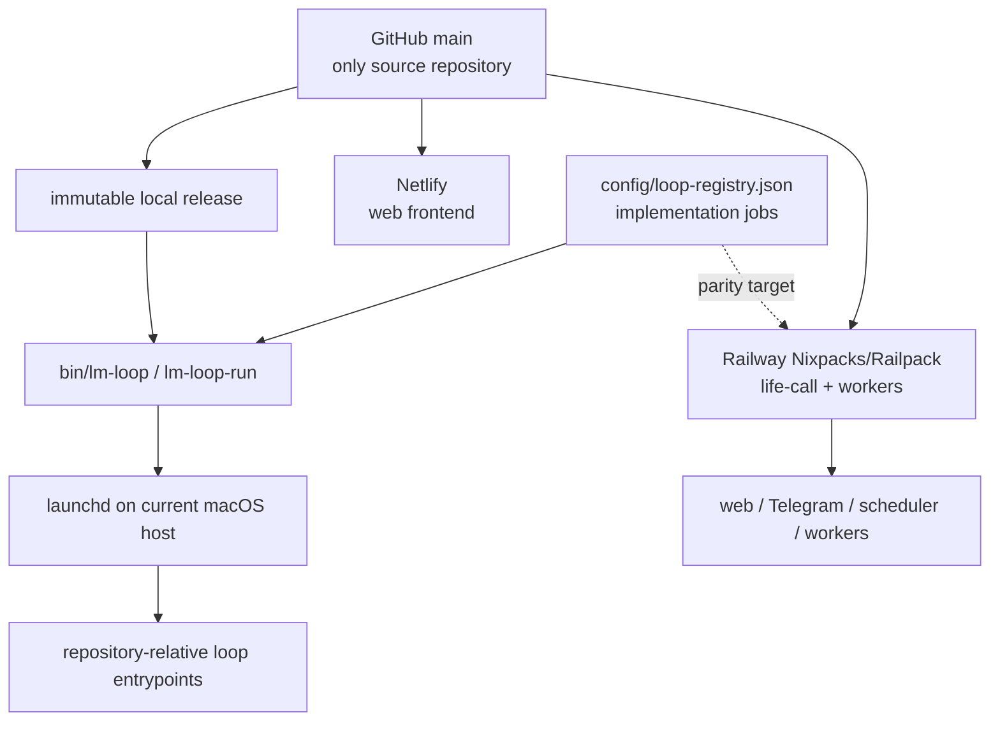

# Life Manager one-repo / two-runtime design

状態: CURRENT RUNTIME VERIFIED — portability implementation remains incomplete

正本範囲: Life Managerのsource、14 product loops、Money Printer umbrella、local/self-hosted runtime、cloud runtime、portable install boundary

本書は既存の実装順序を変更しない。進捗の正本は既存spec/task listのままとする。

## 0. Corrected runtime truth

Life Manager is one open-source product in one GitHub repository. Local/self-hosted and cloud are two deployment
surfaces, not two codebases. They share product contracts and repository-owned entrypoints, but they do **not**
currently run through Docker Compose or one identical container image.

| Surface | Verified current runtime | Docker status |
|---|---|---|
| Mac production loops | immutable main-derived release → `lm-loop-run` → Python/Node/shell entrypoint, supervised by `launchd` | no Docker/Colima daemon or socket; no loaded loop references Docker |
| Selling cloud product | Netlify web frontend; Railway `life-call` and worker roles built from `apps/life-manager` with Nixpacks/Railpack; managed state and hosted browser services | Railway exports OCI images internally, but the product uses neither the checked-in runtime Dockerfile nor Compose |
| Retired local Compose profile | no runtime owner | removed because neither Mac production nor the selling cloud product invoked it |

Some supporting Railway services retain their own checked-in Dockerfiles. They are separate deployment owners and
do not make Docker or Compose a Life Manager local requirement.

## 1. One product, two execution surfaces



- **Local today:** single-owner direct processes on macOS. Code comes from an immutable pushed-main release; mutable
  state, credentials, logs, ledgers, receipts, sessions and browser profiles live outside Git.
- **Cloud today:** the same repository supplies the Netlify frontend and Railway application/services. Cloud owns
  always-on compute and tenant-scoped managed state.
- **Portable self-host target:** a clean clone plus documented host adapter starts supported loops without another
  checkout, OpenClaw, Hermes, Dais-specific paths or private source. macOS is the only verified full production host
  today; Linux and Windows support must be proven before it is advertised.
- **Phone:** a client for cloud or another always-on self-hosted server, not the server itself.

## 2. Canonical repository and runtime tree

```text
life-manager/                         # one GitHub repository
├── apps/
│   ├── life-manager/                # cloud web, Telegram, scheduler and worker core
│   └── landing/                     # Netlify frontend
├── skills/                          # product capabilities and provider adapters
├── runtime/
│   ├── loop/                        # lifecycle, dispatch and runtime events
│   └── agent-runner/                # model-backed work boundary
├── services/                        # independently deployed supporting services
├── bin/                             # lm-loop and repository-owned commands
├── tools/                           # support entrypoints
├── config/loop-registry.json        # implementation/support job registry
├── scripts/                         # onboarding and operational scripts
└── docs/                            # specs and runbooks

outside Git (local)                  managed by cloud providers
├── ~/.local/state/life-manager/     ├── tenant-scoped database/object state
├── credential store                ├── service secrets
├── logs, receipts and ledgers       └── isolated hosted browser/session state
└── browser profiles
```

This is both the target source boundary and the post-cleanup repository shape. Product state, credentials, logs,
browser sessions, receipts and ledgers stay outside Git by design; they are not stray source folders.

The desired developer filesystem is one working folder, `life-manager-main`, connected to the one
`Daisuke134/life-manager` repository. Dedicated temporary worktrees may exist while a change is being developed;
they are removed after merge and are never runtime dependencies.

## 3. The 14 product loops and Money Printer umbrella

The product catalog contains 14 user-facing loops. The count is not a process count: `config/loop-registry.json`
contains many smaller lifecycle IDs because one product loop can need application, browser, reporting,
reconciliation and health jobs.

1. Gig — Coconala
2. Gig — Lancers
3. Gig — CrowdWorks
4. Writer
5. Affiliate
6. Investment / Alpaca
7. Agent Economy
8. Job Hunter
9. Fundraiser
10. Connector
11. Life Manager Cloud
12. Life Manager Mobile Apps — Anicca iOS, Honne and the other owned iOS apps; build, marketing, distribution and measurement
13. Capafy
14. CFO

The README owns the human-readable purpose and representative current runtime owners for each product loop. The
registry owns executable loop IDs.

**Money Printer is not a fifteenth loop.** It is the umbrella name for the system in which all revenue-producing
loops discover work or demand, execute it, verify the provider outcome, reconcile revenue through CFO, and improve.
The `/money-printer` control room is the cross-loop view of that system, not a separate business loop competing with
Coconala, Lancers, Writer, Capafy, Cloud, or the other earning loops. Connector and shared infrastructure may support
the system without being independently revenue-producing.

## 4. Where loop code lives and how it starts

1. A registry-managed job has one stable ID in `config/loop-registry.json` and one repository-relative entrypoint.
2. Current valid source roots include `apps/`, `skills/`, `runtime/`, `bin/`, `services/` and `tools/`; there is no
   separate local-loop copy or cloud-loop copy.
3. On the Mac, a pushed `main` commit becomes a read-only release. `bin/lm-loop` applies selected jobs and `launchd`
   wakes `lm-loop-run`, which dispatches the release-pinned entrypoint.
4. In cloud, Railway starts the roles declared under `apps/life-manager`; `life-call` owns the web/Telegram endpoint
   and in-process cloud scheduling, while worker roles claim supported work.
5. A process exit is not business success. Provider-owned readback and a durable receipt are required.

Safe read-only local inspection:

```bash
jq -r '.loops | keys[]' config/loop-registry.json
./bin/lm-loop status all
./bin/lm-loop doctor
```

Cloning does not automatically install effectful loops. Apply/start is an operator action from an immutable release
after required credentials and host capabilities are configured.

### 4.1 Current reuse truth

The loops do not yet follow one common physical folder shape. Source is distributed across `skills/`, `apps/`,
`runtime/`, `services/` and `tools/`. All 174 managed registry entrypoints exist, and the main local lifecycle and
agent runner are shared, but four declaration/execution systems remain:

1. `config/loop-registry.json` + `runtime/loop` for macOS release and lifecycle;
2. `apps/life-manager/config/loop-adapters.json` + the Postgres job store for cloud adapters;
3. `skills/registry.json` + `runtime/loop/index.mjs` for agent-economy slots;
4. five legacy `loops/*/loop.toml` declarations + `bin/plistgen.py`.

Reuse already working:

- immutable main-derived releases, `lm-loop`, runtime events and the shared agent runner;
- repository-relative entrypoints and explicit state roots;
- marketing generation/publication components for multiple Anicca iOS and Honne lanes;
- the shared marketplace profile/contracts layer used by part of the gig family.

Reuse still missing:

- one manifest and one lifecycle owner for every loop;
- one job/effect/receipt/outbox contract across file, SQLite and Postgres backends;
- one browser lease/target-owner contract across Connector, Gig and Job Hunter;
- one generic mobile-app build/marketing boot path instead of many nearly identical wrappers;
- one gig adapter shape across Coconala, Lancers and CrowdWorks;
- removal of legacy installers, handwritten dispatch maps and external source paths.

### 4.2 Ideal common loop structure

Every product loop uses the same shell. Domain differences live only in a thin adapter and business skill.

```text
loops/
└── <domain>/<loop-id>/
    ├── loop.json                 # ID, cadence, deployment, command/adapter, state, effects
    └── adapter.{py,js,sh}        # thin domain/provider adapter

runtime/
├── control/                      # registry, immutable release, lifecycle, supervisor adapters
├── agent-runner/                 # model-agnostic agent execution
├── browser/                      # lease, target ownership, local/hosted browser adapters
├── contracts/
│   ├── loop-event.schema.json
│   ├── job.schema.json
│   ├── effect.schema.json
│   ├── receipt.schema.json
│   └── outbox.schema.json
└── durable/
    ├── file/                     # local JSONL/SQLite backend adapters
    └── postgres/                 # cloud backend adapter

skills/<domain>/                  # business judgment, prompts and provider-specific tools only
apps/life-manager/adapters/       # cloud API/UI adapters only
```

`loop.json` becomes the only hand-edited declaration. Local and cloud use the same loop ID, adapter, agent/tool
contract and receipt vocabulary. They may use different supervisor, browser and storage backends. Existing mutable
ledgers are not bulk-moved merely to make folders look uniform.

This is an enforced contributor rule, not only a target diagram. `AGENTS.md`
states the invariant for every agent, `skills/loop-engineering/SKILL.md` owns the
implementation boundary, and the English/Japanese READMEs explain it to users.
No contributor adds a local-only or cloud-only copy before proving that a thin
host adapter cannot implement the shared contract.

## 5. Dependency boundary

Every required executable, adapter, schema, prompt and lockfile must live in this repository. An active runtime may
not import code from OpenClaw, Hermes, an Eliza migration folder, another checkout, a worktree or a home-directory
skills tree. External services are allowed only through explicit APIs or host adapters with repository-owned code.

OpenClaw-dependent and absolute-path production jobs are current migration debt, not part of the target. Unused
runtime choices must not remain presented as active architecture. The unowned local Compose stack and its orphaned
container guardian are removed; Railway `internal-worker` and independently owned service Dockerfiles remain.

## 6. Ordered implementation TODO

The established order remains unchanged:

```text
BROWSER-MATRIX-1
  -> BROWSER-HANDOFF-1
  -> BROWSER-RECOVERY-1
  -> LOCAL-CLOUD-PARITY-1
  -> CLOUD-LOOPS-1
  -> LIFE-OUTCOMES-1
  -> LEGACY-RETIRE-1
  -> DEV-E2E-1
  -> OPS-PANEL-1
```

| Existing atom | Required contribution |
|---|---|
| `BROWSER-MATRIX-1` | classify local and hosted browser capabilities without a framework dependency |
| `BROWSER-HANDOFF-1` | hand off the same job identity and receipt contract between browser workers |
| `BROWSER-RECOVERY-1` | resume after worker/browser loss without duplicate provider effect |
| `LOCAL-CLOUD-PARITY-1` | prove the same pushed source, product behavior and receipt contract on both surfaces |
| `CLOUD-LOOPS-1` | converge supported cloud jobs on repository-owned entrypoints without a second implementation |
| `LIFE-OUTCOMES-1` | prove owner-visible outcomes from official provider receipts on both runtimes |
| `LEGACY-RETIRE-1` | remove required OpenClaw, Hermes, migration-folder, worktree, absolute-source and unchosen runtime dependencies; delete the inactive Compose profile unless a real supported owner is proven |
| `DEV-E2E-1` | prove clean clone-to-healthy on each host before claiming support |
| `OPS-PANEL-1` | expose runtime, blocker, receipt and version truth without creating a second authority |

### 6.1 Atomic shared-architecture and cleanup checklist

This checklist does not reorder the product TODO above. It is the fixed internal order used when the corresponding
shared-component or legacy-retirement atom is active.

- [x] `CLEAN-01` Verify Mac loops use immutable releases/launchd and Cloud uses Netlify + Railway Nixpacks/Railpack.
- [x] `CLEAN-02` Correct the 14-loop catalog; define Money Printer as the earning-loop umbrella.
- [x] `CLEAN-03` Classify the local Compose stack, runtime image and container guardian as unowned.
- [x] `CLEAN-04` Remove Compose YAML/env, runtime Dockerfile, Compose CLI, Compose-only scheduler/liveness code and orphan guardian while retaining Railway `internal-worker`.
- [x] `CLEAN-05` Pass focused Node/Python tests, static reference fence and Mac `lm-loop doctor`; confirm Railway `life-call` health and Netlify `/lm` both return HTTP 200 after the source cleanup.
- [x] `WT-01` Inventory all 75 registered worktrees with path, branch, lock, dirty state, PR, merge status and active process owner.
- [x] `WT-02` Attempt exact-path cleanup only after a same-command preflight. The two audit candidates became locked before execution, so fail closed and remove zero; never force-remove, unlock or delete dirty/unmerged/active paths.
- [x] `WT-03` Confirm dry-run prune has no eligible metadata and retain 75 paths: 65 locked plus 10 active/open-PR/unmerged/ignored-state paths.
- [x] `WT-04` Adopt owner/expiry/heartbeat leases and retire stale task worktrees only after an exact-path re-audit.
  - [x] `WT-04a` Add the repository-owned lease contract, heartbeat command, fail-closed audit and lifecycle runbook.
  - [x] `WT-04b` Re-audit `life-manager-alpaca-pr89-spec`; verify clean, merged, unlocked, open PR 0 and process/open file 0; retire it without force and confirm it is absent.
  - [x] `WT-04c` Resolve the ownerless lock on clean, merged `life-manager-alpaca-a11-spec`: its originating Codex session was terminal, the empty lock had not changed since creation, and process/tmux/open-file checks were zero; repeat the complete preflight, retire without force and confirm the path is absent.
  - [x] `WT-04d` Retire every worktree that is not in current development. Dais explicitly authorized discarding stale dirty, ignored, unmerged and legacy-locked worktrees because `main` is the code source of truth; branch refs remain, while uncommitted files are intentionally unrecoverable. Three parallel read-only audits found zero process/open-file users for the stale set, then the primary rechecked each exact path and removed 57 worktrees, including the external Capafy checkout after confirming that no LaunchAgent, config or repository file referenced its absolute path. After retiring the audit worktree, the final readback was 11 retained development worktrees: the main checkout, the current GH-32 workspace, two unexpired managed leases, four open-PR worktrees and three worktrees newly created or recreated by concurrent development during the audit. A later concurrent-development audit retired five more newly stale worktrees after exact-path rechecks: four clean merged paths and one merged path containing only regenerable `node_modules`. A subsequent disk-blocker audit removed six more unmanaged, unlocked worktrees only after confirming open PR 0 and process owner 0; active leases, locks and open-PR worktrees remained protected. New active worktrees continued to appear during these audits and were retained. No age-only or bulk-directory deletion was used.
- [x] `ARCH-01` Freeze the current inventory from one pinned immutable release: 174 managed, 22 external, 50 retired and 12 cloud adapters. `docs/loops/current-inventory.json` records the source commit and manifest hashes, inferred registry owner and last terminal receipt for all 246 local rows. It keeps the gaps explicit: four managed loops have no terminal receipt, all 66 effectful local loops lack a common official-receipt mapping, all 12 cloud adapters lack declarative owner/receipt-source fields, and retired `ai.anicca.job-search-browser` remains installed. The generated projection is evidence, not a second editable registry.
- [x] `ARCH-02` Generate the single Draft 2020-12 `runtime/loop/loop.schema.json` from the existing Python registry contract. The byte-equality test prevents hand-edited schema drift, projects the registry key into required `loop_id`, preserves all current cadence/domain/effect/route/state/cleanup/browser constraints and does not add a second declaration source.
- [x] `ARCH-03` Add validated optional `command`/`adapter` fields and migrate `marketing-dashboard` from the handwritten dispatcher to its repository-owned Python entrypoint without changing argv. The Python validator and generated Draft 2020-12 schema reject partial, null, unknown and empty contracts. The runner now defaults state and evidence to `LIFE_MANAGER_STATE_ROOT` instead of the read-only release. Python loop tests passed 127/127, scheduled-runner tests 5/5, Node adapter tests 15/15 and a no-send external-state run passed. PR #4314 merged as `244ebd4a`; targeted reconcile installed only `ai.anicca.marketing-dashboard`, and its natural RunAtLoad receipt passed with exit 0, blocker null and the same release SHA, replacing the prior immutable-release permission failure.
- [ ] `ARCH-04` Migrate the remaining handwritten dispatch entries one at a time; verify label, argv, state root and receipt after each; delete `entry_dispatch.py` when empty.
  - [x] `ARCH-04a` Migrate `marketing-metrics-daily` to the direct Python adapter with exact `metrics` argv. Move nested business-outcome state and evidence under `LIFE_MANAGER_STATE_ROOT`; retain the standalone fallback. Business-outcome tests passed 17/17, loop tests 129/129, Node adapter tests 15/15 and the external-state no-send run passed without repository-local evidence. PR #4327 merged as `18dd29fd`; targeted reconcile changed only `ai.anicca.marketing-metrics-daily`, and its production run passed with exit 0, blocker null and the installed SHA after the previous read-only-release permission failures.
  - [x] `ARCH-04b` Migrate `marketing-score-daily` to the direct Python adapter with exact `score` argv. Runtime loop tests passed 131/131, Node adapter tests 15/15 and an external-state no-send run exited 0 without repository-local evidence; the score runner returned its existing quarantined `skipped` result. PR #4330 merged as `6b31090e`; targeted reconcile installed only `ai.anicca.marketing-score-daily`, and its production run passed with exit 0, blocker null and matching installed/event release SHAs, replacing the prior `entrypoint_exit_1` receipts.
  - [x] `ARCH-04c` Migrate `self-improve-evolve` to the direct Python adapter with exact `self-improve` argv. Runtime loop tests passed 133/133, Node adapter tests 15/15 and an external-state no-send run exited 0 with the existing quarantined `skipped` result and no repository-local write. PR #4332 merged as `3f3c645`; targeted reconcile changed only `ai.anicca.self-improve-evolve`, and its production run passed with exit 0, blocker null and matching installed/event release SHAs, replacing the prior `entrypoint_exit_1` receipt.
  - [x] `ARCH-04d` Migrate `clip-loop` to the direct Python adapter with exact `clip` argv. Runtime loop tests passed 135/135, Node adapter tests 15/15 and an external-state no-send run exited 0 with the expected quarantined `skipped` result and no publish. PR #4334 merged as `e465e5d`; targeted reconcile changed only `ai.anicca.clip-loop`, and its production run passed with exit 0, blocker null and matching installed/event release SHAs, replacing the prior `entrypoint_exit_1` receipt. The existing quarantine notification was delivered; the clip publisher itself did not run.
  - [x] `ARCH-04e` Add the declarative `exec` adapter and migrate `affiliate-source-refresh` with exact `sources wake` argv. PR #4336 merged as `385138d`; runtime loop tests passed 138/138, Node adapter tests 15/15, the generated schema/fixture matched and fresh review shipped. The migrated run exposed the scheduled runner's fixed 3,600-second limit and then could not persist its terminal event under host ENOSPC. PR #4339 merged as `c581967a`, adding a validated scheduled-only finite override and setting this job to 10,800 seconds; runtime loop tests passed 140/140 and fresh review shipped. Safe release GC restored host headroom and targeted reconcile changed only `ai.anicca.affiliate-source-refresh`. The installed `c581967a` production run then completed after 1 hour 54 minutes with exit 0, blocker null, terminal result `pass`, matching installed/event release SHAs, and no remaining parent or child PID.
  - [x] `ARCH-04f` Migrate `affiliate-composition` to the direct `exec` adapter with exact `compose wake` argv. Runtime loop tests passed 139/139, Node adapter tests 15/15 and fresh review shipped. PR #4337 merged as `6ed8b60`; targeted reconcile changed only `ai.anicca.affiliate-composition`, and its production run passed with exit 0, blocker null and matching installed/event release SHAs.
  - [ ] `ARCH-04g` After `ARCH-04e` reaches a terminal production receipt, migrate the next handwritten dispatch entry and repeat exact argv, state root and receipt verification. `crowdworks-revenue-application` is complete (1/28): PR #4343 merged as `29212a67`; the handwritten OpenClaw venv dispatch was replaced by a repo-managed wrapper and locked self-host runtime dependencies, empty argv became a validated declarative contract, runtime loop tests passed 143/143, Node adapter tests passed 15/15, an isolated clean venv imported the dependencies, and fresh review shipped. Targeted reconcile changed only `ai.anicca.crowdworks-revenue-application`; its production run used the managed venv and passed with exit 0, blocker null, matching installed/event release SHAs and no remaining PID after inspecting 53 jobs with effect 0. `crowdworks-revenue-report` is complete (2/28): PR #4345 merged as `6c2d0d24`; exact `--json` argv moved to the direct Python adapter, the remaining CrowdWorks dispatch path was deleted, runtime loop tests passed 147/147, Node adapter tests passed 15/15, macOS Python 3.9 compilation passed, and fresh review shipped. Targeted reconcile changed only `ai.anicca.crowdworks-revenue-report`; its production run passed with exit 0, blocker null, matching installed/event release SHAs and no remaining PID. `affiliate-browser` is complete (3/28): PR #4347 merged as `0be230df`; its registry entry now directly executes a repo-owned wrapper through the shared Life Manager managed Python, `cloakbrowser==0.5.6` is locked in the self-host runtime requirements, the disk guard resolves from the same immutable full-repo release, and the unused competing Affiliate launchd installer was deleted. Runtime loop tests passed 149/149, focused migration tests passed 67/67, an isolated clean venv imported `cloakbrowser 0.5.6`, and fresh review shipped after its initial installer-layout finding was fixed. Targeted reconcile changed only `ai.anicca.affiliate-browser`; production release `0be230df` recorded an install pass and a continuous running event with blocker null, CDP 9324 returned the ElevenLabs page, and the live child loaded `greenlet` from the Life Manager managed venv. `affiliate-impact-browser` is complete (4/28): PR #4349 merged as `586d4e6f`; the common control plane now projects each validated `browser_owner` port/profile into the runtime environment, and the shared Affiliate wrapper selects the existing Impact URL without a second implementation. Runtime loop tests passed 152/152, focused tests passed 110/110, Node config-drift tests passed 42/42, and fresh review shipped. Targeted reconcile changed only `ai.anicca.affiliate-impact-browser`; production recorded an install pass and continuous running event with blocker null on release `586d4e6f`, CDP 9327 returned the Impact login page, and the child ran through the Life Manager managed venv with profile `impact-en`. Continue through the ordered sub-items below until every owner receipt is recorded and `entry_dispatch.py` is empty.
    - `affiliate-x-browser` is complete (5/28): PR #4351 merged as `0fbb7481`; the final Affiliate browser handwritten dispatch and its now-unused path variable were deleted, while the existing shared wrapper and validated browser-owner projection were reused unchanged. Runtime loop tests passed 153/153, focused tests passed 111/111, Node config-drift tests passed 42/42, and fresh review shipped. Targeted reconcile changed only `ai.anicca.affiliate-x-browser`; production recorded an install pass and continuous running event with blocker null on release `0fbb7481`, CDP 9326 reached `https://x.com/home`, and the live child used the managed venv with profile `x-en`. Current ARCH-04g count is 5/28; 23 dispatcher entries remain.
    - `life-manager-daily-driver` is complete (6/28): PR #4353 merged as `7657b2f2`; the handwritten owner/OpenClaw-Python argv was replaced by the shared browser-owner environment plus a repo-owned managed-Python wrapper, the disk guard now resolves from the same full-repo release, and the obsolete same-label renderer, plist template and self-test were deleted. Runtime loop tests passed 154/154, focused tests passed 110/110, browser tests passed 11/11, Node config-drift tests passed 42/42, wrapper argv smoke passed, and fresh review shipped after its duplicate-deployment finding was fixed. Targeted reconcile changed only `ai.anicca.life-manager-daily-driver`; production recorded an install pass and continuous running event with blocker null on release `7657b2f2`, CDP 9222 responded, and the child used the managed venv with profile `daily-driver`. Current ARCH-04g count is 6/28; 22 dispatcher entries remain.
    - `affiliate-loop` is complete (7/28): PR #4355 merged as `8ceb6061`; the handwritten dispatcher entry was replaced by the direct repo-owned `skills/affiliate/affiliate loop wake` adapter and its now-unused dispatcher variable was deleted. Runtime loop tests passed 156/156, focused tests passed 62/62, Node config-drift tests passed 42/42, and fresh review shipped. Targeted loaded-idle reconcile changed only `ai.anicca.affiliate-loop`; the terminal production receipt recorded exit 0, pass, blocker null, no PID, and matching installed/event release SHAs `8ceb6061`.
    - `marketing-mine-daily` is complete (8/28): PR #4360 migrated exact `mine` argv to the direct Python adapter and removed the duplicate same-label Gate6/Gate8 ownership. Follow-up PRs #4364, #4365, #4372, #4373 and #4379 moved mutable intel state under `LIFE_MANAGER_STATE_ROOT`, preserved private state permissions and symlink rejection, updated the locked `yt-dlp`, bounded the downloaded MP4, and removed unused Whisper word timestamps that exceeded the finite run limit. Runtime tests passed 158/158, focused migration tests passed 64/64, Node config-drift tests passed 42/42, all follow-up focused tests passed, and fresh review shipped for every code change. Targeted reconcile changed only `ai.anicca.marketing-mine-daily`; release `b9078495` completed in production with exit 0, terminal `pass`, blocker null, loaded-idle state, no PID, and matching installed/event release SHAs.
    - `lancers-revenue-application` is complete (9/28): PR #4381 replaced its handwritten dispatch with a repo-owned managed-Python wrapper that preserves exact `--json --exhaustive --state-path $LIFE_MANAGER_STATE_ROOT/application.json` argv, and removed the competing same-label plist generation, activation and manifest ownership from the legacy multi-label Lancers installer while preserving its unmigrated sibling jobs. Production then exposed an existing type-erasure bug: public Lancers `タスク` cards were collapsed into fixed projects and sent to the proposal-only path. PR #4383 preserves them as the common `bounty` type and excludes them with explicit evidence before the proposal planner; fixed-project behavior is unchanged. Runtime loop tests passed 161/161, Lancers tests passed 78/78, Node config-drift tests passed 57/57, wrapper argv smoke passed, and both fresh reviews shipped. Targeted reconcile changed only `ai.anicca.lancers-revenue-application`; release `b440e523` completed in production with exit 0, terminal `pass`, blocker null, loaded-idle state, no PID, and matching installed/event release SHAs. Current ARCH-04g count is 9/28; 19 dispatcher entries remain.
    - `lancers-revenue-work-sync` is complete (10/28): PR #4388 replaced its handwritten dispatch with a repo-owned managed-Python wrapper preserving exact `--json --state-path $LIFE_MANAGER_STATE_ROOT/work-sync.json` argv and removed the competing same-label plist generation, activation and manifest ownership from the legacy multi-label installer. The legacy release payload intentionally retains `work_sync.py` because the unmigrated Telegram reporter imports its watchdog helper; fresh read-only review confirmed that sibling dependency and shipped with no blockers. Runtime tests passed 171/171 plus 25 subtests, Lancers tests passed 78/78, and Node config-drift tests passed 57/57. Targeted reconcile changed only `ai.anicca.lancers-revenue-work-sync`; release `484a7853` ran the exact managed-Python argv and completed in production with exit 0, terminal `pass`, blocker null, loaded-idle state, no PID, and matching installed/event release SHAs. Current ARCH-04g count is 10/28; 18 dispatcher entries remain.
    - `lancers-revenue-negotiate` is complete (11/28): PR #4391 replaced its handwritten dispatch with a repo-owned managed-Python wrapper preserving exact `--lane negotiate --state-path $LIFE_MANAGER_STATE_ROOT/contracts.json` argv; no competing same-label legacy installer existed, and the unmigrated paid sibling remains unchanged. Runtime tests passed 174/174 plus 25 subtests, Lancers tests passed 78/78 plus 13 subtests, Node config-drift tests passed 57/57, wrapper smoke passed, and fresh read-only review shipped with no blockers. Targeted reconcile changed only `ai.anicca.lancers-revenue-negotiate`; release `8f803ddd` ran the exact managed-Python argv and completed twice in production with exit 0, terminal `pass`, blocker null, loaded-idle state, no PID, and matching installed/event release SHAs. Current ARCH-04g count is 11/28; 17 dispatcher entries remain.
    - `lancers-revenue-paid` is complete (12/28): PR #4397 replaced its handwritten dispatch with a repo-owned managed-Python wrapper preserving exact `--lane paid --state-path $LIFE_MANAGER_STATE_ROOT/contracts.json` argv and the existing `money` effect classification; no competing same-label installer existed, and all unmigrated siblings remain unchanged. Runtime tests passed 177/177 plus 25 subtests, Lancers tests passed 84/84 plus 13 subtests, Node config-drift tests passed 57/57, wrapper smoke passed, and fresh read-only review shipped with no blockers. Targeted reconcile changed only `ai.anicca.lancers-revenue-paid`; release `c9ded490` ran the exact managed-Python argv and completed in production with exit 0, terminal `pass`, blocker null, loaded-idle state, no PID, and matching installed/event release SHAs. Current ARCH-04g count is 12/28; 16 dispatcher entries remain.
    - `lancers-revenue-storefront` is complete (13/28): PR #4400 replaced its handwritten dispatch with a repo-owned managed-Python wrapper preserving exact `--apply --product <same-release product JSON> --state-path $LIFE_MANAGER_STATE_ROOT/application.json` argv and the existing `publish` effect. The duplicate same-label legacy plist, renderer, activation, manifest ownership and partial-release source were removed while the report/browser siblings and their dependency closure remain intact. Runtime tests passed 180/180 plus 25 subtests, Lancers tests passed 84/84 plus 13 subtests, Node config-drift tests passed 57/57, and fresh read-only review shipped with no blockers. Targeted reconcile changed only `ai.anicca.lancers-revenue-storefront`; release `26157e61` ran the exact managed-Python argv and completed in production with exit 0, terminal `pass`, blocker null, loaded-idle state, no PID, and matching installed/event release SHAs. Current ARCH-04g count is 13/28; 15 dispatcher entries remain.
    - `lancers-revenue-telegram-report` is complete (14/28): PR #4402 replaced its handwritten dispatch with a repo-owned managed-Python wrapper preserving exact `--json`, database, ledger database, application state and both log-path arguments. The duplicate same-label legacy plist, renderer, activation and manifest ownership were removed; because only the external-Chromium browser sibling remains, the legacy partial release was reduced to its minimal immutable working-directory artifact. Runtime tests passed 183/183 plus 25 subtests, Lancers tests passed 84/84 plus 13 subtests, Node config-drift tests passed 57/57, focused installer/control-plane tests passed 87/87, and fresh read-only review shipped with no blockers. Targeted reconcile changed only `ai.anicca.lancers-revenue-telegram-report`; release `bcf9c9e2` ran the exact managed-Python argv and completed in production with exit 0, terminal `pass`, blocker null, loaded-idle state, no PID, and matching installed/event release SHAs. Current ARCH-04g count is 14/28; 14 dispatcher entries remain.
    - `marketing-metrics` is complete (15/28): PR #4405 replaced its handwritten dispatch with a repo-owned state-root-aware wrapper preserving exact `marketing observe --root $LIFE_MANAGER_STATE_ROOT` argv, and removed the duplicate same-label legacy launchd installer and plist. Runtime tests passed 186/186 plus 25 subtests, Node config-drift tests passed 57/57, an isolated state-root CLI smoke exited 0, and fresh read-only review shipped with no blockers. Targeted reconcile changed only `ai.anicca.marketing-metrics`; release `f7888b5a` ran against the expanded existing `~/Library/Application Support/AniccaMarketing` root and completed in production with exit 0, terminal `pass`, blocker null, loaded-idle state, no PID, and matching installed/event release SHAs. Current ARCH-04g count is 15/28; 13 dispatcher entries remain.
    - `marketing-owner-events` is complete (16/28): PR #4410 replaced its handwritten dispatch with a repository-owned managed-Python wrapper and removed the duplicate same-label Gate15 installer ownership. Production exposed a release-local lock and output bug; PR #4411 moved the lock, publication ledger, native metrics state/evidence and all owner reports under `LIFE_MANAGER_STATE_ROOT`. The next run wrote all evidence successfully but exposed that the publication 95% quality gate shared exit 1 with runtime failures; PR #4420 assigned only a written quality-gate miss the explicit exit 3 and records it as `attention`, while API/runtime exit 1 remains fatal. Runtime tests passed 189/189 plus 25 subtests, focused report tests passed 32/32 plus 4 subtests, native metrics tests passed 19/19, Node config tests passed 64/64, the dedicated publication exit-contract test passed, and fresh read-only review shipped. Two unrelated full publication-suite fixtures remain time-sensitive outside their fixed August window. Targeted reconcile changed only `ai.anicca.marketing-owner-events`; release `51c765e4` ran exact state-root argv, recorded reconcile as attention and all five downstream stages as pass, then completed with exit 0, terminal `pass`, blocker null, loaded-idle state, no PID, and matching installed/event release SHAs. Current ARCH-04g count is 16/28; 12 dispatcher entries remain.
    - `marketing-weekly-review` is complete (17/28): PR #4424 replaced its handwritten `lm intel gap --telegram` dispatch with a repository-owned wrapper that preserves the business argv and routes its only mutable evidence output under `LIFE_MANAGER_STATE_ROOT`; the duplicate single-label Gate8 plist installer and its test were deleted. Runtime tests passed 192/192 plus 25 subtests, intel-gap tests passed 3/3, Node config tests passed 64/64, wrapper argv and shell checks passed, and fresh read-only review shipped. Targeted reconcile changed only `ai.anicca.marketing-weekly-review`; release `5dfa15a7` completed with exit 0, terminal `pass`, blocker null, loaded-idle state, no PID and matching installed/event release SHAs. Its external evidence recorded 18 open tactics and Telegram delivery receipts `64436` and `64437`. Current ARCH-04g count is 17/28; 11 dispatcher entries remain.
    - `hf-gig-paid-direct` is in progress and remains unchecked (candidate 18/28): PR #4430 moved the current central `memory_admission -> gig_disk_guard -> paid_direct.py` path into a repository-owned wrapper, retained its target-owner environment and `~/gig` state paths, and removed only the competing Paid ownership from the legacy Gig manifest/installer. Runtime tests passed 193/193 plus 25 subtests, focused legacy release tests passed 13/13, Node config tests passed 64/64, and fresh read-only review shipped. Targeted release `42be7c51` was installed and the run was last observed processing real Paid work; it had not produced the outer terminal receipt. Dais assigned the running Coconala follow-up to other active developers, so Codex does not stop, restart, reconcile, monitor, or further edit `hf-gig-paid-direct`, `hf-gig-apply-direct`, `hf-gig-reply-detector`, or `hf-gig-storefront-direct`. Do not count this item complete until that owner records the terminal production receipt. ARCH-04g therefore remains 17/28 with 11 entries outstanding.
    - `writer-claim-loop` is complete (18/28): PR #4440 replaced its handwritten dispatch with a repository-owned wrapper preserving exact `claim_loop.py --state-dir $WRITER_STATE_DIR` behavior and external Writer state, and deleted the duplicate same-label Gig manifest/release ownership plus the raw-launchctl installer. Focused runtime tests passed 5/5, focused legacy-ownership tests passed 3/3, Node adapter tests passed 15/15, static checks passed, and fresh read-only review shipped. The full runtime suite passed 188/189 except for an unrelated stale Lancers Paid wrapper expectation already present on `main`; the full legacy Gig release suite passed 14/15 except for its unrelated removed `watch` command test. Targeted reconcile applied only `ai.anicca.writer-claim-loop`; release `080b7aac` completed its natural production wake with exit 0, terminal `pass`, blocker null, loaded-idle state, no PID, and matching installed/event release SHAs. Current ARCH-04g count is 18/28; 10 entries remain.
    - `writer-money-sync` is complete (19/28): PR #4443 replaced its handwritten dispatch with a repository-owned wrapper preserving exact external Writer state and `money.sqlite3` argv, and deleted the duplicate same-label Gig manifest/release ownership plus the raw-launchctl installer. Focused runtime tests passed 5/5, focused legacy-ownership tests passed 3/3, Node adapter tests passed 15/15, static checks passed, and fresh read-only review shipped. The full runtime suite passed 191/192 except for the unrelated stale Lancers Paid wrapper expectation already present on `main`; the full legacy Gig release suite passed 15/16 except for its unrelated removed `watch` command test. Targeted reconcile applied only `ai.anicca.writer-money-sync`; release `06db1ded` completed its natural production wake with exit 0, terminal `pass`, blocker null, loaded-idle state, no PID, and matching installed/event release SHAs. Current ARCH-04g count is 19/28; 9 entries remain.
    - `writer-opportunity-discovery` is complete (20/28): PR #4445 replaced its handwritten dispatch with a repository-owned wrapper preserving the current external opportunities database, claims database, and receipt argv, and deleted the duplicate same-label Gig manifest/release ownership plus the raw-launchctl installer with its divergent runner argument. Focused runtime tests passed 5/5, focused legacy-ownership tests passed 2/2, Node adapter tests passed 15/15, static checks passed, and fresh read-only review shipped. The full runtime suite passed 194/195 except for the unrelated stale Lancers Paid wrapper expectation already present on `main`; the full legacy Gig release suite passed 16/17 except for its unrelated removed `watch` command test. Targeted reconcile applied only `ai.anicca.writer-opportunity-discovery`; its first official event on release `d33a9e51` completed with exit 0, terminal `pass`, blocker null, loaded-idle state, no PID, and matching installed/event release SHAs. Current ARCH-04g count is 20/28; 8 entries remain.
    - `writer-opportunity-response` is complete (21/28): PR #4447 replaced its handwritten dispatch with a repository-owned wrapper preserving the external opportunities database and receipt paths while restoring the required Writer account from the existing private environment (`WRITER_GMAIL_ACCOUNT`, then `LIFE_MANAGER_GMAIL_ACCOUNT`, then `GOG_ACCOUNT`) without hardcoding personal data. The duplicate legacy Gig manifest/release ownership and raw-launchctl installer were deleted. Focused migration tests passed 40/40, Node adapter tests passed 15/15, the broader combined suite passed 56/57 with only the unrelated obsolete `gig_release.py watch` test failing, and fresh read-only review shipped. Targeted reconcile applied only `ai.anicca.writer-opportunity-response`; release `d4638bcb` completed its production wake with exit 0, terminal `pass`, blocker null, loaded-idle state, no PID, and matching installed/event release SHAs. The application effect remained `unknown`, so no external application effect is claimed. Current ARCH-04g count is 21/28; 7 project-wide entries remain.
    - Execution ownership: the four Coconala entries above remain visible only in the project-wide outstanding count and are not in Codex's execution TODO. Their active owners record their completion receipts. Codex's next actionable ARCH-04g queue is, in fixed order: `writer-report`, `marketing-owner-daily`, and `marketing-owner-weekly`; then delete the empty `entry_dispatch.py` and close ARCH-04/ARCH-04g after all owners' receipts are recorded.
- [ ] `ARCH-05` Migrate the five legacy `loop.toml` declarations; delete the second plist generator/declaration path.
- [ ] `ARCH-06` Define common job, event, effect, receipt and outbox schemas without moving existing databases.
- [ ] `ARCH-07` Extract one browser lease/target-owner contract; migrate Connector, then Gig and Job Hunter after live readback.
- [ ] `ARCH-08` Adapt file/JSONL, SQLite and Postgres persistence behind the common contracts.
- [ ] `ARCH-09` Replace the Anicca iOS/Honne per-lane boot wrappers with one product-aware mobile-app command and manifest.
- [ ] `ARCH-10` Retire Lancers and other legacy installers after registry-only ownership is proven; align all gig providers to the same adapter shell.
- [ ] `ARCH-11` Remove external checkout/worktree/OpenClaw/Hermes code dependencies and move required source into this repository. The unused 763 MiB `life-manager-eliza-money-live-report` migration copy is deleted after confirming it was not a Git checkout and had no launchd reference, repository reference or runtime PID; other external dependencies remain to be migrated before this atom can close.
- [ ] `ARCH-12` Prove clean local and cloud runs use the same loop contracts with replay-zero and official provider receipts.
- [x] `DOC-01` Update English/Japanese README architecture and status from measured output; remove the Compose runtime claim and describe Mobile Apps as Anicca iOS, Honne and the other owned iOS build/marketing loops.
- [x] `DOC-02` Bake the one-loop/two-host-adapter rule into `AGENTS.md`, make `skills/loop-engineering/SKILL.md` the implementation-boundary authority, and expose the same local/cloud reuse rule in both READMEs without duplicating the detailed spec.

## 7. Acceptance

Complete means all of the following are measured:

- one public repository contains every required executable source and deployment declaration;
- no active runtime references another checkout, worktree, migration folder or private source tree;
- each advertised host reaches a healthy supported runtime through documented commands;
- local and cloud use repository-owned entrypoints and the same state/effect/receipt contracts;
- restart does not duplicate external effects;
- unsupported platform capabilities fail closed and are visible;
- local private data stays outside Git and cloud data remains tenant scoped;
- Telegram and every external effect retain provider-owned receipts.

## 8. Evidence used for this correction

- live Mac readback: Docker context points to Colima, but its socket is absent; no daemon/container is running; loaded
  Life Manager LaunchAgents execute immutable-release `lm-loop-run` directly;
- live Railway deployment metadata: `life-call` uses `NIXPACKS` with no repository Dockerfile path and starts
  `node server.js`; the worker uses Railpack/Nixpacks with no repository Dockerfile path;
- live cloud readback: the Life Manager endpoints are healthy and the web response is served through Netlify;
- repository declarations: `apps/life-manager/railway.toml` selects Nixpacks and retains
  `node scripts/runtime-up.js internal-worker`; the removed local Compose paths had no production owner.

Railway internally producing an OCI container image is an infrastructure implementation detail. It does not mean
that users or operators run Docker Compose, and it does not justify documenting Compose as the canonical runtime.
