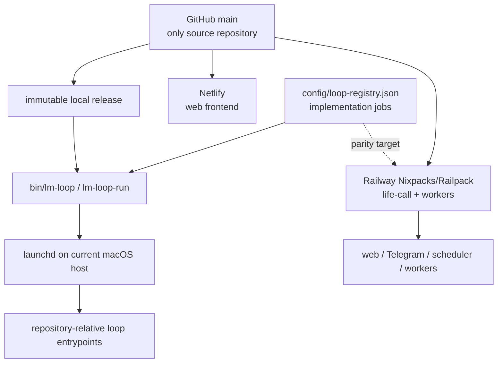

# Life Manager one-repo / two-runtime design

状態: CURRENT RUNTIME VERIFIED — portability implementation remains incomplete

正本範囲: Life Managerのsource、14 product loops、Money Printer umbrella、local/self-hosted runtime、cloud runtime、portable install boundary

本書は既存の実装順序を変更しない。進捗の正本は既存spec/task listのままとする。

## 0. Corrected runtime truth

Life Manager is one open-source product in one GitHub repository. Local/self-hosted and cloud are two deployment
surfaces, not two codebases. They share product contracts and repository-owned entrypoints, but they do **not**
currently run through Docker Compose or one identical container image.

| Surface | Verified current runtime | Docker status |
|---|---|---|
| Mac production loops | immutable main-derived release → `lm-loop-run` → Python/Node/shell entrypoint, supervised by `launchd` | no Docker/Colima daemon or socket; no loaded loop references Docker |
| Selling cloud product | Netlify web frontend; Railway `life-call` and worker roles built from `apps/life-manager` with Nixpacks/Railpack; managed state and hosted browser services | Railway exports OCI images internally, but the product uses neither the checked-in runtime Dockerfile nor Compose |
| Retired local Compose profile | no runtime owner | removed because neither Mac production nor the selling cloud product invoked it |

Some supporting Railway services retain their own checked-in Dockerfiles. They are separate deployment owners and
do not make Docker or Compose a Life Manager local requirement.

## 1. One product, two execution surfaces



- **Local today:** single-owner direct processes on macOS. Code comes from an immutable pushed-main release; mutable
  state, credentials, logs, ledgers, receipts, sessions and browser profiles live outside Git.
- **Cloud today:** the same repository supplies the Netlify frontend and Railway application/services. Cloud owns
  always-on compute and tenant-scoped managed state.
- **Portable self-host target:** a clean clone plus documented host adapter starts supported loops without another
  checkout, OpenClaw, Hermes, Dais-specific paths or private source. macOS is the only verified full production host
  today; Linux and Windows support must be proven before it is advertised.
- **Phone:** a client for cloud or another always-on self-hosted server, not the server itself.

## 2. Canonical repository and runtime tree

```text
life-manager/                         # one GitHub repository
├── apps/
│   ├── life-manager/                # cloud web, Telegram, scheduler and worker core
│   └── landing/                     # Netlify frontend
├── skills/                          # product capabilities and provider adapters
├── runtime/
│   ├── loop/                        # lifecycle, dispatch and runtime events
│   └── agent-runner/                # model-backed work boundary
├── services/                        # independently deployed supporting services
├── bin/                             # lm-loop and repository-owned commands
├── tools/                           # support entrypoints
├── config/loop-registry.json        # implementation/support job registry
├── scripts/                         # onboarding and operational scripts
└── docs/                            # specs and runbooks

outside Git (local)                  managed by cloud providers
├── ~/.local/state/life-manager/     ├── tenant-scoped database/object state
├── credential store                ├── service secrets
├── logs, receipts and ledgers       └── isolated hosted browser/session state
└── browser profiles
```

This is both the target source boundary and the post-cleanup repository shape. Product state, credentials, logs,
browser sessions, receipts and ledgers stay outside Git by design; they are not stray source folders.

The desired developer filesystem is one working folder, `life-manager-main`, connected to the one
`Daisuke134/life-manager` repository. Dedicated temporary worktrees may exist while a change is being developed;
they are removed after merge and are never runtime dependencies.

## 3. The 14 product loops and Money Printer umbrella

The product catalog contains 14 user-facing loops. The count is not a process count: `config/loop-registry.json`
contains many smaller lifecycle IDs because one product loop can need application, browser, reporting,
reconciliation and health jobs.

1. Gig — Coconala
2. Gig — Lancers
3. Gig — CrowdWorks
4. Writer
5. Affiliate
6. Investment / Alpaca
7. Agent Economy
8. Job Hunter
9. Fundraiser
10. Connector
11. Life Manager Cloud
12. Life Manager Mobile Apps — Anicca iOS, Honne and the other owned iOS apps; build, marketing, distribution and measurement
13. Capafy
14. CFO

The README owns the human-readable purpose and representative current runtime owners for each product loop. The
registry owns executable loop IDs.

**Money Printer is not a fifteenth loop.** It is the umbrella name for the system in which all revenue-producing
loops discover work or demand, execute it, verify the provider outcome, reconcile revenue through CFO, and improve.
The `/money-printer` control room is the cross-loop view of that system, not a separate business loop competing with
Coconala, Lancers, Writer, Capafy, Cloud, or the other earning loops. Connector and shared infrastructure may support
the system without being independently revenue-producing.

### Target CFO: one Financial Manager, not three competing loops

The target canonical product loop is **Financial Manager (CFO)**. Moneytree and revenue tracking become different
inputs to that one loop, not interchangeable names and not separate user-facing loops:

- the Moneytree adapter will read the user's personal balances and transactions to establish net worth and cash flow;
- the verified-revenue collector will normalize earned revenue and payout receipts from Gig, Writer, Stripe,
  RevenueCat, KDP, Gumroad, affiliate, x402 and later providers;
- the financial policy layer will combine assets, spending, costs, revenue and evidence freshness to give conservative
  spending, saving and allocation guidance;
- one concise daily/weekly reporting surface will summarize the portfolio and suppress duplicate or no-data messages.

`marketing-owner-daily` and `marketing-owner-weekly` are transitional downstream product-report jobs. They are not
the Financial Manager and must not grow a second revenue ledger. After their dispatch migration, their useful views
are consolidated into Financial Manager and the redundant jobs are retired. If they need temporary human-readable
names before retirement, use `marketing-product-revenue-report-daily` and
`marketing-portfolio-revenue-report-weekly`; the canonical product name remains Financial Manager.

## 4. Where loop code lives and how it starts

1. A registry-managed job has one stable ID in `config/loop-registry.json` and one repository-relative entrypoint.
2. Current valid source roots include `apps/`, `skills/`, `runtime/`, `bin/`, `services/` and `tools/`; there is no
   separate local-loop copy or cloud-loop copy.
3. On the Mac, a pushed `main` commit becomes a read-only release. `bin/lm-loop` applies selected jobs and `launchd`
   wakes `lm-loop-run`, which dispatches the release-pinned entrypoint.
4. In cloud, Railway starts the roles declared under `apps/life-manager`; `life-call` owns the web/Telegram endpoint
   and in-process cloud scheduling, while worker roles claim supported work.
5. A process exit is not business success. Provider-owned readback and a durable receipt are required.

Safe read-only local inspection:

```bash
jq -r '.loops | keys[]' config/loop-registry.json
./bin/lm-loop status all
./bin/lm-loop doctor
```

Cloning does not automatically install effectful loops. Apply/start is an operator action from an immutable release
after required credentials and host capabilities are configured.

### 4.1 Current reuse truth

The loops do not yet follow one common physical folder shape. Source is still distributed across `skills/`, `apps/`,
`runtime/`, `services/` and `tools/`, but the former five `loops/*/loop.toml` declarations and `bin/plistgen.py` have
been deleted. `config/loop-registry.json` is the sole host scheduler registry. Cloud retains its thin adapter map and
tenant job store; Agent Economy retains its product slot registry, but both consume repository-owned shared runtime
contracts instead of constituting independent product implementations.

Reuse already working:

- immutable main-derived releases, `lm-loop`, runtime events and the shared agent runner;
- repository-relative entrypoints and explicit state roots;
- common job, event, effect, receipt, outbox and financial-record contracts across local and cloud persistence;
- one product-aware mobile-app command and manifest for Anicca iOS, Honne and the other owned iOS lanes;
- one adapter shell for the non-Coconala gig providers, with the four currently owned Coconala jobs protected;
- shared browser ownership for migrated Connector and Job Hunter consumers;
- repository-owned Telegram, disk-admission and compute-proxy boundaries.

Reuse still missing:

- production cutover of copied Bounty, Reddit, AgentMail, Agent Economy and generic per-instance state;
- production cutover of both Franklin instances to their isolated repository-owned compute proxies;
- removal of the remaining `:8402`, OpenClaw, Hermes, external checkout and stale state/log-root dependencies;
- local/cloud replay-zero and provider-receipt proof for the shared loop contracts;
- migration of the protected Coconala jobs only by their current owners, outside this cleanup pass.

### 4.2 Ideal common loop structure

Every product loop uses the same shell. Domain differences live only in a thin adapter and business skill.

```text
loops/
└── <domain>/<loop-id>/
    ├── loop.json                 # ID, cadence, deployment, command/adapter, state, effects
    └── adapter.{py,js,sh}        # thin domain/provider adapter

runtime/
├── control/                      # registry, immutable release, lifecycle, supervisor adapters
├── agent-runner/                 # model-agnostic agent execution
├── browser/                      # lease, target ownership, local/hosted browser adapters
├── contracts/
│   ├── loop-event.schema.json
│   ├── job.schema.json
│   ├── effect.schema.json
│   ├── receipt.schema.json
│   └── outbox.schema.json
└── durable/
    ├── file/                     # local JSONL/SQLite backend adapters
    └── postgres/                 # cloud backend adapter

skills/<domain>/                  # business judgment, prompts and provider-specific tools only
apps/life-manager/adapters/       # cloud API/UI adapters only
```

`loop.json` becomes the only hand-edited declaration. Local and cloud use the same loop ID, adapter, agent/tool
contract and receipt vocabulary. They may use different supervisor, browser and storage backends. Existing mutable
ledgers are not bulk-moved merely to make folders look uniform.

This is an enforced contributor rule, not only a target diagram. `AGENTS.md`
states the invariant for every agent, `skills/loop-engineering/SKILL.md` owns the
implementation boundary, and the English/Japanese READMEs explain it to users.
No contributor adds a local-only or cloud-only copy before proving that a thin
host adapter cannot implement the shared contract.

## 5. Dependency boundary

Every required executable, adapter, schema, prompt and lockfile must live in this repository. An active runtime may
not import code from OpenClaw, Hermes, an Eliza migration folder, another checkout, a worktree or a home-directory
skills tree. External services are allowed only through explicit APIs or host adapters with repository-owned code.

OpenClaw-dependent and absolute-path production jobs are current migration debt, not part of the target. Unused
runtime choices must not remain presented as active architecture. The unowned local Compose stack and its orphaned
container guardian are removed; Railway `internal-worker` and independently owned service Dockerfiles remain.

## 6. Ordered implementation TODO

The established order remains unchanged:

```text
BROWSER-MATRIX-1
  -> BROWSER-HANDOFF-1
  -> BROWSER-RECOVERY-1
  -> LOCAL-CLOUD-PARITY-1
  -> CLOUD-LOOPS-1
  -> LIFE-OUTCOMES-1
  -> LEGACY-RETIRE-1
  -> DEV-E2E-1
  -> OPS-PANEL-1
```

| Existing atom | Required contribution |
|---|---|
| `BROWSER-MATRIX-1` | classify local and hosted browser capabilities without a framework dependency |
| `BROWSER-HANDOFF-1` | hand off the same job identity and receipt contract between browser workers |
| `BROWSER-RECOVERY-1` | resume after worker/browser loss without duplicate provider effect |
| `LOCAL-CLOUD-PARITY-1` | prove the same pushed source, product behavior and receipt contract on both surfaces |
| `CLOUD-LOOPS-1` | converge supported cloud jobs on repository-owned entrypoints without a second implementation |
| `LIFE-OUTCOMES-1` | prove owner-visible outcomes from official provider receipts on both runtimes |
| `LEGACY-RETIRE-1` | remove required OpenClaw, Hermes, migration-folder, worktree, absolute-source and unchosen runtime dependencies; delete the inactive Compose profile unless a real supported owner is proven |
| `DEV-E2E-1` | prove clean clone-to-healthy on each host before claiming support |
| `OPS-PANEL-1` | expose runtime, blocker, receipt and version truth without creating a second authority |

### 6.1 Atomic shared-architecture and cleanup checklist

This checklist does not reorder the product TODO above. It is the fixed internal order used when the corresponding
shared-component or legacy-retirement atom is active.

- [x] `CLEAN-01` Verify Mac loops use immutable releases/launchd and Cloud uses Netlify + Railway Nixpacks/Railpack.
- [x] `CLEAN-02` Correct the 14-loop catalog; define Money Printer as the earning-loop umbrella.
- [x] `CLEAN-03` Classify the local Compose stack, runtime image and container guardian as unowned.
- [x] `CLEAN-04` Remove Compose YAML/env, runtime Dockerfile, Compose CLI, Compose-only scheduler/liveness code and orphan guardian while retaining Railway `internal-worker`.
- [x] `CLEAN-05` Pass focused Node/Python tests, static reference fence and Mac `lm-loop doctor`; confirm Railway `life-call` health and Netlify `/lm` both return HTTP 200 after the source cleanup.
- [x] `WT-01` Inventory all 75 registered worktrees with path, branch, lock, dirty state, PR, merge status and active process owner.
- [x] `WT-02` Attempt exact-path cleanup only after a same-command preflight. The two audit candidates became locked before execution, so fail closed and remove zero; never force-remove, unlock or delete dirty/unmerged/active paths.
- [x] `WT-03` Confirm dry-run prune has no eligible metadata and retain 75 paths: 65 locked plus 10 active/open-PR/unmerged/ignored-state paths.
- [x] `WT-04` Adopt owner/expiry/heartbeat leases and retire stale task worktrees only after an exact-path re-audit.
  - [x] `WT-04a` Add the repository-owned lease contract, heartbeat command, fail-closed audit and lifecycle runbook.
  - [x] `WT-04b` Re-audit `life-manager-alpaca-pr89-spec`; verify clean, merged, unlocked, open PR 0 and process/open file 0; retire it without force and confirm it is absent.
  - [x] `WT-04c` Resolve the ownerless lock on clean, merged `life-manager-alpaca-a11-spec`: its originating Codex session was terminal, the empty lock had not changed since creation, and process/tmux/open-file checks were zero; repeat the complete preflight, retire without force and confirm the path is absent.
  - [x] `WT-04d` Retire every worktree that is not in current development. Dais explicitly authorized discarding stale dirty, ignored, unmerged and legacy-locked worktrees because `main` is the code source of truth; branch refs remain, while uncommitted files are intentionally unrecoverable. Three parallel read-only audits found zero process/open-file users for the stale set, then the primary rechecked each exact path and removed 57 worktrees, including the external Capafy checkout after confirming that no LaunchAgent, config or repository file referenced its absolute path. After retiring the audit worktree, the final readback was 11 retained development worktrees: the main checkout, the current GH-32 workspace, two unexpired managed leases, four open-PR worktrees and three worktrees newly created or recreated by concurrent development during the audit. A later concurrent-development audit retired five more newly stale worktrees after exact-path rechecks: four clean merged paths and one merged path containing only regenerable `node_modules`. A subsequent disk-blocker audit removed six more unmanaged, unlocked worktrees only after confirming open PR 0 and process owner 0; active leases, locks and open-PR worktrees remained protected. New active worktrees continued to appear during these audits and were retained. No age-only or bulk-directory deletion was used.
- [x] `ARCH-01` Freeze the current inventory from one pinned immutable release: 174 managed, 22 external, 50 retired and 12 cloud adapters. `docs/loops/current-inventory.json` records the source commit and manifest hashes, inferred registry owner and last terminal receipt for all 246 local rows. It keeps the gaps explicit: four managed loops have no terminal receipt, all 66 effectful local loops lack a common official-receipt mapping, all 12 cloud adapters lack declarative owner/receipt-source fields, and retired `ai.anicca.job-search-browser` remains installed. The generated projection is evidence, not a second editable registry.
- [x] `ARCH-02` Generate the single Draft 2020-12 `runtime/loop/loop.schema.json` from the existing Python registry contract. The byte-equality test prevents hand-edited schema drift, projects the registry key into required `loop_id`, preserves all current cadence/domain/effect/route/state/cleanup/browser constraints and does not add a second declaration source.
- [x] `ARCH-03` Add validated optional `command`/`adapter` fields and migrate `marketing-dashboard` from the handwritten dispatcher to its repository-owned Python entrypoint without changing argv. The Python validator and generated Draft 2020-12 schema reject partial, null, unknown and empty contracts. The runner now defaults state and evidence to `LIFE_MANAGER_STATE_ROOT` instead of the read-only release. Python loop tests passed 127/127, scheduled-runner tests 5/5, Node adapter tests 15/15 and a no-send external-state run passed. PR #4314 merged as `244ebd4a`; targeted reconcile installed only `ai.anicca.marketing-dashboard`, and its natural RunAtLoad receipt passed with exit 0, blocker null and the same release SHA, replacing the prior immutable-release permission failure.
- [x] `ARCH-04` Migrate the handwritten dispatch entries in the shared-architecture scope one at a time; verify label, argv, state root and receipt after each. The currently running Coconala owners are explicitly outside this cleanup scope, so their compatibility branches remain until their current owner replaces them.
  - [x] `ARCH-04a` Migrate `marketing-metrics-daily` to the direct Python adapter with exact `metrics` argv. Move nested business-outcome state and evidence under `LIFE_MANAGER_STATE_ROOT`; retain the standalone fallback. Business-outcome tests passed 17/17, loop tests 129/129, Node adapter tests 15/15 and the external-state no-send run passed without repository-local evidence. PR #4327 merged as `18dd29fd`; targeted reconcile changed only `ai.anicca.marketing-metrics-daily`, and its production run passed with exit 0, blocker null and the installed SHA after the previous read-only-release permission failures.
  - [x] `ARCH-04b` Migrate `marketing-score-daily` to the direct Python adapter with exact `score` argv. Runtime loop tests passed 131/131, Node adapter tests 15/15 and an external-state no-send run exited 0 without repository-local evidence; the score runner returned its existing quarantined `skipped` result. PR #4330 merged as `6b31090e`; targeted reconcile installed only `ai.anicca.marketing-score-daily`, and its production run passed with exit 0, blocker null and matching installed/event release SHAs, replacing the prior `entrypoint_exit_1` receipts.
  - [x] `ARCH-04c` Migrate `self-improve-evolve` to the direct Python adapter with exact `self-improve` argv. Runtime loop tests passed 133/133, Node adapter tests 15/15 and an external-state no-send run exited 0 with the existing quarantined `skipped` result and no repository-local write. PR #4332 merged as `3f3c645`; targeted reconcile changed only `ai.anicca.self-improve-evolve`, and its production run passed with exit 0, blocker null and matching installed/event release SHAs, replacing the prior `entrypoint_exit_1` receipt.
  - [x] `ARCH-04d` Migrate `clip-loop` to the direct Python adapter with exact `clip` argv. Runtime loop tests passed 135/135, Node adapter tests 15/15 and an external-state no-send run exited 0 with the expected quarantined `skipped` result and no publish. PR #4334 merged as `e465e5d`; targeted reconcile changed only `ai.anicca.clip-loop`, and its production run passed with exit 0, blocker null and matching installed/event release SHAs, replacing the prior `entrypoint_exit_1` receipt. The existing quarantine notification was delivered; the clip publisher itself did not run.
  - [x] `ARCH-04e` Add the declarative `exec` adapter and migrate `affiliate-source-refresh` with exact `sources wake` argv. PR #4336 merged as `385138d`; runtime loop tests passed 138/138, Node adapter tests 15/15, the generated schema/fixture matched and fresh review shipped. The migrated run exposed the scheduled runner's fixed 3,600-second limit and then could not persist its terminal event under host ENOSPC. PR #4339 merged as `c581967a`, adding a validated scheduled-only finite override and setting this job to 10,800 seconds; runtime loop tests passed 140/140 and fresh review shipped. Safe release GC restored host headroom and targeted reconcile changed only `ai.anicca.affiliate-source-refresh`. The installed `c581967a` production run then completed after 1 hour 54 minutes with exit 0, blocker null, terminal result `pass`, matching installed/event release SHAs, and no remaining parent or child PID.
  - [x] `ARCH-04f` Migrate `affiliate-composition` to the direct `exec` adapter with exact `compose wake` argv. Runtime loop tests passed 139/139, Node adapter tests 15/15 and fresh review shipped. PR #4337 merged as `6ed8b60`; targeted reconcile changed only `ai.anicca.affiliate-composition`, and its production run passed with exit 0, blocker null and matching installed/event release SHAs.
  - [x] `ARCH-04g` After `ARCH-04e` reaches a terminal production receipt, migrate each in-scope handwritten dispatch entry and repeat exact argv, state root and receipt verification. `crowdworks-revenue-application` is complete (1/28): PR #4343 merged as `29212a67`; the handwritten OpenClaw venv dispatch was replaced by a repo-managed wrapper and locked self-host runtime dependencies, empty argv became a validated declarative contract, runtime loop tests passed 143/143, Node adapter tests passed 15/15, an isolated clean venv imported the dependencies, and fresh review shipped. Targeted reconcile changed only `ai.anicca.crowdworks-revenue-application`; its production run used the managed venv and passed with exit 0, blocker null, matching installed/event release SHAs and no remaining PID after inspecting 53 jobs with effect 0. `crowdworks-revenue-report` is complete (2/28): PR #4345 merged as `6c2d0d24`; exact `--json` argv moved to the direct Python adapter, the remaining CrowdWorks dispatch path was deleted, runtime loop tests passed 147/147, Node adapter tests passed 15/15, macOS Python 3.9 compilation passed, and fresh review shipped. Targeted reconcile changed only `ai.anicca.crowdworks-revenue-report`; its production run passed with exit 0, blocker null, matching installed/event release SHAs and no remaining PID. `affiliate-browser` is complete (3/28): PR #4347 merged as `0be230df`; its registry entry now directly executes a repo-owned wrapper through the shared Life Manager managed Python, `cloakbrowser==0.5.6` is locked in the self-host runtime requirements, the disk guard resolves from the same immutable full-repo release, and the unused competing Affiliate launchd installer was deleted. Runtime loop tests passed 149/149, focused migration tests passed 67/67, an isolated clean venv imported `cloakbrowser 0.5.6`, Node config-drift tests passed 42/42, and fresh review shipped after its initial installer-layout finding was fixed. Targeted reconcile changed only `ai.anicca.affiliate-browser`; production release `0be230df` recorded an install pass and a continuous running event with blocker null, CDP 9324 returned the ElevenLabs page, and the live child loaded `greenlet` from the Life Manager managed venv. `affiliate-impact-browser` is complete (4/28): PR #4349 merged as `586d4e6f`; the common control plane now projects each validated `browser_owner` port/profile into the runtime environment, and the shared Affiliate wrapper selects the existing Impact URL without a second implementation. Runtime loop tests passed 152/152, focused tests passed 110/110, Node config-drift tests passed 42/42, and fresh review shipped. Targeted reconcile changed only `ai.anicca.affiliate-impact-browser`; production recorded an install pass and continuous running event with blocker null on release `586d4e6f`, CDP 9327 returned the Impact login page, and the child ran through the Life Manager managed venv with profile `impact-en`. Continue through the ordered in-scope sub-items below; the running Coconala compatibility branches are excluded by the execution-ownership note.
    - `affiliate-x-browser` is complete (5/28): PR #4351 merged as `0fbb7481`; the final Affiliate browser handwritten dispatch and its now-unused path variable were deleted, while the existing shared wrapper and validated browser-owner projection were reused unchanged. Runtime loop tests passed 153/153, focused tests passed 111/111, Node config-drift tests passed 42/42, and fresh review shipped. Targeted reconcile changed only `ai.anicca.affiliate-x-browser`; production recorded an install pass and continuous running event with blocker null on release `0fbb7481`, CDP 9326 reached `https://x.com/home`, and the live child used the managed venv with profile `x-en`. Current ARCH-04g count is 5/28; 23 dispatcher entries remain.
    - `life-manager-daily-driver` is complete (6/28): PR #4353 merged as `7657b2f2`; the handwritten owner/OpenClaw-Python argv was replaced by the shared browser-owner environment plus a repo-owned managed-Python wrapper, the disk guard now resolves from the same full-repo release, and the obsolete same-label renderer, plist template and self-test were deleted. Runtime loop tests passed 154/154, focused tests passed 110/110, browser tests passed 11/11, Node config-drift tests passed 42/42, wrapper argv smoke passed, and fresh review shipped after its duplicate-deployment finding was fixed. Targeted reconcile changed only `ai.anicca.life-manager-daily-driver`; production recorded an install pass and continuous running event with blocker null on release `7657b2f2`, CDP 9222 responded, and the child used the managed venv with profile `daily-driver`. Current ARCH-04g count is 6/28; 22 dispatcher entries remain.
    - `affiliate-loop` is complete (7/28): PR #4355 merged as `8ceb6061`; the handwritten dispatcher entry was replaced by the direct repo-owned `skills/affiliate/affiliate loop wake` adapter and its now-unused dispatcher variable was deleted. Runtime loop tests passed 156/156, focused tests passed 62/62, Node config-drift tests passed 42/42, and fresh review shipped. Targeted loaded-idle reconcile changed only `ai.anicca.affiliate-loop`; the terminal production receipt recorded exit 0, pass, blocker null, no PID, and matching installed/event release SHAs `8ceb6061`.
    - `marketing-mine-daily` is complete (8/28): PR #4360 migrated exact `mine` argv to the direct Python adapter and removed the duplicate same-label Gate6/Gate8 ownership. Follow-up PRs #4364, #4365, #4372, #4373 and #4379 moved mutable intel state under `LIFE_MANAGER_STATE_ROOT`, preserved private state permissions and symlink rejection, updated the locked `yt-dlp`, bounded the downloaded MP4, and removed unused Whisper word timestamps that exceeded the finite run limit. Runtime tests passed 158/158, focused migration tests passed 64/64, Node config-drift tests passed 42/42, all follow-up focused tests passed, and fresh review shipped for every code change. Targeted reconcile changed only `ai.anicca.marketing-mine-daily`; release `b9078495` completed in production with exit 0, terminal `pass`, blocker null, loaded-idle state, no PID, and matching installed/event release SHAs.
    - `lancers-revenue-application` is complete (9/28): PR #4381 replaced its handwritten dispatch with a repo-owned managed-Python wrapper that preserves exact `--json --exhaustive --state-path $LIFE_MANAGER_STATE_ROOT/application.json` argv, and removed the competing same-label plist generation, activation and manifest ownership from the legacy multi-label Lancers installer while preserving its unmigrated sibling jobs. Production then exposed an existing type-erasure bug: public Lancers `タスク` cards were collapsed into fixed projects and sent to the proposal-only path. PR #4383 preserves them as the common `bounty` type and excludes them with explicit evidence before the proposal planner; fixed-project behavior is unchanged. Runtime loop tests passed 161/161, Lancers tests passed 78/78, Node config-drift tests passed 57/57, wrapper argv smoke passed, and both fresh reviews shipped. Targeted reconcile changed only `ai.anicca.lancers-revenue-application`; release `b440e523` completed in production with exit 0, terminal `pass`, blocker null, loaded-idle state, no PID, and matching installed/event release SHAs. Current ARCH-04g count is 9/28; 19 dispatcher entries remain.
    - `lancers-revenue-work-sync` is complete (10/28): PR #4388 replaced its handwritten dispatch with a repo-owned managed-Python wrapper preserving exact `--json --state-path $LIFE_MANAGER_STATE_ROOT/work-sync.json` argv and removed the competing same-label plist generation, activation and manifest ownership from the legacy multi-label installer. The legacy release payload intentionally retains `work_sync.py` because the unmigrated Telegram reporter imports its watchdog helper; fresh read-only review confirmed that sibling dependency and shipped with no blockers. Runtime tests passed 171/171 plus 25 subtests, Lancers tests passed 78/78, and Node config-drift tests passed 57/57. Targeted reconcile changed only `ai.anicca.lancers-revenue-work-sync`; release `484a7853` ran the exact managed-Python argv and completed in production with exit 0, terminal `pass`, blocker null, loaded-idle state, no PID, and matching installed/event release SHAs. Current ARCH-04g count is 10/28; 18 dispatcher entries remain.
    - `lancers-revenue-negotiate` is complete (11/28): PR #4391 replaced its handwritten dispatch with a repo-owned managed-Python wrapper preserving exact `--lane negotiate --state-path $LIFE_MANAGER_STATE_ROOT/contracts.json` argv; no competing same-label legacy installer existed, and the unmigrated paid sibling remains unchanged. Runtime tests passed 174/174 plus 25 subtests, Lancers tests passed 78/78 plus 13 subtests, Node config-drift tests passed 57/57, wrapper smoke passed, and fresh read-only review shipped with no blockers. Targeted reconcile changed only `ai.anicca.lancers-revenue-negotiate`; release `8f803ddd` ran the exact managed-Python argv and completed twice in production with exit 0, terminal `pass`, blocker null, loaded-idle state, no PID, and matching installed/event release SHAs. Current ARCH-04g count is 11/28; 17 dispatcher entries remain.
    - `lancers-revenue-paid` is complete (12/28): PR #4397 replaced its handwritten dispatch with a repo-owned managed-Python wrapper preserving exact `--lane paid --state-path $LIFE_MANAGER_STATE_ROOT/contracts.json` argv and the existing `money` effect classification; no competing same-label installer existed, and all unmigrated siblings remain unchanged. Runtime tests passed 177/177 plus 25 subtests, Lancers tests passed 84/84 plus 13 subtests, Node config-drift tests passed 57/57, wrapper smoke passed, and fresh read-only review shipped with no blockers. Targeted reconcile changed only `ai.anicca.lancers-revenue-paid`; release `c9ded490` ran the exact managed-Python argv and completed in production with exit 0, terminal `pass`, blocker null, loaded-idle state, no PID, and matching installed/event release SHAs. Current ARCH-04g count is 12/28; 16 dispatcher entries remain.
    - `lancers-revenue-storefront` is complete (13/28): PR #4400 replaced its handwritten dispatch with a repo-owned managed-Python wrapper preserving exact `--apply --product <same-release product JSON> --state-path $LIFE_MANAGER_STATE_ROOT/application.json` argv and the existing `publish` effect. The duplicate same-label legacy plist, renderer, activation, manifest ownership and partial-release source were removed while the report/browser siblings and their dependency closure remain intact. Runtime tests passed 180/180 plus 25 subtests, Lancers tests passed 84/84 plus 13 subtests, Node config-drift tests passed 57/57, and fresh read-only review shipped with no blockers. Targeted reconcile changed only `ai.anicca.lancers-revenue-storefront`; release `26157e61` ran the exact managed-Python argv and completed in production with exit 0, terminal `pass`, blocker null, loaded-idle state, no PID, and matching installed/event release SHAs. Current ARCH-04g count is 13/28; 15 dispatcher entries remain.
    - `lancers-revenue-telegram-report` is complete (14/28): PR #4402 replaced its handwritten dispatch with a repo-owned managed-Python wrapper preserving exact `--json`, database, ledger database, application state and both log-path arguments. The duplicate same-label legacy plist, renderer, activation and manifest ownership were removed; because only the external-Chromium browser sibling remains, the legacy partial release was reduced to its minimal immutable working-directory artifact. Runtime tests passed 183/183 plus 25 subtests, Lancers tests passed 84/84 plus 13 subtests, Node config-drift tests passed 57/57, focused installer/control-plane tests passed 87/87, and fresh read-only review shipped with no blockers. Targeted reconcile changed only `ai.anicca.lancers-revenue-telegram-report`; release `bcf9c9e2` ran the exact managed-Python argv and completed in production with exit 0, terminal `pass`, blocker null, loaded-idle state, no PID, and matching installed/event release SHAs. Current ARCH-04g count is 14/28; 14 dispatcher entries remain.
    - `marketing-metrics` is complete (15/28): PR #4405 replaced its handwritten dispatch with a repo-owned state-root-aware wrapper preserving exact `marketing observe --root $LIFE_MANAGER_STATE_ROOT` argv, and removed the duplicate same-label legacy launchd installer and plist. Runtime tests passed 186/186 plus 25 subtests, Node config-drift tests passed 57/57, an isolated state-root CLI smoke exited 0, and fresh read-only review shipped with no blockers. Targeted reconcile changed only `ai.anicca.marketing-metrics`; release `f7888b5a` ran against the expanded existing `~/Library/Application Support/AniccaMarketing` root and completed in production with exit 0, terminal `pass`, blocker null, loaded-idle state, no PID, and matching installed/event release SHAs. Current ARCH-04g count is 15/28; 13 dispatcher entries remain.
    - `marketing-owner-events` is complete (16/28): PR #4410 replaced its handwritten dispatch with a repository-owned managed-Python wrapper and removed the duplicate same-label Gate15 installer ownership. Production exposed a release-local lock and output bug; PR #4411 moved the lock, publication ledger, native metrics state/evidence and all owner reports under `LIFE_MANAGER_STATE_ROOT`. The next run wrote all evidence successfully but exposed that the publication 95% quality gate shared exit 1 with runtime failures; PR #4420 assigned only a written quality-gate miss the explicit exit 3 and records it as `attention`, while API/runtime exit 1 remains fatal. Runtime tests passed 189/189 plus 25 subtests, focused report tests passed 32/32 plus 4 subtests, native metrics tests passed 19/19, Node config tests passed 64/64, the dedicated publication exit-contract test passed, and fresh read-only review shipped. Two unrelated full publication-suite fixtures remain time-sensitive outside their fixed August window. Targeted reconcile changed only `ai.anicca.marketing-owner-events`; release `51c765e4` ran exact state-root argv, recorded reconcile as attention and all five downstream stages as pass, then completed with exit 0, terminal `pass`, blocker null, loaded-idle state, no PID, and matching installed/event release SHAs. Current ARCH-04g count is 16/28; 12 dispatcher entries remain.
    - `marketing-weekly-review` is complete (17/28): PR #4424 replaced its handwritten `lm intel gap --telegram` dispatch with a repository-owned wrapper that preserves the business argv and routes its only mutable evidence output under `LIFE_MANAGER_STATE_ROOT`; the duplicate single-label Gate8 plist installer and its test were deleted. Runtime tests passed 192/192 plus 25 subtests, intel-gap tests passed 3/3, Node config tests passed 64/64, wrapper argv and shell checks passed, and fresh read-only review shipped. Targeted reconcile changed only `ai.anicca.marketing-weekly-review`; release `5dfa15a7` completed with exit 0, terminal `pass`, blocker null, loaded-idle state, no PID and matching installed/event release SHAs. Its external evidence recorded 18 open tactics and Telegram delivery receipts `64436` and `64437`. Current ARCH-04g count is 17/28; 11 dispatcher entries remain.
    - `hf-gig-paid-direct` historical note: PR #4430 moved the central `memory_admission -> gig_disk_guard -> paid_direct.py` path into a repository-owned wrapper, retained its target-owner environment and `~/gig` state paths, and removed only the competing Paid ownership from the legacy Gig manifest/installer. Runtime tests passed 193/193 plus 25 subtests, focused legacy release tests passed 13/13, Node config tests passed 64/64, and fresh read-only review shipped. Targeted release `42be7c51` was installed and the run was last observed processing real Paid work. Dais assigned all running Coconala follow-up to their current developers and removed their receipt wait from this architecture TODO. Codex does not stop, restart, reconcile, monitor, edit, or wait for `hf-gig-paid-direct`, `hf-gig-apply-direct`, `hf-gig-reply-detector`, or `hf-gig-storefront-direct`; none of their receipts is a completion condition here.
    - `writer-claim-loop` is complete (18/28): PR #4440 replaced its handwritten dispatch with a repository-owned wrapper preserving exact `claim_loop.py --state-dir $WRITER_STATE_DIR` behavior and external Writer state, and deleted the duplicate same-label Gig manifest/release ownership plus the raw-launchctl installer. Focused runtime tests passed 5/5, focused legacy-ownership tests passed 3/3, Node adapter tests passed 15/15, static checks passed, and fresh read-only review shipped. The full runtime suite passed 188/189 except for an unrelated stale Lancers Paid wrapper expectation already present on `main`; the full legacy Gig release suite passed 14/15 except for its unrelated removed `watch` command test. Targeted reconcile applied only `ai.anicca.writer-claim-loop`; release `080b7aac` completed its natural production wake with exit 0, terminal `pass`, blocker null, loaded-idle state, no PID, and matching installed/event release SHAs. Current ARCH-04g count is 18/28; 10 entries remain.
    - `writer-money-sync` is complete (19/28): PR #4443 replaced its handwritten dispatch with a repository-owned wrapper preserving exact external Writer state and `money.sqlite3` argv, and deleted the duplicate same-label Gig manifest/release ownership plus the raw-launchctl installer. Focused runtime tests passed 5/5, focused legacy-ownership tests passed 3/3, Node adapter tests passed 15/15, static checks passed, and fresh read-only review shipped. The full runtime suite passed 191/192 except for the unrelated stale Lancers Paid wrapper expectation already present on `main`; the full legacy Gig release suite passed 15/16 except for its unrelated removed `watch` command test. Targeted reconcile applied only `ai.anicca.writer-money-sync`; release `06db1ded` completed its natural production wake with exit 0, terminal `pass`, blocker null, loaded-idle state, no PID, and matching installed/event release SHAs. Current ARCH-04g count is 19/28; 9 entries remain.
    - `writer-opportunity-discovery` is complete (20/28): PR #4445 replaced its handwritten dispatch with a repository-owned wrapper preserving the current external opportunities database, claims database, and receipt argv, and deleted the duplicate same-label Gig manifest/release ownership plus the raw-launchctl installer with its divergent runner argument. Focused runtime tests passed 5/5, focused legacy-ownership tests passed 2/2, Node adapter tests passed 15/15, static checks passed, and fresh read-only review shipped. The full runtime suite passed 194/195 except for the unrelated stale Lancers Paid wrapper expectation already present on `main`; the full legacy Gig release suite passed 16/17 except for its unrelated removed `watch` command test. Targeted reconcile applied only `ai.anicca.writer-opportunity-discovery`; its first official event on release `d33a9e51` completed with exit 0, terminal `pass`, blocker null, loaded-idle state, no PID, and matching installed/event release SHAs. Current ARCH-04g count is 20/28; 8 entries remain.
    - `writer-opportunity-response` is complete (21/28): PR #4447 replaced its handwritten dispatch with a repository-owned wrapper preserving the external opportunities database and receipt paths while restoring the required Writer account from the existing private environment (`WRITER_GMAIL_ACCOUNT`, then `LIFE_MANAGER_GMAIL_ACCOUNT`, then `GOG_ACCOUNT`) without hardcoding personal data. The duplicate legacy Gig manifest/release ownership and raw-launchctl installer were deleted. Focused migration tests passed 40/40, Node adapter tests passed 15/15, the broader combined suite passed 56/57 with only the unrelated obsolete `gig_release.py watch` test failing, and fresh read-only review shipped. Targeted reconcile applied only `ai.anicca.writer-opportunity-response`; release `d4638bcb` completed its production wake with exit 0, terminal `pass`, blocker null, loaded-idle state, no PID, and matching installed/event release SHAs. The application effect remained `unknown`, so no external application effect is claimed. Current ARCH-04g count is 21/28; 7 project-wide entries remain.
    - `writer-report` is complete (22/28): PR #4452 replaced its handwritten dispatch with a repository-owned wrapper preserving exact `writer_report_worker.py --state-dir $WRITER_STATE_DIR` behavior and external Writer state. The duplicate legacy Gig manifest/release ownership and raw-launchctl installer were deleted while the business worker and its Telegram durable-delivery logic remained unchanged. Focused migration tests passed 9/9, Writer Report truth tests passed 6/6, Node adapter tests passed 15/15, shell checks passed, and fresh read-only review shipped. The broader runtime selection passed 109/110 except for the unrelated stale Lancers Paid wrapper expectation already present on `main`. Targeted reconcile applied only `ai.anicca.writer-report`; release `ea8f8540` completed its production wake with exit 0, terminal `pass`, blocker null, loaded-idle state, no PID, and matching installed/event release SHAs. The message effect remained `unknown`, so no Telegram delivery effect is claimed. Current ARCH-04g count is 22/28; 6 project-wide entries remain.
    - `marketing-owner-daily` is complete (23/28): PR #4456 replaced only its handwritten dispatch with a repository-owned wrapper preserving exact `owner_report_cli.py sweep --kind product_daily --state-root ~/.local/state/life-manager/marketing-engine` behavior, 22:00 calendar cadence, publish effect, and shared-agent-runner route. Gate15 legacy ownership was reduced to the still-unmigrated Weekly label; business and Telegram code and every Coconala blob remained unchanged. Focused tests passed 22/22 plus 3 subtests, Marketing/Gate15 tests passed 44/44 plus 3 subtests, Node adapter tests passed 15/15, shell checks passed, and fresh read-only review shipped. The broader runtime selection passed 112/113 except for the unrelated stale Lancers Paid wrapper expectation already present on `main`. Targeted reconcile applied only `ai.anicca.marketing-owner-daily` and installed release `d254ff7f`. Dais removed the unnecessary natural-wake wait; an explicitly authorized targeted kickstart completed with exit 0, terminal `pass`, blocker null, loaded-idle state, no PID, and matching installed/event release SHAs. Telegram provider receipts `64871`–`64874` prove delivery, but all four messages reported `no_business_snapshot`; this confirms the job is a transitional downstream reporter rather than the canonical revenue ledger. Current ARCH-04g count is 23/28 with 5 project-wide entries outstanding.
    - `marketing-owner-weekly` is complete (24/28): PR #4467 replaced its final handwritten Marketing dispatch with a repository-owned wrapper preserving exact `owner_report_cli.py sweep --kind portfolio_weekly --state-root ~/.local/state/life-manager/marketing-engine` behavior, Sunday 21:00 cadence, publish effect and shared-agent-runner route. The now-ownerless 424-line Gate15 installer and its 295-line dedicated test were deleted. Focused registry, dispatch and wrapper tests passed 95/95; owner-report tests passed 33/33; shell and diff checks passed; fresh read-only review shipped. Targeted reconcile changed only `ai.anicca.marketing-owner-weekly`; main release `c9dd6c50` completed the authorized kickstart with exit 0, terminal `pass`, blocker null, loaded-idle state, no PID and matching installed/event SHAs. Telegram provider receipt `64966` proves the single weekly delivery.
    - Execution ownership: Dais explicitly removed the four currently owned Coconala jobs and their receipt wait from this architecture TODO. Codex does not stop, restart, reconcile, edit or wait for them. Their remaining compatibility branches keep `entry_dispatch.py` present without making that file a shared-architecture blocker. A future Coconala owner may replace those branches only as part of its own running-loop work.
- [x] `ARCH-05` Migrate the five legacy `loop.toml` declarations; delete the second plist generator/declaration path. PR #4472 deleted all five declarations plus `bin/plistgen.py` and made `config/loop-registry.json` the sole scheduler source. X Repost EN/JA and X Tweeter identity, model, transport, state, digest and health defaults moved into their repository-owned wrappers so clean installs do not depend on inherited plist environment; the retired Mercor label remains explicitly retired. X Repost tests passed 72/72, X Tweeter 20/20, Mercor contracts 16/16 and registry tests 53/53; fresh review shipped. EN Repost, Tweeter and four auxiliary jobs were applied from main-derived releases. The already-running JA pass was intentionally not restarted and is left for normal loaded-idle reconciliation; it does not retain a source dependency on the deleted TOML path.
- [x] `ARCH-06` Define common job, event, effect, receipt and outbox schemas without moving existing databases. PR #4478 merged as `b4a22e4d`; `runtime/contracts/common-record.schema.json` now defines the shared `Job`, `RuntimeEvent`, `Effect`, `Receipt`, `OutboxItem` and `FinancialRecord` wire contracts. The Financial Manager contract keeps personal balances/transactions distinct from verified business revenue, costs and payouts while preserving source attribution and evidence freshness. Outbox states require explicit claim/delivery evidence and treat uncertain delivery as reconciliation work, not a blind retry. Existing JSONL, SQLite and Postgres stores remain unmoved for ARCH-08 adapters. Contract, runtime-event and registry tests passed 71/71, diff checks passed and fresh read-only review shipped.
- [x] `ARCH-07` Extract one browser lease/target-owner contract; migrate the in-scope Connector and Job Hunter consumers after live readback. The running Coconala/Gig consumer is explicitly outside this cleanup scope.
  - [x] Connector: PR #4481 merged as `e3e77cc0`. The proven target lease core moved to `runtime/browser/target-lease.cjs`; the thin Connector adapter retains its exact CDP-origin and provider-URL policy. `BrowserTargetLease` is the shared record shape while adapter validation remains the authorization boundary. Connector/ownership tests passed 65/65 and contract/runtime tests passed 72/72. Read-only production evidence showed one exact Luma target receipt followed by an empty lease ledger after release; no production mutation was used.
  - [x] Gig excluded from this TODO: read-only live evidence showed `gig-storefront-direct` currently owning a target while an independent context lease was also active. Dais explicitly removed the four running Coconala owners from this cleanup scope, so their existing shared Python context/target implementation remains untouched. This check records the scope decision, not a consumer migration claim.
  - [x] Job Hunter: PR #4485 merged as `e59d236e`. `BrowserSession` now retains the existing context lease token, generation and context identity, exact-releases that fence on close, releases after connect/marker failure, refuses foreign markers and retains the fence when release fails. Dedicated tests passed 4/4 and related browser/resume tests passed 26/26; fresh review shipped. Live inventory contained no `job-search-daily` lease at migration time, and the unrelated Mercor and Coconala owners were not touched.
- [x] `ARCH-08` Adapt file/JSONL, SQLite and Postgres persistence behind the common contracts. Put Moneytree and the currently supported Agent Economy/Marketplace earning receipts behind Financial Manager adapters. Repair `life-manager-cfo-hourly`, remove its obsolete partial-release source override, refresh Moneytree evidence, and consolidate the useful Daily/Weekly financial views without creating a second revenue aggregator. Provider-by-provider revenue ingestion remains explicit follow-on work under `ARCH-10` and local/cloud proof remains under `ARCH-12`; this completion does not claim that every business already emits a compatible receipt.
  - [x] File/JSONL: PR #4490 adds a shared common-Job projector and exposes existing Marketing JSONL jobs through `readCommonJob` without rewriting stored history. Ledger tests passed 25/25 and common-contract/runtime tests passed 23/23; fresh review shipped.
  - [x] SQLite: PR #4492 projects the shared Telegram SQLite outbox to common `OutboxItem`. Abandoned `sending` claims now become `delivery_uncertain` instead of returning to `pending`; claim evidence remains available for provider reconciliation. Marketplace/CrowdWorks/Lancers tests passed 120/120, Alpaca passed 57 tests plus 50 subtests, Capafy passed 12/12, and fresh review shipped.
  - [x] Postgres: PR #4494 adds tenant-scoped common Job and immutable Receipt reads over the existing runtime tables. Verified receipts require explicit provider, external reference and evidence; `none`, object IDs and unrepresentable `reconciled_absent` rows fail closed. Node tests passed 37/37, schema tests passed 12/12, and fresh review shipped.
  - [x] Moneytree shape: PR #4498 projects personal balances and transactions to tenant-scoped `FinancialRecord` values, separating assets, liabilities, income, expense and transfer. Snapshot identities are stable per subject and explicit observation. Values remain `unverified` until real provider evidence is refreshed. Financial tests passed 8/8, schema tests passed 13/13, and fresh review shipped.
  - [x] Earning providers: PR #4502 projects settled Agent Economy receipts to exact-decimal, tenant-scoped revenue/fee/refund `FinancialRecord` values and PR #4505 projects Marketplace payment receipts plus payouts without treating transfers as new revenue. Failed/cancelled events, unsafe legacy numeric values and missing provider evidence fail closed. Focused tests passed 30/30 across both adapters and the common schema; both changes received fresh read-only review and merged as `cc67960b` and `40a759a7`.
  - [x] FinancialRecord persistence: one repository-owned append/read boundary now validates the common contract for both hosts. Local uses mode-600 immutable JSONL shards published by atomic hard-link; cloud uses an immutable, RLS-protected, tenant-scoped Postgres table. `record_id` is the full deterministic SHA-256 of subject plus idempotency key, so both stores share one collision rule. Moneytree, Agent Economy and Marketplace adapters use that identity. Focused Node tests passed 11/11, Marketplace tests 3/3 and common schema tests 14/14; fresh read-only review shipped.
  - [x] CFO source repair: `cfo-hourly-local.js` now runs over the common FinancialRecord boundary, repository-owned immutable JSONL/snapshot state and the shared receipt-backed Telegram outbox. Moneytree remains unverified pending provider evidence; the existing Agent Economy verified receipt journal projects deterministically, optional Marketplace journals use the common adapter, unavailable configured sources suppress stale partial reports, and unchanged financial values are replay-zero even when unverified observation counts grow. The wrapper and Node process share the registry state root and resolve code from the same immutable repository release, so the obsolete second app copy is no longer a source dependency. A read-only smoke projected the real Agent Economy journal through an isolated store without exposing its contents. Focused Node tests passed 10/10, related Python tests passed 58/58, common contract tests passed 14/14, shell/diff checks passed, and fresh read-only review shipped. No Coconala code or runtime state changed.
  - [x] Installed CFO repair: read-only Aqua/UID/PID preflight passed and the installed plist exposed a dangling partial-release working directory plus obsolete `LIFE_MANAGER_APP_DIR` and `CFO_STATE_DIR`. PRs #4528, #4530 and #4533 retire those CFO-only preserved values, use the exact release registry/canonical loop ID, and leave every other label's operational environment unchanged. A transient Moneytree app-server startup exceeded its 20-second boundary twice; PR #4535 added one bounded read-only retry while retaining fail-closed delivery. Targeted apply changed only `ai.anicca.life-manager-cfo-hourly`. Main-derived immutable release `faf4fed5e` then completed with launchd exit 0, terminal `pass`, blocker null, loaded-idle state, no PID and matching installed/event release SHAs. The pass read the real Agent Economy journal as verified and Moneytree as unverified, returned `quiet` because there was no verified current-month value, and sent no misleading Telegram. The registry stderr file did not grow; all old app/state/working-directory references are absent. Running Coconala owners were not touched.
  - [x] Moneytree evidence: PR #4547 records each fresh authenticated `codex_apps` Moneytree read as a private, content-addressed immutable observation containing only tool identity, retrieval times, counts and payload digests; it does not mislabel this local observation as an official Moneytree receipt or persist account names, numbers or values in the evidence document. Only timestamped balance snapshots become `verified` after that evidence is durable; replay-stable transactions remain `unverified` until a stable per-transaction provider proof exists. PRs #4552 and #4555 serialize the two app-server reads and wait for each child to exit, preventing overlapping connector initialization. Focused tests passed 22/22, common contract tests passed 14/14, isolated real reads and two-pass replay passed, and fresh read-only reviews shipped. Production apply changed only `ai.anicca.life-manager-cfo-hourly`. The first validation sequence incorrectly kickstarted a `RunAtLoad` job before its automatic pass had settled and created overlapping runs; provider receipt `65893` nevertheless proves the first concise Moneytree balance report was delivered. A subsequent clean, non-overlapping kickstart on release `66cf5d50` completed with launchd exit 0, terminal `pass`, blocker null, loaded-idle state, matching installed/event SHAs and `quiet/unchanged`; the outbox retained exactly one delivered message, proving deduplication. Agent Economy remained readable but had no current-month revenue, and all-business revenue remains incomplete pending the next adapters. No Coconala code or runtime was touched.
  - [x] Reporting consolidation: PR #4562 merged as `6b729ff7`. Financial Manager now renders verified today, trailing-seven-day and current-month totals plus provider-level monthly revenue from the same common `FinancialRecord` set, while omitting empty sections and retaining the personal Moneytree balance view. The obsolete `marketing-owner-daily` and `marketing-owner-weekly` entries and their dedicated wrappers were removed; their two labels remain in `retired_labels`, and exact-label retirement support removes only the requested obsolete job. Node tests passed 24/24, the selected Python/runtime/contract suite passed 101/101, registry validation and byte-stable fixture checks passed, and fresh read-only review shipped. Production exact-label retirement unloaded both obsolete labels and removed both plists. The CFO alone was applied from main-derived release `6b729ff7`; after two transient Moneytree app-server failures, the identical isolated accounts/transactions/evidence path passed and one non-overlapping retry completed with exit 0, terminal `pass`, blocker null, loaded-idle state and matching installed/event SHAs. Telegram provider message `66079` proves the concise consolidated report was delivered with Moneytree and Agent Economy both `observed_verified`. No Coconala code, state or runtime was touched. Because no current-month Agent Economy receipt or other provider receipts were present, this receipt does not claim all-business revenue coverage.
- [x] `ARCH-09` Replace the Anicca iOS/Honne per-lane boot wrappers with one product-aware mobile-app command and manifest. PR #4564 merged as `e57a568a`. All 18 publication lanes now use the same repository-owned `apps/life-manager/scripts/mobile-app` exec adapter, pass only their canonical loop ID, and resolve exact `product_id`, runner and action from `apps/life-manager/config/mobile-app-loops.json`. The shared command preserves the guarded private marketing env, absolute Homebrew Node, 1,200-second timeout and each old wrapper's exact runner/action while rejecting unknown IDs, traversal and missing runners. The 18 redundant boot wrappers plus six competing installer/plist-template pairs were deleted; the retained marketing destination contract points its 17 represented routes to the same shared entrypoint. Node tests passed 14/14, selected runtime tests passed 87/87, reviewer apply/fixture tests passed 46/46, all 18 manifest resolutions passed, and registry validation, fixture equality, Bash syntax and ShellCheck passed. Fresh read-only review shipped. Main-derived release `e57a568a` was target-applied to exactly the 18 mobile labels after all were confirmed idle. Readback shows 18/18 loaded-idle with no PID, the exact installed SHA and canonical `lm-loop-run` argv. No kickstart or extra publication occurred; three displayed blockers remain historical pre-migration terminal receipts until their next natural cadence. No Coconala code or runtime was touched.
- [x] `ARCH-10` Retire Lancers and other legacy installers after registry-only ownership is proven; align all gig providers to the same adapter shell. PR #4566 merged as `75c600da`. The 15 non-Coconala marketplace/gig jobs now share the registry-owned `exec` adapter contract with explicit list commands; CrowdWorks reporting and the Lancers browser use repository-owned wrappers that preserve their exact managed-Python/JSON and browser-port behavior. Competing Lancers, Taskmarket and UGig launchd installers/templates were deleted with absence guards. Focused Python tests passed 101/101, Node tests passed 8/8, and registry validation, exact command, fixture, shell and diff checks passed; fresh review shipped. Main-derived immutable release `75c600da` was applied only while targets were idle: 13/15 installed the new release with no apply failures. The continuously running Lancers browser and an active Mercor application retain their prior immutable releases until a safe natural idle boundary; neither was stopped or restarted. The four protected Coconala registry entries and their code/runtime paths remained byte-identical and were not applied.
- [ ] `ARCH-11` Remove external checkout/worktree/OpenClaw/Hermes code dependencies and move required source into this repository. The unused 763 MiB `life-manager-eliza-money-live-report` migration copy is deleted after confirming it was not a Git checkout and had no launchd reference, repository reference or runtime PID. X402 release dependencies and Affiliate publication source now resolve from the canonical repository; unused OpenClaw maintenance loops, the external skills-sync loop and the unregistered completed connector seven-day streak verifier are retired. The shared Telegram sender, fail-soft Bash notifier, Capafy reporting and core-agent prompt, token daily report, X Repost reports, Life Manager self-build and development reports, Writer shared notifier plus craft-training and topic-supply reports, effect watcher and fuel watcher now call the repository-owned Python Bot API client, with credentials and Capafy state under `~/.local/state/life-manager`; the two watchers no longer embed Dais's chat ID or duplicate OpenClaw subprocess parsing. X Repost also uses its checked-in humanization checklist and browser entrypoint instead of external source copies. `daily-nl-report` now loads the common environment file and executes its checked-in report source instead of `~/.openclaw` and `~/.anicca/skills`. The browser lease/identity guard now lives in `skills/browser`; the shared browser wrapper, provisioning path, Capafy and X Repost resolve it from the repository, while Coconala-owned callers remain untouched. Bounty now runs its checked-in runner and deterministic stages from the canonical repository, loads the common Life Manager environment, stores state/logs/evidence beneath `~/.local/state/life-manager/bounty`, and no longer ships duplicate absolute-path launchd plists; a tested copy-only migration preserves its legacy business ledger, heartbeat, evidence and logs at cutover. Reddit now has one canonical implementation under `skills/reddit`, uses the checked-in shared agent runner and Camofox launcher, stores ledger/heartbeat/log/evidence beneath `~/.local/state/life-manager/reddit`, and no longer retains the moved tombstone, raw-launchctl compatibility CLI or six duplicate static plists; its copy-only migration preserves the existing ledger and runtime evidence at cutover. The unreferenced `skills/affiliate/legacy` preservation tree, including its OpenClaw prompt, healthcheck, browser launcher, duplicate vendor source and preservation manifests/tests, is deleted; all six canonical Affiliate registry entries continue to use the current repository-owned implementation. AgentMail now shares one repository-owned path contract across webhook, ingest, replier, nudge and sender; secrets use the common Life Manager environment, mutable data lives under `~/.local/state/life-manager/agentmail`, five obsolete standalone artifacts (four static plists and the unused Hermes-specific provisioner) are deleted, and a tested non-overwriting migration preserves its legacy queue, SQLite database, adapter state, semantic evidence and logs. Agent Economy's revenue, reconciliation, compute-cost and shelter-cost journals now share `~/.local/state/life-manager/agent-economy`; its Hermes/OpenClaw registry roots are removed, a tested non-overwriting migration preserves all old journals, and the strict EVM receipt verifier removed by a later merge is restored from its already-tested repository history so the reconciliation CLI starts again. Other external dependencies remain to be migrated before this atom can close; executing the Bounty, Reddit, AgentMail and Agent Economy state copies during their release cutovers, separating generic agent skill code from mutable state so the daemon's second `skills/` copy can be deleted, extracting the shared disk guard from its historical Gig location, and migrating other active loops remain separate items, while the currently owned Coconala runtime stays protected from this cleanup pass.
  - [x] Generic agent skill-root separation: executable code resolves only from the release-owned repository `skills/` root; per-instance data uses `$ANICCA_HOME/state/skills`. The daemon no longer rsyncs a second code tree or symlinks repository dependencies into instance state, registry entrypoints resolve centrally (including X Repost, report and UBI), install validates rather than copies code, and a repeatable non-overwriting migration copies legacy nested skill state while retaining its source. Focused contract/install/config-drift tests pass 19/19 and the migration test passes on first and repeated runs. Release cutover of existing state is still pending, so `ARCH-11` remains open.
  - [x] Generic self-host brain boundary: the non-Franklin daemon no longer globally installs or invokes ClawRouter, reads an OpenClaw-shared environment/wallet, or borrows another runtime's compute owner. It starts the existing repository-owned `runtime/compute-proxy` on its dedicated default port `18402` through a tested `--proxy-only` mode, which prepares only the instance EVM wallet, strips ambient wallet selectors, skips Solana/Polymarket/loop side effects, and fails closed when HTTP readiness is absent. The adapter translates the loop's legacy `free/*` model profile to the verified raw BlockRun free model before forwarding. Focused daemon/wallet/proxy/model tests pass 20/20 (including real fresh-wallet generation from the documented dependency root and forwarded-body normalization), adapter registry tests pass 15/15, OSS tests pass 12/12 and `lm-loop doctor` reports `ok=true`. The externally owned loaded `ai.anicca.clawrouter` remains untouched on port `8402` because the two running Franklin-family loops still consume it; their isolated-port cutover and exact-label retirement remain pending.
  - [x] Shared disk admission boundary: the reusable producer preflight now lives at `runtime/host/disk_admission.py`, defaults entirely to Life Manager state, creates fresh private control and producer-state directories without OpenClaw setup, rejects unsafe state roots and preserves the 512 MiB fail-closed contract and atomically replaced failure receipt. Central cleanup now supplies the same Life Manager-owned control root. Writer's nine legacy-manifest lanes, Affiliate, generic browser provisioning, self-build, job-search daily/browser, media reporting and recording-store use that common boundary and generic environment names. Focused Python tests pass 89/89 plus 10 subtests, self-build Node tests pass 77/77, OSS Node tests pass 13/13, shell/Python syntax and diff checks pass and `lm-loop doctor` reports `ok=true`. Five reappeared but already-retired OpenClaw maintenance labels were confirmed loaded-idle with no PID, booted out through the immutable release's safe control plane and had their plists moved to a recoverable Trash directory. The protected Coconala dispatch, paid owner, three manifest lanes and shared Gig browser remain byte-unchanged on the legacy compatibility guard until their current owners finish.
  - [x] Franklin repository-compute code path: generic self-host and both Franklin-family loops use the same repository-owned compute adapter; only their isolated instance homes, payer wallets and ports differ (`18402`, `18403`, `18404`). Franklin no longer has a special external-ClawRouter brain branch or accepts the retired `FRANKLIN_PROXY_PORT`. Franklin telemetry now resolves its wallet, cost log and wake ledger from the exact `--home` supplied by its owning daemon, fixing Franklin2's cross-instance read, and derives its model and tier report through the proxy's shared model normalizer. Focused routing, lifecycle, wallet, model and telemetry tests pass 34/34, Bash syntax/diff checks pass and `lm-loop doctor` reports `ok=true`. Production cutover remains pending: the two KeepAlive labels still run the previous main-derived release and must be restarted individually with readiness/readback before their former `:8402` dependency is considered removed.
  - [x] Bounty pre-copy: both Bounty labels were confirmed loaded-idle with no PID before the copy. The host migration copied and SHA-256-verified 424 legacy marker, evidence and log files into `~/.local/state/life-manager/bounty` and retained every source. The migration rejects broad, relative, overlapping or symlinked destinations before mutation and enforces private `0700` directories and `0600` files; production readback reports zero hash or mode mismatches. Its redundant Trash snapshot was deleted after the authoritative legacy source and verified target were retained. No Bounty job was started or stopped.
  - [x] Reddit pre-copy: both Reddit labels were confirmed loaded-idle with no PID. The hardened migration copied 302 business-ledger, heartbeat, evidence and selected log files into `~/.local/state/life-manager/reddit`, retained every source and produced 302/302 byte-identical pairs with zero permission or symlink violations. Its six safety tests cover rerun preservation, source overlap, destination/source symlinks and unsafe parent components. No Reddit job was started or stopped.
  - [x] AgentMail pre-copy: webhook, replier and nudge were confirmed loaded-idle with no PID. The migration uses a read-only SQLite source connection, same-directory temporary backup, integrity check and atomic non-overwriting publish; failure leaves no partial final or temporary database. Production copied 928 queue, adapter, semantic-evidence and log files byte-identically, both database integrity checks returned `ok`, logical database digests matched, and permission/symlink violations were zero. Every legacy source remains. No AgentMail job was started or stopped.
  - [x] Agent Economy pre-copy: its single managed loop was confirmed loaded-idle with no PID. The hardened migration atomically published the two legacy journals that exist on this host—earn ledger and shelter cost—under `~/.local/state/life-manager/agent-economy`; both pairs are byte-identical with zero permission or symlink violations. Four optional receipt/compute journals were absent rather than fabricated. Every `.anicca` and `.hermes` source remains, and no Agent Economy job was started or stopped.
  - [ ] Ordered pre-main migration phase: complete the explicitly approved Connector/Fundraiser recovery detour below, then return to pre-copy and verify generic per-instance skill state, followed by Life Manager video/dev state. Remove remaining repository source dependencies, stale registry roots and non-Coconala duplicate ownership without changing the currently owned Coconala runtime.
    - [ ] Connector recovery: replace the Connector-only `http://[::1]:9222` browser endpoint with the repository-owned shared daily-driver endpoint contract. The job is already enabled hourly; current production reaches Calendar retrieval and then fails with exit 2 because the live daily-driver listens only on `127.0.0.1:9222`. Pass focused tests, ship through the final main-derived release, then prove provider discovery, provider receipt, Calendar insertion and Telegram reporting separately; the endpoint repair alone is not an effect claim.
      - [x] Code and review: Connector consumes the guarded shared `CLOAK_CDP_BASE_URL`, defaults to the live IPv4 loopback endpoint, and shares one exact WebSocket-origin validator across controller, tab ownership, lease, runner and browser harness. External hosts, credentials, other ports and non-root HTTP paths fail closed. Focused Connector tests pass 366/366 and fresh read-only review shipped; Coconala is unchanged.
      - [ ] Production: include the change in the final main-derived release and prove discovery, provider effect receipt, Calendar insertion and Telegram delivery.
    - [ ] Fundraiser recovery: replace the bare directory lock with an ownership-aware lock that distinguishes a live owner from a dead or malformed owner and reports a lock skip truthfully instead of returning a false pass. The job is already enabled every minute, but a lock left on 2026-09-01 has no live process and makes every wake exit 0 without fundraising work. Pass live/dead/malformed-owner and signal-cleanup tests, ship through the final main-derived release, reclaim only the proven-stale exact lock, then verify an actual application outcome and Telegram receipt.
      - [x] Code and review: a shared macOS/Linux lock helper publishes a fully written and fsynced PID/start-identity/token record atomically, serializes stale recovery by inode to prevent ABA races, preserves live owners and reclaims dead, malformed and old empty legacy locks. Exact-owner release and canonical process-group signal handling prevent foreign unlock and orphan overlap. Focused tests pass 14/14 and fresh read-only review shipped; Coconala is unchanged.
      - [ ] Production: include the change in the final main-derived release, reclaim the exact ownerless legacy lock through the repaired path, then prove an application outcome and Telegram receipt.
    - [x] Generic per-instance skill-state pre-copy: physical-path checks reject direct or symlinked `TMPDIR` overlap with source/target before mutation, portable macOS/Linux-oriented tests pass and fresh read-only review ships. Copy-only production migration preserved all 35 current files across `~/.anicca`, `~/.blockrun` and `~/.franklin2-home/.blockrun`: 35/35 were byte-identical immediately after copy, with zero missing files, mode violations or symlinks. Every legacy source remains; the final idle-boundary convergence must refresh any source that changes after this snapshot before switching readers. Telegram milestone receipt: `68799`.
    - [ ] Life Manager video/dev state pre-copy and remaining non-Coconala source cleanup.
      - [x] Video/dev state: no legacy `lm-video` store exists; the current Life Manager video store is already authoritative. The four legacy `life-manager-dev` files are all semantically contained by the current Life Manager store (7/7 legacy daily-ledger rows, 4/4 done rows and 6/6 issues, with a newer compatible seven-day snapshot). The copy-only verifier now compares newly copied files byte-for-byte, mutable JSONL/issue state by semantic inclusion and the status snapshot by schema plus evaluation time instead of the invalid file-size heuristic. It performs zero overwrite/delete operations. Migration tests pass 7/7, daily-dev tests 10/10 and the video legacy guard 8/8; the real readback passes with 0 copied and 4 verified existing files.
      - [ ] Remove or migrate the remaining non-Coconala external source paths and duplicate ownership, preserving only deliberate compatibility/packaging references.
        - [x] The six Life Manager-owned video/dev/self-build/taskmarket/uGig/recording registry rows no longer write common runtime events, scratch or launchd logs beneath OpenClaw. Their repository entrypoints and business-state paths were already Life Manager-owned; their registry metadata now uses distinct `~/.local/state/life-manager/...` roots. Registry validation and the focused path/render/schema tests pass. No production loop is changed until the final release cutover.
        - [ ] X Repost/X Tweeter state: a repository-owned migration mirrors only the three allowlisted legacy stores into `~/.local/state/life-manager/social-x`, verifies each stable copy, rejects overlap/symlinks/unowned destinations, permits later convergence only while every destination file still matches its previous migration digest, and seals itself against writes at cutover. Production pre-copy and immediate convergence verified 31,230/31,230 files (173 MiB), with zero symlinks or mode violations; all six active entrypoint/healthcheck defaults and all seven registry rows now resolve to the migrated Life Manager stores. X Repost tests pass 73/73, X Tweeter tests 20/20, migration/render checks 7/7 and registry validation passes. The target remains deliberately unsealed and production still reads the legacy source until the final idle cutover; final convergence/seal/readback remains pending.
        - [ ] Writer: all 14 registry entries now share `~/.local/state/life-manager/writer` and its `logs/` directory. The launchd renderer projects the same repository root, state, log and Life Manager env contract, and all 14 direct entrypoints source one repository-owned `writer-runtime-env.sh`; that contract preserves registry-selected paths across dotenv loading and refuses OpenClaw/Hermes state or log roots. The daily wrapper no longer sources or cleans OpenClaw, and its prompt, disk brake, completion heartbeat, Telegram helper and browser Python resolve through the shared contract. Focused contract/plist/render tests pass 6/6 and all changed shell entrypoints parse. The repository-owned shared migration core now gives X and Writer the same allowlisted, restart-safe, atomic pre-copy contract: online pre-copy never replaces an existing mapped target, while convergence updates require the separately gated sealed idle cutover. Its focused X/Writer suite passes 27/27 and fresh read-only review ships. Production Writer pre-copy added exactly 100 legacy global marker/log files (11,069,308 bytes) to the existing Life Manager Writer store; the immediate replay copied 0 and skipped 100, and readback found 100/100 marker entries with zero missing files, hash mismatches, symlinks or file-mode violations. The marker remains deliberately unsealed and every legacy source remains. Writer credential and Telegram migration is complete: Python and shell consumers use the Life Manager env contract, Telegram delivery prefers canonical `LM_TELEGRAM_BOT_TOKEN` with compatibility fallback, and the daily model prompt no longer directs an OpenClaw CLI send. The allowlist-only, locked migration copied 6 configured Writer keys into the mode-0600 Life Manager env; immediate replay copied 0 and skipped 6, 2 optional keys remain unconfigured, no secret values were emitted, and the legacy env remains retained. Related tests pass 45/45 plus 25 subtests, shell/Python checks pass, and fresh read-only review ships. External Writer tool/workspace literals still must be removed before final convergence, seal and source deletion.
  - [ ] Final main-derived release phase: after all pre-main code, migration, tests and review pass, merge once; converge and reconcile Bounty, Reddit, AgentMail, Agent Economy, generic skill state and video/dev state onto their Life Manager roots; cut over and read back `ai.anicca.franklin-loop` then `ai.anicca.franklin2-loop`; census every remaining `:8402` caller before retiring `ai.anicca.clawrouter`; finally remove only legacy OpenClaw/Hermes data proven unused. Dais explicitly approved this production-cutover phase moving after the ordered pre-copy work so the single-merge rule does not deadlock execution.
- [ ] `ARCH-12` Prove clean local and cloud runs use the same loop contracts with replay-zero and official provider receipts. Verify Financial Manager produces one concise, deduplicated report on both hosts and suppresses no-data Telegram noise.
- [x] `DOC-01` Update English/Japanese README architecture and status from measured output; remove the Compose runtime claim and describe Mobile Apps as Anicca iOS, Honne and the other owned iOS build/marketing loops.
- [x] `DOC-02` Bake the one-loop/two-host-adapter rule into `AGENTS.md`, make `skills/loop-engineering/SKILL.md` the implementation-boundary authority, and expose the same local/cloud reuse rule in both READMEs without duplicating the detailed spec.

## 7. Acceptance

Complete means all of the following are measured:

- one public repository contains every required executable source and deployment declaration;
- no active runtime references another checkout, worktree, migration folder or private source tree;
- each advertised host reaches a healthy supported runtime through documented commands;
- local and cloud use repository-owned entrypoints and the same state/effect/receipt contracts;
- restart does not duplicate external effects;
- unsupported platform capabilities fail closed and are visible;
- local private data stays outside Git and cloud data remains tenant scoped;
- Telegram and every external effect retain provider-owned receipts.

## 8. Evidence used for this correction

- live Mac readback: Docker context points to Colima, but its socket is absent; no daemon/container is running; loaded
  Life Manager LaunchAgents execute immutable-release `lm-loop-run` directly;
- live Railway deployment metadata: `life-call` uses `NIXPACKS` with no repository Dockerfile path and starts
  `node server.js`; the worker uses Railpack/Nixpacks with no repository Dockerfile path;
- live cloud readback: the Life Manager endpoints are healthy and the web response is served through Netlify;
- repository declarations: `apps/life-manager/railway.toml` selects Nixpacks and retains
  `node scripts/runtime-up.js internal-worker`; the removed local Compose paths had no production owner.

Railway internally producing an OCI container image is an infrastructure implementation detail. It does not mean
that users or operators run Docker Compose, and it does not justify documenting Compose as the canonical runtime.
