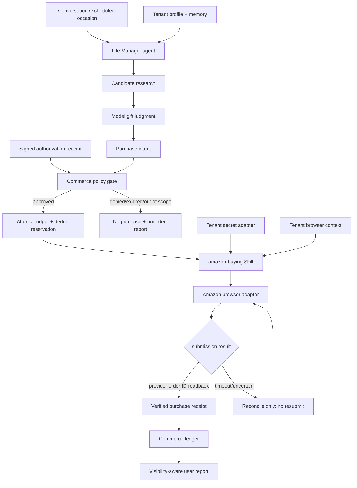
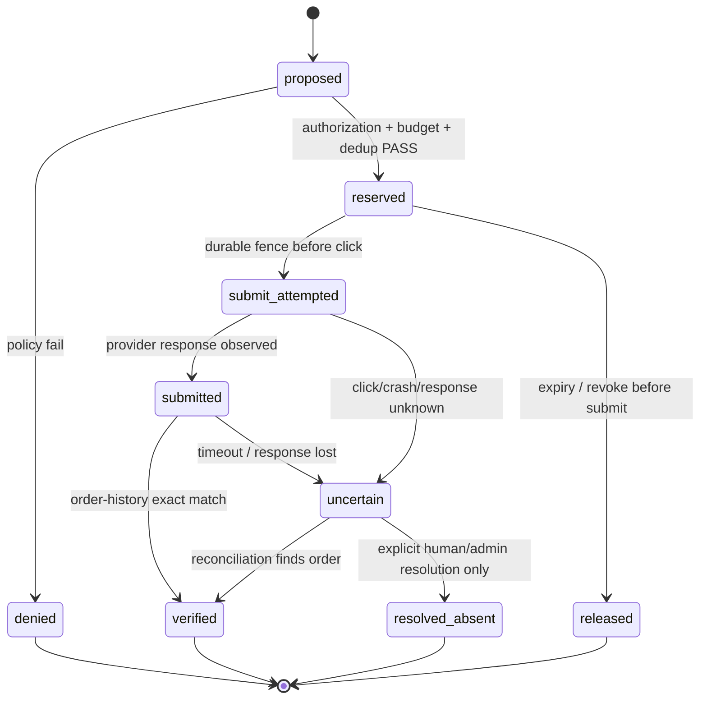

# Life Manager OSS Amazon buying / occasion gift 設計

## 0. 決定

Life Manager は、特定人物の誕生日や予算を埋め込んだ Amazon bot を作らない。
公開製品は次の二層に分ける。

1. `amazon-buying` — 任意 tenant について、署名済みの有効な支出authorization receiptに基づき、Amazon で商品を調査・購入・照合する再利用可能な Skill。単発の明示依頼もauthorization receipt発行の根拠にはなるが、未署名の依頼だけでは購入しない。
2. `occasion-gift` — 誕生日、記念日、季節行事などを tenant profile から読み、贈り物を選ぶ agent loop。購入手段の一つとして `amazon-buying` を使う。

商品選択、相手に合うか、サプライズとして価値があるかは model の判断とする。金額計算、authorization、予算予約、重複防止、secret 隔離、注文照合は deterministic gate とする。

公開 tree に個人名、メール、誕生日、住所、体格、購入履歴、予算、Amazon account、決済情報、TOTP secret を置かない。すべて tenant-scoped private input とする。

## 1. 成果

### 1.1 ユーザー成果

- ユーザーは通常の会話で「安い柔術用品を買って」のように依頼できる。
- ユーザーは、用途、期間、上限、配送先、除外カテゴリを限定した継続 authorization を発行できる。
- 誕生日プレゼントでは、商品名を本人に事前表示しない `surprise` visibility を選べる。
- 有効な authorization の範囲内では、ログイン、TOTP、商品選択、checkout、注文照合まで human 0 で完了できる。
- authorization がない、失効した、上限を超える、注文結果が不明、追加本人確認が必要、適切な商品がない場合は購入しない。

### 1.2 OSS成果

- fresh clone から local と cloud の両方で同じ Skill、agent contract、effect fence、receipt vocabulary を使う。
- provider、tenant、account、recipient、payment、browser session、secret、ledger を交差させない。
- 各production tenantは同じ公開contractを使い、コード上の特別分岐を持たない。
- Amazon 以外の marketplace を追加するときも、agent と effect kernel を複製せず provider adapter を追加する。

## 2. 非目標

- Amazon の非公開 API や署名方式をリバースエンジニアリングしない。
- CAPTCHA、3DS、account recovery、本人確認書類の提出を突破したと報告しない。
- card number、CVV、有効期限、TOTP secret、cookie、OTP を model context、Git、DB row、event、log、Telegramへ渡さない。
- 商品名の keyword list や固定カテゴリ表だけで「良いプレゼント」を決めない。
- agent が自分の authorization、予算、recipient、payment ref、expiry を作成・拡張・更新しない。
- checkout process の成功を注文成功とみなさない。provider の注文履歴 readback だけを外部効果の完了根拠にする。

## 3. 原則

### 3.1 公開既定

```yaml
commerce:
  enabled: false
  live_purchase_enabled: false
  per_purchase_cap_minor: 0
  rolling_period_cap_minor: 0
  saved_payment_method_ref: null
  authorization_ref: null
```

installer が account session や credentials を見つけても、この既定を自動で live にしない。認証可能性は支出権限ではない。

### 3.2 判断と強制の分離

| model が判断する | deterministic code が強制する |
|---|---|
| 何を贈るか | tenant / provider / account / recipient scope |
| 候補をどう検索するか | currency minor unit と税込総額 |
| 趣味・最近の出来事との関連性 | per-purchase / rolling-period cap |
| 品質、レビュー、到着日のtrade-off | authorization expiry / revoke |
| サプライズとしての新規性 | yearly / occasion dedup key |
| 候補を見送る理由 | intent reservation / uncertain reconciliation |

固定 regex、商品 keyword allowlist、ユーザー固有条件分岐を判断器にしない。model は profile、memory、候補、価格、レビュー、配送情報を読み、自然言語promptと少数のcanonical examplesに基づいて選ぶ。

deterministic gate は model の推薦を信用して支出しない。すべての monetary effect は gate を通し、範囲外なら fail closed する。

## 4. 全体architecture



### 4.1 境界

- `occasion-gift` owns: occasion検知、候補調査、recipientに合う商品の判断、surprise visibility。
- `amazon-buying` owns: Amazon内の調査、variant選択、cart、checkout、注文履歴readback。
- commerce effect kernel owns: authorization、budget、idempotency、intent lifecycle、receipt validation。
- browser/auth runtime owns: tenant browser context、session restore、TOTP tool、challenge handoff。
- provider adapter owns: Amazon画面の現在構造への変換。支出可否や贈り物の価値を判断しない。
- loop control plane owns: cadence、release、state path、launchd lifecycle。Skill は plist や sibling loop を操作しない。

## 5. Tenant model

### 5.1 Private profile

公開schemaは値ではなく形だけを提供する。

```json
{
  "tenant_id": "tenant_example",
  "timezone": "Asia/Tokyo",
  "people": [
    {
      "person_id": "self",
      "relationship": "self",
      "date_of_birth": "2000-01-01",
      "shipping_address_ref": "address_primary",
      "preferences_ref": "preferences_self"
    }
  ],
  "commerce": {
    "provider_account_ref": "amazon_primary",
    "default_payment_method_ref": "amazon_saved_default"
  }
}
```

実値は local では owner-only file、cloud では authenticated tenant row + secret reference に保存する。別tenantのprofileや購入履歴を推薦材料に使わない。匿名化したglobal learningも個人の購入内容を復元できる形では保存しない。

### 5.2 Occasion rule

```json
{
  "occasion_rule_id": "annual-birthday-self",
  "tenant_id": "tenant_example",
  "recipient_id": "self",
  "occasion_type": "birthday",
  "schedule": {
    "source": "recipient.date_of_birth",
    "timezone_source": "tenant.timezone",
    "lead_days": 7,
    "recurrence": "annual"
  },
  "selection": {
    "quantity_max": 1,
    "visibility": "surprise_until_delivery"
  },
  "authorization_ref": "authz_example"
}
```

誕生日の日付、金額、recipient、lead days を loop code に埋め込まない。日次wakeは全tenantのdue ruleをqueryし、該当0ならeffect 0で終了する。

## 6. Authorization contract

### 6.1 Receipt

継続購入は、ユーザーが発行した不変authorization receiptを必須とする。

```json
{
  "schema_version": 1,
  "authorization_id": "authz_example",
  "tenant_id": "tenant_example",
  "issuer_principal_id": "user_example",
  "issuer_key_id": "tenant-key-1",
  "principal": "user",
  "provider": "amazon",
  "provider_account_ref": "amazon_primary",
  "action": "purchase_physical_goods",
  "transport": "browser",
  "recipient_refs": ["self"],
  "occasion_rule_refs": ["annual-birthday-self"],
  "currency": "JPY",
  "per_purchase_cap_minor": 10000,
  "rolling_period": "P1Y",
  "rolling_period_cap_minor": 10000,
  "quantity_max": 1,
  "shipping_address_refs": ["address_primary"],
  "payment_method_refs": ["amazon_saved_default"],
  "excluded_effects": [
    "subscription",
    "membership",
    "recurring_order",
    "gift_card",
    "cash_equivalent",
    "third_party_recipient"
  ],
  "issued_at": "2000-01-01T00:00:00Z",
  "expires_at": "2001-01-01T00:00:00Z",
  "revoked_at": null,
  "evidence_hash": "sha256:synthetic",
  "signature_algorithm": "Ed25519",
  "signature": "base64url:synthetic-invalid-fixture"
}
```

`per_purchase_cap_minor`と`rolling_period_cap_minor`の両方を満たす。送料、税、割引、coupon、point利用後のprovider請求総額を同一currency minor unitで評価する。価格やcurrencyが不明なら購入不可とする。

### 6.2 発行・変更・失効

- user-authenticated surfaceだけがreceiptを発行する。
- receiptはRFC 8785 JSON Canonicalization Schemeで正規化し、`signature` fieldだけを除いた全fieldのcanonical bytesへ署名する。`tenant_id`、`issuer_principal_id`、`issuer_key_id`は署名対象に含まれる。effect kernelはtenant trust storeの検証鍵で署名、issuer権限、tenant bindingを検証し、別tenantからのreplayを拒否する。`evidence_hash`単体を真正性の根拠にしない。
- agentは候補authorizationを提案できるが、発行、増額、scope拡張、expiry延長、revoke解除を行えない。
- revokeは即時で、予約済みでも未submit intentを中止する。
- authorizationとrevoke ledgerのreadはsubmit直前に同じlinearizable transaction/snapshotで再検証する。cache済みreceiptだけではsubmitできない。
- 公開fixtureは必ずsyntheticで、live authorizationとして解釈できない値を使う。
- `surprise`は商品名の表示policyであり、authorizationやledgerを隠す権限ではない。

## 7. Authentication and secrets

### 7.1 TOTP

Amazonはpasswordに加えて認証アプリのOTPを利用できる。TOTP tool は RFC 6238 に従い、tenant vault内のsecretと信頼できる現在時刻から短命OTPを生成する。

```text
agent -> request login(provider_account_ref)
trusted auth broker -> bind tenant + provider + principal + browser session
secret adapter -> generate inside trusted boundary
trusted auth broker -> fill OTP directly into bound browser field
model / event / log <- secret 0, OTP 0
```

既存の6桁画面、スクリーンショット、期限切れOTPからTOTP secretを推定しない。初回onboardingではproviderの通常security設定で認証器を追加・再登録し、QRの`otpauth://`payloadを一度だけtrusted UIからsecret adapterへ渡す。QR画像を永続保存しない。

### 7.2 Storage adapters

| Runtime | Secret storage | Browser state |
|---|---|---|
| local OSS | documented owner-only credential adapter、directory `0700`、file `0600` | tenant + origin scoped CloakBrowser context / encrypted session snapshot |
| cloud OSS | pluggable secret-manager adapter、DBにはopaque refのみ | tenant + origin + principal scoped encrypted browser context |

secret adapterは`get_password_ref`、`fill_totp_into_bound_session`、`rotate_ref`、`revoke_ref`の最小interfaceを持つ。`fill_totp_into_bound_session`はOTP文字列を呼出元へ返さず、tenant、provider origin、principal、browser session、対象fieldが一致した時だけtrusted broker内で入力する。Skillが特定のhome path、Keychain、cloud vendor、API keyを直接選ばない。

browser/runtimeはOTP field、`otpauth://`、QR、keyboard入力値をDOM snapshot、screenshot、URL、HAR、console、traceからredactする。vault呼出権限はauth broker service identityだけに与え、agent/model、一般browser tool、event writerには与えない。

### 7.3 Challenge

- 有効sessionまたはpassword + TOTPでloginできる場合だけ自動継続する。
- CAPTCHA、3DS、passkey user presence、account recovery、本人確認が出たら`handoff_required`とする。
- challenge後の同一origin sessionを保存し、次回human 0を目指す。
- challengeを理由に別account、別payment、別recipientへ切り替えない。

## 8. Purchase intent state machine



### 8.1 Idempotency

```text
source_key = occasion(tenant_id + recipient_id + occasion_rule_id + recurrence_instance)
          | request(tenant_id + principal_id + request_id)
purchase_key = tenant_id + provider_account_ref + normalized_cart_hash + authorization_id + source_key
```

会話起点ではuser-authenticated surfaceがimmutable `request_id`を発行し、request本文hash、principal、authorizationへbindingする。replayは同じ`source_key`へ収束する。

同じ`source_key`に`verified`、active reservation、`submit_attempted`、`submitted`、`uncertain`、`resolved_absent`のいずれかがあれば新規submitしない。browserにprovider idempotency keyがない場合、effect kernelはclick前に`submit_attempted`をdurable storeへatomic commitし、commit成功後の同一workerだけに一度だけclick capabilityを渡す。crashを含めclick実行の有無が証明できなければ`uncertain`へ進み、成功または不存在を推測しない。

`uncertain`は時間経過や「注文がまだ見えない」だけでreleaseしない。注文履歴から発見すれば`verified`、発見できなければreconciliationを継続する。`resolved_absent`は本人または権限を持つ管理者がprovider証拠を確認して明示解決した時だけ作れるが、元の`source_key`は恒久的に消費済みのままとする。再購入にはuser-authenticated surfaceで新しい`request_id`と明示authorizationを発行する。agent/loopは解決権限も再購入request発行権限も持たない。

submit capability発行の直前にeffect kernelは、authorization/revoke ledgerとbrowser画面から正規化したcart SKU・variant・数量・税込送料込最終請求額・currency・recipient・配送先ref・saved payment ref・subscription/recurrence等の副作用を同一判定入力として再照合する。不一致・読取不能ならeffect 0とする。browser adapterはこの判定後にcart、address、payment、quantityを変更できず、変更検出時はcapabilityを破棄して再判定する。

### 8.2 Provider readback

verified receipt は最低限次を持つ。

```json
{
  "provider": "amazon",
  "provider_account_ref": "amazon_primary",
  "provider_order_ids": ["synthetic-order-id"],
  "tenant_id": "tenant_example",
  "authorization_id": "authz_example",
  "source_key": "request:synthetic-source-key",
  "source": {
    "type": "request",
    "request_id": "synthetic-request-id"
  },
  "line_items": [
    {
      "provider_item_id": "synthetic-item-id",
      "variant": {"size": "synthetic-size", "color": "synthetic-color"},
      "quantity": 1,
      "charged_minor": 10000
    }
  ],
  "currency": "JPY",
  "charged_total_minor": 10000,
  "recipient_ref": "self",
  "shipping_address_ref": "address_primary",
  "verified_at": "2000-01-01T00:00:00Z",
  "verification_source": "provider_order_history"
}
```

`source.type`は`request`または`occasion`で、前者は`request_id`、後者は`occasion_rule_id`と`recurrence_instance`を必須とする。`source_key`は§8.1で生成した値を保存し、receiptのline item、variant、quantity、合計とprovider order historyを照合する。

Amazonが注文を複数order IDへ分割しても、一つのpurchase intentと合計請求額に対応付ける。confirmation pageだけではverifiedにしない。

## 9. Agent contract

### 9.1 Inputs

- tenant-scoped recipient profile
- relevant private memory summary
- occasion rule
- authorization summary（secretや支払番号なし）
- remaining budget
- provider search/browser tools
- prior gift summaries and verified receipts
- current date、timezone、delivery window

### 9.2 Prompt altitude

promptは「相手にとって有用で、既購入品と重複せず、期限内に届き、authorization内の一品を選ぶ」という成果を伝える。特定人物、特定商品、固定ブランド、固定検索語を命令しない。

canonical examplesは少数だけ持つ。

- 趣味を始めた直後で基本道具が不足している → 実用的なstarter itemを選ぶ。
- 十分な根拠がなく候補がどれも低品質 → 予算を使い切らず、その年は購入しない。
- surprise対象だが安全上のhandoffが必要 → 商品名を伏せて認証だけ依頼する。
- 同一年のverified receiptがある → 再購入せず完了する。

### 9.3 Output

modelは構造化purchase proposalを返す。effect kernelが再検証する。

```json
{
  "candidate_id": "provider-scoped-id",
  "variant": {"size": "tenant-derived", "color": "model-selected"},
  "quantity": 1,
  "reason": "recipient-grounded concise rationale",
  "expected_total_minor": 9000,
  "currency": "JPY",
  "delivery_window": {"start": "2000-01-01", "end": "2000-01-02"}
}
```

## 10. Skill and loop layout

```text
life-manager/
├── skills/
│   ├── amazon-buying/
│   │   ├── SKILL.md
│   │   ├── scripts/
│   │   │   ├── amazon_browser.py
│   │   │   └── verify_order.py
│   │   └── references/
│   │       ├── browser-contract.md
│   │       └── auth-onboarding.md
│   └── occasion-gift/
│       ├── SKILL.md
│       ├── run.py
│       └── prompt.md
├── runtime/
│   ├── agent-runner/
│   ├── commerce/
│   │   ├── authorization.py
│   │   ├── budget.py
│   │   ├── intent.py
│   │   ├── receipt.py
│   │   └── tests/
│   └── loop/
│       └── entry_dispatch.py
├── config/
│   ├── loop-registry.json
│   └── commerce-policy.json
```

初回実装のeffect kernelは既存runtime boundary配下の`runtime/commerce/`が所有する。`occasion-gift`一つと`amazon-buying`一つのためにpackageを新設しない。二つ目のcommerce providerまたは二つ目の購買loopが現れ、共有が実証された時だけ`packages/commerce-effect-kernel/`へ抽出する。

### 10.1 Runtime state

```text
<state-root>/tenants/<tenant-id>/commerce/
├── authorizations/
├── intents/
├── receipts/
├── reconciliations/
└── events/

<state-root>/tenants/<tenant-id>/occasion-gift/
├── candidates/
├── decisions/
└── reports/
```

localでは`~/.local/state/life-manager/`以下、cloudではtenant-scoped durable store adapterを使う。pathだけに依存せず、全recordの`tenant_id`、全query predicate、暗号鍵namespace、browser/session bindingでも同一tenantを強制する。local browser contextもtenant + origin + principalで分離し、cross-tenant mismatchはread/write/useを行わずsecurity eventにする。release内にmutable stateを置かない。

## 11. Scheduling and ownership

`occasion-gift`は一pass実行して終了するmanaged loopとする。

- cadenceは日次でよい。日付一致をplistへ埋めず、due ruleをtenant storeからqueryする。
- lead window中に候補評価し、delivery deadlineを満たす最初の高品質proposalだけをreserveできる。
- loop declarationとlifecycleの唯一のSSOTは`config/loop-registry.json`の一rowとし、別の`loop.toml`を作らない。
- argvが必要なら既存`runtime/loop/entry_dispatch.py`を使う。
- model callは既存`runtime/agent-runner/agent_runner.py`とtask classを使う。
- localとcloudは同じbusiness passを使い、supervisor、storage、secret、browser transportだけをadapterで替える。
- Skillやloopはraw launchd、独自plist、release watcher、sibling restartを持たない。

## 12. Visibility and surprise

`visibility`は次のenumとする。

| Mode | Purchase前 | Purchase後 | Delivery後 |
|---|---|---|---|
| `transparent` | 商品・価格を表示 | order ID・商品を表示 | 通常報告 |
| `surprise_until_purchase` | 商品名を伏せる | 商品・order IDを表示 | 通常報告 |
| `surprise_until_delivery` | 商品名を伏せる | 予算内購入済みと到着予定だけ表示 | 商品・receiptを表示 |

運用者panel、audit ledger、provider order historyには完全なreceiptが残る。visibilityは本人向け通知のredactionであり、監査証拠の欠落を意味しない。商品名を伏せても金額上限違反、challenge、購入失敗、revokeは通知する。

## 13. Failure policy

| Failure | Result |
|---|---|
| authorizationなし/失効/revoked | effect 0、候補提案のみ可能 |
| price/currency/recipient/payment scope不明 | effect 0 |
| cap超過 | 安い候補をmodelが再評価。範囲内候補がなければ終了 |
| TOTP secretなし | one-time auth onboarding handoff |
| CAPTCHA/3DS/passkey/recovery | handoff_required、submit 0 |
| submit前timeout | reservation release可 |
| submit後timeout/crash | uncertain、order history reconciliationのみ。自動release・再submit禁止 |
| provider receipt不一致 | verified禁止、再submit禁止 |
| appropriate giftなし | no_purchaseを正しいterminal resultとする |
| cross-tenant mismatch | secret/browser/payment/provider effect 0、security event |

retryはread/search/navigationの再生成可能操作に限る。購入submitは一intentにつき1回。unknown effectを成功や失敗へ推測しない。

## 14. Acceptance criteria

| ID | 条件 |
|---|---|
| AB-01 | public treeの個人名、実メール、実住所、実誕生日、実account ID、実payment、実secretが0 |
| AB-02 | clean tenantのlive purchase既定がdisabled、cap 0 |
| AB-03 | path、record、query、key namespace、browser/sessionの全境界でtenant Aのprofile、secret、browser、payment、authorization、receiptをtenant Bがread/write/useできない |
| AB-04 | password + TOTP loginをfresh sessionで成功し、OTPはbound browser fieldへ非観測fillされ、secret/OTP/QR/keyboard値のmodel・log・event・DOM・screenshot・URL・HAR・trace出力0 |
| AB-05 | provider accountへのログイン成功だけではpurchase effect 0 |
| AB-06 | 有効authorizationのprovider/account/action/recipient/address/payment/occasion/currency/cap/expiryが全一致時だけreserveできる |
| AB-07 | 税・送料込みtotalがper-purchaseとrolling cap以下である |
| AB-08 | revoked/expired/unknown authorizationはsubmit 0 |
| AB-09 | occasion recurrenceとimmutable conversation requestの各source keyでsubmit attemptはat most once、verified purchaseはexactly once、replay submit 0 |
| AB-10 | click前のdurable `submit_attempted` fence後にtimeout/crashしても再submitせず、order history reconciliationでverifiedまたは`uncertain`になる。`resolved_absent`は本人/管理者の明示操作だけで、元source keyの再submitは永久に0 |
| AB-11 | provider order historyのorder ID、item/variant、total、recipient、address scopeがreceiptと一致する |
| AB-12 | Amazonが複数order IDへ分割しても一intentへexactly onceで集約する |
| AB-13 | subscription、membership、recurring order、cash equivalentは除外effectとして拒否できる |
| AB-14 | `surprise_until_delivery`で本人通知に商品名0、audit receiptには完全なprovider evidenceがある |
| AB-15 | 適切な候補なしをpurchase failureにせず、支出0のterminal resultとして記録する |
| AB-16 | local/cloudが同じcommit、agent contract、authorization schema、receipt schema、dedup keyを使う |
| AB-17 | managed loopはregistryに1行、release-relative entrypoint、external state rootを持ち、独自plist/raw launchd操作0 |
| AB-18 | official order history readbackなしに`verified`を出さない |
| AB-19 | canonical署名、issuer権限、tenant binding、submit直前のlinearizable revoke確認のどれかが失敗すればsubmit 0 |
| AB-20 | submit直前のcart、数量、最終請求額、currency、recipient、address、payment、副作用がauthorizationと全一致し、判定後に変更されればcapabilityを破棄してsubmit 0 |

## 15. Test matrix

### 15.1 Deterministic

- cap boundary: 9,999 / 10,000 / 10,001 minor units
- tax、shipping、coupon、point利用前後のprovider charge正規化
- invalid signature、wrong issuer/key/tenant、submit直前revoke、expired、wrong provider/account/recipient/address/payment/occasion/currency
- annual recurrence rollover、同一年replay、immutable conversation request replay
- reservation crash、fence commit直後crash、click直後crash、submit前timeout、submit後timeout、uncertainの自動release拒否、resolved_absent後の同一source replay submit 0
- revokeとcapability発行の競合で、revokeが先にlinearizeした場合のclick 0
- effect判定後のcart/quantity/total/address/payment mutationでcapability失効
- one intentから複数provider order ID
- secret/OTP/card/cookie redaction fixtures
- tenant A/B cross-read、cross-sign、cross-browser、cross-payment拒否

### 15.2 Agent eval

- profileに新しい趣味と必要品がある
- profile情報が薄く、安全に良い候補を選べない
- 過去giftと候補が重複する
- 安価だが低評価、良質だがdeadline後、高評価で予算内というtrade-off
- surpriseを保ったままchallenge handoffが必要
- 予算を使い切るよりno_purchaseが良い

agent evalは特定wordの一致を採点しない。候補根拠、profile grounding、authorization尊重、no-purchase判断、effect結果をrubricで評価する。

### 15.3 Provider E2E

1. read-only search + variant + cart totalをfixture accountで取得する。
2. authorization disabledでcheckout submit 0を示す。
3. bounded test authorizationで一つの低額physical itemを購入する。
4. confirmation pageではなくorder historyからorder IDを取得する。
5. 同じwakeをreplayし、新注文0を確認する。
6. secret、OTP、payment detailがbounded logs/events/tracesに0であることを確認する。

live purchase E2Eはテスト費用、recipient、item、取消/返品条件を別authorizationで明示した時だけ実行する。通常のunit/eval完了条件へ勝手に追加しない。

## 16. Implementation order

本specは新しい独立featureの内部順序だけを定め、既存spec/TODOの正本順序を変更しない。

1. `authorization`、budget reservation、intent、receiptのschemaとfocused tests。
2. tenant-scoped secret adapterと非観測TOTP fill broker。secret-free event/DOM/screenshot/trace test。
3. `amazon-buying` read-only search/cart adapter。
4. click前durable fence、order-history reconciliation、本人/管理者だけのunknown明示解決。
5. conversation起点のassisted purchaseで一件をverified。
6. `occasion-gift` agent contractとoffline eval。
7. generic occasion rule、visibility、annual dedup。
8. local managed loop rowとnatural scheduled no-op pass。
9. synthetic second tenantでisolation E2E。
10. cloud adaptersを同じcoreへ接続しlocal/cloud parityを確認。
11. 明示されたbounded authorizationでsurprise purchaseを一件verified。

各段階は前段のeffect fenceを通過してから進む。folder、mock、confirmation画面、process exit 0を購入成功の代用にしない。

## 17. Sources and adopted constraints

- [Amazon.co.jp「2段階認証について」](https://www.amazon.co.jp/gp/help/customer/display.html?nodeId=G3PWZPU52FKN7PW4): Amazonはpasswordに加え、text messageまたは認証アプリのOTPを使う。したがってTOTPはproviderの通常認証として扱い、購入authorizationとは分離する。
- [RFC 6238 — TOTP](https://www.rfc-editor.org/rfc/rfc6238.txt): TOTPはHOTPをtime valueへ拡張した短命OTPである。したがって保存対象は現在の6桁値ではなくtenant secret refである。
- [OWASP Secrets Management Cheat Sheet](https://cheatsheetseries.owasp.org/cheatsheets/Secrets_Management_Cheat_Sheet.html): secretはcentralized lifecycle、access control、rotation、auditを持ち、least privilegeで扱う。したがってprovider Skillからsecret storage実装を分離する。
- [Anthropic, Building Effective Agents](https://www.anthropic.com/engineering/building-effective-agents): agentは環境feedbackに基づいてtoolを選ぶ。したがって商品判断を固定workflowへ落とさない。
- [Anthropic, Writing Tools for Agents](https://www.anthropic.com/engineering/writing-tools-for-agents): toolはdeterministic systemとnon-deterministic agentのcontractである。したがってbrowser、TOTP、budget、receiptを明示interfaceにする。
- 既存正本: `docs/superpowers/specs/2026-08-02-connector-o1b24-event-spend-policy-design.md` の「policy内なら都度承認なし」「saved payment evidence」「unknown payment reconciliation」を再利用する。
- 既存正本: `docs/superpowers/specs/2026-08-22-life-manager-gig-economy-loop-design.md` のtenant-scoped authorization receiptと、agentがauthorizationを自己拡張しない契約を再利用する。
- 既存正本: `docs/superpowers/specs/2026-07-19-anicca-one-repo-consolidation-spec.md` のOSS-1〜OSS-7、BROWSER-AUTH-1、local/cloud parityを再利用する。
- loop lifecycle: `skills/loop-development/SKILL.md` のregistry、immutable release、external mutable state、official effect readback契約に従う。

## 18. Done definition

このdesignの実装完了は、任意のsynthetic tenantで会話購入とoccasion購入が同じ`amazon-buying`、authorization gate、browser/auth runtime、receipt verifierを使い、別tenantと混線せず、範囲内の一注文だけをprovider order historyでverifiedにし、replay注文0を示す状態とする。

特定ユーザー固有の日付・金額・住所・好みをcodeやpublic fixtureへ追加してもdoneにはならない。各tenantのprivate authorizationは、公開製品のgeneric contractが完成した後に同じonboarding surfaceから発行する一つのruntime inputとする。
