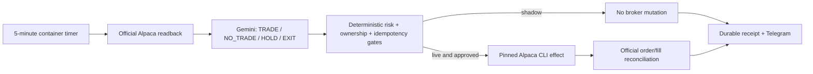

# Investment Loop self-host

This package runs the same open-source Python decision, risk, receipt, reconciliation, and Telegram core used by
Life Manager Local and Cloud. It does not guarantee profit. Deposits are principal; only verified net P&L after
fees and slippage is income.

## Requirements

- Docker with Compose
- Your own approved Alpaca live account and live API keys
- Your own Telegram bot token and destination chat ID
- A Gemini API key for the bounded model decision

## Architecture and deployment choice



Choose one live owner per Alpaca account:

- **Self-host Local/Linux:** this Docker package; you own the machine, state volume, keys, and uptime.
- **Life Manager Cloud:** the hosted Telegram product; tenant state and encrypted secrets remain isolated in its
  Cloud runtime. Do not run this container in `live` for the same account at the same time.
- **macOS repository operator:** the existing immutable-release `lm-loop`/launchd wiring is for contributors who
  run the full Life Manager repository, not required for normal self-host users.

## Install and prove the package without secrets

From the repository root:

```bash
docker build -f skills/alpaca-investment/self-host/Dockerfile -t life-manager-investment .
docker run --rm -e INVESTMENT_VERIFY_ONLY=true life-manager-investment
```

This verifies the sealed pre-live replay, deterministic risk gate, and Telegram renderer. It never contacts a
broker or Telegram.

## Connect your account safely

```bash
cd skills/alpaca-investment/self-host
cp .env.example .env
chmod 600 .env
# Fill .env with your own values, keeping INVESTMENT_MODE=shadow.
docker compose up --build -d
docker compose logs -f investment-loop
```

`shadow` reads the real Alpaca account, makes a model decision, writes durable receipts, and reports every five
minutes, but the Python submit boundary rejects every broker mutation. Confirm at least two reports and zero open
orders in Alpaca before considering live mode.

## Telegram report

Every wake reports `shadow` or `live`, account status, action/HOLD/NO_TRADE, model reason, equity, cash, daily net
P&L when known, unrealised P&L, positions, order result, remaining daily-loss budget, observation time, and the next
five-minute check. Unknown evidence is shown as unknown, never invented as zero.

Example:

```text
[Investment Loop][投資判断]
モード: shadow
ライブ口座: 有効
判断: NO_TRADE（model_no_trade）
理由: 判断根拠が不足しているため見送る。
資産: $66.72
注文: 注文なし
次回確認: 5分後
ユーザーの操作は必要ありません。
```

## Live money

Stop the container, edit `.env`, and set both:

```dotenv
INVESTMENT_MODE=live
I_UNDERSTAND_REAL_MONEY=true
```

Then run `docker compose up -d`. The model may choose HOLD or NO_TRADE; the product does not force an order. The
deterministic core allows at most `$100` allocated capital, `$10` maximum loss per new trade, and `$20` daily loss.
It permits only one owned BTC position, one effect at a time, stable client-order IDs, broker reconciliation, and
pause/kill fencing. Do not run Local and Cloud live writers for the same Alpaca account simultaneously.

The interval is fixed at exactly 300 seconds, measured start-to-start. Before each pass the scheduler freezes the
next start timestamp and passes that exact value to the Telegram reporter; other interval values fail at startup
instead of making the report inaccurate.

## Stop and recover

```bash
docker compose exec investment-loop python3 /opt/life-manager/skills/alpaca-investment/control.py --state-root /data/investment --action pause
docker compose exec investment-loop python3 /opt/life-manager/skills/alpaca-investment/control.py --state-root /data/investment --action resume
docker compose stop
docker compose start
docker compose down                 # keeps the named state volume
docker compose down --volumes       # destructive: removes receipts and recovery state
```

Use `--action kill` only for a permanent fail-closed state; unlike pause, kill cannot be resumed from that volume.

Normal restart reuses the named volume and reconciles any started order by client-order ID before another effect.
If state is lost, keep the loop stopped, inspect Alpaca open orders and positions, and restore the volume backup;
never start live against an unexplained position or order.

Secrets exist only in the ignored mode-0600 `.env` and a memory-backed `/run/investment` credential file. They are
not written into the image, repository, Telegram report, durable state volume, or receipt.

## Threat model

| Threat | Boundary |
|---|---|
| Model invents a profitable trade | Model proposes only; deterministic code validates official quotes, cash, position/order slots, expected value, and fixed loss limits. |
| Wake or container restarts after submit | Stable effect/client-order IDs and the durable volume reconcile the official broker order before another effect. |
| Two processes spend the same account | One live owner is required; control fencing and one owned-position policy reject concurrent effects. |
| Credential leakage | Image is secret-free; `.env` is ignored and mode 0600; generated broker credentials use tmpfs; reports and receipts exclude secret fields. |
| Unknown broker or P&L evidence | Entry fails closed and Telegram reports `unknown`; deposits remain principal and never become reported profit. |
| Compromised container | Non-root user, read-only root filesystem, all Linux capabilities dropped, and `no-new-privileges`; network remains necessary for Alpaca, Gemini, and Telegram. |
