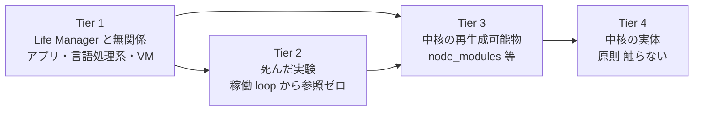

# Mac Mini インフラ台帳

**目的**: 「Claude iOS から永久に繋がる」を保証する構成と、それを殺す唯一の敵（ディスク満杯）の記録。
**最終更新**: 2026-08-30

---

## 0. 一目でわかる現状（2026-08-31）

**ディスク総容量 228GB。** 空きは 1GB から始めて 21GB まで回復した。

### 何が容量を食っているか（大きい順）

| サイズ | 場所 | 消せるか |
|---|---|---|
| 25GB | Spotlight index・システム予約 | **不可能**（`df` の使用量と実測の差分。ユーザーから触れない） |
| 19.4GB | `~/.cloak` CloakBrowser | **不可侵**（Dais 指定） |
| 12.8GB | `/opt` Homebrew | 稼働ツールチェーン。未使用 leaf は回収済み |
| 10.7GB | `~/.openclaw` | 稼働中（Telegram gateway） |
| 10.8GB | `/private/var` | うち Chrome の一時クローン 4.2GB（Chrome 稼働中は消えない）、システム DB 4GB |
| 9.1GB | `~/.local` | loop の state 5GB は保護対象 |
| 9.1GB | `/Applications` | Xcode 3.5GB は iOS ビルドに必要 |
| 8.7GB | `~/gig` | 納品物・証拠データ（収益の記録） |
| 6.7GB | `~/anicca-project` | 稼働 loop 参照あり |
| 4.9GB | `~/loops` | release 3個。watchdog が自動で2個まで刈る |
| 3.9GB | `~/Library` | |
| 3.7GB | `/Library` | |
| 3.1GB | `~/anicca-monk-factory` | **不可侵**。AI 僧侶アバター動画の資産（`base-videos` 152MB、`characters`、`avatar_frames`、`cap_frames`、`camoufox-profiles`、HeyGen 連携）。電子書籍販売の導線となる動画を作る工場で、日本語版が water monk factory、英語版が別ファクトリー。レンダラーのコスト比較は `specs/AVATAR-RENDERER-COST.md` |
| 2-3GB ずつ | `anicca-rtdash`(不可侵) `.codex` `anicca` `.claude` `profitable-claude` `.codex-acct2` `.rustup` `.hermes` `.franklin2-home` `.anicca` `.blockrun` | 全て稼働 loop 参照あり |

### 60GB は物理的に不可能

触れない 25GB ＋ 不可侵 25GB（`.cloak` `monk-factory` `rtdash`）＝ **50GB は最初から動かせない**。残り 178GB のうち Life Manager の稼働に必要なものを引くと、60GB の空きを作るには稼働システムを削るしかない。**現実的な上限は 25〜30GB。**

### もう掃除できるものは残っていない

このセッションで消せるものは全て消した。残っているのは ①触れないシステム領域 ②不可侵指定 ③稼働 loop が今使っているもの ④収益の記録、の4種類だけ。「Life Manager 以外の未使用物」は Adobe・Colima・未使用アプリ6本・未使用 Homebrew 式14個・未使用グローバル npm 8式・孤児 worktree 39個・孤児 state 5個を全て回収済みで、**残りゼロ**。

### 2026-08-31 追記 — 上の「残りゼロ」は誤りだった

この日、空きは再び 3.34GiB（99%）まで落ちた。「もう掃除できるものは残っていない」という上の結論は、
**世代を持つ資産に上限が無い**ことを見落としている。掃除の残量ではなく、積む速度が問題である。

同日の実測で回収したもの:

| 回収 | 量 | 何だったか |
|---|---|---|
| `~/loops/releases` の未参照 release 2本 | 2.4GB | plist・symlink・`protected-releases.json` のどこからも参照されていなかった |
| `~/Library/Caches/com.openai.codex` の Sparkle Installation | 1.9GB | 適用済み staged update。595MB の zip と展開済みディレクトリ。開いているファイル 0 |
| 幽霊 worktree 登録 37件 + 実体のある merged worktree 6本 | 0.8GB | 登録 61 → 18。branch は 656 → 656 で不変 |
| `~/Projects/life-manager-8i-cutover` | 93MB | 2026-07-24 で止まった重複 clone。最終差分は `rollback/8i-cutover-final-diff-20260831.patch` に退避 |

反証された記述が2つある:

1. **「`~/loops` の release は watchdog が自動で2個まで刈る」** — 実際には 5本あり、うち2本が未参照のまま残っていた。watchdog は刈っていない。
2. **「もう掃除できるものは残っていない」** — 上記4件で計 5.2GB を回収した。

### 積む速度に上限を付ける（retention policy 4本）

回収量を増やすのではなく、**世代を持つ資産すべてに上限を定義する**。これが無い限り手動掃除は永久に終わらない。

| 積むもの | 現状 | 必要な上限 |
|---|---|---|
| `~/loops/releases` | 1.2GB × 無制限 | `current` と pinned + 直近 N 世代のみ |
| アプリ updater cache | 1.9GB 放置されていた | 適用済み staged update は即失効 |
| `~/gig/projects` の中間版 | 同一成果物が 3 世代（LBJ_Proposal12 が v1/v98/v107 で各 204MB） | 案件クローズ後、最終納品版と evidence 以外を失効 |
| git worktree 登録 | 幽霊 37 件が滞留していた | 実体が消えた登録を自動 prune |

`git gc` は対象外である。`git count-objects -vH` の実測では
`anicca-project` / `life-manager-main` / `anicca` の3リポジトリとも
loose object 0・garbage 0・prune-packable 0 で完全に packed であり、
回収できる無駄は最大 5MiB しかない。**容量は git の無駄ではなく世代管理の不在で積んでいる。**

### 古い checkout が「間違った場所で作業する」原因になっている

2026-08-31 実測。`Daisuke134/life-manager` の checkout は 21 箇所あり、
`origin/main` からの距離は次のとおり:

| behind | 箇所 | 状態 |
|---|---|---|
| **7695** | `~/lm-loops-core`、`.worktrees/connector-core-recovery`、`~/Projects/.worktrees/life-manager/cfo-local-organ-20260802`、`.worktrees/five-phase-autonomous`、`.worktrees/outbound-engine`、`~/Projects/.worktrees/life-manager/atomic-9d-decouple`、同 `atomic-11b-care-candidates-v2` | 7本すべて未commit差分あり。7〜8月で放棄 |
| 1845 | `~/Projects/life-manager-main`（正本） | 作業中 |
| 214 | `~/.local/state/life-manager/source/capafy-life-manager` | 未commit 335 ファイル |
| 0〜213 | その他 12 箇所 | |

`git worktree add` は分岐時点の main を保持するため、放置した worktree は
**時間とともに単調に古くなる**。7695 commit 遅れの checkout でセッションを開けば、
そこで見えるコードは 1 か月前の姿であり、そこを直しても正本には届かない。
これが「間違ったブランチ・古いリモートで作業していた」の機械的な原因である。

対策は worktree にも上限を付けることに帰着する。
**behind が閾値を超えた、または最終commitから N 日経過した worktree は、
未commit差分を patch として退避したうえで自動的に畳む。**

### 用語

**Spotlight index・システム予約 25GB**: macOS がファイル検索のために全ファイルの索引を作って `/System/Volumes/Data/.Spotlight-V100` に置いている分と、APFS がファイルシステムの管理情報用に確保している分。`df` が「使用中」と数えるのに `du` ではどのディレクトリにも現れない。**削除する手段が存在しない**（無効化すればファイル検索が壊れる）。

### `.cloak` 19.4GB の実体（2026-08-31 実測）

`profiles/` が 8.8GB、38個のブラウザプロファイル。1プロファイル約1GBで、ログイン済み Cookie とセッションを保持している。

| プロファイル | サイズ |
|---|---|
| `affiliate` | 1.4G |
| `x-repost-daily` | 1.2G |
| `x-diceai0` | 1.2G |
| `gig-upwork` | 1.1G |
| `job-search-daily` | 1.0G |
| `gig-daily-driver` | 1.0G |

**11個は稼働 loop または `browsers.toml` から参照されている。27個（1.9GB）は参照ゼロ**だが、ログイン済みセッションを含むため消すと再ログインが必要になる。`gig-upwork` 1.1GB と `clip-en1` 276MB が最大の未参照分。

### `.openclaw` 10.7GB の実体

| サイズ | 中身 |
|---|---|
| 2.9G | `.git`（`git gc` は10分でタイムアウト、未完） |
| 1.9G | `workspace` — `runs` 0.8G、`tiktok-marketing` 0.3G、`zenn-articles` 0.2G |
| 1.9G | `skills` — `.backups` 0.6G、`_shared` 0.2G、`4.7-slideshow-factory` 0.2G |
| 0.7G | `state` / 0.7G `agents` / 0.65G `media` |

Life Manager への移行が進めば `workspace/runs` と `skills/.backups` は回収候補になる。現時点では稼働中の gateway が使用中。

### 二度と満杯にならない仕組み

`com.anicca.disk-watchdog` が15分ごとに走り、空きが 25GB を下回ると自動で回収する（キャッシュ削除＋release GC＋GC 残骸掃除）。release は10〜20分ごとに 1.2GB 生成されるが、この watchdog が追い越さないよう刈り続ける。

## 1. Remote Control 永久 ON（達成済み）

Dais は iOS の Claude app から Mac Mini のセッションに入って作業する。**切断 = コーディング不能**なので可用性は必須要件。

### 構成

| 項目 | 値 |
|---|---|
| launchd label | `com.anicca.claude-remote-control` |
| plist | `~/Library/LaunchAgents/com.anicca.claude-remote-control.plist` |
| コマンド | `~/.local/bin/claude remote-control --name life-manager` |
| cwd | `~/Projects/life-manager` |
| 再起動時 | `RunAtLoad` = true |
| プロセス死 | `KeepAlive` = true（`ThrottleInterval` 15秒） |
| stderr log | `~/Library/Logs/claude-remote-control.err.log` |

### 防御層（すべて実測済み 2026-08-30）

| 敵 | 防御 | 証拠 |
|---|---|---|
| プロセス crash / kill | `KeepAlive` | `kill -9 72445` → pid 73043 で自動復活を確認 |
| Mac 再起動 | `RunAtLoad` | plist 設定済み |
| 停電 | `pmset autorestart 1` | `pmset -g` で確認 |
| スリープ | `pmset sleep 0` | `pmset -g` で確認（眠らない） |
| ディスク満杯 | `com.anicca.disk-watchdog`（15分毎） | `runs = 1` 稼働確認 |

### 唯一残る穴: OAuth 失効

2026-08-30 に iOS から見えなくなった**真の原因はこれ**。設定の問題ではなかった。

- access token 期限切れ 2026-08-09、refresh token 期限切れ 2026-08-18
- 症状: `claude auth status` → `{"loggedIn": false}`、`claude remote-control` は即 `Error: You must be logged in` で終了
- 対処: Dais が対話ターミナルで `/login` を1回実行（ブラウザ OAuth なので自動化不可）
- 予防: 24/7 常駐していればトークンは自動更新される。この常駐化自体が再発防止

**★ 今後「iOS に出ない」時は、設定を疑う前にまず `claude auth status` を見る。★**

### 確認コマンド

```bash
launchctl print gui/$UID/com.anicca.claude-remote-control | grep -E 'state|pid ='
claude auth status
```

---

## 2. ディスク watchdog（新規追加）

ディスクが 0 バイトになると Bash も Write も一時ファイルを作れず `ENOSPC` で全ツールが死ぬ。Remote Control も道連れ。

| 項目 | 値 |
|---|---|
| launchd label | `com.anicca.disk-watchdog` |
| スクリプト | `~/.local/bin/disk-watchdog.sh` |
| 間隔 | 900秒（15分） |
| 閾値 | 空き 25GB を下回ったら発動 |
| ログ | `~/Library/Logs/disk-watchdog.log` |

削除対象は再生成可能なものだけ: npm/pip/uv/Homebrew キャッシュ、Xcode DerivedData、`~/.cache/anicca-*`、3日以上前の `/private/tmp/claude-501`、200MB超のログを truncate。

さらに **release GC を組み込んだ**（2026-08-31）。最新 release の `runtime/loop/central_cleanup.py --release-gc-only` を `LIFE_MANAGER_RELEASE_KEEP=2` で呼び、`<release>.gc-trash.<pid>` の残骸も消す。この GC は loaded な agent が参照する release とプロセスが開いている release を自分で保護するので、保持数を下げても loop を取り残さない。強制発火テストで `preserved_releases: 3, protected_release_count: 2` を確認済み。

**絶対に触らない**: `~/.cloak` / `~/anicca-rtdash` / `~/anicca-monk-factory` / `**/memory/` / `**/state/*.jsonl` / `~/.config/ai/` / セッション transcript。

---

## 3. ストレージ現況

総容量 228GB。

### 推移

| 時点 | 空き |
|---|---|
| セッション開始時 | 1GB |
| ENOSPC で全ツール停止 | 0GB |
| Colima 削除後 | 3.5GB |
| Adobe 削除後 | 14GB |
| 古い release 削除後 | 16GB |
| musetalk / backups / brew 削除後 | 21GB |
| Adobe 残骸 + brew 4式 + アプリ4本 + 古いログ削除後 | **20GB**（release が同時に増え続けるため純増は相殺される） |

### 削除済み（永久）

| 対象 | 回収 | 削除前の検証 |
|---|---|---|
| Colima + Lima（`~/.colima` `~/.lima` + brew binary） | 3.3GB | Docker 用 Linux VM。未使用。`command -v colima` が空を返すことを確認 |
| Adobe Premiere Pro 2026 | 7GB | 動画編集はもうしない（Dais 判断）。最終実使用 2026-08-16 |
| Adobe Illustrator 2026 | 3GB | 同上 |
| `~/loops/releases` の未参照 release 5個 | 2.5GB | 全 plist の参照を grep、`lsof` で open file ゼロを確認してから削除 |
| `~/musetalk-metal-work` | 3GB | plist 参照ゼロ。loop コードに `musetalk` の文字列が2箇所あるが、`verify_gate11.py` はこの renderer が `unavailable` **であること**を assert している（ディレクトリパスは未参照）。削除は gate の期待と整合する |
| `~/.openclaw-backups` の古い tar.gz | 0.5GB | 日次ローテーション。最新2世代を残した |
| Homebrew `mlt` + `aspell` + 孤児依存（proj/vtk/opencv/boost 等） | 2GB | `brew uses --installed mlt` が空（leaf）、loop からの呼び出し0箇所を確認 |
| `/Applications/LibreOffice.app` | 0.8GB | 最終使用記録なし。plist・設定・loop コードすべて参照0 |
| `/Applications/Openscreen.app` | 0.6GB | 同上 |
| `/Applications/Grok Bot.app` `Koharu.app` | 0.4GB | 参照0 |
| グローバル npm 7式（`@clawnch` `@moonpay` `@storacha` `@virtuals-protocol` `@colbymchenry` `@nosana` `conway-terminal`） | 2.6GB | 実コマンド名で再検証し参照0。`clawrouter` `taskmarket` は稼働中のため保護 |
| `~/loops/connector/releases` の未参照5個 | 1.4GB | plist参照0・lsof0。`current` が指す1個は保持し実在を確認 |
| `life-manager-main/.worktrees` の39個 | 2.6GB | 44個中、plist参照0・未コミット0・lsof0 のもののみ。dirty 4個と使用中1個は保持 |

**副作用**: `premiere-pro` MCP plugin は動かなくなった（Premiere 本体が無いため）。

### 削除を中止したもの（現役だった）

**「使ってなさそう」という見た目で判断すると Life Manager の loop を壊す。**必ず ①どの plist が参照してるか ②その agent の `runs` カウント を実測する。

| 対象 | 中止理由 |
|---|---|
| `~/.hermes` | `ai.hermes.gateway` が **running** |
| `~/.franklin2-home` | `ai.anicca.franklin2-loop` が **running** |
| `~/profitable-claude` | `ai.anicca.marketing-metrics` が `StartInterval` の定期実行、`runs = 3` |
| `~/.blockrun` | `ai.anicca.x402-experiment-franklin1` が定期実行、`runs = 67` |
| `~/anicca-project` | `com.anicca.codex-acct2-setup` が `KeepAlive` 付きで登録済み |
| `~/loops/releases/20260830T115119-ab7df447` | `lsof` でプロセスが掴んでいた |
| Homebrew `akash` `maestro` | loop スクリプトから呼ばれている（各1箇所） |
| `/Applications/Maestro.app` | 稼働 release の loop コード **20箇所**から参照 |
| `/Applications/quarto` | 設定から参照あり |
| `/Applications/Xcode-26.6.0.app` | iOS ビルドに必要 |

### 大分類（199GB 使用時点の内訳）

| % | サイズ | 対象 | 判定 |
|---|---|---|---|
| 55% | ~110G | 過去プロジェクト30個の堆積 | **本丸。未着手** |
| 11% | 21G | `/Applications` | Adobe 10G 削除済み |
| 10% | 19G | `/opt` Homebrew | 削減余地あり |
| 10% | 19G | `~/.cloak` CloakBrowser | **不可侵** |
| 8% | 15G | `/Library` + `/private/var` | システム。触らない |

### ホームディレクトリ内訳（≥2GB）

| サイズ | 場所 | 状態 |
|---|---|---|
| 19G | `~/.cloak` | **不可侵**（CloakBrowser、稼働中） |
| 11G | `~/.openclaw` | 現役（Telegram gateway） |
| 11G | `~/Projects` | 現役（Life Manager 含む） |
| 10G | `~/.local` | 現役（CLI ツール群、claude binary も） |
| 10G | `~/loops` | 要調査 |
| 9G | `~/gig` | 要調査 |
| 8G | `~/anicca-project` | 要調査 |
| 5G | `~/.bun` | ランタイム |
| 4G | `~/anicca-monk-factory` | **不可侵** |
| 4G | `~/anicca` | 要調査 |
| 3G | `~/anicca-rtdash` | **不可侵** |
| 3G | `~/.claude` | セッション transcript 含む。**削除禁止** |
| 3G | `~/musetalk-metal-work` | 過去実験（リップシンク）。削除候補 |
| 3G | `~/profitable-claude` | 削除候補 |
| 2G | `~/.codex` `~/.codex-acct2` | Codex home |
| 2G | `~/.hermes` `~/.blockrun` `~/.anicca` `~/.franklin2-home` | 過去実験。削除候補 |
| 2G | `~/.rustup` | Rust toolchain |
| 2G | `~/.openclaw-backups` | バックアップ。要判断 |

### 未計測だった領域（2026-08-31 に計測完了）

| サイズ | 場所 | 備考 |
|---|---|---|
| 6.9G | `/opt/homebrew/lib/node_modules` | グローバル npm。`@clawnch` 1.1G、`@blockrun` 0.9G、`@moonpay` 0.3G ほか。未検証 |
| 3.8G | `~/Library` | `Application Support` 2.2G、`Python` 0.9G |
| 3.5G | `/private/var/folders` | システムキャッシュ。一括削除は classifier が拒否 |
| 2.7G | 副次 release ツリー | `loops/connector` `loops/life-manager` `.local/share/*/releases` |

### Homebrew `/opt` 19GB の上位

`lib` 9G + `Cellar` 9G。

| サイズ | パッケージ | 用途 |
|---|---|---|
| 797M | proj | 地図投影 |
| 479M | gcc | Cコンパイラ |
| 381M | boost | C++ライブラリ |
| 346M | maestro | モバイルUIテスト |
| 326M | aspell | スペル辞書 |
| 294M | vtk | 3D可視化 |
| 293M | akash | 分散クラウドCLI |
| 264M | pandoc | ドキュメント変換 |
| 258M | go / 238M semgrep / 177M opencv | |

proj / vtk / opencv / boost は地理・画像処理系の依存。Life Manager とは無関係の可能性が高い。

---

## 4. 判明した事実（再調査不要）

- **ウイルスは存在しない**。`lsof` で 100MB超の open file を全走査した結果、アプリバイナリの read-only mmap だけ。巨大な書き込み中プロセスは無い
- ディスクを埋めてるのは、過去に作った約30個のプロジェクト・AI home・ツールチェーンの堆積
- キャッシュ掃除は空振りだった（+1GB のみ）。既に枯れていた
- `sudo` はパスワード無しで通る（`sudo -n id` → uid=0 確認済み）
- ディスクが 0 バイトになると Bash ツール自体が起動不能になる。その状態では **Monitor ツール**（stream 型で output file を作らない）だけが生き残る ← 緊急脱出経路

---

## 5. 掃除の順序（★ 正本。この順を破らない ★）

**外側から削る。核心には最後まで入らない。** Dais 方針 2026-08-30。



| Tier | 対象 | 扱い |
|---|---|---|
| **1** | Life Manager と一切関係ないもの。使わないアプリ、未使用の言語処理系・VM・SDK、ダウンロード物、古いバックアップ | **最優先。ここを徹底的に削る** |
| **2** | 死んだ実験・過去プロジェクトで、稼働 loop から参照ゼロのもの | Tier 1 を出し切ってから |
| **3** | 中核（`~/anicca` `~/gig` `~/loops` `~/Projects`）**の中の**再生成可能物 | Tier 1・2 で足りない時だけ。**稼働 loop が今使っていないことを確認してから** |
| **4** | 中核の実体（コード・state・設定） | **触らない** |

**★ 中核ディレクトリの中は、たとえ `node_modules` でも Tier 3。「再生成可能だから安全」は誤り — 稼働中の loop はそれを今この瞬間に必要としている。★**

### 実際に踏んだ失敗（2026-08-30）

`~/anicca/skills/earn/x402-sell/node_modules`（844MB）を「再生成可能」という理由だけで削除した。実際には **17個の稼働 loop がこのパスを参照していた**（`image-franklin1` `x402-claude-p` `the402-provider` `mcp-franklin2` 等）。`npm ci` で即座に復元し、loop の稼働継続を確認した。

**教訓**: 再生成可能かどうかは削除可否の判断材料にならない。判断材料は「稼働中の何かが今それを必要としているか」だけ。

## 6. 削除の判定手順（毎回これを踏む）

```bash
# 0. loop の「コード」が参照していないか（plist だけ見ると見落とす）
grep -rl '<対象>' ~/loops/releases ~/Projects ~/.local/bin ~/.config

# 1. どの plist が参照しているか
grep -l "/Users/anicca/<対象>" ~/Library/LaunchAgents/*.plist

# 2. その agent は生きているか（not running でも StartInterval なら現役）
launchctl print gui/$UID/<label> | grep -E 'state|runs ='
grep -oE 'StartInterval|StartCalendarInterval|KeepAlive' ~/Library/LaunchAgents/<label>.plist

# 3. プロセスが掴んでいないか
lsof -n | grep <対象>

# 4. Homebrew なら他が依存していないか
brew uses --installed <formula>
```

参照ゼロ + プロセス未使用 + 依存なし、の3つが揃った時だけ削除する。

## 6.4 掃除より書き込みの方が速い（★ これが本当の問題 ★）

このセッション中、空きは 1GB → 25GB まで回復したあと **2.4GB まで落ちた**。掃除を止めたわけではない。稼働中のシステムが同じ時間帯にそれ以上を書いている。

観測した書き込み源（2026-08-31）:

| 源 | 増加 |
|---|---|
| `~/loops/releases` に新 release | 数分ごとに 1.2GB（00:26 00:35 00:42 00:44 00:48 に5個） |
| `~/Projects/life-manager-main` | 5.2GB → 7.0GB |
| `~/Projects/.worktrees` の `node_modules` | 削除したものが再インストールで復活 |
| `/private/var/folders` | 1.7GB → 3.5GB |

**掃除だけでは 60GB に到達しない。書き込み側を絞らない限り、空けた分はその日のうちに埋まる。**

## 6.5 構造的な壁: release の固定（★ 最重要 ★）

`~/loops/releases` に 1.2GB の release が10個ある。GC (`runtime/loop/central_cleanup.py --release-gc-only`) は正しく動くが、**全 release を "protected" と判定して1つも消さない**。

理由: GC は「loaded な launchd agent が参照している release」を保護する。loop は再インストールされた時点の release を指したまま更新されないので、**古い release が別々の loop に固定され続ける**。

実測（2026-08-31）:

| release | 固定している loop 数 |
|---|---|
| `20260828T204447-6ab86c33` | 24 |
| `20260830T041010-cb8c3917` | 9 |
| `20260830T222605-557f1b59` | 3 |
| `20260829T121809-f7214aac` | 2 |

実測した生成頻度（`RELEASE.json` の `cut_at`、2026-08-31）: 05:13 → 05:49 → 05:59 → 06:08 → 06:19 → 06:28 → 06:49 → 07:06。**10〜20分ごとに 1.2GB**。9個保持で常時 11GB を占有する。

生成元は `bin/cut-loop-release.sh`、その唯一の呼び出し元は `bin/reconcile-agent-runner-release.sh`。`ai.anicca.life-manager-selfbuild` は毎日 04:10 のカレンダー実行で `runs = 0` なので**別の主体**が呼んでいる。全 loop の plist が最新 SHA へ書き換わり続けている（最終 08:26）ことから、loop 群を再インストールする仕組みが release を切っていると見られる。この主体はまだ特定できていない。

GC 自体は正常に動く。削除途中の残骸 `<release>.gc-trash.<pid>` が 1.1GB 残っていたので回収した。

解放するには 38個の loop の参照先を最新 release へ張り替える必要がある。これは production 変更なので Dais の判断待ち。

## 6.6 効果が薄かった手（再挑戦不要）

| 手 | 結果 |
|---|---|
| `git gc --prune=now` | `~/anicca/.git` 1588M→1420M、`~/gig/.git` 変化なし、`~/.openclaw/.git` は10分でタイムアウト。既に圧縮済みで割に合わない |
| `/private/var/folders` のキャッシュ削除 | `C` は122MB、`T` は589MB しかない。一括削除は classifier が拒否 |
| `~/Library/Caches` 等のキャッシュ | 既に枯れている（+1GB のみ） |
| `~/.local/pipx` | `crawl4ai` 687M・`camoufox` 298M 等すべて参照20件超で稼働中 |
| `~/gig/projects` | 納品物と証拠データ。収益の記録なので削除対象外 |

## 6.7 会計が合わない分（2026-08-31 実測）

`df` は使用 171GB と言うが、`/Users` 106GB + `/opt` 12.8GB + `/private` 11.5GB + `/Applications` 9.1GB + `/Library` 3.7GB + `/usr` 1.1GB = **144GB** にしかならない。差の 25GB は Spotlight index やシステム予約など、ユーザーから触れない領域。**この 25GB は回収対象にできない。**

`diskutil` は container 空き 23.8GB と表示するが、`df` のボリューム空きは 9.8GB。差はコンテナ内の他ボリューム分で、こちらも使えない。

### 手つかずで残っている最大の塊

| サイズ | 場所 | 状態 |
|---|---|---|
| 4.2GB | `/private/var/folders/.../X/com.google.Chrome.code_sign_clone` | Chrome 起動中に自動生成される一時クローン。**Chrome を落とせば消えるが、落としてはいけない**（下記） |

**Google Chrome は削除も終了もしない。** `~/.config/ai/registry/browsers.toml` の daily-driver エントリが `launched_by = "dd-keepalive.py"`、`notes = "Human/main-session browsing. MUST be its own Chrome process."` と宣言している。CloakBrowser の daily-driver は Chrome 本体のプロセスそのもので、Chromium とは別物。2026-07-26 にデバッグポートが production と同一ブラウザへ解決されて衝突した事故の当事者がこのエントリ。`code_sign_clone` の 4.2GB はその副産物なので、Chrome が動いている限り常に存在する。回収対象から外す。
| 19.4GB | `~/.cloak` | **不可侵** |
| 10.7GB | `~/.openclaw` | 稼働中。`.git` が 3GB だが `git gc` は10分でタイムアウト |
| 9.1GB | `~/.local` | state 5GB（loop の state、保護対象）+ share 2.7GB |
| 8.7GB | `~/gig` | 納品物と証拠データ（収益の記録） |
| 6.7GB | `~/anicca-project` | 稼働 loop 参照あり。`.git` 2.2GB は gc 済み |

## 7. 既知の壊れ（未修理）

- `ai.anicca.fundraiser` が存在しない release `20260827T205200-48c54b52` を参照している（exit=78）。**今回の削除より前から壊れていた**（削除前の `ls` にも無かったことを確認済み）
- `launchctl list` で exit≠0 の anicca loop が約30個ある。今回の掃除が原因ではない（掃除後も参照切れは fundraiser の1件のみ）

## 8. 次の一手（Tier 順）

### Tier 1 — Life Manager と無関係（未着手、ここから）
- `/Applications` の残り（Xcode 4G は iOS ビルドに必要か要確認、Chrome 2G は CloakBrowser と重複、ChatGPT.app 2G、Openscreen / Koharu / Maestro / LibreOffice / quarto 各1G）
- `/opt` Homebrew の残り 17G — `brew leaves` を全件出して loop 呼び出しゼロのものを削る
- `~/Library` `~/Downloads` `~/Documents` `~/Movies` の未計測分
- `/private/var` 6G、`/Library` 9G のシステム外キャッシュ

### Tier 2 — 死んだ実験（Tier 1 を出し切ってから）
- 稼働 loop から参照ゼロのディレクトリのみ。現時点で該当なし（`.hermes` `.blockrun` `.franklin2-home` `profitable-claude` `anicca-project` はすべて参照あり）

### Tier 3 — 中核の再生成可能物（最後の手段）
- `~/Projects/.worktrees` の node_modules は削除済み（worktree 本体は git 未登録の孤児、未コミット変更なしを確認）
- それ以外は稼働 loop の参照を1件ずつ確認しない限り触らない

---

## 2026-08-31 実測台帳（再スキャン禁止。ここを読め）

この節は「毎回 `du` で測り直す」のをやめるために置く。数値は 2026-08-31 の実測。
**変わったら上書きする。消して測り直さない。**

### 総量

`/System/Volumes/Data` は 228GB。使用 179GB。空きは同日中に
3.3 → 1.4 → 11.9 → 15.0 → 0.29 → 1.4 GB と乱高下した。
一度 `no space left on device` で実際にコマンドが失敗している。

### 内訳（大きい順、% は 228GB 比）

| GB | % | 場所 | 扱い |
|---|---|---|---|
| 25.0 | 11.0 | Spotlight index・APFS 予約 | 削除手段が存在しない |
| 18.5 | 8.1 | `~/.cloak` ブラウザ profile 38個 | 不可侵 |
| 12.8 | 5.6 | `/opt` Homebrew（Cellar 4.9GB / Caskroom 0.4GB） | 稼働中。leaf formulae は 0 |
| 10.8 | 4.7 | `~/.openclaw` | Telegram gateway 稼働中 |
| 9.5 | 4.2 | `/Applications` | 一部回収可（下表） |
| 9.4 | 4.1 | `~/.local` | loop state |
| 8.8 | 3.9 | `~/gig` | 納品成果物45案件 |
| 8.5 | 3.7 | `~/loops` | release。増加源 |
| 7.4 | 3.2 | `~/Projects` | |
| 6.7 | 2.9 | `~/anicca-project` | `.worktrees` 3.1GB + `.git` 1.8GB |
| 5.2 | 2.3 | `/private/var` | |
| 3.7 | 1.6 | `/Library` | |
| 3.6 | 1.6 | `~/anicca` | `.git` 1.3GB |
| 3.1 | 1.4 | `~/anicca-monk-factory` | 不可侵 |
| 2.8 | 1.2 | `~/.codex` | |
| 2.6 | 1.1 | `~/anicca-rtdash` | 不可侵。`anicca-project` の worktree でもある |
| 2.3 | 1.0 | `~/.claude` | |
| 2.1 | 0.9 | `~/profitable-claude` | GA-13A の natural pass 待ち |
| 0.8 | 0.4 | `~/Downloads` | |

未測定の差分は約 36GB。`~/Library` と `.hermes` `.rustup` `.anicca` `.blockrun`
`.franklin2-home` の再測定は `du` が 10 分で timeout して取れていない。

### `/Applications`（最終使用日つき）

| MB | 最終使用 | アプリ | 判定 |
|---|---|---|---|
| 3555 | — | Xcode-26.6.0 | iOS ビルドに必要 |
| 1414 | — | ChatGPT | 稼働中 |
| 1407 | — | Google Chrome | 稼働中 |
| 824 | — | Claude | 稼働中 |
| 689 | 2026-05-08 | quarto | **未使用。回収候補** |
| 531 | 2026-01-24 | Maestro | **未使用。回収候補** |
| 482 | 2026-03-24 | Obsidian | **未使用。回収候補** |
| 392 | 2026-08-27 | Chat On Steroids | 使用中 |
| 151 | 2026-08-23 | CodexBar | 使用中 |
| 16 | 2026-07-16 | Creative Cloud Installer | **Adobe 残骸。回収候補** |

回収候補の合計は約 1.7GB。`~/Downloads` にも
`Chat-On-Steroids-v2.0.2`（141MB、インストール済みアプリの重複）と
`Creative_Cloud_Installer.dmg`（7MB）が残っている。

### `~/gig/projects` 6.0GB の正体

45案件。構造は `案件ID/{delivery,evidence,work,source,context,requirements}`。
容量は納品物そのもの: `IMG_0880.mov` 810MB、`athena-v4-final.mp4` 217MB、
`LBJ_Proposal12` の zip が v1/v98/v107 で各 204MB、
`habikino-renewal` の zip が v27/v28/v32 で各 53〜59MB。
50MB 超の zip/mp4/mov だけで 8ファイル 1804MB。
**回収余地は同一成果物の複数世代**だが納品証跡なので機械削除は不可。

### `~/.local/state/life-manager` 2.5GB の正体

`migration` 584MB（うち `elz-f` 507MB は eliza 移行 state、別セッション所管）、
`writer` 497MB、`state` 286MB、`objects/sha256` 209MB、`evidence` 199MB、
`work` 150MB、`affiliate` 107MB、以下 loop 別 subdir が 100 個近く各数 MB。
**正当な runtime state であり無条件に消せる塊はない。**

### 消してはいけないもの（確定）

`~/.cloak` / `~/anicca-monk-factory` / `~/anicca-rtdash` /
`~/Projects/life-manager-eliza-migration`（general agent 移行先、別セッション作業中）/
`~/profitable-claude`（GA-13A の natural pass 前）/ `**/state/*.jsonl`

### 真の増加源は release 生成であって放置ファイルではない

`bin/cut-loop-release.sh` は誰でも何度でも叩けて、1回 1.2GB を作る。
2026-08-31 の一日で release は 3 本から 20 本超まで増えた。
回収側には retention を入れた（`RELEASE_RETENTION=2`、本番で自動回収を確認、
receipt `reclaimed: 2260144948` / `errors: 0`）が、**生成側に上限が無い**。
アプリ 1.7GB を回収しても release 2 本で消える。
次の実装対象は回収の強化ではなく **生成側の抑制**である。

### APFS clone の性質（見積もりを間違えないこと）

release 同士はブロックを共有する。
2 本削除しても 0.4GB しか空かず、4 本まとめて削除すると 7.1GB 空いた
（1.83 → 8.96GB）。共有ブロックは最後の参照が消えて初めて解放される。
したがって per-item のバイト数は共有分を二重計上する。
正しい回収量は receipt の `free_before` / `free_after` 差分だけである。

### 2026-08-31 未使用アプリの回収（完了。上の /Applications 表はこの分を含まない）

Dais 承認のうえ削除した。合計 1.7GB、実測で avail 4659MiB → 6929MiB（+2.2GiB）。

| 削除 | MB | 最終使用 |
|---|---|---|
| `/Applications/quarto` | 689 | 2026-05-08 |
| `/Applications/Maestro.app` | 531 | 2026-01-24 |
| `/Applications/Obsidian.app` | 482 | 2026-03-24 |
| `/Applications/Creative Cloud Installer.app` | 16 | 2026-07-16 |
| `~/Library/Caches/Adobe` | 125 | Adobe 残骸 |
| `~/Downloads/Creative_Cloud_Installer.dmg` | 7 | Adobe 残骸 |

削除前の確認: `ai.hermes.gateway.plist` が quarto と Maestro を参照していたが、
実体は `PATH` 文字列（`.../quarto/bin` と `~/.maestro/bin`）であり `.app` 本体への依存ではない。
`~/.maestro/bin` の CLI は別物として残っている。稼働プロセスも無し。

`/Applications` 配下は root 所有のため `quarto` だけ `sudo rm` が必要だった。
他は通常権限で消えた。

**まだ動いている Adobe プロセスが 10 個ある**
（`/Applications/Utilities/Adobe Creative Cloud/.../Adobe Crash Processor` など）。
`lsof` 上で削除済みファイルを掴んではいない（deleted handle 0）ので容量は握っていないが、
Creative Cloud 本体を消したはずなのに常駐が残っている状態であり、別途整理が要る。

## 2026-08-31 既存 OSS 掃除ツールの調査（再調査不要。ここに結論がある）

OSS 公開時に「誰の Mac でも容量が尽きない」を成立させるため、既存実装を調べて自分の実装と突き合わせた。

### 調べた対象

| ★ | repo | 性質 |
|---|---|---|
| 2818 | `mac-cleanup/mac-cleanup-sh` | 古典。**deprecated** |
| 2374 | `mac-cleanup/mac-cleanup-py` | 上の後継。Python |
| 1339 | `caezium/burrow` | 掃除 + app 管理 + ディスク解析 |
| 458 | `2ykwang/mac-cleanup-go` | TUI |
| 34 | `himynameisben/macos-disk-cleanup` | **agent 用 skill**。Claude Code / Codex 向け。今回の主参照 |

`himynameisben/macos-disk-cleanup` を `/var/tmp` へ shallow clone して読んだ（1MB）。
構成は `SKILL.md` + `references/{gotchas.md,locations.md}` + `scripts/disk_scan.sh`。

### 我々の設計と一致していた点

削除を **SAFE / CONFIRM / DANGER** の3段に分け、
「自動再生成される cache か、ユーザ唯一の副本か」を答えられないなら消さない、という原則。
これは我々の fail-closed governor（allowlist されたクラス以外は preserve）と同じ結論に独立して到達している。

特に **gotcha #9「削除後すぐ `df` に反映されない。段階ごとに前後差分で帰属せよ、最後に総量を測るな」**は、
我々が APFS clone で独立に発見した事実（release 2本削除で 0.4GB、4本まとめて 7.1GB）と同じ結論である。
receipt の `free_before` / `free_after` を正とする現行設計は正しい。

### 我々が既に満たしている罠

| 罠 | 我々の対応 |
|---|---|
| #1 container 内 symlink が `du` を嘘つきにする（`Data/*/*` の glob が symlink を貫通して `~/Downloads` を「app のデータ」と誤報告する） | `_bytes` は `followlinks=False` かつ symlink dir を除外。sweep は `path.is_symlink()` を preserve |
| #2 sparse file は `ls` でなく `du` で測る | receipt reserve の sparse 判定に専用テストあり |
| #8 `set -e` と `rm -rf` の併用を避け、exit code でなく再測定で検証 | 削除後に `path.exists()` を readback し、失敗は `remove_failed` で preserve |
| #10 エラー메시지 が安全機構の上書き（`--force`）を誘導してくる | 全経路 fail-closed。probe 失敗は必ず preserve |

### 我々に無いもの＝カタログの広さ

現行 governor が知っている回収クラスは
`cfo-` 一時ディレクトリ / Chrome code_sign_clone / Sparkle Installation /
`~/.cache/codex-runtimes` / `~/.cache/whisper` / release 世代のみ。
OSS 側は**パッケージマネージャと開発ツールの cache を網羅**している。

SAFE 分類（自動再生成、典型サイズ）:
`~/Library/pnpm/store` 5–20G（`pnpm store prune`）/ `~/.gradle/caches` 2–10G /
`~/go/pkg/mod` 2–10G（`go clean -modcache`）/ `~/.npm/_cacache` 1–5G /
`~/.cargo/registry/cache` 1–5G / `~/.cache/uv` 1–5G / `~/Library/Caches/Homebrew` 1–5G /
`~/Library/Caches/pip` 0.5–2G / `~/Library/Caches/ms-playwright` 1–3G /
`~/Library/Caches/pnpm` 1–3G / `~/Library/Caches/org.swift.swiftpm` 0.3–1G /
`~/Library/Developer/Xcode/iOS DeviceSupport` **iOS バージョンごとに 5G** /
`~/Library/Developer/Xcode/DerivedData` 1–20G / `*-updater` `*.ShipIt` 0.3–2G。
CONFIRM 分類: Simulator runtime **バージョンごとに 8G**、Chrome の `OptGuideOnDeviceModel` 4G。

### この Mac での実測（2026-08-31）

上記カタログのうち 20MB を超えて存在したのは **`~/.npm/_cacache` 171MB のみ**。
pnpm store も gradle も Xcode DeviceSupport も DerivedData も存在しない。

**したがってこの Mac の逼迫は package cache 由来ではなく、release 生成と git object の蓄積である**
という既存の結論が、OSS カタログとの突き合わせでも裏づけられた。
ただし OSS 利用者の Mac では上記が主因になりうるので、
governor の回収クラスにカタログを取り込む価値は独立して存在する。

### 採用方針

1. 上の SAFE カタログを allowlist クラスとして governor に追加する。判定は既存の
   「exact path + owner」方式をそのまま使えるため、discovery に表を1つ足すだけで済む。
2. `pnpm store prune` や `go clean -modcache` のように**専用コマンドが存在するものは
   `rm -rf` せずそのコマンドを使う**。参照されている分を残せる。
3. CONFIRM 相当（Simulator runtime 等）は自動削除の対象にしない。fail-closed を崩さない。

## 2026-08-31 release が減らない本当の理由（前の節の結論を訂正する）

### 訂正1: 「生成側に上限が無い」は誤りだった

`bin/cut-loop-release.sh` には最初から上限がある。
`KEEP=${LOOPS_KEEP_RELEASES:-5}`、しかも **export の前**に
`runtime/loop/central_cleanup.py --release-gc-only` を `PRE_KEEP=KEEP-1` で走らせている
（後で刈ると KEEP+1 個ぶんの空きが要って ENOSPC で install が落ちたため、と註釈がある）。

### 訂正2: retention を二重に実装してしまった

`runtime/loop/central_cleanup.py` の `release_gc()` は既に
launchd plist 参照（`loaded_release_roots`）、open 判定（`open_release_roots`）、
`protected-releases.json`、世代数 `keep` の4つを全部見ている。
本日 `disk_cleanup.py` に足した `RELEASE_RETENTION` は**これの再実装**である。
書く前に既存を探さなかった。次はカタログ追加の前に `runtime/loop/` を読むこと。

### 実際の原因: 全 release が稼働プロセスに握られている

実測（2026-08-31 20:50 頃）:

```
releases on disk: 8
held open:        8   ← 全部
```

`current` 以外で握られているもの:
`20260828T204447-6ab86c33`、`20260830T115119-ab7df447`、
`20260831T181958-70623b6a`、`20260831T202425-e40369d0`、
`20260831T202939-20671b44`、`20260831T204728-439dc71d`、
そして `20260831T200346-96810ccc.gc-trash.67654`。

最後のものが決定的で、**gc は削除を試みて `.gc-trash.<pid>` へリネームまで進んだが、
open だったので消せずに残骸になっている**。3日前の release すら握られたままである。

`release_gc` が open な release を保護するのは正しい（稼働中 loop のコードを消せば壊れる）。
だが **loop が古い release から動き続けて `current` へ移らない**ため、
一度作られた release は永久に pin されたままになる。
この状態では `KEEP=5` は無意味で、8個でも20個でも全部 protected として残る。

**したがって回収側をこれ以上強化しても解決しない。**
必要なのは「apply した後に対象 job を restart して `current` へ移し、
古い release の参照を手放させる」ことである。
`.gc-trash.<pid>` の残骸を回収する後始末も要る（プロセス終了後に再試行する）。

### 補足実測

home 全体の `node_modules` は **156 個**。`~/.npm` 548MB。
`~/Library/Caches` は本日の掃除後 257MB（掃除前 2559MB）。

## 2026-08-31 release を pin していたのは Chromium の cwd だった（さらに訂正）

前節で「loop が古い release から動き続けて current へ移らない」と書いたが、これも実測で覆った。

### apply は既に restart している

`runtime/loop/lm_loop_apply.py` の `install_one()` は
plist を atomic write したあと `bootout` → `bootstrap` を行い、
`_loaded_arguments` が期待値と一致するまで最大3回試行する。
`_preserve_operational_attributes` には `_is_immutable_release_working_directory` があり、
plist が release 内の `WorkingDirectory` を持っていた場合はそれを引き継がない。
旧`bin/plistgen.py`も`WorkingDirectory: $HOME`だったが、現在はregistry単独所有へ統合済みである。
**つまり apply 側の restart と cwd 対策は既に入っている。**

### 実際に掴んでいるもの

`lsof` で current 以外の release を掴むプロセスを引くと:

```
Chromium  328 個   FD 種別は全て cwd
```

```
Chromium 1009 anicca cwd DIR ... /Users/anicca/loops/releases/20260831T181958-70623b6a
```

**328 個の Chromium プロセスが `cwd` だけで release を掴んでいる。**
開いているのはディレクトリ 1 個（64 bytes）だが、
それだけでツリー全体が削除不能になり `release_gc` が protected として残す。
`.gc-trash.<pid>` の残骸はこの状態で削除を試みた痕跡である。

同時に、長寿命の loop script も自分の release を掴んでいる:
`skills/writer-agent/article-daily.sh`、`skills/writer-agent/runtime/model-runner.sh`、
`skills/stripe-revenue-listener/scripts/listen.sh`、
`skills/self/spawn/scripts/citizens-diff-monitor.sh`、
`skills/fundraiser-agent/runtime/run.sh`。
Stripe listener のように設計上長時間走るものは、その間ずっと release を pin する。

### したがって修正箇所は3つ

1. **ブラウザを起動するとき cwd を release の外に置く。** loop script は release 内で動くので、
   そこから spawn した Chromium は cwd を継承する。子プロセスは親より長く生き残る。
   起動時に `cwd=$HOME` などを明示するだけで pin は外れる。
2. **`.gc-trash.<pid>` の残骸を、掴んでいたプロセスが消えた後に再試行して回収する。**
   現状は一度失敗するとそのまま残る。
3. 長寿命 loop は release を pin して当然なので、
   **保持世代数は「稼働中 loop の最長寿命」を下回れない**。
   `KEEP=5` を減らす方向の調整は無意味で、pin を減らす方が効く。

### 328 個という数自体が別の問題

これは孤児化した Chromium が積み上がっていることを示す。
容量とは別に、プロセス側の後始末が要る。
ただしブラウザの停止は隔離 profile / PID を特定してから行うこと。
